# Overview

For this tutorial we will be analyzing data from an actual clinical trial conducted here in Cork. You can read more about the study [here](https://doi.org/10.1016/j.ahj.2018.03.018), but in a nutshell the study enrolled patients who had suffered a very serious heart attack (known as a [STEMI](https://en.wikipedia.org/wiki/Myocardial_infarction)) and randomized them into one of 3 groups. Two of the groups received an injection of [IGF1](https://en.wikipedia.org/wiki/Insulin-like_growth_factor_1) right into their heart (at two different doses) while the third group received an inactive placebo injection. The goal of the study of course was to understand the causal effects on this IGF injection, especially with respect to [global left ventricular ejection faction](https://en.wikipedia.org/wiki/Ejection_fraction) (GLVEF), which is one of many indicators of heart function. 

For the analysis that follows, we are going to focus on the high-dose and placebo groups - just to simplify things a bit. We will be using and comparing t-tests, ANOVA, and linear models, as well as doing lots of data visualization to make sure that the models and tests make sense with respect to what we "see" in the data. Along the way, we will also point out various aspects of coding with R and RStudio. 

# R Markdown files

The first thing to point out is that this tutorial was made using a special kind of script, called a Rmd file. You can access this file [here](https://raw.githubusercontent.com/CRFCSDAU/EH6126_data_analysis_tutorials/master/Linear_models/Linear_models.Rmd), and the easiest thing for you to do at this stage is just to copy and paste the code from that link into a new Rmd file (File -> New File -> R Markdown).

RMarkdown files are an example of ["literate programming"](https://en.wikipedia.org/wiki/Literate_programming), where we combine "human readable" text (like this overview), "computer readable" code, and all of the resulting outputs (e.g. tables and figures) into a single document. Further, this document can be "knit" into different formats for sharing, including html files, Word docx, and PDFs. This makes it very easy to share high quality statistical reports without having to cut and paste a bunch of stuff from different documents into the a single report. To learn more about RMarkdown, [check our the resouces here](https://rmarkdown.rstudio.com/). 


For now, the most important thing to know is that code in a Rmd file is contained in a chunk, like this:


# Download the dataset

The first thing we need to do in order to analyze some data is to get some data! The data for this tutorial are contained in a comma-separated-values (csv) file on the github page for this project. We can download the data using the code contained in the chuck below. 


```r
# Read in the data from the github page

  data <- read_csv(file = "https://raw.githubusercontent.com/CRFCSDAU/EH6126_data_analysis_tutorials/master/Linear_models/example.csv")
```

To help understand that code, you need to recognize that `read_csv` is a function from the `readr` **package**, which is one of the `tidyverse` packages that you installed earlier. If you want, you can learn more about this function by typing `?read_csv` into your console. The most important things to know are that it accepts a web address for the `file` argument, and returns a **dataframe** (or tibble). In this case we have assigned that dataframe to an object called `data`, with the **assignment** operator `<-`.

Remember that almost all of R scripting (or coding) is just taking [objects](https://vimeo.com/220493412) (a character vector with a web address in this case), putting them into a [function](https://vimeo.com/220490105), which in turn creates new objects (a dataframe in this example) which we can assign a name in our work space (in this case, the object called `data`). 


# Explore the data

Now that we have the data, we need to check it out a bit and make sure it all looks ok.

First, properly constructed datasets should include a row for each observation (e.g. a person, or a mouse, or a country, etc); and each column should contain exactly one characteristic about the observations (e.g. their height, weight, or GDP, etc). Importantly, each of these characteristics should only include a single type of information (a number, or a date, or a character value. etc.) - that means no mixing and matching within a variable. For example, you shouldn't ever have a variable for blood pressure where you might include "High, 162" as an entry. This should instead be two different variables, one reflecting the actual blood pressure value (e.g. 162) and a separate column for the categorized version (e.g. high vs low).

I have a very small video about this (here)[https://www.youtube.com/watch?v=Ry2xjTBtNFE] which basically just overviews the main points from [this really important paper](https://www.tandfonline.com/doi/full/10.1080/00031305.2017.1375989). 

So the first thing we should check is how many rows and columns the data has. Let's do that using so called "in line" code, where I will call 2 functions, `nrow` and `ncol` to get this information. Importantly, this code will be rendered out here in the human readable part of the file, not in a code chunk, so you'll only see it if you are looking at the actual Rmd file. 

The number of columns in this dataset is 13, and the number of rows is 62.

Sometimes the easiest thing to do with smaller dataset is just "look" at it with the `View` function. 


```r
# View(data)

# Running this code will open a viewer where you can see the data. You could
# achieve the same thing by clicking on the object in the environment widow.
```

Because we'll be working with different variables (columns) in the dataset, it's useful to know what their names are. 


```r
  names(data)
```

```
##  [1] "id"          "demo_age"    "demo_gender" "demo_ht_cm"  "demo_wt_kg" 
##  [6] "bmi"         "arm"         "time"        "pre_timi"    "glvef"      
## [11] "lvmass.a"    "bl_glvef"    "eos_glvef"
```

```r
# Naming variable is generally recognized as a hard job! You want something
# relatively short but that's still informative.
```

The most important variables in this dataset are `arm` which tells us which treatment each patient was allocated to, and `eos_glvef`, which is the primary outcome of interest measured at the end of the study. So let's have a look at them together. 


```r
# Make a nice plot the distribution of glvef by study arm. 
# We use a dotplot to show the actual values of the outcome, glvef. 
# We use a boxplot to help summarize the distribution of those values. 
# We mark the mean value in each group with a red point. 
 
  ggplot(data, aes(x = arm, y = eos_glvef)) +
    geom_dotplot(binaxis = "y", stackdir = "centerwhole") +
    geom_boxplot(width = 0.3, alpha = 0.5) +
    stat_summary(fun.y = mean, geom = "point", shape = 20, size = 10,
                 color = "red", fill = "red") 
```

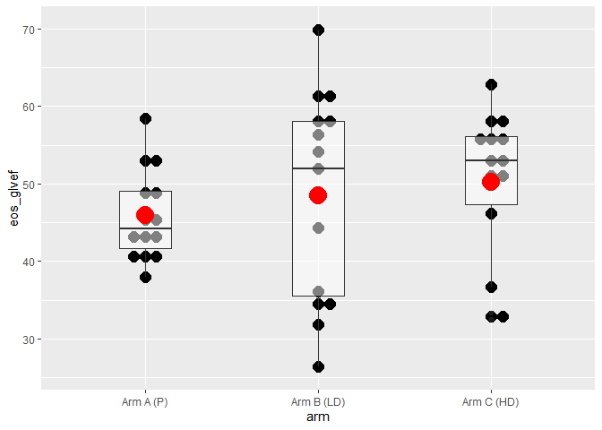<!-- -->

We can see that patients in the active arm (arm C who received high dose IGF1) have a higher mean GLVEF at the end of the study, compared to patients who got the placebo. However, it's worth pointing out that people in the active arm didn't always have higher values - in fact the people with the some of the lowest values were in the active arm. 


Next, let's see what the mean and standard deviation of GLVEF at the end of the study were for each arm. 


```r
  group_by(data, arm) %>%
  summarise(
    mean = round(mean(eos_glvef, na.rm = TRUE), 2), 
    sd   = round(sd  (eos_glvef, na.rm = TRUE), 2)
  ) 
```

```
## # A tibble: 2 x 3
##   arm         mean    sd
##   <chr>      <dbl> <dbl>
## 1 Arm A (P)   45.9  5.7 
## 2 Arm C (HD)  50.2  9.38
```


## Part 1. Estimands, estimators, and estimates

The primary aim of a clinical trial is to arrive at some number that tells us something useful about the "true" causal effect of the treatment we are testing. This number, which is calculated from the study data, is called an **estimate** of some corresponding "truth" called an **estimand**. The actual calculation or algorithm we used to provided this estimate of the estimand is called the **estimator**. 

Much of clinical science is about deciding what the important estimands are, asking, "What do we want to know?" On the other hand, much of statistics is about understanding and evaluating the properties of estimators, asking "What is the optimal way to learn it?" 

### A simple example. 

Let's say we want to estimate the mean systolic blood pressure in the population of Irish women, to help plan health services. One way to do this would be to take a random sample from this population, measure their blood pressures, and calculate the mean of the observed values. In this example, the estimand, estimator, and estimate are as follows:

- Estimand - The mean systolic blood pressure in the **population** of Irish women.
- Estimator - The mean systolic blood pressure in our **sample** of this population.
- Estimate - The actual value that arises from our estimator. 

Estimators have different properties that we can use to evaluate how useful they are. Importantly, our understanding of an estimator's properties will usually rely on assumptions, for example, that the sample was truly a random draw from the population. 

To better understand all of this, let's simulate a large number of SBP measurements from a normal distribution with a known mean and standard deviation. This will be our population.  


```r
# First we will simulate our population

# Set the seed for the random number generator to preserve reproducability
  set.seed(1209) 

  pop_sbp <- rnorm(1e7, 124.5, 18.0) # Simulate a large population of values

  hist(pop_sbp)                      # Plot the distribution of those values
```

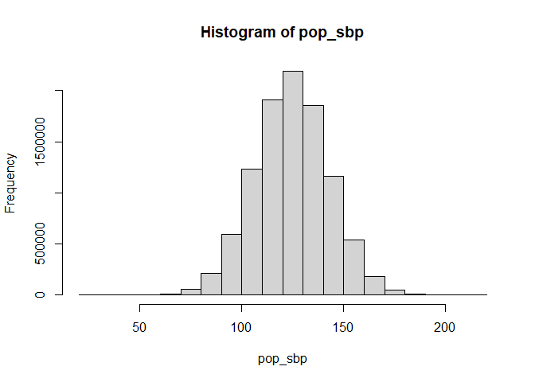<!-- -->

```r
  summary(pop_sbp)                   # Summarize the distribution
```

```
##    Min. 1st Qu.  Median    Mean 3rd Qu.    Max. 
##   28.42  112.36  124.50  124.51  136.65  216.28
```

Next, let's draw a random sample from this population, and calculate the mean. The full procedure of taking a random sample of the population and calculating the mean of that sample is our estimator **for** the population mean. The actual number that results is our estimate **of** the population mean. 


```r
  sample_sbp <- sample(pop_sbp, 50, replace = FALSE) # Draw a sample of n = 50

  mean(sample_sbp) # Calculate the mean of the sample
```

```
## [1] 122.8668
```

We can immediately see that the sample mean is close to, but not exactly, the population mean (which we know was 124.5, from our simulation). Importantly, if we were to repeat the process using the **same** estimator, we would expect a **different** estimate. 


```r
# Draw another sample of n = 50 and calculate the mean
  mean(sample(pop_sbp, 50, replace = FALSE))
```

```
## [1] 124.215
```

So what happens if we repeat this process many times? We get a **sampling distribution** of sample means. This concept of a sampling distribution is critical to understanding the **frequentist** school of statistical inference that is most often used to interpret the results of clinical trials, as we will see below.


```r
# This is a custom function that drwas a sample from a population and then 
# calcuates the mean of those values. It takes 2 arguments: pop, which is a 
# dataframe object containing the population data we simulated; and n, which is 
# the size of the sample we want to draw.

  rep_means <- function(pop, n, ...){     
    round(mean(sample(pop, n, replace = FALSE)), 2)
  }                                       

# Use this new function 100 times and keep the results from each replicate
  many_sample_means <- replicate(100, rep_means(pop_sbp, 50)) 

  hist(many_sample_means)    # Plot the resulting distribution
```

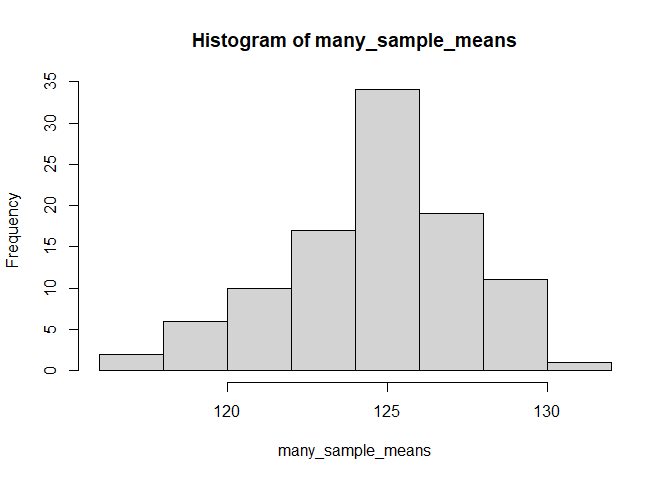<!-- -->

```r
  summary(many_sample_means) # Summarize it
```

```
##    Min. 1st Qu.  Median    Mean 3rd Qu.    Max. 
##   117.6   123.0   124.5   124.6   126.6   130.5
```

### Try it yourself

What do you think would happen to the distribution of the sample mean if we increased the number of observations that we sample from the population? Copy and modify the code above to see what would happen for samples of n = 100, 200, and 500.

## Part 2. Pesky p-values

Now we are going to simulate a clinical trial with a known effect of the intervention, and evaluate our estimate of that effect using the ubiquitous p-value. 


```r
  set.seed(0236)

# Simulate some study data into a dataframe. Tx effect = 0.5
  study_df <- data_frame(
    y = c(rnorm(20, 0, 1),                       # Control arm outcomes
          rnorm(20, 0, 1) + 0.5),                # Active arm outcomes
    arm = rep(c("Control", "Active"), each = 20) # Arm labels
  )
  
  study_df$arm <- relevel(factor(study_df$arm), ref = "Control")

# Plot the distribtion of outcomes in each arm
  ggplot(study_df, aes(x = y, fill = arm)) +
    geom_histogram() +
    facet_wrap(~arm, ncol = 1) +
    scale_fill_viridis(guide = FALSE, discrete = TRUE, end = 0.85)
```

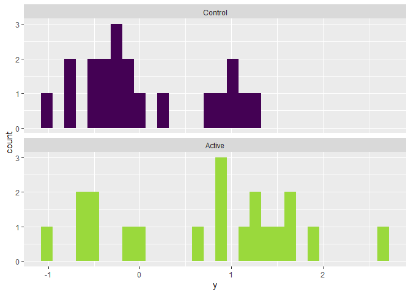<!-- -->

```r
# Note: When we plotted the distribution before, we used so-called "base" R 
# plotting. Going forward, we will more often used a package called ggplot2 
# (which is included in the tidyverse family of packages).  
```

Now we will pretend that we don't know what the true effect of the treatment is (0.5). The difference in means between the two arms in this sample is 0.65. This of course isn't exactly 0.5, since the tx effect is added to a variable outcome that is measured in a random sample. Thus some sampling variability should be expected.  

The actual test statistic we will use is called Student's t. It is a ratio of this difference in means to the standard error (which is what we, somewhat confusingly, call the standard deviation of a sampling distribution). You can think of it as a "signal to noise ratio".  

Let's do it "by hand" so we can see how the p-value is calculated. 

The first step is to calculate the value for t from our sample data. This is our estimate. 


```r
# https://en.wikipedia.org/wiki/Welch's_t-test

# First, just to see how eveCalcuate T "by hand"
  m_act <- mean(study_df$y[study_df$arm == "Active"])
  m_con <- mean(study_df$y[study_df$arm == "Control"])
  v_act <-  var(study_df$y[study_df$arm == "Active"])
  v_con <-  var(study_df$y[study_df$arm == "Control"])
  n <- 20 # Sample size in each group
  se <- sqrt(v_act/n + v_con/n)
  df_s <- (v_act/n + v_con/n)^2 / # Need this for the sampling dist. below
          ((v_act^2 / (n^2 * (n - 1))) + 
           (v_con^2 / (n^2 * (n - 1))))
  
  t_sample <- round((m_act - m_con) / se, 2)
  
  t_sample
```

```
## [1] 2.35
```

Then we want to plot the sampling distribution of t under the null hypothesis that there is no different in the means (i.e. t = 0). The key parameter for this distribution is the degrees of freedom we calculated above (df_s). 


```r
# Get the expected sampling distibution under a null hypotheis of no difference
  
  g1 <- ggplot(data_frame(x = c(-4 , 4)), aes(x = x)) + 
    stat_function(fun = dt, args = list(df = df_s), 
                  geom = "area", fill = viridis(1), alpha = 0.3) +
    xlim(c(-4 , 4)) +
    xlab("t") +
    ylab("Density") +
    theme_minimal()

  g1
```

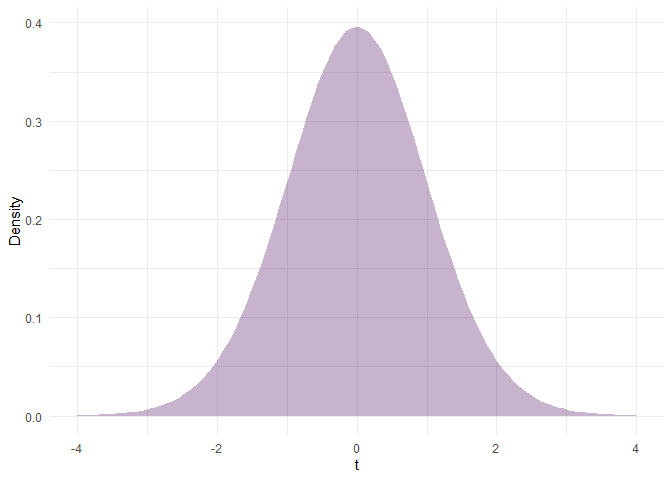<!-- -->

Then we plot the position of t for our sample, and calculate the area of the t distribution (under the null) for values of t as big or bigger than the value we actually observed. 


```r
  g2 <- g1 +
    geom_vline(xintercept = t_sample) +
    stat_function(xlim = c(t_sample , 4), 
                  fun = dt, args = list(df = df_s), 
                  geom = "area", fill = viridis(1)) +
    scale_x_continuous(breaks = c(-3, -1.5, 0, 1.5, t_sample, 3)) +
    theme(panel.grid.minor = element_blank()) +
    ggtitle(paste0("The proportion of the total area in the darker part of the distribution\n for t (given the null is true) is ", signif(pt(t_sample, df_s, lower.tail = FALSE), 2)))

  g2
```

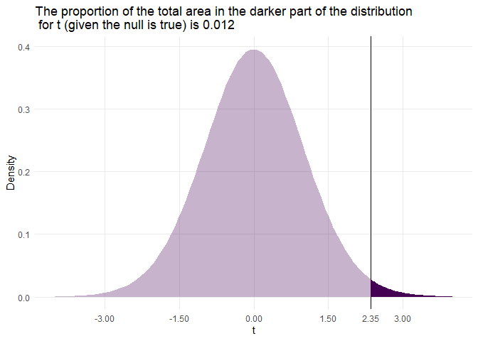<!-- -->

This means that **IF** there was no treatment effect, **AND** the assumptions underlying our calculation of t distribution under the null hold, **AND** we were able repeat our experiment many, many times, **THEN** we would only expect to see a value as large or larger than the one we calculated in *our* sample, 1.2% of the time. This is our p-value. Please note that there is no way to correctly explain what this p-value is in a single sentence. 

So what can we do with this p-value? That's where things start to get tricky. At the risk of over-simplifying things, Fisher saw the p-value as a continuous measure of how surprised we should be if the data were truly generated under a mechanism of "no effect". So then a small p-value indicates there might be an effect worth further exploring or looking for in continued experiments. Then, if you were able able to repeat an experiment several times and consistently produce a small p-value, you might finally conclude that your intervention "works". 

Others would use the p-value as a hypothesis test. In the example above, it would be the null hypothesis of t ≤ 0 vs the alternative of t > 0. Then you would set some threshold for p (e.g. 5%) for which you would "reject the null". We'll come back to this way of thinking when we discuss power, and type 1 and 2 errors below.    

In the example above, we only considered our estimate of t with respect to one tail of the sampling distribution of t under the null. This is what we refer to as a one-sided test. However, it usually makes more sense to make it relative to both tails, so that the null is t = 0 vs. t < 0 or t > 0. 


```r
  g3 <- g2 +
    stat_function(xlim = c(t_sample , 4), 
                  fun = dt, args = list(df = df_s), 
                  geom = "area", fill = viridis(1)) +
    stat_function(xlim = c(-4, -t_sample), 
                  fun = dt, args = list(df = df_s), 
                  geom = "area", fill = viridis(1)) +
    ggtitle(paste0("The proportion of the total area in the darker part of the distribution\n for t is ", signif(2 * pt(t_sample, df_s, lower.tail = FALSE), 3)))

  g3
```

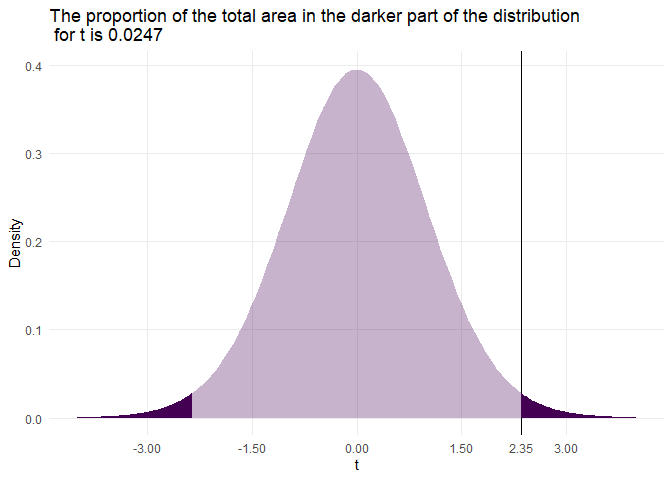<!-- -->

Now this was a fair bit of work just to do a simple t-test. So now let's R do this for us (and confirm our result).


```r
  t_1 <- t.test(y ~ arm, data = study_df)

  t_1
```

```
## 
## 	Welch Two Sample t-test
## 
## data:  y by arm
## t = -2.3472, df = 34.049, p-value = 0.02487
## alternative hypothesis: true difference in means is not equal to 0
## 95 percent confidence interval:
##  -1.21698902 -0.08755436
## sample estimates:
## mean in group Control  mean in group Active 
##            0.05376083            0.70603252
```

### Side-note: Linear models

We noted in EH6124 that most commonly used statistical tests can be represented by linear models. The advantage of this is two-fold. First, linear models can incorporate covariate information which often leads to more efficient estimators by integrating out variability in the outcome predicted by the covariates. It's also useful to think in terms of linear models because it's much easier than trying to remember a multitude statistical tests. 

For example, the t-test is used when we are interested in a difference in means and when we have a fairly small sample size (the specific problem the t-test addresses is that when we have a small sample and we need to use the sample standard deviation to work our the distribution of the sample mean, then we should have more uncertainty in that distribution, i.e. it should be wider - it should have "fatter tails").


```r
  lm_1 <- lm(y ~ arm, data = study_df)

  pvalue <- filter(tidy(lm_1), term == "armActive")$p.value
  
  summary(lm_1)
```

```
## 
## Call:
## lm(formula = y ~ arm, data = study_df)
## 
## Residuals:
##      Min       1Q   Median       3Q      Max 
## -1.72700 -0.62341 -0.09427  0.73933  1.93982 
## 
## Coefficients:
##             Estimate Std. Error t value Pr(>|t|)  
## (Intercept)  0.05376    0.19650   0.274   0.7859  
## armActive    0.65227    0.27789   2.347   0.0242 *
## ---
## Signif. codes:  0 '***' 0.001 '**' 0.01 '*' 0.05 '.' 0.1 ' ' 1
## 
## Residual standard error: 0.8788 on 38 degrees of freedom
## Multiple R-squared:  0.1266,	Adjusted R-squared:  0.1036 
## F-statistic: 5.509 on 1 and 38 DF,  p-value: 0.02423
```

So here we get a p-value of 0.0242 vs. 0.025 from the t-test. Of course the difference in means, the effect estimate, is exactly the same (-0.65). It's the sampling distributions of the two estimators of that effect (t vs the regression coefficient) that are different.

## Part 3. Error control and power

In the example above, we focused mostly on Fisher's interpretations of the  p-value given by a particular set of set of observations as a continuous measure of evidence for/against a null hypothesis/model (though he still viewed being able to repeatedly procure a small p-value as an important step before declaring the existence of an experimental effect). However, this idea was met with resistance from the very beginning. Much of this resistance came from the Neyman-Pearson (NP) school of thought, whose proponents instead thought that p-values should be used to conduct the binary hypothesis tests we noted above. 

When we choose to use such tests, we are using a relaxed version of the following logic (called [modus tollens](https://en.wikipedia.org/wiki/Modus_tollens)):

If A, then B | Not B, then not A

These hypothesis tests are used to make a similar argument: **If** the null hypothesis/model is true, **then** the data should be more likely to look one way. If however the data **don't** look that way, **then** we should consider rejecting the null. 

This means we can incorrectly reject the null then it's true; or incorrectly fail to reject the null when it isn't. From this point of view, our goal when using statistics is to control the probability of making these errors. 

Let's look at some simulations. 

First we will generate some data under a null, normal model, with a random allocation to study arms. 


```r
  n <- 100

  data <- data_frame(
    sbp = rnorm(n, 124.5, 18.0), 
    arm = sample(c("Active", "Control"), size = n, replace = TRUE)
  )
  
# Plot the distribtion of outcomes in each arm
  ggplot(data, aes(x = sbp, fill = arm)) +
    geom_histogram() +
    facet_wrap(~arm, ncol = 1) +
    scale_fill_viridis(guide = FALSE, discrete = TRUE, end = 0.85)
```

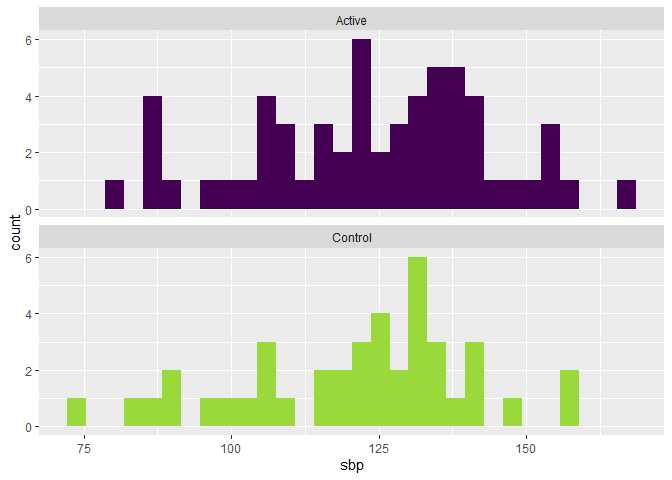<!-- -->

```r
# Regress SBP on the treatment arm  
  summary(lm(sbp ~ arm, data = data))
```

```
## 
## Call:
## lm(formula = sbp ~ arm, data = data)
## 
## Residuals:
##     Min      1Q  Median      3Q     Max 
## -48.069 -13.951   2.747  13.127  42.172 
## 
## Coefficients:
##             Estimate Std. Error t value Pr(>|t|)    
## (Intercept)  124.014      2.579  48.094   <2e-16 ***
## armControl    -2.872      4.027  -0.713    0.477    
## ---
## Signif. codes:  0 '***' 0.001 '**' 0.01 '*' 0.05 '.' 0.1 ' ' 1
## 
## Residual standard error: 19.81 on 98 degrees of freedom
## Multiple R-squared:  0.005163,	Adjusted R-squared:  -0.004989 
## F-statistic: 0.5086 on 1 and 98 DF,  p-value: 0.4774
```

Now let's look at what happens if we repeat this process many times.


```r
  make_pvalues <- function(n, ...){

    data <- data_frame(
      sbp = rnorm(n, 124.5, 18.0), 
      arm = sample(c("Active", "Control"), size = n, replace = TRUE)
    )
    
    data$arm <- relevel(factor(data$arm), ref = "Control")

    result <- tidy(lm(sbp ~ arm, data = data)) %>%
      filter(term == "armActive")
    
    return(result$p.value)

  }

  k <- 2000
  results <- as_data_frame(replicate(k, make_pvalues(100))) %>%
    rename(p_value = value)

  ggplot(results, aes(x = p_value)) +
    geom_histogram() +
    geom_vline(xintercept = 0.05, color = "red", linepype = "dashed")
```

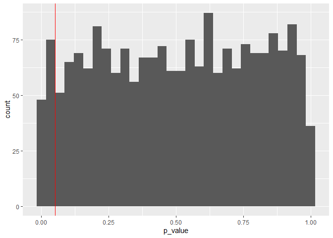<!-- -->

As some of you might have expected, about 5% of the p-values fall below the nominal 5% level (6% in this set of simulations)

Just for fun, what will happen to the distribution of p-values if I decrease the sample size of the individual replicates?


```r
  k <- 2000
  results <- as_data_frame(replicate(k, make_pvalues(20))) %>% # n = 20
    rename(p_value = value)

  ggplot(results, aes(x = p_value)) +
    geom_histogram() +
    geom_vline(xintercept = 0.05, color = "red", linepype = "dashed")
```

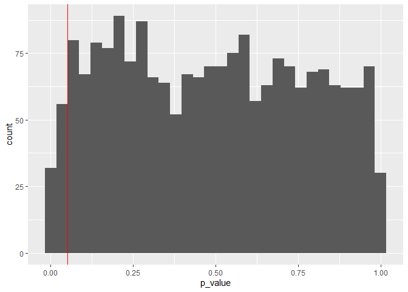<!-- -->

Again, about 5% of the p-values fall below the nominal 5% level (4.4% - the difference is just simulation error - if we ran more simulations, this would be 5% for sure)

And if I increase the sample size?


```r
  k <- 2000
  results <- as_data_frame(replicate(k, make_pvalues(1000))) %>% # n = 1000
    rename(p_value = value)

  ggplot(results, aes(x = p_value)) +
    geom_histogram() +
    geom_vline(xintercept = 0.05, color = "red", linepype = "dashed")
```

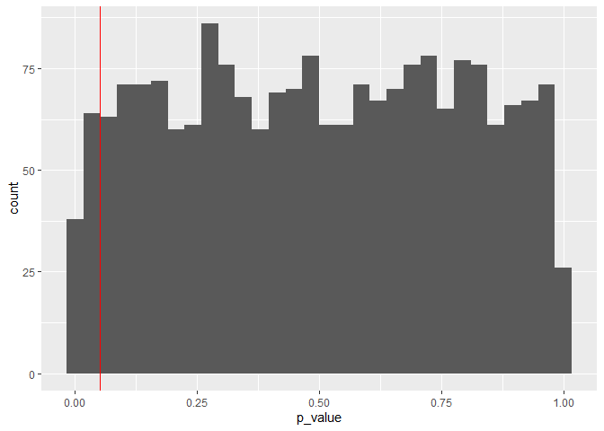<!-- -->

The same result (4.8%). To put a finer point on this, **when the data are indeed generated by a null model**, the distribution of p-values is constant; and because p is based on a sampling distribution, which is in turn partly determined by the sample size (via the standard error), then 5% of p values will be below the 5% threshold, regardless of sample size. 

The other important addition from the NP view is the introduction of some alternative hypothesis, so that when we reject the null (based on a small p-value) then we are implicitly accepting some alternative. Thus we can restate the two types of possible error we noted above: 

- We can reject the null when it's true, thus declaring there is an effect (the alternative) when there isn't: a false positive. 

- We can accept the null when it's false, thus declaring there is no effect (the alternative) when there actually is: a false negative. 

The first of these is what we just looked at above, when we simulated data under the null and say how many times we would reject it when it was in fact true - and that we could "control" this error rate using the p-value. If I'm happy accepting making this kind of mistake 5% of the time, then my p-value for "significance" should be 0.05. If I want to make that more or less stringent, I can. However, this only really makes sense if I am also happy thinking of what I'm doing as one experiment in a long succession of such experiments, like a machine making widgets. 

So now let's look at the second kind of error, and generate some data with a known effect. 


```r
  make_pvalues <- function(n, effect, ...){

    data <- data_frame(
      sbp = rnorm(n, 124.5, 18.0), 
      arm = sample(c("Active", "Control"), size = n, replace = TRUE)
    )
    
    data$arm <- relevel(factor(data$arm), ref = "Control")

    
    data$sbp[data$arm == "Active"] <- data$sbp[data$arm == "Active"] + effect
  
    result <- tidy(lm(sbp ~ arm, data = data)) %>%
      filter(term == "armActive")
    
    return(result$p.value)

  }

  k <- 2000
  results <- as_data_frame(replicate(k, make_pvalues(100, -2))) %>%
    rename(p_value = value)

  ggplot(results, aes(x = p_value)) +
    geom_histogram() +
    geom_vline(xintercept = 0.05, color = "red", linepype = "dashed")
```

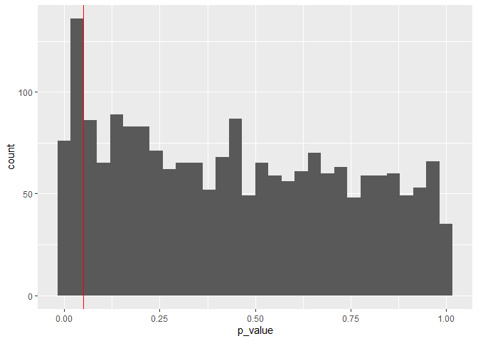<!-- -->

Now if I use p = 0.05 to reject the null, which is now the correct decision (since I know I simulated data with "an effect"), I will do so 10.35% of the time. That is my **power**. Alternately, I will accept the null (wrongly) 89.65% of the time. That is my type 2 error rate. 

Most of the time people recommend a power of at least 80% (more on this later), so clearly this is a very low power. That's because our effect (= -2) is small relative to the variability in the outcome. So we need a bigger effect or a bigger sample to overcome that variability and increase the power. So let's greatly increase the sample size. 


```r
  k <- 2000
  results <- as_data_frame(replicate(k, make_pvalues(2000, -2))) %>%
    rename(p_value = value)

  ggplot(results, aes(x = p_value)) +
    geom_histogram() +
    geom_vline(xintercept = 0.05, color = "red", linepype = "dashed")
```

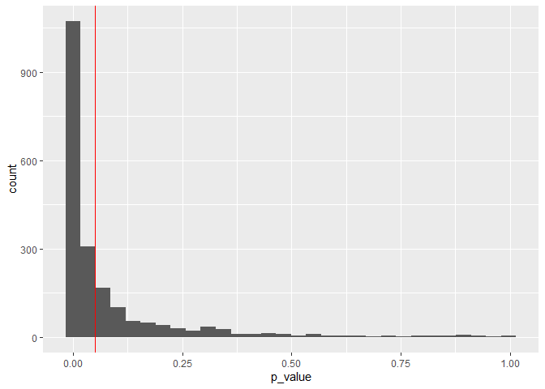<!-- -->

Whoa! What just happened? Now if I use p = 0.05 to (correctly) reject the null, my power is 68.55%, and my type 2 error rate is 31.45%. 
 
Here is an important point - there is no such thing as **A** study's power. Power is specific to both a study's design, and **AN** effect size. Thus the same study will produce a different power for different effect sizes. In these simulated examples, we **know** what the alternative hypothesis is (effect = -2), while for a real study, there are many plausible alternative hypotheses (i.e. many plausible potential effect sizes) and we can't know which is true, or else we wouldn't need to run the study. 

However, one of these hypothetical effect sizes stands out among all the rest. It's the one Senn refers to as the smallest possible effect that we'd like to not miss. In other words, many of these plausible effect sizes are so small that we don't really care if they exist or not (when we are talking about clinical research where the goal is to intervene on people), but there are other, larger effect sizes we certainly would like to be able to detect with a high power - and if we design the study to have high power for the smallest of these, then we will have high power to detect all of them. So let's plan a study to detect an effect = 2, given what we know about the distribution of the outcome we used in the simulation. 


```r
   effect_size <- -2
   sd <- 18
   d <- effect_size / sd

   pwr.t.test(d = d, sig.level = .05, power = 0.90)
```

```
## 
##      Two-sample t test power calculation 
## 
##               n = 1703.163
##               d = 0.1111111
##       sig.level = 0.05
##           power = 0.9
##     alternative = two.sided
## 
## NOTE: n is number in *each* group
```

```r
# I am being a bit lazy here, using the power based on a t-test when I know
# that I am going to analyze the data with a linear model - but sample sizes are
# an educated guess at best - so close enough for now!   
```

Ha! So to detect an effect this small (relative to the SD of the SBP distribution), I need 3400 people in my study for achieve a power of 90% (i.e. to produce a study that will detect this effect, based on a binary hypothesis test vs the null, 90% of the time). Now, let's confirm this with a simulation. 


```r
  k <- 2000
  results <- as_data_frame(replicate(k, make_pvalues(3400, 2))) %>%
    rename(p_value = value)

  ggplot(results, aes(x = p_value)) +
    geom_histogram() +
    geom_vline(xintercept = 0.05, color = "red", linepype = "dashed")
```

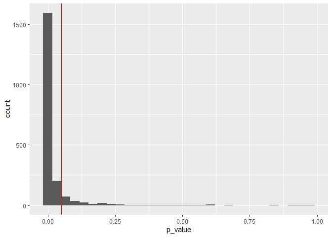<!-- -->

From the above I can see that 89.6% of p-values from the simulations fall below 5% - that's my power, which is just what I expected (with a bit of simulation error). 

I want to point out one more thing, which is the distribution of p-values that fall under 0.05 when the alternative is in fact true and we have a high power test, as we just simulated.


```r
  filter(results, p_value <= 0.05) %>%
  ggplot(aes(x = p_value)) +
    geom_histogram() +
    geom_vline(xintercept = 0.05, color = "red", linepype = "dashed")
```

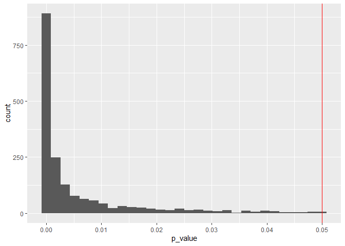<!-- -->

So how many of those p-values are close to 0.05? Very few! What does this mean? It means that when some alternative effect is true and the trial is very well powered to detect that effect, the distribution of p-values is heavily skewed towards very small values, values much smaller than 0.05. This is why many people are skeptical of papers and bodies of literature that report many "just significant" p-values, as it suggests publication bias and p-hacking. 

