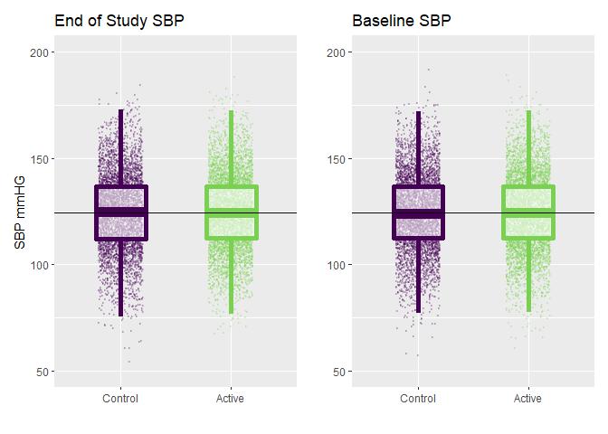
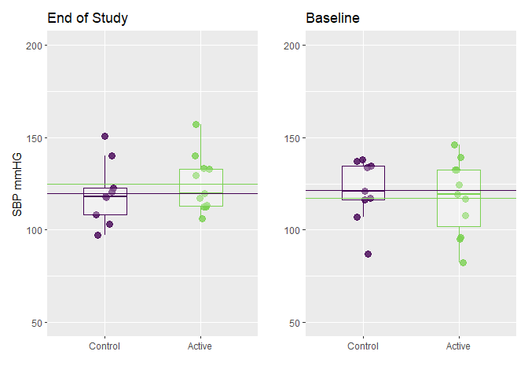
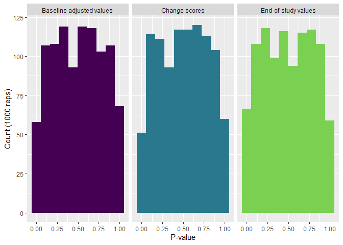
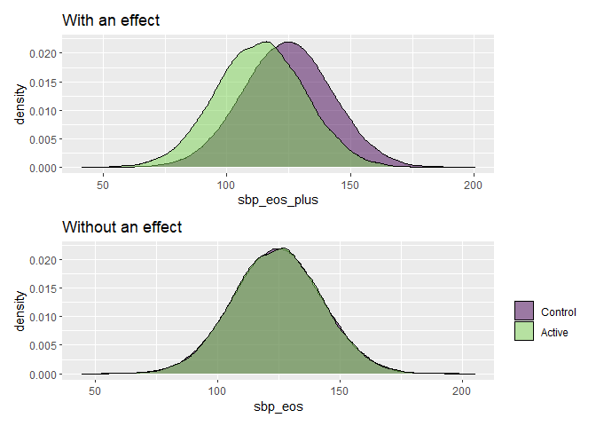
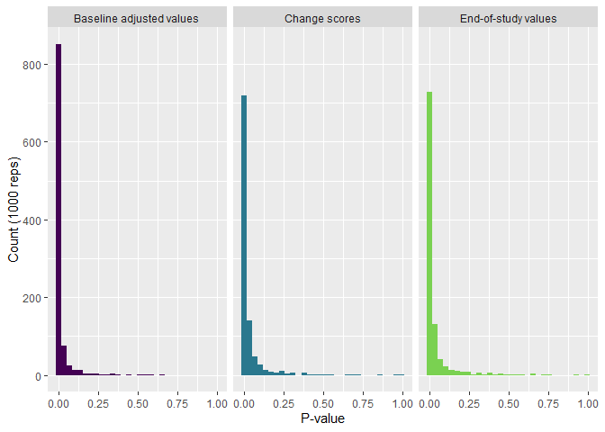

# Overview

Clinical trials are primarily used to test for, or estimate, the effects of treatments or interventions. This estimate is derived by comparing one or more groups with respect to some important outcome, where the groups are assumed to be *comparable* because they were *randomized* to receive different interventions. When we talk about *comparability* like this, what we really mean is that the distribution of the outcome measured at the end of the study would have been the same in all the groups had we *not* exposed any of them to the treatment being tested (i.e. as if everyone was on the current standard-of-care). 

However, we can never truly *know* how comparable our groups are - we can only make assumptions about them. This is because we can't observe the distribution of future outcomes in the absence of the tested treatment in every group, since at least one group *will* receive the treatment under test (and we can't rewind time). Further, while we know that randomization will result in groups that are comparable "on average" over many hypothetical trials, at the end of the day, we just have the one trial that we actually ran. And for that one trial there really could be important differences between the groups at baseline that could lead to errors of inference (e.g. concluding the treatment is beneficial when it isn't).

For example, say we have a trial for a blood pressure medication that we hope will lower patients' SBP values. So we set up the trial, recruit some patients and randomize them into two groups. Then we give one group the new medication we are testing, and the other gets standard-of-care. At the end of the study we compare the mean blood pressure of the two groups and find that the active group had a SBP that was 3 mmHg lower, on average, than the values seen in the control group. We might thus conclude that the treatment worked. 

However, what if it just so happened that the active group also had a similarly lower mean blood pressure (vs the other group) measured at baseline, before the intervention? Again, randomization means that on average, across many hypothetical randomizations, this won't be the case - the groups should usually have very similar distributions of blood pressures at baseline. But you can always get "unlucky" with any one particular randomization, and wind up with a baseline difference that could throw off your conclusions. How to best deal with this situation is one of the most common topics for discussion and debate among clinical trialists. 

One very commonly employed tactic for dealing with this problem is to analyze change scores. This means that you subtract the baseline value of the outcome from the value measured at the end of the study and use that difference for your statistical tests or models. The apparent logic is that by taking the difference between the baseline and end of study outcome measurements, you are accounting for any important differences between the groups at baseline. Let's see if that actually works in practice. 

# Simulate some data under a null model of no between-arm difference

First, let's simulate some data when we know there is no treatment effect. 


```r
# Set the seed for the random number generator to preserve reproducability
  set.seed(1207) 

# Now generate baseline and end-of-study SBP for 10000 people where the mean is
# 124.5 mmHg, and successive measurements have a correlation = 0.5.

  sbp <- rnorm_multi(
    n = 10000,          # 10k observations
    mu = rep(124.5, 2), # Same mean
    sd = rep(18, 2),    # Same SD
    r = c(0.5),         # Correlation = 0.5
    varnames = c("sbp_eos", "sbp_bl"),
    empirical = FALSE
    )
```


```r
# Now check the data to see if it is what we wanted. 
  
  map(sbp, mean) # Are both means close to 124.5?
```

```
## $sbp_eos
## [1] 124.4641
## 
## $sbp_bl
## [1] 124.4208
```

```r
  map(sbp, sd) # Are both SDs close to 18?
```

```
## $sbp_eos
## [1] 18.0237
## 
## $sbp_bl
## [1] 17.96457
```


```r
  with(sbp, cor(sbp_eos, sbp_bl)) # Is the correlation between the 2 vars ~ 0.5?
```

```
## [1] 0.4874181
```

So far, so good. How let's randomly assign everyone to one of two study arms. 


```r
  sbp$arm <- sample(c("Active", "Control"), size = 10000, replace = TRUE) %>%
    factor(levels = c("Control", "Active"))
```


```r
  table(sbp$arm) # Check how many went into each arm
```

```
## 
## Control  Active 
##    4990    5010
```

# Change scores

Next, let's create a change score and see how it correlates with the baseline values 


```r
  sbp <- mutate(sbp, change_sbp = sbp_eos - sbp_bl)

# sbp$change_sbp <- sbp$sbp_eos - sbp$sbp_bl # Base R version of the same thing
```


```r
  g1 <- ggplot(sbp, aes(x = sbp_bl, y = sbp_eos)) +
    geom_point(alpha = 0.4) +
    geom_smooth(se = FALSE, method = "lm") +
    ylab("End of Study SBP") +
    xlab("Baseline SBP")

  g2 <- ggplot(sbp, aes(x = sbp_bl, y = change_sbp)) +
    geom_point(alpha = 0.4) +
    geom_smooth(se = FALSE, method = "lm") +
    ylab("Change in SBP") +
    xlab("Baseline SBP")
  
  g1 + g2
```

<!-- -->


```r
  with(sbp, cor(sbp_eos, sbp_bl)) # Is the correlation between the 2 vars ~ 0.5?
```

```
## [1] 0.4874181
```

```r
  with(sbp, cor(change_sbp, sbp_bl)) 
```

```
## [1] -0.5038361
```

So the change score is correlated with the baseline just as much as the end of study value is, just in the opposite direction. This is important because it undercuts some people's justification to use change scores because the outcome at the end of the study is correlated with the baseline values. As you can clearly see above, it's no less of a problem for change scores, except that people with higher change scores tend to have *lower* baseline values, whereas people with higher end-of-study outcomes tend to have similarly *higher* baseline values. 

# Linear regression (a model of means) for the between arm difference in mean SBP

Finally, let's see if there is a difference in either blood pressure values (end of study or baseline) between arms. To do this, we will use a simple linear regression model. 


```r
# Here we estaimte 2 linear regression models, and display the results with
# tab_model()

# Estimate the between arm difference in mean blood pressure at the end of the study
  m1_eos <- lm(sbp_eos ~ arm, data = sbp)  
# Estimate the between arm difference in mean blood pressure at baseline
  m1_bl  <- lm(sbp_bl  ~ arm, data = sbp)
  
  tab_model(m1_eos, m1_bl)
```

<table style="border-collapse:collapse; border:none;">
<tr>
<th style="border-top: double; text-align:center; font-style:normal; font-weight:bold; padding:0.2cm;  text-align:left; ">&nbsp;</th>
<th colspan="3" style="border-top: double; text-align:center; font-style:normal; font-weight:bold; padding:0.2cm; ">sbp eos</th>
<th colspan="3" style="border-top: double; text-align:center; font-style:normal; font-weight:bold; padding:0.2cm; ">sbp bl</th>
</tr>
<tr>
<td style=" text-align:center; border-bottom:1px solid; font-style:italic; font-weight:normal;  text-align:left; ">Predictors</td>
<td style=" text-align:center; border-bottom:1px solid; font-style:italic; font-weight:normal;  ">Estimates</td>
<td style=" text-align:center; border-bottom:1px solid; font-style:italic; font-weight:normal;  ">CI</td>
<td style=" text-align:center; border-bottom:1px solid; font-style:italic; font-weight:normal;  ">p</td>
<td style=" text-align:center; border-bottom:1px solid; font-style:italic; font-weight:normal;  ">Estimates</td>
<td style=" text-align:center; border-bottom:1px solid; font-style:italic; font-weight:normal;  ">CI</td>
<td style=" text-align:center; border-bottom:1px solid; font-style:italic; font-weight:normal;  col7">p</td>
</tr>
<tr>
<td style=" padding:0.2cm; text-align:left; vertical-align:top; text-align:left; ">(Intercept)</td>
<td style=" padding:0.2cm; text-align:left; vertical-align:top; text-align:center;  ">124.34</td>
<td style=" padding:0.2cm; text-align:left; vertical-align:top; text-align:center;  ">123.84&nbsp;&ndash;&nbsp;124.84</td>
<td style=" padding:0.2cm; text-align:left; vertical-align:top; text-align:center;  "><strong>&lt;0.001</td>
<td style=" padding:0.2cm; text-align:left; vertical-align:top; text-align:center;  ">124.33</td>
<td style=" padding:0.2cm; text-align:left; vertical-align:top; text-align:center;  ">123.83&nbsp;&ndash;&nbsp;124.83</td>
<td style=" padding:0.2cm; text-align:left; vertical-align:top; text-align:center;  col7"><strong>&lt;0.001</td>
</tr>
<tr>
<td style=" padding:0.2cm; text-align:left; vertical-align:top; text-align:left; ">arm [Active]</td>
<td style=" padding:0.2cm; text-align:left; vertical-align:top; text-align:center;  ">0.24</td>
<td style=" padding:0.2cm; text-align:left; vertical-align:top; text-align:center;  ">-0.46&nbsp;&ndash;&nbsp;0.95</td>
<td style=" padding:0.2cm; text-align:left; vertical-align:top; text-align:center;  ">0.499</td>
<td style=" padding:0.2cm; text-align:left; vertical-align:top; text-align:center;  ">0.18</td>
<td style=" padding:0.2cm; text-align:left; vertical-align:top; text-align:center;  ">-0.52&nbsp;&ndash;&nbsp;0.88</td>
<td style=" padding:0.2cm; text-align:left; vertical-align:top; text-align:center;  col7">0.617</td>
</tr>
<tr>
<td style=" padding:0.2cm; text-align:left; vertical-align:top; text-align:left; padding-top:0.1cm; padding-bottom:0.1cm; border-top:1px solid;">Observations</td>
<td style=" padding:0.2cm; text-align:left; vertical-align:top; padding-top:0.1cm; padding-bottom:0.1cm; text-align:left; border-top:1px solid;" colspan="3">10000</td>
<td style=" padding:0.2cm; text-align:left; vertical-align:top; padding-top:0.1cm; padding-bottom:0.1cm; text-align:left; border-top:1px solid;" colspan="3">10000</td>
</tr>
<tr>
<td style=" padding:0.2cm; text-align:left; vertical-align:top; text-align:left; padding-top:0.1cm; padding-bottom:0.1cm;">R<sup>2</sup> / R<sup>2</sup> adjusted</td>
<td style=" padding:0.2cm; text-align:left; vertical-align:top; padding-top:0.1cm; padding-bottom:0.1cm; text-align:left;" colspan="3">0.000 / -0.000</td>
<td style=" padding:0.2cm; text-align:left; vertical-align:top; padding-top:0.1cm; padding-bottom:0.1cm; text-align:left;" colspan="3">0.000 / -0.000</td>
</tr>

</table>

The models both confirm what we already knew - that there is essentially no difference in mean blood pressure, measured at baseline or the end of study, between the two groups. The mean SBP at the end of the study was 0.24 mmHG higher in the active arm than the control arm; while the mean baseline value was 0.18 mmHG higher. 

*Question: What was the actual mean SBP value at the end of the study in the control arm?*

Here is a plot of the data that similar reflects what the regression tells us. 


```r
  g1 <- ggplot(sbp, aes(y = sbp_eos, x = arm, color = arm)) +
    geom_jitter(alpha = 0.2, size = 0.5, width = 0.2) +
    geom_boxplot(alpha = 0.6, width = 0.45, outlier.alpha = 0, size = 2) +
    geom_hline(data = group_by(sbp, arm) %>% summarise(mean = mean(sbp_eos)), 
               aes(yintercept = mean)) +
    ylab("SBP mmHG") +
    xlab("") +
    ggtitle("End of Study SBP") +
    scale_color_viridis(guide = FALSE, discrete = TRUE, end = 0.8) +
    ylim(50, 200)

  g2 <- ggplot(sbp, aes(y = sbp_bl, x = arm, color = arm)) +
    geom_jitter(alpha = 0.2, size = 0.5, width = 0.2) +
    geom_boxplot(alpha = 0.6, width = 0.45, outlier.alpha = 0, size = 2) +
    geom_hline(data = group_by(sbp, arm) %>% summarise(mean = mean(sbp_bl)), 
               aes(yintercept = mean)) +
    ylab("") +
    xlab("") +
    ggtitle("Baseline SBP") +
    scale_color_viridis(guide = FALSE, discrete = TRUE, end = 0.8)  +
    ylim(50, 200)
  
  g1 + g2
```

<!-- -->

The horizontal line spanning the width of the plots is actually 2 lines. They are just overlapping because they are the group specific means, and there is essentially no difference between the means, which is what the regression model tells us. If we wanted we could zoom in closer to see the tiny difference. 


```r
  ggplot(sbp, aes(y = sbp_eos, x = arm, color = arm)) +
    geom_jitter(alpha = 0.7, size = 1, width = 0.2) +
    geom_boxplot(alpha = 0.6, width = 0.45, outlier.alpha = 0, size = 2) +
    geom_hline(data = group_by(sbp, arm) %>% summarise(mean = mean(sbp_eos)), 
               aes(yintercept = mean, color = arm)) +
    ylab("SBP mmHG") +
    xlab("") +
    ggtitle("End of Study") +
    scale_color_viridis(guide = FALSE, discrete = TRUE, end = 0.8) +
    coord_cartesian(ylim = c(124.0, 124.7)) # Zoom in with + coord_cartesian()
```

<!-- -->

# Sampling variability

Given the large number of observations we just simulated, it shouldn't come as a surprise that we didn't see differences between the two groups. After all, as the sample size increases, the probability of any particular randomization having a sizable "imbalance" plummets. To better understand this, let's repeat the simulation but now with a much smaller sample size (n = 20). 


```r
# Data
  sbp_2 <- rnorm_multi(                        # Generate the SBP measures
    n = 20, # Smaller sample size
    mu = rep(124.5, 2),
    sd = rep(18, 2),
    r = c(0.5),
    varnames = c("sbp_eos", "sbp_bl"),
    empirical = FALSE
    ) %>%
  mutate(arm =                                  # Randomize to study arm
    factor(
      sample(c("Active", "Control"), size = 20, replace = TRUE), 
      levels = c("Control", "Active")
      )
    )

# Models
  m1_eos_2 <- lm(sbp_eos ~ arm, data = sbp_2)
  m1_bl_2  <- lm(sbp_bl  ~ arm, data = sbp_2)
  
  tab_model(m1_eos_2, m1_bl_2)
```

<table style="border-collapse:collapse; border:none;">
<tr>
<th style="border-top: double; text-align:center; font-style:normal; font-weight:bold; padding:0.2cm;  text-align:left; ">&nbsp;</th>
<th colspan="3" style="border-top: double; text-align:center; font-style:normal; font-weight:bold; padding:0.2cm; ">sbp eos</th>
<th colspan="3" style="border-top: double; text-align:center; font-style:normal; font-weight:bold; padding:0.2cm; ">sbp bl</th>
</tr>
<tr>
<td style=" text-align:center; border-bottom:1px solid; font-style:italic; font-weight:normal;  text-align:left; ">Predictors</td>
<td style=" text-align:center; border-bottom:1px solid; font-style:italic; font-weight:normal;  ">Estimates</td>
<td style=" text-align:center; border-bottom:1px solid; font-style:italic; font-weight:normal;  ">CI</td>
<td style=" text-align:center; border-bottom:1px solid; font-style:italic; font-weight:normal;  ">p</td>
<td style=" text-align:center; border-bottom:1px solid; font-style:italic; font-weight:normal;  ">Estimates</td>
<td style=" text-align:center; border-bottom:1px solid; font-style:italic; font-weight:normal;  ">CI</td>
<td style=" text-align:center; border-bottom:1px solid; font-style:italic; font-weight:normal;  col7">p</td>
</tr>
<tr>
<td style=" padding:0.2cm; text-align:left; vertical-align:top; text-align:left; ">(Intercept)</td>
<td style=" padding:0.2cm; text-align:left; vertical-align:top; text-align:center;  ">119.83</td>
<td style=" padding:0.2cm; text-align:left; vertical-align:top; text-align:center;  ">108.60&nbsp;&ndash;&nbsp;131.06</td>
<td style=" padding:0.2cm; text-align:left; vertical-align:top; text-align:center;  "><strong>&lt;0.001</td>
<td style=" padding:0.2cm; text-align:left; vertical-align:top; text-align:center;  ">121.29</td>
<td style=" padding:0.2cm; text-align:left; vertical-align:top; text-align:center;  ">108.10&nbsp;&ndash;&nbsp;134.48</td>
<td style=" padding:0.2cm; text-align:left; vertical-align:top; text-align:center;  col7"><strong>&lt;0.001</td>
</tr>
<tr>
<td style=" padding:0.2cm; text-align:left; vertical-align:top; text-align:left; ">arm [Active]</td>
<td style=" padding:0.2cm; text-align:left; vertical-align:top; text-align:center;  ">5.12</td>
<td style=" padding:0.2cm; text-align:left; vertical-align:top; text-align:center;  ">-10.03&nbsp;&ndash;&nbsp;20.26</td>
<td style=" padding:0.2cm; text-align:left; vertical-align:top; text-align:center;  ">0.487</td>
<td style=" padding:0.2cm; text-align:left; vertical-align:top; text-align:center;  ">-3.93</td>
<td style=" padding:0.2cm; text-align:left; vertical-align:top; text-align:center;  ">-21.72&nbsp;&ndash;&nbsp;13.86</td>
<td style=" padding:0.2cm; text-align:left; vertical-align:top; text-align:center;  col7">0.648</td>
</tr>
<tr>
<td style=" padding:0.2cm; text-align:left; vertical-align:top; text-align:left; padding-top:0.1cm; padding-bottom:0.1cm; border-top:1px solid;">Observations</td>
<td style=" padding:0.2cm; text-align:left; vertical-align:top; padding-top:0.1cm; padding-bottom:0.1cm; text-align:left; border-top:1px solid;" colspan="3">20</td>
<td style=" padding:0.2cm; text-align:left; vertical-align:top; padding-top:0.1cm; padding-bottom:0.1cm; text-align:left; border-top:1px solid;" colspan="3">20</td>
</tr>
<tr>
<td style=" padding:0.2cm; text-align:left; vertical-align:top; text-align:left; padding-top:0.1cm; padding-bottom:0.1cm;">R<sup>2</sup> / R<sup>2</sup> adjusted</td>
<td style=" padding:0.2cm; text-align:left; vertical-align:top; padding-top:0.1cm; padding-bottom:0.1cm; text-align:left;" colspan="3">0.027 / -0.027</td>
<td style=" padding:0.2cm; text-align:left; vertical-align:top; padding-top:0.1cm; padding-bottom:0.1cm; text-align:left;" colspan="3">0.012 / -0.043</td>
</tr>

</table>

Look! The p-values are still large, but the estimates (i.e. the difference in mean values between arms) are now much much larger. 

We can "see" this by plotting the data again. 


```r
  g1 <- ggplot(sbp_2, aes(y = sbp_eos, x = arm, color = arm)) +
    geom_jitter(alpha = 0.8, size = 3, width = 0.1) +
    geom_boxplot(alpha = 0.3, width = 0.45, outlier.alpha = 0, size = 0.5) +
    geom_hline(data = group_by(sbp, arm) %>% summarise(mean = mean(sbp_eos)), 
               aes(yintercept = mean, color = arm)) +
    ylab("SBP mmHG") +
    xlab("") +
    ggtitle("End of Study") +
    scale_color_viridis(guide = FALSE, discrete = TRUE, end = 0.8) +
    ylim(50, 200)

  g2 <- ggplot(sbp_2, aes(y = sbp_bl, x = arm, color = arm)) +
    geom_jitter(alpha = 0.8, size = 3, width = 0.1) +
    geom_boxplot(alpha = 0.3, width = 0.45, outlier.alpha = 0, size = 0.5) +
    geom_hline(data = group_by(sbp, arm) %>% summarise(mean = mean(sbp_bl)), 
               aes(yintercept = mean, color = arm)) +
    ylab("") +
    xlab("") +
    ggtitle("Baseline") +
    scale_color_viridis(guide = FALSE, discrete = TRUE, end = 0.8)  +
    ylim(50, 200)
  
  g1 + g2
```

<!-- -->
Now we can clearly see the gap between the arm-specific means indicated by the horizontal lines. 


Let's take a closer look at imbalances in the baseline measures as a function of sample size. We'll do this by simulating many datasets with different sample sizes, each time calculating the mean difference in baseline SBP between the groups, and then plotting those differences.   


```r
# Make a function to simulate the datasets

  gen_diffs <- function(x, y){
    
    data <- rnorm_multi(                           # Generate the SBP measures
      n = x, # Variable
      mu = rep(124.5, 2),
      sd = rep(18, 2),
      r = c(0.5),
      varnames = c("sbp_eos", "sbp_bl"),
      empirical = FALSE
      ) %>%
    mutate(size = x, rep = y, arm = factor(
      sample(c("Active", "Control"), size = x, replace = TRUE), 
      levels = c("Control", "Active")
      ))
    
    # calculate the between arm baseline difference for the sample. 
    data$diff_bl <- mean(data$sbp_bl[data$arm == "Active"]) - 
      mean(data$sbp_bl[data$arm == "Control"])
    
    return(data)
  }
```


```r
# Use that function repeatedly to make all the different simulated samples This
# chunk may take a moment to run as it is making thousands of different
# datasets.

  set.seed(0092) 

  sizes <- c(10, 20, 50, 100, 200, 500, 1000)
  names(sizes) <- as.character(sizes)

  diffs <- map2_dfr(
    rep(sizes, each = 1000), 
    rep(1:1000, times = length(sizes)),
    gen_diffs
    ) %>%
    mutate(change_sbp = sbp_eos - sbp_bl)
```


```r
  diffs %>%
    select(size, rep, diff_bl) %>%
    distinct() %>%
    mutate(size = factor(size)) %>%
  ggplot(aes(y = diff_bl, x = size, color = size)) +
    geom_boxplot(outlier.alpha = 0, fill = "white", size = 1) +
    geom_jitter(alpha = 0.1) +
    scale_color_viridis(guide = FALSE, discrete = TRUE) +
    ylab("Between arm difference in mean SBP")
```

<!-- -->

So when we have small samples sizes, the observed mean difference fluctuates considerably, even though we *know* the data are simulated from a model where there is *no difference* in the distribution of SBP between the groups. These differences are just pure *sampling variability*. As we increase the sample size, the probability of a substantial between arm difference in baseline SBP drops quickly. This is the fundamental reason why we like large sample sizes!

# Impact of outcome/model choice in type 1 error control

Next I want to consider 3 possible regression models to test for the effects of treatment in the simulated datasets where n = 100. The 3 models all estimate the effect of the active treatment, but on 3 different outcomes:

1 - The end of study blood pressure measurement

2 - The change score

3 - The end of study blood pressure measurement, adjusted for baseline SBP

We want to see if the type 1 error rate is controlled at 5% (when p for the estimated effect is < 0.05) for all 3 approaches when we know the null is true (because we simulated it ourselves, and haven't added a treatment effect yet). 


```r
  pull_pvalues <- function(x, y){
    
    y <- as.formula(y)
    
    res <- filter(diffs, size == 100 & rep == x) %>% # Get the sims where n = 100
      lm(y, data = .) %>%                            # Run regression with those data
      summary() %>%                                  # Summarise the its results
      coef()                                        
    
    return(res["armActive", "Pr(>|t|)"])             # Pull out the p-value for the 
                                                     # estimated effect
    
  }  

# This code creates a new dataset that is only p-values for the 3 different
# models run using all the different simulated datasets (1000 of them)

  data <- full_join( 
    filter(diffs, size == 100), 
    data_frame(
      p_value_eos =                                  # Model 1
        map_dbl(1:1000, function(x) pull_pvalues(x, "sbp_eos ~ arm")),
      p_value_chg =                                  # Model 2
        map_dbl(1:1000, function(x) pull_pvalues(x, "change_sbp ~ arm")),
      p_value_bla =                                  # Model 3
        map_dbl(1:1000, function(x) pull_pvalues(x, "sbp_eos ~ arm + sbp_bl")),
      rep = 1:1000
      ), 
    by = "rep"
  )
```

Here are the distributions of those p-values. They are (fairly) uniform, as expected when the data are indeed generated under the null hypothesis of no effect (see the [unit 1 review on frequentist inference](https://github.com/CRFCSDAU/EH6126_data_analysis_tutorials/blob/master/Unit_1_Review/Frequentist_inference.md) if needed. 


```r
  gather(data, type, p_value, starts_with("p_value")) %>%
  ggplot(aes(x = p_value, fill = type)) +
    geom_histogram() +
    facet_wrap(~type, nrow = 1) +
    scale_fill_viridis(guide = FALSE, discrete = TRUE, end = 0.8) +
    xlab("P-value") +
    ylab("Count (1000 reps)")
```

<!-- -->

And now we can get the actually calcuate the observed % of p-values for each model that are < 0.05. 


```r
  length(data$p_value_eos[data$p_value_eos < 0.05])/1000 # End of study outcome
```

```
## [1] 5.5
```

```r
  length(data$p_value_chg[data$p_value_chg < 0.05])/1000 # Change score
```

```
## [1] 4.8
```

```r
  length(data$p_value_bla[data$p_value_bla < 0.05])/1000 # Baseline adjusted
```

```
## [1] 5.5
```

They are all about the same, and close to 5%. So what does this tell us? It means that if the null is true (there is no effect of the tested treatment), regardless of how I analyze the data (using the *end-of-study measure*, using the *change score*, or using the *baseline adjusted end-of-study measure*), I will observe a p < 0.05 right at 5% of the time (with some simulation error here since we can't simulate millions of datasets without tying up our computers for hours and days). This means that the type 1 error (false positive) probability is preserved (or controlled) at the same level for each approach. So in this regard it doesn't make a difference which we use. 

# Impact of outcome/model choice on power (type 2 error control)

Now let's add a treatment effect of -11 mmHg to the active arm, and use the same models to try and detect/estimate this effect. I've added this level of effect because, assuming normally distributed outcome with a SD of 18 (like our blood pressure measures), the standardized effect we can expect to detect with 85% power is about 0.6 (and 0.6 times 18 = 11). 


```r
  library(pwr) # http://www.statmethods.net/stats/power.html
  
  pwr.t.test(n = 50, sig.level = .05, power = 0.85)
```

```
## 
##      Two-sample t test power calculation 
## 
##               n = 50
##               d = 0.6052384
##       sig.level = 0.05
##           power = 0.85
##     alternative = two.sided
## 
## NOTE: n is number in *each* group
```

```r
# This returns an effect size you can detect with 85% power when the sample size
# is 50 in each arm.
```


```r
# Add the effect only to those in the active arm, and then recalculate the
# change scores.

  diffs$sbp_eos_plus[diffs$arm == "Active"] <- 
    diffs$sbp_eos[diffs$arm == "Active"] - 11
  diffs$sbp_eos_plus[diffs$arm == "Control"] <- 
    diffs$sbp_eos[diffs$arm == "Control"] 

  diffs$change_sbp_plus <- diffs$sbp_eos_plus - diffs$sbp_bl
```

Here are the outcome SBP distributions with and without the added effect, across all the simulated trials where n = 100 (1000 simulated datasets).


```r
  g1 <- filter(diffs, size == 100) %>%
  ggplot(aes(x = sbp_eos_plus, fill = arm)) +
    geom_density(alpha = 0.5) +
    scale_fill_viridis(guide = FALSE, discrete = TRUE, end = 0.8) +
    ggtitle("With an effect")

  g2 <- filter(diffs, size == 100) %>%
  ggplot(aes(x = sbp_eos, fill = arm)) +
    geom_density(alpha = 0.5) +
    scale_fill_viridis("", discrete = TRUE, end = 0.8) +
    ggtitle("Without an effect")
  
  g1 / g2
```

<!-- -->

Here's what this looks like when we just look at a single simulated dataset. 


```r
  g1 <- filter(diffs, size == 100 & rep == 1) %>%
  ggplot(aes(x = sbp_eos_plus, fill = arm)) +
    geom_density(alpha = 0.5) +
    scale_fill_viridis(guide = FALSE, discrete = TRUE, end = 0.8) +
    ggtitle("With an effect")

  g2 <- filter(diffs, size == 100 & rep == 1) %>%
  ggplot(aes(x = sbp_eos, fill = arm)) +
    geom_density(alpha = 0.5) +
    scale_fill_viridis("", discrete = TRUE, end = 0.8) +
    ggtitle("Without an effect")
  
  g1 / g2
```

<!-- -->

A lot bumpier!

Finally, let's test for (or estimate) our new treatment effect in the 3 models we have been discussing. 


```r
  data <-  filter(diffs, size == 100 & rep == 1)

  m1 <- lm(sbp_eos_plus ~ arm, data = data) 
  m2 <- lm(change_sbp_plus ~ arm, data = data) 
  m3 <- lm(sbp_eos_plus ~ arm + scale(sbp_bl, scale = FALSE), data = data) 
  
  tab_model(m1, m2, m3, show.se = TRUE)
```

<table style="border-collapse:collapse; border:none;">
<tr>
<th style="border-top: double; text-align:center; font-style:normal; font-weight:bold; padding:0.2cm;  text-align:left; ">&nbsp;</th>
<th colspan="4" style="border-top: double; text-align:center; font-style:normal; font-weight:bold; padding:0.2cm; ">sbp eos plus</th>
<th colspan="4" style="border-top: double; text-align:center; font-style:normal; font-weight:bold; padding:0.2cm; ">change sbp plus</th>
<th colspan="4" style="border-top: double; text-align:center; font-style:normal; font-weight:bold; padding:0.2cm; ">sbp eos plus</th>
</tr>
<tr>
<td style=" text-align:center; border-bottom:1px solid; font-style:italic; font-weight:normal;  text-align:left; ">Predictors</td>
<td style=" text-align:center; border-bottom:1px solid; font-style:italic; font-weight:normal;  ">Estimates</td>
<td style=" text-align:center; border-bottom:1px solid; font-style:italic; font-weight:normal;  ">std. Error</td>
<td style=" text-align:center; border-bottom:1px solid; font-style:italic; font-weight:normal;  ">CI</td>
<td style=" text-align:center; border-bottom:1px solid; font-style:italic; font-weight:normal;  ">p</td>
<td style=" text-align:center; border-bottom:1px solid; font-style:italic; font-weight:normal;  ">Estimates</td>
<td style=" text-align:center; border-bottom:1px solid; font-style:italic; font-weight:normal;  col7">std. Error</td>
<td style=" text-align:center; border-bottom:1px solid; font-style:italic; font-weight:normal;  col8">CI</td>
<td style=" text-align:center; border-bottom:1px solid; font-style:italic; font-weight:normal;  col9">p</td>
<td style=" text-align:center; border-bottom:1px solid; font-style:italic; font-weight:normal;  0">Estimates</td>
<td style=" text-align:center; border-bottom:1px solid; font-style:italic; font-weight:normal;  1">std. Error</td>
<td style=" text-align:center; border-bottom:1px solid; font-style:italic; font-weight:normal;  2">CI</td>
<td style=" text-align:center; border-bottom:1px solid; font-style:italic; font-weight:normal;  3">p</td>
</tr>
<tr>
<td style=" padding:0.2cm; text-align:left; vertical-align:top; text-align:left; ">(Intercept)</td>
<td style=" padding:0.2cm; text-align:left; vertical-align:top; text-align:center;  ">122.81</td>
<td style=" padding:0.2cm; text-align:left; vertical-align:top; text-align:center;  ">2.48</td>
<td style=" padding:0.2cm; text-align:left; vertical-align:top; text-align:center;  ">117.89&nbsp;&ndash;&nbsp;127.72</td>
<td style=" padding:0.2cm; text-align:left; vertical-align:top; text-align:center;  "><strong>&lt;0.001</td>
<td style=" padding:0.2cm; text-align:left; vertical-align:top; text-align:center;  ">-3.56</td>
<td style=" padding:0.2cm; text-align:left; vertical-align:top; text-align:center;  col7">2.39</td>
<td style=" padding:0.2cm; text-align:left; vertical-align:top; text-align:center;  col8">-8.31&nbsp;&ndash;&nbsp;1.18</td>
<td style=" padding:0.2cm; text-align:left; vertical-align:top; text-align:center;  col9">0.139</td>
<td style=" padding:0.2cm; text-align:left; vertical-align:top; text-align:center;  0">122.47</td>
<td style=" padding:0.2cm; text-align:left; vertical-align:top; text-align:center;  1">2.02</td>
<td style=" padding:0.2cm; text-align:left; vertical-align:top; text-align:center;  2">118.46&nbsp;&ndash;&nbsp;126.47</td>
<td style=" padding:0.2cm; text-align:left; vertical-align:top; text-align:center;  3"><strong>&lt;0.001</td>
</tr>
<tr>
<td style=" padding:0.2cm; text-align:left; vertical-align:top; text-align:left; ">arm [Active]</td>
<td style=" padding:0.2cm; text-align:left; vertical-align:top; text-align:center;  ">-10.01</td>
<td style=" padding:0.2cm; text-align:left; vertical-align:top; text-align:center;  ">3.74</td>
<td style=" padding:0.2cm; text-align:left; vertical-align:top; text-align:center;  ">-17.42&nbsp;&ndash;&nbsp;-2.59</td>
<td style=" padding:0.2cm; text-align:left; vertical-align:top; text-align:center;  "><strong>0.009</strong></td>
<td style=" padding:0.2cm; text-align:left; vertical-align:top; text-align:center;  ">-8.54</td>
<td style=" padding:0.2cm; text-align:left; vertical-align:top; text-align:center;  col7">3.61</td>
<td style=" padding:0.2cm; text-align:left; vertical-align:top; text-align:center;  col8">-15.70&nbsp;&ndash;&nbsp;-1.39</td>
<td style=" padding:0.2cm; text-align:left; vertical-align:top; text-align:center;  col9"><strong>0.020</strong></td>
<td style=" padding:0.2cm; text-align:left; vertical-align:top; text-align:center;  0">-9.23</td>
<td style=" padding:0.2cm; text-align:left; vertical-align:top; text-align:center;  1">3.04</td>
<td style=" padding:0.2cm; text-align:left; vertical-align:top; text-align:center;  2">-15.28&nbsp;&ndash;&nbsp;-3.19</td>
<td style=" padding:0.2cm; text-align:left; vertical-align:top; text-align:center;  3"><strong>0.003</strong></td>
</tr>
<tr>
<td style=" padding:0.2cm; text-align:left; vertical-align:top; text-align:left; ">scale(sbp_bl, scale =<br>FALSE)</td>
<td style=" padding:0.2cm; text-align:left; vertical-align:top; text-align:center;  "></td>
<td style=" padding:0.2cm; text-align:left; vertical-align:top; text-align:center;  "></td>
<td style=" padding:0.2cm; text-align:left; vertical-align:top; text-align:center;  "></td>
<td style=" padding:0.2cm; text-align:left; vertical-align:top; text-align:center;  "></td>
<td style=" padding:0.2cm; text-align:left; vertical-align:top; text-align:center;  "></td>
<td style=" padding:0.2cm; text-align:left; vertical-align:top; text-align:center;  col7"></td>
<td style=" padding:0.2cm; text-align:left; vertical-align:top; text-align:center;  col8"></td>
<td style=" padding:0.2cm; text-align:left; vertical-align:top; text-align:center;  col9"></td>
<td style=" padding:0.2cm; text-align:left; vertical-align:top; text-align:center;  0">0.53</td>
<td style=" padding:0.2cm; text-align:left; vertical-align:top; text-align:center;  1">0.07</td>
<td style=" padding:0.2cm; text-align:left; vertical-align:top; text-align:center;  2">0.38&nbsp;&ndash;&nbsp;0.67</td>
<td style=" padding:0.2cm; text-align:left; vertical-align:top; text-align:center;  3"><strong>&lt;0.001</td>
</tr>
<tr>
<td style=" padding:0.2cm; text-align:left; vertical-align:top; text-align:left; padding-top:0.1cm; padding-bottom:0.1cm; border-top:1px solid;">Observations</td>
<td style=" padding:0.2cm; text-align:left; vertical-align:top; padding-top:0.1cm; padding-bottom:0.1cm; text-align:left; border-top:1px solid;" colspan="4">100</td>
<td style=" padding:0.2cm; text-align:left; vertical-align:top; padding-top:0.1cm; padding-bottom:0.1cm; text-align:left; border-top:1px solid;" colspan="4">100</td>
<td style=" padding:0.2cm; text-align:left; vertical-align:top; padding-top:0.1cm; padding-bottom:0.1cm; text-align:left; border-top:1px solid;" colspan="4">100</td>
</tr>
<tr>
<td style=" padding:0.2cm; text-align:left; vertical-align:top; text-align:left; padding-top:0.1cm; padding-bottom:0.1cm;">R<sup>2</sup> / R<sup>2</sup> adjusted</td>
<td style=" padding:0.2cm; text-align:left; vertical-align:top; padding-top:0.1cm; padding-bottom:0.1cm; text-align:left;" colspan="4">0.068 / 0.059</td>
<td style=" padding:0.2cm; text-align:left; vertical-align:top; padding-top:0.1cm; padding-bottom:0.1cm; text-align:left;" colspan="4">0.054 / 0.044</td>
<td style=" padding:0.2cm; text-align:left; vertical-align:top; padding-top:0.1cm; padding-bottom:0.1cm; text-align:left;" colspan="4">0.388 / 0.376</td>
</tr>

</table>

The key thing to look at here are the standard errors of the effect estimates. You can see that the smallest SE is for the third model, which is the baseline adjusted model. This is a fair bit smaller than the SEs for the treatment effect estimates from the other 2 models. Smaller SEs means less uncertainly in the estimates, and this more power to detect effects *when they do exist*. So, finally, let's have a look at the power to detect our known effect using the 3 models. 


```r
# Same code as above, but tweeking the models to use the updated outcomes with
# the tx effect added.

  data_2 <- full_join( 
    filter(diffs, size == 100), 
    data_frame(
      p_value_eos =                                  # Model 1
        map_dbl(1:1000, function(x) pull_pvalues(x, "sbp_eos_plus ~ arm")),
      p_value_chg =                                  # Model 2
        map_dbl(1:1000, function(x) pull_pvalues(x, "change_sbp_plus ~ arm")),
      p_value_bla =                                  # Model 3
        map_dbl(1:1000, function(x) pull_pvalues(x, "sbp_eos_plus ~ arm + sbp_bl")),
      rep = 1:1000
      ), 
    by = "rep"
  )
```


```r
  gather(data_2, type, p_value, starts_with("p_value")) %>%
  ggplot(aes(x = p_value, fill = type)) +
    geom_histogram() +
    facet_wrap(~type, nrow = 1) +
    scale_fill_viridis(guide = FALSE, discrete = TRUE, end = 0.8) +
    xlab("P-value") +
    ylab("Count (1000 reps)")
```

<!-- -->

Before, when the data were generated under the null model of no effect, the p-values were uniformly distributed. Now, that we have added an effect, and used a sample size that we know has 85% power to detect that effect, we see that most p-values are now very small across all the simulations. 

Finally, let's get the actual % of p-values for each model that are < 0.05 for each model, keeping in mind we expect there to be 85% of these. 


```r
  length(data_2$p_value_eos[data$p_value_eos < 0.05])/1000 # End of study outcome
```

```
## [1] 0
```

```r
  length(data_2$p_value_chg[data$p_value_chg < 0.05])/1000 # Change score
```

```
## [1] 0
```

```r
  length(data_2$p_value_bla[data$p_value_bla < 0.05])/1000 # Baseline adjusted
```

```
## [1] 0
```

Viola! The observed power for models 1 and 2 were indeed 85%, but almost 93% for the baseline adjusted model! Huzzah! 

So, why does adjusting for baseline SBP help improve the efficiency of our study? 

When we adjust for a variable that is correlated with the outcome, we are removing the outcome variability predicted by that variable. Reducing the outcome variability like this (the "noise") then makes it easier to see the effect (the "signal"). 

First, let's return to models 1 and 3 from before. 


```r
  tab_model(m1, m3, show.se = TRUE)
```

<table style="border-collapse:collapse; border:none;">
<tr>
<th style="border-top: double; text-align:center; font-style:normal; font-weight:bold; padding:0.2cm;  text-align:left; ">&nbsp;</th>
<th colspan="4" style="border-top: double; text-align:center; font-style:normal; font-weight:bold; padding:0.2cm; ">sbp eos plus</th>
<th colspan="4" style="border-top: double; text-align:center; font-style:normal; font-weight:bold; padding:0.2cm; ">sbp eos plus</th>
</tr>
<tr>
<td style=" text-align:center; border-bottom:1px solid; font-style:italic; font-weight:normal;  text-align:left; ">Predictors</td>
<td style=" text-align:center; border-bottom:1px solid; font-style:italic; font-weight:normal;  ">Estimates</td>
<td style=" text-align:center; border-bottom:1px solid; font-style:italic; font-weight:normal;  ">std. Error</td>
<td style=" text-align:center; border-bottom:1px solid; font-style:italic; font-weight:normal;  ">CI</td>
<td style=" text-align:center; border-bottom:1px solid; font-style:italic; font-weight:normal;  ">p</td>
<td style=" text-align:center; border-bottom:1px solid; font-style:italic; font-weight:normal;  ">Estimates</td>
<td style=" text-align:center; border-bottom:1px solid; font-style:italic; font-weight:normal;  col7">std. Error</td>
<td style=" text-align:center; border-bottom:1px solid; font-style:italic; font-weight:normal;  col8">CI</td>
<td style=" text-align:center; border-bottom:1px solid; font-style:italic; font-weight:normal;  col9">p</td>
</tr>
<tr>
<td style=" padding:0.2cm; text-align:left; vertical-align:top; text-align:left; ">(Intercept)</td>
<td style=" padding:0.2cm; text-align:left; vertical-align:top; text-align:center;  ">122.81</td>
<td style=" padding:0.2cm; text-align:left; vertical-align:top; text-align:center;  ">2.48</td>
<td style=" padding:0.2cm; text-align:left; vertical-align:top; text-align:center;  ">117.89&nbsp;&ndash;&nbsp;127.72</td>
<td style=" padding:0.2cm; text-align:left; vertical-align:top; text-align:center;  "><strong>&lt;0.001</td>
<td style=" padding:0.2cm; text-align:left; vertical-align:top; text-align:center;  ">122.47</td>
<td style=" padding:0.2cm; text-align:left; vertical-align:top; text-align:center;  col7">2.02</td>
<td style=" padding:0.2cm; text-align:left; vertical-align:top; text-align:center;  col8">118.46&nbsp;&ndash;&nbsp;126.47</td>
<td style=" padding:0.2cm; text-align:left; vertical-align:top; text-align:center;  col9"><strong>&lt;0.001</td>
</tr>
<tr>
<td style=" padding:0.2cm; text-align:left; vertical-align:top; text-align:left; ">arm [Active]</td>
<td style=" padding:0.2cm; text-align:left; vertical-align:top; text-align:center;  ">-10.01</td>
<td style=" padding:0.2cm; text-align:left; vertical-align:top; text-align:center;  ">3.74</td>
<td style=" padding:0.2cm; text-align:left; vertical-align:top; text-align:center;  ">-17.42&nbsp;&ndash;&nbsp;-2.59</td>
<td style=" padding:0.2cm; text-align:left; vertical-align:top; text-align:center;  "><strong>0.009</strong></td>
<td style=" padding:0.2cm; text-align:left; vertical-align:top; text-align:center;  ">-9.23</td>
<td style=" padding:0.2cm; text-align:left; vertical-align:top; text-align:center;  col7">3.04</td>
<td style=" padding:0.2cm; text-align:left; vertical-align:top; text-align:center;  col8">-15.28&nbsp;&ndash;&nbsp;-3.19</td>
<td style=" padding:0.2cm; text-align:left; vertical-align:top; text-align:center;  col9"><strong>0.003</strong></td>
</tr>
<tr>
<td style=" padding:0.2cm; text-align:left; vertical-align:top; text-align:left; ">scale(sbp_bl, scale =<br>FALSE)</td>
<td style=" padding:0.2cm; text-align:left; vertical-align:top; text-align:center;  "></td>
<td style=" padding:0.2cm; text-align:left; vertical-align:top; text-align:center;  "></td>
<td style=" padding:0.2cm; text-align:left; vertical-align:top; text-align:center;  "></td>
<td style=" padding:0.2cm; text-align:left; vertical-align:top; text-align:center;  "></td>
<td style=" padding:0.2cm; text-align:left; vertical-align:top; text-align:center;  ">0.53</td>
<td style=" padding:0.2cm; text-align:left; vertical-align:top; text-align:center;  col7">0.07</td>
<td style=" padding:0.2cm; text-align:left; vertical-align:top; text-align:center;  col8">0.38&nbsp;&ndash;&nbsp;0.67</td>
<td style=" padding:0.2cm; text-align:left; vertical-align:top; text-align:center;  col9"><strong>&lt;0.001</td>
</tr>
<tr>
<td style=" padding:0.2cm; text-align:left; vertical-align:top; text-align:left; padding-top:0.1cm; padding-bottom:0.1cm; border-top:1px solid;">Observations</td>
<td style=" padding:0.2cm; text-align:left; vertical-align:top; padding-top:0.1cm; padding-bottom:0.1cm; text-align:left; border-top:1px solid;" colspan="4">100</td>
<td style=" padding:0.2cm; text-align:left; vertical-align:top; padding-top:0.1cm; padding-bottom:0.1cm; text-align:left; border-top:1px solid;" colspan="4">100</td>
</tr>
<tr>
<td style=" padding:0.2cm; text-align:left; vertical-align:top; text-align:left; padding-top:0.1cm; padding-bottom:0.1cm;">R<sup>2</sup> / R<sup>2</sup> adjusted</td>
<td style=" padding:0.2cm; text-align:left; vertical-align:top; padding-top:0.1cm; padding-bottom:0.1cm; text-align:left;" colspan="4">0.068 / 0.059</td>
<td style=" padding:0.2cm; text-align:left; vertical-align:top; padding-top:0.1cm; padding-bottom:0.1cm; text-align:left;" colspan="4">0.388 / 0.376</td>
</tr>

</table>

Take note that the R2 for model 1 is 0.068, while for the R2 for model 2 is 0.39. These R2 values are typically interpreted as the % of the outcome variability "explained" by the model. In the first model, there is only one predictor, the treatment arm, which we can now say explains about 7% of the variance in SBP measured at the end of the study. In the second model, we added baseline SBP, and now the model explains 39% of the variance. If you recall when we simulated these data, we did that assuming a correlation between the two SBP measures = 0.5. If we squared that (R2), we get 0.25, which is to say that baseline SBP explains 25% of the variability in SBP measured at the end of the study. Just to confirm that, let's go back to the very first dataset we simulated with 10k observations, and check the R2 for the baseline adjusted model. 


```r
  m4 <- lm(sbp_eos ~ arm, data = sbp)
  m5 <- lm(sbp_eos  ~ arm + scale(sbp_bl, scale = FALSE), data = sbp)
  
  tab_model(m4, m5)
```

<table style="border-collapse:collapse; border:none;">
<tr>
<th style="border-top: double; text-align:center; font-style:normal; font-weight:bold; padding:0.2cm;  text-align:left; ">&nbsp;</th>
<th colspan="3" style="border-top: double; text-align:center; font-style:normal; font-weight:bold; padding:0.2cm; ">sbp eos</th>
<th colspan="3" style="border-top: double; text-align:center; font-style:normal; font-weight:bold; padding:0.2cm; ">sbp eos</th>
</tr>
<tr>
<td style=" text-align:center; border-bottom:1px solid; font-style:italic; font-weight:normal;  text-align:left; ">Predictors</td>
<td style=" text-align:center; border-bottom:1px solid; font-style:italic; font-weight:normal;  ">Estimates</td>
<td style=" text-align:center; border-bottom:1px solid; font-style:italic; font-weight:normal;  ">CI</td>
<td style=" text-align:center; border-bottom:1px solid; font-style:italic; font-weight:normal;  ">p</td>
<td style=" text-align:center; border-bottom:1px solid; font-style:italic; font-weight:normal;  ">Estimates</td>
<td style=" text-align:center; border-bottom:1px solid; font-style:italic; font-weight:normal;  ">CI</td>
<td style=" text-align:center; border-bottom:1px solid; font-style:italic; font-weight:normal;  col7">p</td>
</tr>
<tr>
<td style=" padding:0.2cm; text-align:left; vertical-align:top; text-align:left; ">(Intercept)</td>
<td style=" padding:0.2cm; text-align:left; vertical-align:top; text-align:center;  ">124.34</td>
<td style=" padding:0.2cm; text-align:left; vertical-align:top; text-align:center;  ">123.84&nbsp;&ndash;&nbsp;124.84</td>
<td style=" padding:0.2cm; text-align:left; vertical-align:top; text-align:center;  "><strong>&lt;0.001</td>
<td style=" padding:0.2cm; text-align:left; vertical-align:top; text-align:center;  ">124.39</td>
<td style=" padding:0.2cm; text-align:left; vertical-align:top; text-align:center;  ">123.95&nbsp;&ndash;&nbsp;124.82</td>
<td style=" padding:0.2cm; text-align:left; vertical-align:top; text-align:center;  col7"><strong>&lt;0.001</td>
</tr>
<tr>
<td style=" padding:0.2cm; text-align:left; vertical-align:top; text-align:left; ">arm [Active]</td>
<td style=" padding:0.2cm; text-align:left; vertical-align:top; text-align:center;  ">0.24</td>
<td style=" padding:0.2cm; text-align:left; vertical-align:top; text-align:center;  ">-0.46&nbsp;&ndash;&nbsp;0.95</td>
<td style=" padding:0.2cm; text-align:left; vertical-align:top; text-align:center;  ">0.499</td>
<td style=" padding:0.2cm; text-align:left; vertical-align:top; text-align:center;  ">0.16</td>
<td style=" padding:0.2cm; text-align:left; vertical-align:top; text-align:center;  ">-0.46&nbsp;&ndash;&nbsp;0.77</td>
<td style=" padding:0.2cm; text-align:left; vertical-align:top; text-align:center;  col7">0.620</td>
</tr>
<tr>
<td style=" padding:0.2cm; text-align:left; vertical-align:top; text-align:left; ">scale(sbp_bl, scale =<br>FALSE)</td>
<td style=" padding:0.2cm; text-align:left; vertical-align:top; text-align:center;  "></td>
<td style=" padding:0.2cm; text-align:left; vertical-align:top; text-align:center;  "></td>
<td style=" padding:0.2cm; text-align:left; vertical-align:top; text-align:center;  "></td>
<td style=" padding:0.2cm; text-align:left; vertical-align:top; text-align:center;  ">0.49</td>
<td style=" padding:0.2cm; text-align:left; vertical-align:top; text-align:center;  ">0.47&nbsp;&ndash;&nbsp;0.51</td>
<td style=" padding:0.2cm; text-align:left; vertical-align:top; text-align:center;  col7"><strong>&lt;0.001</td>
</tr>
<tr>
<td style=" padding:0.2cm; text-align:left; vertical-align:top; text-align:left; padding-top:0.1cm; padding-bottom:0.1cm; border-top:1px solid;">Observations</td>
<td style=" padding:0.2cm; text-align:left; vertical-align:top; padding-top:0.1cm; padding-bottom:0.1cm; text-align:left; border-top:1px solid;" colspan="3">10000</td>
<td style=" padding:0.2cm; text-align:left; vertical-align:top; padding-top:0.1cm; padding-bottom:0.1cm; text-align:left; border-top:1px solid;" colspan="3">10000</td>
</tr>
<tr>
<td style=" padding:0.2cm; text-align:left; vertical-align:top; text-align:left; padding-top:0.1cm; padding-bottom:0.1cm;">R<sup>2</sup> / R<sup>2</sup> adjusted</td>
<td style=" padding:0.2cm; text-align:left; vertical-align:top; padding-top:0.1cm; padding-bottom:0.1cm; text-align:left;" colspan="3">0.000 / -0.000</td>
<td style=" padding:0.2cm; text-align:left; vertical-align:top; padding-top:0.1cm; padding-bottom:0.1cm; text-align:left;" colspan="3">0.238 / 0.237</td>
</tr>

</table>

It's 24 % (off a bit due to a bit of simulation error). 

Returning to our smaller dataset, we can see that 7% + 25% = 32% is pretty close to the 39% we actually observed. They aren't exactly the same simply because of sampling error, so that the observed correlation between SBP measures in this sample of n = 100 is 0.58, and since the actual correlation between the outcome and study arm is 0.03 instead of zero. 

To get another look at this, we can calculate the residuals for each person. This is their observed SBP value at the end of the study, minus their model predicted values. We can then compare the variability of those residuals to the variability of the SBP measured at the end of the study.  


```r
  m6 <- lm(sbp_eos_plus ~ scale(sbp_bl, scale = FALSE), data = data)

  data$residuals <- residuals(m6) + mean(data$sbp_eos)

  gather(data, type, value, sbp_eos, residuals) %>%
  ggplot(aes(x = value, fill = type)) +
    geom_density(alpha = 0.5) +
    scale_fill_viridis("", discrete = TRUE, end = 0.9)
```

<!-- -->

When you adjust for baseline SBP, it's like trying to estimate your effect in terms of this residual, which is less variable, so the SE for your effect estimate goes down. In fact, let's try that. 


```r
  m7 <- lm(residuals ~ arm, data = data) 

  tab_model(m3, m6, m7, show.se = TRUE)
```

<table style="border-collapse:collapse; border:none;">
<tr>
<th style="border-top: double; text-align:center; font-style:normal; font-weight:bold; padding:0.2cm;  text-align:left; ">&nbsp;</th>
<th colspan="4" style="border-top: double; text-align:center; font-style:normal; font-weight:bold; padding:0.2cm; ">sbp eos plus</th>
<th colspan="4" style="border-top: double; text-align:center; font-style:normal; font-weight:bold; padding:0.2cm; ">sbp eos plus</th>
<th colspan="4" style="border-top: double; text-align:center; font-style:normal; font-weight:bold; padding:0.2cm; ">residuals</th>
</tr>
<tr>
<td style=" text-align:center; border-bottom:1px solid; font-style:italic; font-weight:normal;  text-align:left; ">Predictors</td>
<td style=" text-align:center; border-bottom:1px solid; font-style:italic; font-weight:normal;  ">Estimates</td>
<td style=" text-align:center; border-bottom:1px solid; font-style:italic; font-weight:normal;  ">std. Error</td>
<td style=" text-align:center; border-bottom:1px solid; font-style:italic; font-weight:normal;  ">CI</td>
<td style=" text-align:center; border-bottom:1px solid; font-style:italic; font-weight:normal;  ">p</td>
<td style=" text-align:center; border-bottom:1px solid; font-style:italic; font-weight:normal;  ">Estimates</td>
<td style=" text-align:center; border-bottom:1px solid; font-style:italic; font-weight:normal;  col7">std. Error</td>
<td style=" text-align:center; border-bottom:1px solid; font-style:italic; font-weight:normal;  col8">CI</td>
<td style=" text-align:center; border-bottom:1px solid; font-style:italic; font-weight:normal;  col9">p</td>
<td style=" text-align:center; border-bottom:1px solid; font-style:italic; font-weight:normal;  0">Estimates</td>
<td style=" text-align:center; border-bottom:1px solid; font-style:italic; font-weight:normal;  1">std. Error</td>
<td style=" text-align:center; border-bottom:1px solid; font-style:italic; font-weight:normal;  2">CI</td>
<td style=" text-align:center; border-bottom:1px solid; font-style:italic; font-weight:normal;  3">p</td>
</tr>
<tr>
<td style=" padding:0.2cm; text-align:left; vertical-align:top; text-align:left; ">(Intercept)</td>
<td style=" padding:0.2cm; text-align:left; vertical-align:top; text-align:center;  ">122.47</td>
<td style=" padding:0.2cm; text-align:left; vertical-align:top; text-align:center;  ">2.02</td>
<td style=" padding:0.2cm; text-align:left; vertical-align:top; text-align:center;  ">118.46&nbsp;&ndash;&nbsp;126.47</td>
<td style=" padding:0.2cm; text-align:left; vertical-align:top; text-align:center;  "><strong>&lt;0.001</td>
<td style=" padding:0.2cm; text-align:left; vertical-align:top; text-align:center;  ">118.40</td>
<td style=" padding:0.2cm; text-align:left; vertical-align:top; text-align:center;  col7">1.57</td>
<td style=" padding:0.2cm; text-align:left; vertical-align:top; text-align:center;  col8">115.28&nbsp;&ndash;&nbsp;121.52</td>
<td style=" padding:0.2cm; text-align:left; vertical-align:top; text-align:center;  col9"><strong>&lt;0.001</td>
<td style=" padding:0.2cm; text-align:left; vertical-align:top; text-align:center;  0">127.30</td>
<td style=" padding:0.2cm; text-align:left; vertical-align:top; text-align:center;  1">2.01</td>
<td style=" padding:0.2cm; text-align:left; vertical-align:top; text-align:center;  2">123.32&nbsp;&ndash;&nbsp;131.29</td>
<td style=" padding:0.2cm; text-align:left; vertical-align:top; text-align:center;  3"><strong>&lt;0.001</td>
</tr>
<tr>
<td style=" padding:0.2cm; text-align:left; vertical-align:top; text-align:left; ">arm [Active]</td>
<td style=" padding:0.2cm; text-align:left; vertical-align:top; text-align:center;  ">-9.23</td>
<td style=" padding:0.2cm; text-align:left; vertical-align:top; text-align:center;  ">3.04</td>
<td style=" padding:0.2cm; text-align:left; vertical-align:top; text-align:center;  ">-15.28&nbsp;&ndash;&nbsp;-3.19</td>
<td style=" padding:0.2cm; text-align:left; vertical-align:top; text-align:center;  "><strong>0.003</strong></td>
<td style=" padding:0.2cm; text-align:left; vertical-align:top; text-align:center;  "></td>
<td style=" padding:0.2cm; text-align:left; vertical-align:top; text-align:center;  col7"></td>
<td style=" padding:0.2cm; text-align:left; vertical-align:top; text-align:center;  col8"></td>
<td style=" padding:0.2cm; text-align:left; vertical-align:top; text-align:center;  col9"></td>
<td style=" padding:0.2cm; text-align:left; vertical-align:top; text-align:center;  0">-9.22</td>
<td style=" padding:0.2cm; text-align:left; vertical-align:top; text-align:center;  1">3.03</td>
<td style=" padding:0.2cm; text-align:left; vertical-align:top; text-align:center;  2">-15.23&nbsp;&ndash;&nbsp;-3.21</td>
<td style=" padding:0.2cm; text-align:left; vertical-align:top; text-align:center;  3"><strong>0.003</strong></td>
</tr>
<tr>
<td style=" padding:0.2cm; text-align:left; vertical-align:top; text-align:left; ">scale(sbp_bl, scale =<br>FALSE)</td>
<td style=" padding:0.2cm; text-align:left; vertical-align:top; text-align:center;  ">0.53</td>
<td style=" padding:0.2cm; text-align:left; vertical-align:top; text-align:center;  ">0.07</td>
<td style=" padding:0.2cm; text-align:left; vertical-align:top; text-align:center;  ">0.38&nbsp;&ndash;&nbsp;0.67</td>
<td style=" padding:0.2cm; text-align:left; vertical-align:top; text-align:center;  "><strong>&lt;0.001</td>
<td style=" padding:0.2cm; text-align:left; vertical-align:top; text-align:center;  ">0.54</td>
<td style=" padding:0.2cm; text-align:left; vertical-align:top; text-align:center;  col7">0.08</td>
<td style=" padding:0.2cm; text-align:left; vertical-align:top; text-align:center;  col8">0.38&nbsp;&ndash;&nbsp;0.69</td>
<td style=" padding:0.2cm; text-align:left; vertical-align:top; text-align:center;  col9"><strong>&lt;0.001</td>
<td style=" padding:0.2cm; text-align:left; vertical-align:top; text-align:center;  0"></td>
<td style=" padding:0.2cm; text-align:left; vertical-align:top; text-align:center;  1"></td>
<td style=" padding:0.2cm; text-align:left; vertical-align:top; text-align:center;  2"></td>
<td style=" padding:0.2cm; text-align:left; vertical-align:top; text-align:center;  3"></td>
</tr>
<tr>
<td style=" padding:0.2cm; text-align:left; vertical-align:top; text-align:left; padding-top:0.1cm; padding-bottom:0.1cm; border-top:1px solid;">Observations</td>
<td style=" padding:0.2cm; text-align:left; vertical-align:top; padding-top:0.1cm; padding-bottom:0.1cm; text-align:left; border-top:1px solid;" colspan="4">100</td>
<td style=" padding:0.2cm; text-align:left; vertical-align:top; padding-top:0.1cm; padding-bottom:0.1cm; text-align:left; border-top:1px solid;" colspan="4">100</td>
<td style=" padding:0.2cm; text-align:left; vertical-align:top; padding-top:0.1cm; padding-bottom:0.1cm; text-align:left; border-top:1px solid;" colspan="4">100</td>
</tr>
<tr>
<td style=" padding:0.2cm; text-align:left; vertical-align:top; text-align:left; padding-top:0.1cm; padding-bottom:0.1cm;">R<sup>2</sup> / R<sup>2</sup> adjusted</td>
<td style=" padding:0.2cm; text-align:left; vertical-align:top; padding-top:0.1cm; padding-bottom:0.1cm; text-align:left;" colspan="4">0.388 / 0.376</td>
<td style=" padding:0.2cm; text-align:left; vertical-align:top; padding-top:0.1cm; padding-bottom:0.1cm; text-align:left;" colspan="4">0.330 / 0.323</td>
<td style=" padding:0.2cm; text-align:left; vertical-align:top; padding-top:0.1cm; padding-bottom:0.1cm; text-align:left;" colspan="4">0.087 / 0.077</td>
</tr>

</table>

So our baseline adjusted model is just like first regressing the outcome on the baseline (and removing the outcome variance predicted by the baseline), taking the residual, and the regressing that on treatment arm. 

One final, final point, is that once you have decided to adjust for baseline SBP, it no longer matters whether you use the end-of-study SBP or the change score as your outcome. Have a look for yourself:


```r
  m8 <- lm(change_sbp_plus ~ arm + scale(sbp_bl, scale = FALSE), data = data)

  tab_model(m3, m8)
```

<table style="border-collapse:collapse; border:none;">
<tr>
<th style="border-top: double; text-align:center; font-style:normal; font-weight:bold; padding:0.2cm;  text-align:left; ">&nbsp;</th>
<th colspan="3" style="border-top: double; text-align:center; font-style:normal; font-weight:bold; padding:0.2cm; ">sbp eos plus</th>
<th colspan="3" style="border-top: double; text-align:center; font-style:normal; font-weight:bold; padding:0.2cm; ">change sbp plus</th>
</tr>
<tr>
<td style=" text-align:center; border-bottom:1px solid; font-style:italic; font-weight:normal;  text-align:left; ">Predictors</td>
<td style=" text-align:center; border-bottom:1px solid; font-style:italic; font-weight:normal;  ">Estimates</td>
<td style=" text-align:center; border-bottom:1px solid; font-style:italic; font-weight:normal;  ">CI</td>
<td style=" text-align:center; border-bottom:1px solid; font-style:italic; font-weight:normal;  ">p</td>
<td style=" text-align:center; border-bottom:1px solid; font-style:italic; font-weight:normal;  ">Estimates</td>
<td style=" text-align:center; border-bottom:1px solid; font-style:italic; font-weight:normal;  ">CI</td>
<td style=" text-align:center; border-bottom:1px solid; font-style:italic; font-weight:normal;  col7">p</td>
</tr>
<tr>
<td style=" padding:0.2cm; text-align:left; vertical-align:top; text-align:left; ">(Intercept)</td>
<td style=" padding:0.2cm; text-align:left; vertical-align:top; text-align:center;  ">122.47</td>
<td style=" padding:0.2cm; text-align:left; vertical-align:top; text-align:center;  ">118.46&nbsp;&ndash;&nbsp;126.47</td>
<td style=" padding:0.2cm; text-align:left; vertical-align:top; text-align:center;  "><strong>&lt;0.001</td>
<td style=" padding:0.2cm; text-align:left; vertical-align:top; text-align:center;  ">-3.26</td>
<td style=" padding:0.2cm; text-align:left; vertical-align:top; text-align:center;  ">-7.27&nbsp;&ndash;&nbsp;0.75</td>
<td style=" padding:0.2cm; text-align:left; vertical-align:top; text-align:center;  col7">0.110</td>
</tr>
<tr>
<td style=" padding:0.2cm; text-align:left; vertical-align:top; text-align:left; ">arm [Active]</td>
<td style=" padding:0.2cm; text-align:left; vertical-align:top; text-align:center;  ">-9.23</td>
<td style=" padding:0.2cm; text-align:left; vertical-align:top; text-align:center;  ">-15.28&nbsp;&ndash;&nbsp;-3.19</td>
<td style=" padding:0.2cm; text-align:left; vertical-align:top; text-align:center;  "><strong>0.003</strong></td>
<td style=" padding:0.2cm; text-align:left; vertical-align:top; text-align:center;  ">-9.23</td>
<td style=" padding:0.2cm; text-align:left; vertical-align:top; text-align:center;  ">-15.28&nbsp;&ndash;&nbsp;-3.19</td>
<td style=" padding:0.2cm; text-align:left; vertical-align:top; text-align:center;  col7"><strong>0.003</strong></td>
</tr>
<tr>
<td style=" padding:0.2cm; text-align:left; vertical-align:top; text-align:left; ">scale(sbp_bl, scale =<br>FALSE)</td>
<td style=" padding:0.2cm; text-align:left; vertical-align:top; text-align:center;  ">0.53</td>
<td style=" padding:0.2cm; text-align:left; vertical-align:top; text-align:center;  ">0.38&nbsp;&ndash;&nbsp;0.67</td>
<td style=" padding:0.2cm; text-align:left; vertical-align:top; text-align:center;  "><strong>&lt;0.001</td>
<td style=" padding:0.2cm; text-align:left; vertical-align:top; text-align:center;  ">-0.47</td>
<td style=" padding:0.2cm; text-align:left; vertical-align:top; text-align:center;  ">-0.62&nbsp;&ndash;&nbsp;-0.33</td>
<td style=" padding:0.2cm; text-align:left; vertical-align:top; text-align:center;  col7"><strong>&lt;0.001</td>
</tr>
<tr>
<td style=" padding:0.2cm; text-align:left; vertical-align:top; text-align:left; padding-top:0.1cm; padding-bottom:0.1cm; border-top:1px solid;">Observations</td>
<td style=" padding:0.2cm; text-align:left; vertical-align:top; padding-top:0.1cm; padding-bottom:0.1cm; text-align:left; border-top:1px solid;" colspan="3">100</td>
<td style=" padding:0.2cm; text-align:left; vertical-align:top; padding-top:0.1cm; padding-bottom:0.1cm; text-align:left; border-top:1px solid;" colspan="3">100</td>
</tr>
<tr>
<td style=" padding:0.2cm; text-align:left; vertical-align:top; text-align:left; padding-top:0.1cm; padding-bottom:0.1cm;">R<sup>2</sup> / R<sup>2</sup> adjusted</td>
<td style=" padding:0.2cm; text-align:left; vertical-align:top; padding-top:0.1cm; padding-bottom:0.1cm; text-align:left;" colspan="3">0.388 / 0.376</td>
<td style=" padding:0.2cm; text-align:left; vertical-align:top; padding-top:0.1cm; padding-bottom:0.1cm; text-align:left;" colspan="3">0.334 / 0.320</td>
</tr>

</table>

The estimated treatment effects are identical. Can you figure out why?


Please ask any questions on the discussion board. 


