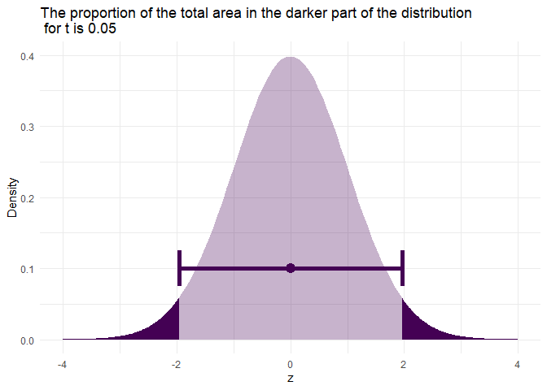
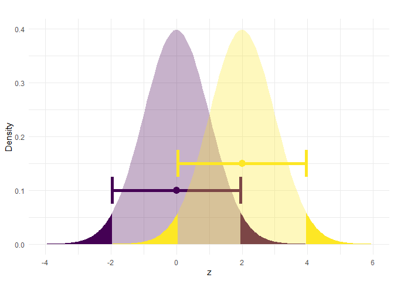
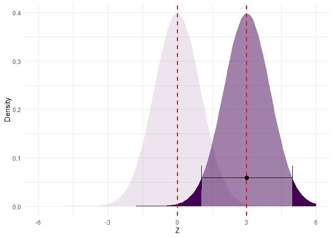
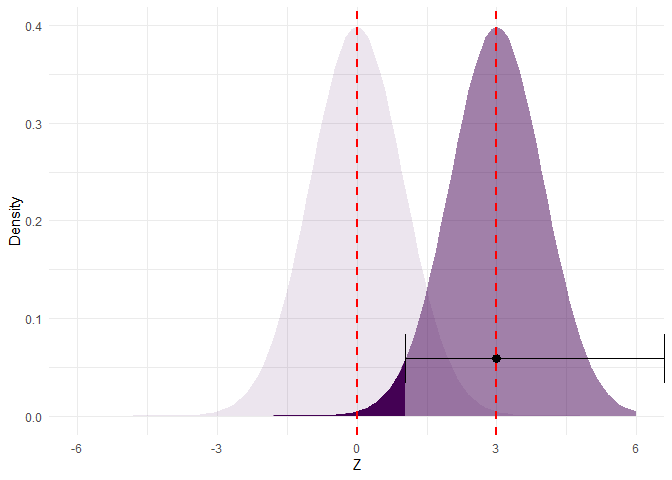
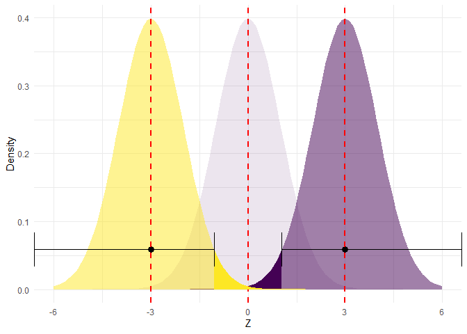
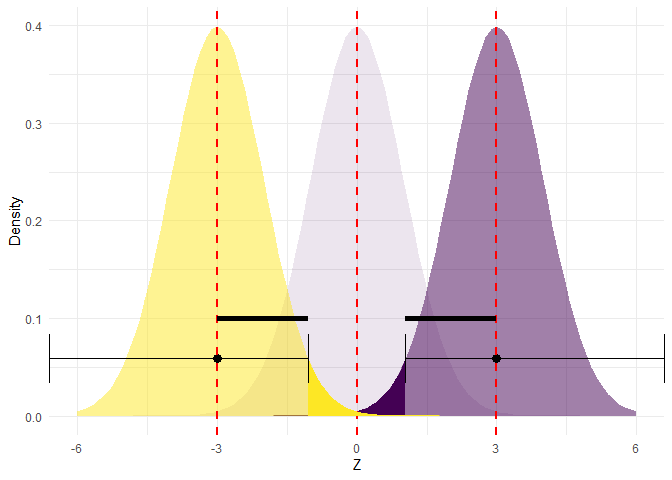
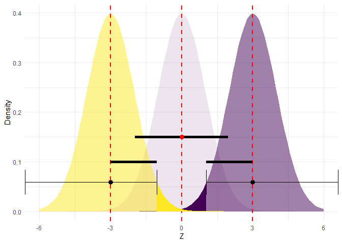
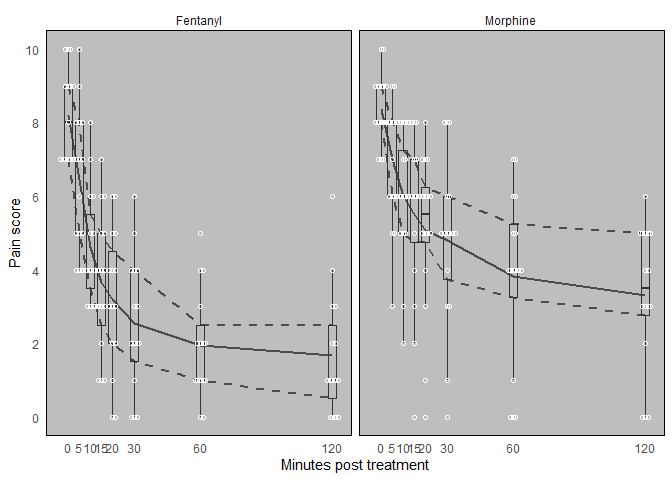
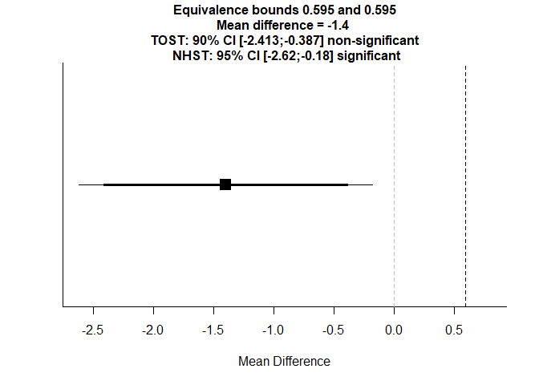
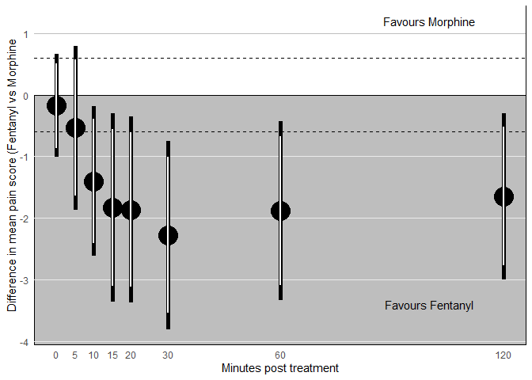

# Frequentist statistics continued + equivalence vs superiority tests

## Part 4: Confidence intervals

In the previous sections, we discussed how to calculate and use p-values to make inferences, either by using the p-value directly, or by using it to perform binary hypothesis tests and focus on controlling errors. Another common way to use p-values is to create frequentist confidence intervals (CI). 

To do this, first we take some level of alpha, our acceptable type 1 error rate (usually 0.05 (5%) due to thoughtless convention). Then we set the null to be the effect estimate we actually observed. Then we take the collection of values for which we would fail to reject that null at the set alpha level. This collection of values is our CI.  Another way to think of it is that it is the middle 95% of values (for alpha = 0.05) from the estimator's sampling distribution, centered on our observed effect estimate. This can be tricky to think about, so let's work through it.  

First, let's look at the two-sided p-value from a normal sampling distribution with an effect = 0 and an standard error (SE) = 1 (remember, an SE is just what we call the standard deviation for a sampling distribution).


```r
  g1 <- ggplot(data_frame(x = c(-4 , 4)), aes(x = x)) + 
    stat_function(fun = dnorm, args = list(0, 1), 
                  geom = "area", fill = viridis(1), alpha = 0.3) +
    xlim(c(-4 , 4)) +
    xlab("z") +
    ylab("Density") +
    theme_minimal() +
    stat_function(xlim = c(1.96 , 4), 
                  fun = dnorm, args = list(0, 1), 
                  geom = "area", fill = viridis(1)) +
    stat_function(xlim = c(-4, -1.96), 
                  fun = dnorm, args = list(0, 1), 
                  geom = "area", fill = viridis(1)) +
    geom_errorbarh(aes(x = 0, xmax = 1.96, xmin = -1.96, y = 0.1), 
                   height = 0.05, size = 2, color = viridis(1)) +
    geom_point(aes(x = 0, y = 0.1), size = 4, color = viridis(1)) +
    ggtitle(paste0("The proportion of the total area in the darker part of the distribution\n for t is ", signif(2 * pnorm(1.96, 0, 1, lower.tail = FALSE), 3)))

  g1
```

<!-- -->

We can thus see the middle 95% of values, which would be our 95% CI. Values falling outside of this range are in the rejection region of the distribution. 

Now, for sampling distributions where we are happy to assume a normal model (this is often true), we can just slide this same range over so that it's centered on our observed effect estimate. So let's see this for an effect = 2. 


```r
  g2 <- g1 +
    stat_function(fun = dnorm, args = list(2, 1), 
                  geom = "area", fill = viridis(1, direction = -1), alpha = 0.3) +
    xlim(c(-4 , 6)) +
    xlab("z") +
    ylab("Density") +
    theme_minimal() +
    stat_function(xlim = c(2 + 1.96 , 6), 
                  fun = dnorm, args = list(2, 1), 
                  geom = "area", fill = viridis(1, direction = -1)) +
    stat_function(xlim = c(-4, -1.96 + 2), 
                  fun = dnorm, args = list(2, 1), 
                  geom = "area", fill = viridis(1, direction = -1)) +
    geom_errorbarh(aes(x = 2, xmax = 2 + 1.96, xmin = 2 + -1.96, y = 0.15), 
                   height = 0.05, size = 2, 
                   color = viridis(1, direction = -1)) +
    geom_point(aes(x = 2, y = 0.15), size = 4, 
               color = viridis(1, direction = -1)) +
    ggtitle("")

  g2
```

<!-- -->

So now the have the same interval centered on our observed effect = 2 (yellow). 

Because this effect of 2 is > 1.96 (1.96 being the critical value we used the calculate the p-value if we want alpha = 0.05; see the purple sampling distribution), we would thus "reject the null hypothesis of 0 effect". 

We can also see that zero falls (just barely) outside of the yellow 95% CI. This means that if we set the null to 2, rather than 0, then we would reject this new null if we actually observed a 0 effect, just like we reject a null of 0 when we observe a 2. One test is just the mirror image of the other. We will use the same idea when we get to equivalence tests below. 

So how should we interpret a CI centered on our observed effect? Many people think that an X% CI says that there is an X% chance that the "true" effect falls in the interval. This is incorrect, and reflects a Bayesian interpretation that is unwarranted here. 

Instead, an X% CI will contain the "true" effect X% of the time over many replications of the procedure that led to the CI. In other words, the CI is still a completely frequentist tool, and one way to think of it is as a collection of statistical tests. You can also think of it as a "compatibility interval" - a collection of values that our observed data would be compatible with (at some pre-specified alpha) had the data indeed been generated by (any one of) those values. We will come back to Bayesian intervals, where can *can* conclude some % that the "truth" falls in our interval (given other assumptions), when we get to Bayesian statistics later in the module. 

## Part 5: Equivalence

Thinking about equivalence tests can get tricky, so we will try to build up slowly. In a superiority trial, we usually construct a 95% CI around our effect estimate. If this interval excludes our null, then we might choose to reject that null, concluding that the data we observed would have been unusual had they actually been generated under a null model (which includes a null effect and the assumptions underlying the sampling distribution we use). In this case, our hypothesis test is one of H:0 y = 0 vs H_Alt: y < 0 or y >0 (assuming we are using a two-sided test).

However, to test for non-inferiority and non-superiority (the two "sides" of establishing equivalence), we will use two one-sided tests. 

The non-inferiority test is H0: y >= margin vs H_Alt y < margin, where higher values of y indicate worse outcome, and the margin is some value indicating how much worse we are willing the new treatment is compared to the current standard of care (see the lecture for more on this). If we reject this test, we can declare non-inferiority - that is, we reject the notion that the data we observed were from a data generating model where the "true" effect was as larger as our margin or larger 

The non-superiority test is then H0: y <= margin vs H_Alt: y > margin. When we reject this hypothesis test, we declare non-superiority. 

If we reject both tests, we conclude there is equivalence between the treatments being compared. 

Let's start with our familiar null = 0 sampling distribution from a normal model with a SE = 1 and a 95% two sided CI. 


```r
# Get the expected sampling distibution under a null hypotheis of no difference
  
  g1 
```

<!-- -->

Now let's slide the CI so that it centers on our non-inferiority margin (= 3 in this example).


```r
  margin <- 3

  g2 <- ggplot(data_frame(x = c(-6 , 6)), aes(x = x)) + 
    stat_function(fun = dnorm, args = list(0, 1), 
                  geom = "area", fill = viridis(1), alpha = 0.1) +
    stat_function(fun = dnorm, args = list(margin, 1), 
                  geom = "area", fill = viridis(1, end = 0.7), 
                  alpha = 0.5) +
    xlim(c(-6 , 6)) +
    xlab("Z") +
    ylab("Density") +
    theme_minimal() +
    stat_function(xlim = c(1.96 + margin , 6), 
              fun = dnorm, args = list(margin, 1), 
              geom = "area", fill = viridis(1)) +
    stat_function(xlim = c(-6, -1.96 + margin), 
              fun = dnorm, args = list(margin, 1), 
              geom = "area", fill = viridis(1))  +
    geom_errorbarh(aes(xmin = -1.96 + margin, xmax = 1.96 + margin,
             y = dnorm(-1.96)), height = 0.05) +
    geom_point(x = margin, y = dnorm(-1.96), size = 3) +
    geom_vline(xintercept = 0, color = "red", linetype = "dashed", size = 1) +
    geom_vline(xintercept = margin, color = "red", linetype = "dashed", 
         size = 1)

  g2
```

<!-- -->

But we aren't interested in a two sided test of H0: z = 3 vs H_Alt: Z < 3 or Z > 3, but rather we want the one sided test of Z >= 3 vs Z < 3 - our non-inferiority test.


```r
  g3 <- ggplot(data_frame(x = c(-6 , 6)), aes(x = x)) + 
    stat_function(fun = dnorm, args = list(0, 1), 
                  geom = "area", fill = viridis(1), alpha = 0.1) +
    stat_function(fun = dnorm, args = list(margin, 1), 
                  geom = "area", fill = viridis(1, end = 0.7), 
                  alpha = 0.5) +
    xlim(c(-6 , 6)) +
    xlab("Z") +
    ylab("Density") +
    theme_minimal() +
    stat_function(xlim = c(-6, -1.96 + margin), 
              fun = dnorm, args = list(margin, 1), 
              geom = "area", fill = viridis(1))  +
    geom_errorbarh(aes(xmin = -1.96 + margin, xmax = Inf,
             y = dnorm(-1.96)), height = 0.05) +
    geom_point(x = margin, y = dnorm(-1.96), size = 3) +
    geom_vline(xintercept = 0, color = "red", linetype = "dashed", size = 1) +
    geom_vline(xintercept = margin, color = "red", linetype = "dashed", 
               size = 1)

  g3
```

<!-- -->
Note: the right side of the 97.5% one-sided CI technically goes out to infinity, which is why the interval is asymetric. 

As well as the one sided test of Z <= -3 vs Z > -3 - our non-superiority test.


```r
  g4 <- g3 +
    stat_function(fun = dnorm, args = list(-margin, 1), 
                  geom = "area", fill = viridis(1, direction = -1), 
                  alpha = 0.5) +
    stat_function(xlim = c(6, 1.96 + -margin), 
                  fun = dnorm, args = list(-margin, 1), 
                  geom = "area", fill = viridis(1, direction = -1)) +
    geom_errorbarh(aes(xmin = 1.96 + -margin, xmax = -Inf,
                   y = dnorm(-1.96)), height = 0.05) +
    geom_point(x = -margin, y = dnorm(-1.96), size = 3) +
    geom_vline(xintercept = -margin, color = "red", linetype = "dashed", 
               size = 1)

  g4
```

<!-- -->

Based on these two one-sided 97.5% intervals, we can create a two-sided 95% interval as follows: 

First, take each bounded side of the two one-sided intervals. 


```r
  g5 <- g4 + 
    geom_segment(x = 1.96 + -margin, xend = -margin,
                 y = 0.1, yend = 0.1, size = 2) +
    geom_segment(x = -1.96 + margin, xend = margin,
                 y = 0.1, yend = 0.1, size = 2)

  g5
```

<!-- -->

Then stick them together. 


```r
  g6 <- g5 + 
    geom_segment(x = 1.96, xend = 0,
                 y = 0.15, yend = 0.15, size = 2) +
    geom_segment(x = -1.96, xend = 0,
                 y = 0.15, yend = 0.15, size = 2) +
    geom_point(y = 0.15, x = 0, size = 3, color = "red") 


  g6
```

<!-- -->

So now I have a 95% CI centered on 0, and if I shifted it so that its upper limit crossed the non-inferiority margin, that would also drag the point estimate into the acceptance (light purple) region of the one-sided test, so we wouldn't be able to declare non-inferiority. Similarly, if I shifted it so that its lower limit crossed the non-superiority margin, that would drag the estimate into the acceptance region (light yellow) of the one-sided non-superiority test.

One final point, here were focused on one-sided tests with alpha = 0.025 (2.5%) so that we could get to the 95% (100 - (2 * 2.5)) two-sided confidence intervals we are more used to. However, if we are truly wanting to use a 5% type 1 error rate, then we would use two one-sided 95% intervals, resulting in a 90% two-sided CI. Both 90% and 95% CIs are used in practice, but you need to understand that when used in equivalence tests the first has a 5% type 1 error rate, and the second has a 2.5% type 1 error rate. 

## Analysis example

Here is an example of this in practice. We start with a small trial looking at the effect of fentanyl vs morphine in controlling pain. 


```r
  data <- read_csv("data/data.csv")

  names(data)
```

```
##  [1] "subject"        "arm"            "a_painscore0"   "b_painscore5"  
##  [5] "c_painscore10"  "d_painscore15"  "e_painscore20"  "f_painscore30" 
##  [9] "g_painscore60"  "h_painscore120"
```

```r
  length(unique(data$subject)) == nrow(data)
```

```
## [1] TRUE
```

```r
  table(data$arm)
```

```
## 
## Fentanyl Morphine 
##       15       16
```

We can see the dataset contains a unique id for 31 observations, information about which arm the participant was in, and a series of pain scores measured over time. 

The first thing I usually do with a dataset is to plot the key variables, so let's have a look at these pain scores over time. To do this, first I want to "reshape" the dataset from a wide format (1 row with many columns per observations) to a long format (many rows - one for each time point per person).


```r
  pain <- gather(data, time, pain, a_painscore0:h_painscore120) %>%
    mutate(time = as.numeric(gsub("_", "", gsub("[[:alpha:]]", "", time))))

  head(pain)
```

```
## # A tibble: 6 x 4
##   subject arm       time  pain
##     <dbl> <chr>    <dbl> <dbl>
## 1     101 Morphine     0    10
## 2     102 Fentanyl     0     9
## 3     103 Morphine     0     9
## 4     104 Fentanyl     0     9
## 5     105 Morphine     0     9
## 6     106 Morphine     0     8
```

Next I want to calculate some summary statistics, and then plot these alongside the data. 


```r
# Summary stats
  pain_df <- group_by(pain, arm, time) %>%
    summarise(median = quantile(pain, 0.5),
              upperq = quantile(pain, 0.75),
              lowerq = quantile(pain, 0.25),
              mean = mean(pain),
              sd = sd(pain),
              n = n(),
              se = sd / sqrt(n-1),
              ul = mean + (1.96 * se),
              ll = mean - (1.96 * se)) %>%
    gather(type, pain, median:ll)
  
# Plot the summary stats and the raw data
  ggplot(pain_df, aes(x = time, y = pain)) +
    geom_line(data = filter(pain_df, type == "upperq"),
              alpha = 0.6, color = "black", size = 1, linetype = "dashed") +
    geom_line(data = filter(pain_df, type == "mean"), 
              alpha = 0.6, color = "black", size = 1) +
    geom_line(data = filter(pain_df, type == "lowerq"),
              alpha = 0.6, color = "black", size = 1, linetype = "dashed") +
    geom_boxplot(data = pain, aes(y = pain, group = time), 
                 color = "grey20", alpha = 0) +
    geom_beeswarm(data = pain, aes(group = time, y = pain),
                  color = "white", shape = 1) +
    facet_wrap(~arm, nrow = 1) +
    theme_minimal() +
    theme(panel.grid = element_blank()) +
    xlab("Minutes post treatment") +
    ylab("Pain score") +
    scale_y_continuous(breaks = seq(0, 10, by = 2)) +
    scale_x_continuous(breaks = c(0, 5, 10, 15, 20, 30, 60, 120)) +
    theme(panel.background = element_rect(fill = "grey")) +
    coord_cartesian(ylim = c(0, 10))
```

<!-- -->

```r
# Save a pdf version  
  ggsave("plots/figure_1.pdf", height = 19.05, width = 33.86,
         units = "cm", scale = 0.8)
```

### TOST for the primary outcome (10 minutes)

Next we want to use the TOSTER package to carry out our two one-sided tests that we will use to evaluate if fentanyl is non-inferior to morphine. This means that we will accept that it's a little worse (e.g. is associated with higher pain scores), but not too much worse (not more than +0.36 SDs of pain worse - this is the margin).  


```r
  m2 <- mean(filter(data, arm == "Morphine")$c_painscore10, na.rm = TRUE)
  m1 <- mean(filter(data, arm == "Fentanyl")$c_painscore10, na.rm = TRUE)
  sd2 <-  sd(filter(data, arm == "Morphine")$c_painscore10, na.rm = TRUE)
  sd1 <-  sd(filter(data, arm == "Fentanyl")$c_painscore10, na.rm = TRUE)

  TOSTtwo(
    m1 = m1, m2 = m2, sd1 = sd1, sd2 = sd2, n1 = 16, n2 = 15,
    low_eqbound_d  = 0.36,
    high_eqbound_d = 0.36,
    alpha = 0.05,
    var.equal = FALSE,
    plot = TRUE
    )
```

<!-- -->

```
## TOST results:
## t-value lower bound: -3.35 	p-value lower bound: 0.999
## t-value upper bound: -3.35 	p-value upper bound: 0.001
## degrees of freedom : 28.01
## 
## Equivalence bounds (Cohen's d):
## low eqbound: 0.36 
## high eqbound: 0.36
## 
## Equivalence bounds (raw scores):
## low eqbound: 0.5952 
## high eqbound: 0.5952
## 
## TOST confidence interval:
## lower bound 90% CI: -2.413
## upper bound 90% CI:  -0.387
## 
## NHST confidence interval:
## lower bound 95% CI: -2.62
## upper bound 95% CI:  -0.18
## 
## Equivalence Test Result:
## The equivalence test was non-significant, t(28.01) = -3.351, p = 0.999, given equivalence bounds of 0.595 and 0.595 (on a raw scale) and an alpha of 0.05.
## Null Hypothesis Test Result:
## The null hypothesis test was significant, t(28.01) = -2.352, p = 0.026, given an alpha of 0.05.
## Based on the equivalence test and the null-hypothesis test combined, we can conclude that the observed effect is statistically different from zero and statistically not equivalent to zero.
```

# Two sample t-tests with unequal variances

For our own learning, let's see if we can replicate what the TOSTER package does, and apply it to every time point. Below we will basically run 2 t-tests comparing the mean pain score between arms, at each time point. For one of these tests, we will set alpha to 0.05 (for a 95% CI), and for the other, we will set alpha to 0.10 (for a 90% CI, which is our two one-sided tests, each with alpha = 0.05).


```r
# Function for running and reporting t-tests
  ttest_res <- function(x, data, level, ...){
    form <- as.formula(paste0(x, " ~ arm"))
    x <- tidy(t.test(form, data, conf.level = level)) %>%
      mutate(time = x, level = level) %>%
      mutate(time = gsub("[[:alpha:]]", "", time)) %>%
      mutate(time = as.numeric(gsub("_", "", time)))

    return(x)
  }

# Mean diffs with 95%CI (taken from t-test)
  ttests_95 <- list()
  for(i in 1:length(names(dplyr::select(data, contains("painscore"))))){
    ttests_95[[i]] <- ttest_res(
      names(dplyr::select(data, contains("painscore")))[i], data, 0.95
    )
  }
  
  ttests_95 <- do.call(bind_rows, ttests_95)
  
# Mean diffs with 90%CI (taken from t-test)
  ttests_90 <- list()
  for(i in 1:length(names(dplyr::select(data, contains("painscore"))))){
    ttests_90[[i]] <- ttest_res(
      names(dplyr::select(data, contains("painscore")))[i], data, 0.90
    )
  }
  
  ttests_90 <- do.call(bind_rows, ttests_90)
```

Now let's plot the results. 


```r
  ggplot(ttests_95, aes(x = time, y = estimate, ymax = conf.high, 
                        ymin = conf.low)) +
    geom_rect(aes(ymin = 0, ymax = Inf, xmin = -Inf, xmax = Inf),
              fill = "white", alpha = 0.8) +
    geom_hline(yintercept = -0.6, linetype = "dashed", color = "black") +
    geom_hline(yintercept =  0.6, linetype = "dashed", color = "black") +
    geom_hline(yintercept = 0, color = "black") +
    geom_hline(yintercept = 1, color = "grey") +
    geom_pointrange(color = "black", size = 2) +
    geom_linerange(data = ttests_90, color = "white", size = 1) +
    theme_minimal() +
    theme(panel.grid.major.x = element_blank(), 
          panel.grid.minor.x = element_blank(), 
          panel.grid.minor.y = element_blank()) +    
    xlab("Minutes post treatment") +
    ylab("Difference in mean pain score (Fentanyl vs Morphine") +
    scale_x_continuous(breaks = c(0, 5, 10, 15, 20, 30, 60, 120)) +
    theme(panel.background = element_rect(fill = "grey")) +
    annotate("text", y = -3.4, x = 100, label = "Favours Fentanyl") +
    annotate("text", y = 1.2, x = 100, label = "Favours Morphine") 
```

<!-- -->

```r
   ggsave("plots/figure_2.pdf", height = 19.05, width = 33.86,
         units = "cm", scale = 0.8)
```

And finally, a table of results. 


```r
# Take the long pain data, convert to wide, keep mean, n, sd by arm and time
  pain_df_wide <- spread(pain_df, type, pain) %>% 
    dplyr::select(-ll, -ul, -median, -upperq, -lowerq, -se) %>%
    dplyr::select(arm, time, n, mean, sd)

# Split the data by arm and cbind into dataset. 
  table_data <- cbind(
    filter(pain_df_wide, arm == "Fentanyl"), 
    filter(pain_df_wide, arm == "Morphine")
  ) %>% 
    ungroup() %>%
    dplyr::select(-arm, -arm1, -time1)
  
  table_data <- full_join(
    table_data, 
    dplyr::select(ttests_95, estimate, conf.low, conf.high, time), 
    by = "time"
  )
  
  tar <- c("mean", "sd", "mean1", "sd1", "estimate", "conf.low", "conf.high")
  table_data[tar] <- lapply(table_data[tar], round, 2)
  
  table_data <- mutate(table_data, effect = paste0(
    estimate, " (", conf.low, " to ", conf.high, ")"
  )) %>%
    dplyr::select(-estimate, -conf.low, -conf.high)
  
  knitr::kable(
    table_data, 
    col.names = c(
      "Time (+min)", rep(c("N", "Mean", "SD"), 2), 
      "Mean Difference (95%CI)"
      ), 
    align = c("l", rep("c", ncol(table_data) - 1))
  )
```


Time (+min)    N     Mean     SD     N     Mean     SD     Mean Difference (95%CI) 
------------  ----  ------  ------  ----  ------  ------  -------------------------
0              15    8.20    1.26    16    8.38    0.96     -0.18 (-1.01 to 0.66)  
5              15    6.47    1.92    16    7.00    1.67     -0.53 (-1.86 to 0.8)   
10             15    4.60    1.55    16    6.00    1.75     -1.4 (-2.61 to -0.19)  
15             15    3.67    1.91    16    5.50    2.25     -1.83 (-3.37 to -0.3)  
20             15    3.20    1.93    16    5.06    2.17    -1.86 (-3.37 to -0.35)  
30             15    2.53    1.85    16    4.81    2.29     -2.28 (-3.8 to -0.76)  
60             15    1.93    1.49    16    3.81    2.37    -1.88 (-3.33 to -0.43)  
120            15    1.67    1.72    16    3.31    1.96      -1.65 (-3 to -0.29)   

### Challenge

Try to use what you've seen in the last two tutorials to 1) simulate some data (hint: see sim_t_test_data from the last tutorial) from a two arm parallel trial with n = 40 where the effect of the new treatment on a normally distributed outcome (mean = 0, sd = 1) is 0.3 SDs worse than the standard treatment (i.e. higher scores is bad). Then test for non-inferiority using the TOST procedure based on a t-test with unequal variances and a NI margin of 0.4 SDs (hint: see tost_primary above). Then repeat your simulation many times to explore it's performance. Finally, increase the sample size to 100 and repeat the exercise. 

