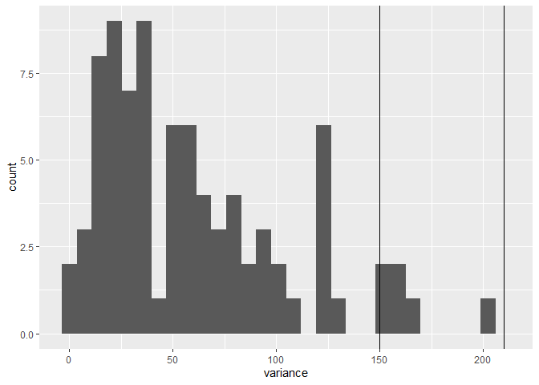

# Introduction 

For this tutorial we will be working with a dataset from a standard 2-period, 2-treatment AB:BA crossover trial of a treatment aimed at lowering blood pressure in people who usually have mildly-evaluated values. In other words, each person in the trial gets exposed to each intervention (active vs placebo), but in one of two possible sequences (active first vs placebo first). 

# Getting the data ready

As usual, we will first load the necessary packages and bring in the dataset. 


Have a look at the dataset. 


```r
# View(data)

# view(dfSummary(data))
```


```r
  print(summarytools::dfSummary(data, style = "grid", plain.ascii = FALSE), 
    method = "render")
```

<!--html_preserve--><div class="container st-container">
<h3>Data Frame Summary</h3>
<h4>data</h4>
<strong>Dimensions</strong>: 83 x 17
  <br/><strong>Duplicates</strong>: 0
<br/>
<table class="table table-striped table-bordered st-table st-table-striped st-table-bordered st-multiline ">
  <thead>
    <tr>
      <th align="center" class="st-protect-top-border"><strong>No</strong></th>
      <th align="center" class="st-protect-top-border"><strong>Variable</strong></th>
      <th align="center" class="st-protect-top-border"><strong>Stats / Values</strong></th>
      <th align="center" class="st-protect-top-border"><strong>Freqs (% of Valid)</strong></th>
      <th align="center" class="st-protect-top-border"><strong>Graph</strong></th>
      <th align="center" class="st-protect-top-border"><strong>Valid</strong></th>
      <th align="center" class="st-protect-top-border"><strong>Missing</strong></th>
    </tr>
  </thead>
  <tbody>
    <tr>
      <td align="center">1</td>
      <td align="left">subj_id
[character]</td>
      <td align="left">1. R001
2. R002
3. R003
4. R004
5. R005
6. R006
7. R007
8. R008
9. R009
10. R010
[ 73 others ]</td>
      <td align="left" style="padding:0;vertical-align:middle"><table style="border-collapse:collapse;border:none;margin:0"><tr style="background-color:transparent"><td style="padding:0 5px 0 7px;margin:0;border:0" align="right">1</td><td style="padding:0 2px 0 0;border:0;" align="left">(</td><td style="padding:0;border:0" align="right">1.2%</td><td style="padding:0 4px 0 2px;border:0" align="left">)</td></tr><tr style="background-color:transparent"><td style="padding:0 5px 0 7px;margin:0;border:0" align="right">1</td><td style="padding:0 2px 0 0;border:0;" align="left">(</td><td style="padding:0;border:0" align="right">1.2%</td><td style="padding:0 4px 0 2px;border:0" align="left">)</td></tr><tr style="background-color:transparent"><td style="padding:0 5px 0 7px;margin:0;border:0" align="right">1</td><td style="padding:0 2px 0 0;border:0;" align="left">(</td><td style="padding:0;border:0" align="right">1.2%</td><td style="padding:0 4px 0 2px;border:0" align="left">)</td></tr><tr style="background-color:transparent"><td style="padding:0 5px 0 7px;margin:0;border:0" align="right">1</td><td style="padding:0 2px 0 0;border:0;" align="left">(</td><td style="padding:0;border:0" align="right">1.2%</td><td style="padding:0 4px 0 2px;border:0" align="left">)</td></tr><tr style="background-color:transparent"><td style="padding:0 5px 0 7px;margin:0;border:0" align="right">1</td><td style="padding:0 2px 0 0;border:0;" align="left">(</td><td style="padding:0;border:0" align="right">1.2%</td><td style="padding:0 4px 0 2px;border:0" align="left">)</td></tr><tr style="background-color:transparent"><td style="padding:0 5px 0 7px;margin:0;border:0" align="right">1</td><td style="padding:0 2px 0 0;border:0;" align="left">(</td><td style="padding:0;border:0" align="right">1.2%</td><td style="padding:0 4px 0 2px;border:0" align="left">)</td></tr><tr style="background-color:transparent"><td style="padding:0 5px 0 7px;margin:0;border:0" align="right">1</td><td style="padding:0 2px 0 0;border:0;" align="left">(</td><td style="padding:0;border:0" align="right">1.2%</td><td style="padding:0 4px 0 2px;border:0" align="left">)</td></tr><tr style="background-color:transparent"><td style="padding:0 5px 0 7px;margin:0;border:0" align="right">1</td><td style="padding:0 2px 0 0;border:0;" align="left">(</td><td style="padding:0;border:0" align="right">1.2%</td><td style="padding:0 4px 0 2px;border:0" align="left">)</td></tr><tr style="background-color:transparent"><td style="padding:0 5px 0 7px;margin:0;border:0" align="right">1</td><td style="padding:0 2px 0 0;border:0;" align="left">(</td><td style="padding:0;border:0" align="right">1.2%</td><td style="padding:0 4px 0 2px;border:0" align="left">)</td></tr><tr style="background-color:transparent"><td style="padding:0 5px 0 7px;margin:0;border:0" align="right">1</td><td style="padding:0 2px 0 0;border:0;" align="left">(</td><td style="padding:0;border:0" align="right">1.2%</td><td style="padding:0 4px 0 2px;border:0" align="left">)</td></tr><tr style="background-color:transparent"><td style="padding:0 5px 0 7px;margin:0;border:0" align="right">73</td><td style="padding:0 2px 0 0;border:0;" align="left">(</td><td style="padding:0;border:0" align="right">87.9%</td><td style="padding:0 4px 0 2px;border:0" align="left">)</td></tr></table></td>
      <td align="left" style="vertical-align:middle;padding:0;background-color:transparent"></td>
      <td align="center">83
(100%)</td>
      <td align="center">0
(0%)</td>
    </tr>
    <tr>
      <td align="center">2</td>
      <td align="left">sequence
[numeric]</td>
      <td align="left">Min : 0
Mean : 0.5
Max : 1</td>
      <td align="left" style="padding:0;vertical-align:middle"><table style="border-collapse:collapse;border:none;margin:0"><tr style="background-color:transparent"><td style="padding:0 0 0 7px;margin:0;border:0" align="right">0</td><td style="padding:0 2px;border:0;" align="left">:</td><td style="padding:0 4px 0 6px;margin:0;border:0" align="right">42</td><td style="padding:0;border:0" align="left">(</td><td style="padding:0 2px;margin:0;border:0" align="right">50.6%</td><td style="padding:0 4px 0 0;border:0" align="left">)</td></tr><tr style="background-color:transparent"><td style="padding:0 0 0 7px;margin:0;border:0" align="right">1</td><td style="padding:0 2px;border:0;" align="left">:</td><td style="padding:0 4px 0 6px;margin:0;border:0" align="right">41</td><td style="padding:0;border:0" align="left">(</td><td style="padding:0 2px;margin:0;border:0" align="right">49.4%</td><td style="padding:0 4px 0 0;border:0" align="left">)</td></tr></table></td>
      <td align="left" style="vertical-align:middle;padding:0;background-color:transparent"></td>
      <td align="center">83
(100%)</td>
      <td align="center">0
(0%)</td>
    </tr>
    <tr>
      <td align="center">3</td>
      <td align="left">treatment_p1
[numeric]</td>
      <td align="left">Min : 0
Mean : 0.5
Max : 1</td>
      <td align="left" style="padding:0;vertical-align:middle"><table style="border-collapse:collapse;border:none;margin:0"><tr style="background-color:transparent"><td style="padding:0 0 0 7px;margin:0;border:0" align="right">0</td><td style="padding:0 2px;border:0;" align="left">:</td><td style="padding:0 4px 0 6px;margin:0;border:0" align="right">42</td><td style="padding:0;border:0" align="left">(</td><td style="padding:0 2px;margin:0;border:0" align="right">50.6%</td><td style="padding:0 4px 0 0;border:0" align="left">)</td></tr><tr style="background-color:transparent"><td style="padding:0 0 0 7px;margin:0;border:0" align="right">1</td><td style="padding:0 2px;border:0;" align="left">:</td><td style="padding:0 4px 0 6px;margin:0;border:0" align="right">41</td><td style="padding:0;border:0" align="left">(</td><td style="padding:0 2px;margin:0;border:0" align="right">49.4%</td><td style="padding:0 4px 0 0;border:0" align="left">)</td></tr></table></td>
      <td align="left" style="vertical-align:middle;padding:0;background-color:transparent"></td>
      <td align="center">83
(100%)</td>
      <td align="center">0
(0%)</td>
    </tr>
    <tr>
      <td align="center">4</td>
      <td align="left">treatment_p2
[numeric]</td>
      <td align="left">Min : 0
Mean : 0.5
Max : 1</td>
      <td align="left" style="padding:0;vertical-align:middle"><table style="border-collapse:collapse;border:none;margin:0"><tr style="background-color:transparent"><td style="padding:0 0 0 7px;margin:0;border:0" align="right">0</td><td style="padding:0 2px;border:0;" align="left">:</td><td style="padding:0 4px 0 6px;margin:0;border:0" align="right">41</td><td style="padding:0;border:0" align="left">(</td><td style="padding:0 2px;margin:0;border:0" align="right">49.4%</td><td style="padding:0 4px 0 0;border:0" align="left">)</td></tr><tr style="background-color:transparent"><td style="padding:0 0 0 7px;margin:0;border:0" align="right">1</td><td style="padding:0 2px;border:0;" align="left">:</td><td style="padding:0 4px 0 6px;margin:0;border:0" align="right">42</td><td style="padding:0;border:0" align="left">(</td><td style="padding:0 2px;margin:0;border:0" align="right">50.6%</td><td style="padding:0 4px 0 0;border:0" align="left">)</td></tr></table></td>
      <td align="left" style="vertical-align:middle;padding:0;background-color:transparent"></td>
      <td align="center">83
(100%)</td>
      <td align="center">0
(0%)</td>
    </tr>
    <tr>
      <td align="center">5</td>
      <td align="left">sex
[numeric]</td>
      <td align="left">Min : 0
Mean : 0.4
Max : 1</td>
      <td align="left" style="padding:0;vertical-align:middle"><table style="border-collapse:collapse;border:none;margin:0"><tr style="background-color:transparent"><td style="padding:0 0 0 7px;margin:0;border:0" align="right">0</td><td style="padding:0 2px;border:0;" align="left">:</td><td style="padding:0 4px 0 6px;margin:0;border:0" align="right">46</td><td style="padding:0;border:0" align="left">(</td><td style="padding:0 2px;margin:0;border:0" align="right">55.4%</td><td style="padding:0 4px 0 0;border:0" align="left">)</td></tr><tr style="background-color:transparent"><td style="padding:0 0 0 7px;margin:0;border:0" align="right">1</td><td style="padding:0 2px;border:0;" align="left">:</td><td style="padding:0 4px 0 6px;margin:0;border:0" align="right">37</td><td style="padding:0;border:0" align="left">(</td><td style="padding:0 2px;margin:0;border:0" align="right">44.6%</td><td style="padding:0 4px 0 0;border:0" align="left">)</td></tr></table></td>
      <td align="left" style="vertical-align:middle;padding:0;background-color:transparent"></td>
      <td align="center">83
(100%)</td>
      <td align="center">0
(0%)</td>
    </tr>
    <tr>
      <td align="center">6</td>
      <td align="left">age_screening
[numeric]</td>
      <td align="left">Mean (sd) : 57.7 (6.2)
min < med < max:
45 < 57 < 70
IQR (CV) : 10.5 (0.1)</td>
      <td align="left" style="vertical-align:middle">25 distinct values</td>
      <td align="left" style="vertical-align:middle;padding:0;background-color:transparent"></td>
      <td align="center">83
(100%)</td>
      <td align="center">0
(0%)</td>
    </tr>
    <tr>
      <td align="center">7</td>
      <td align="left">days_p1
[numeric]</td>
      <td align="left">Mean (sd) : 42.4 (4.7)
min < med < max:
34 < 42 < 68
IQR (CV) : 1 (0.1)</td>
      <td align="left" style="vertical-align:middle">19 distinct values</td>
      <td align="left" style="vertical-align:middle;padding:0;background-color:transparent"></td>
      <td align="center">83
(100%)</td>
      <td align="center">0
(0%)</td>
    </tr>
    <tr>
      <td align="center">8</td>
      <td align="left">days_p2
[numeric]</td>
      <td align="left">Mean (sd) : 42.7 (3.4)
min < med < max:
33 < 42 < 50
IQR (CV) : 2 (0.1)</td>
      <td align="left" style="vertical-align:middle">17 distinct values</td>
      <td align="left" style="vertical-align:middle;padding:0;background-color:transparent"></td>
      <td align="center">82
(98.8%)</td>
      <td align="center">1
(1.2%)</td>
    </tr>
    <tr>
      <td align="center">9</td>
      <td align="left">height_m
[numeric]</td>
      <td align="left">Mean (sd) : 1.7 (0.1)
min < med < max:
1.5 < 1.7 < 1.9
IQR (CV) : 0.2 (0.1)</td>
      <td align="left" style="vertical-align:middle">34 distinct values</td>
      <td align="left" style="vertical-align:middle;padding:0;background-color:transparent"></td>
      <td align="center">83
(100%)</td>
      <td align="center">0
(0%)</td>
    </tr>
    <tr>
      <td align="center">10</td>
      <td align="left">weight_kg_screen
[numeric]</td>
      <td align="left">Mean (sd) : 80.4 (13)
min < med < max:
53.5 < 80.9 < 106.3
IQR (CV) : 20.4 (0.2)</td>
      <td align="left" style="vertical-align:middle">76 distinct values</td>
      <td align="left" style="vertical-align:middle;padding:0;background-color:transparent"></td>
      <td align="center">83
(100%)</td>
      <td align="center">0
(0%)</td>
    </tr>
    <tr>
      <td align="center">11</td>
      <td align="left">bmi_screening
[numeric]</td>
      <td align="left">Mean (sd) : 27.7 (3.5)
min < med < max:
20.4 < 27.9 < 37.2
IQR (CV) : 4.9 (0.1)</td>
      <td align="left" style="vertical-align:middle">83 distinct values</td>
      <td align="left" style="vertical-align:middle;padding:0;background-color:transparent"></td>
      <td align="center">83
(100%)</td>
      <td align="center">0
(0%)</td>
    </tr>
    <tr>
      <td align="center">12</td>
      <td align="left">sbpscreening
[numeric]</td>
      <td align="left">Mean (sd) : 140.4 (10.1)
min < med < max:
124 < 140 < 171
IQR (CV) : 13.5 (0.1)</td>
      <td align="left" style="vertical-align:middle">35 distinct values</td>
      <td align="left" style="vertical-align:middle;padding:0;background-color:transparent"></td>
      <td align="center">83
(100%)</td>
      <td align="center">0
(0%)</td>
    </tr>
    <tr>
      <td align="center">13</td>
      <td align="left">dbpscreening
[numeric]</td>
      <td align="left">Mean (sd) : 89.5 (8.8)
min < med < max:
67 < 89 < 112
IQR (CV) : 11.5 (0.1)</td>
      <td align="left" style="vertical-align:middle">34 distinct values</td>
      <td align="left" style="vertical-align:middle;padding:0;background-color:transparent"></td>
      <td align="center">83
(100%)</td>
      <td align="center">0
(0%)</td>
    </tr>
    <tr>
      <td align="center">14</td>
      <td align="left">sbp__b_p1
[numeric]</td>
      <td align="left">Mean (sd) : 137.4 (12.6)
min < med < max:
109 < 137.5 < 167
IQR (CV) : 13.8 (0.1)</td>
      <td align="left" style="vertical-align:middle">38 distinct values</td>
      <td align="left" style="vertical-align:middle;padding:0;background-color:transparent"></td>
      <td align="center">82
(98.8%)</td>
      <td align="center">1
(1.2%)</td>
    </tr>
    <tr>
      <td align="center">15</td>
      <td align="left">sbp__ep_p1
[numeric]</td>
      <td align="left">Mean (sd) : 137.1 (14.5)
min < med < max:
106 < 136 < 178
IQR (CV) : 16.8 (0.1)</td>
      <td align="left" style="vertical-align:middle">44 distinct values</td>
      <td align="left" style="vertical-align:middle;padding:0;background-color:transparent"></td>
      <td align="center">82
(98.8%)</td>
      <td align="center">1
(1.2%)</td>
    </tr>
    <tr>
      <td align="center">16</td>
      <td align="left">sbp__b_p2
[numeric]</td>
      <td align="left">Mean (sd) : 135.5 (12.3)
min < med < max:
112 < 135 < 170
IQR (CV) : 17.8 (0.1)</td>
      <td align="left" style="vertical-align:middle">38 distinct values</td>
      <td align="left" style="vertical-align:middle;padding:0;background-color:transparent"></td>
      <td align="center">82
(98.8%)</td>
      <td align="center">1
(1.2%)</td>
    </tr>
    <tr>
      <td align="center">17</td>
      <td align="left">sbp__ep_p2
[numeric]</td>
      <td align="left">Mean (sd) : 136.4 (14)
min < med < max:
104 < 133 < 174
IQR (CV) : 19.8 (0.1)</td>
      <td align="left" style="vertical-align:middle">42 distinct values</td>
      <td align="left" style="vertical-align:middle;padding:0;background-color:transparent"></td>
      <td align="center">82
(98.8%)</td>
      <td align="center">1
(1.2%)</td>
    </tr>
  </tbody>
</table>
<p>Generated by <a href='https://github.com/dcomtois/summarytools'>summarytools</a> 0.9.6 (<a href='https://www.r-project.org/'>R</a> version 3.6.3)<br/>2020-10-05</p>
</div><!--/html_preserve-->


```r
# We should add labels for sex

  data$sex <- factor(data$sex, labels = c("Males", "Females"))

# Challange: Based on the information available in the dataset, how could you
# confirm that 0 = Males and 1 = Females, as I have coded it here?
```


We can see there are 4 SBP values per patient (row). These are the start and end values for each of the two periods. To visualize and analyze these data correctly, we need to convert the dataset so that it's "long", i.e. one row for each patient/time-point (more on why we do this below).


```r
# Being able to switch between wide and long datasets is important for both
# modeling and plotting data. 

# "Wide" data:
#  ID   Time1Measure  T2M  T3M   T4M
#   1        85        82   83    81
#   2        45        96   32    99

# "Long" data:
#  ID  Time  Measure
#   1    1    85
#   1    2    82
#   1    3    83
#   1    4    81

# Reshape the data on 4 SBP values in order to plot the within period changes
# by tx group, get missing values. See functions.R

  data_long <- gather(data, time, value, starts_with("sbp")) %>%
    select(sequence, treatment_p1, treatment_p2, time, value, subj_id, sex, 
           everything()) %>%
    mutate(sequence = factor(sequence), treatment_p1 = factor(treatment_p1),
           treatment_p2 = factor(treatment_p2))

# view(dfSummary(data_long))
```

Now you can see there are five timepoints (screening, plus the start and end values for each of the two periods), each with 83 observations, which is the number of study participants. 

Now let's clean up the data a bit. 


```r
  data_long$time <- gsub("sbp__|sbp", "", data_long$time) # remove extraneous info

# Just reordering the levels so they match time. This will help when we plot
# the data. 
  times <- c("b_p1", "ep_p1", "b_p2", "ep_p2")

  data_long <- mutate(data_long, time = factor(time, levels = times)) 
# table(data_long$time)

# Create a new variable to reflect the period  
  data_long$period[grepl("_p1", data_long$time)] <- "First"
  data_long$period[grepl("_p2", data_long$time)] <- "Second"

# Create a new variable to reflect start (baseline) or end of period  
  bp <- grepl("b_p",  data_long$time) # Baseline times
  ep <- grepl("ep_p", data_long$time) # End times

  data_long$timing[bp] <- "Baseline"
  data_long$timing[ep] <- "EoP"
  
# with(data_long, table(period, timing))  

# These are the same info but we'll use them in the models below where I'll 
# explain why we want them split into 2 columns like this.   
  data_long$bl[bp] <- data_long$value[bp] # Baseline SBPs
  data_long$ep[ep] <- data_long$value[ep] # End SBPs

# Treatment indicator  
  p1 <- data_long$period == "First"  & !is.na(data_long$period)
  p2 <- data_long$period == "Second" & !is.na(data_long$period)
  data_long$tx[p1] <- data_long$treatment_p1[p1]
  data_long$tx[p2] <- data_long$treatment_p2[p2]

  data_long <- filter(data_long, !is.na(time)) %>%
    arrange(subj_id, period, timing) %>%
    select(subj_id, sequence, period, timing, tx, value, everything()) %>%
    mutate(period = factor(period),
           timing = factor(timing),
           tx  = factor(tx))

  data_long$time2 <- factor(
    data_long$time, 
    labels = c("p1_b", "p1_ep", "p2_b", "p2_ep")
    )

# View(data_long)
  
# view(dfSummary(data_long))
```

Now plot the data in a way that shows the overall structure. 


```r
  ggplot(data_long, aes(x = time2, y = value, group = subj_id)) +
    geom_line(data = filter(data_long, as.numeric(time) < 3), alpha = 0.2,
              aes(color = treatment_p1)) +
    geom_smooth(data = filter(data_long, as.numeric(time) < 3), method = "lm",
                aes(color = treatment_p1, linetype = treatment_p1,
                group = treatment_p1),
                se = FALSE, size = 2) +
    geom_line(data = filter(data_long, as.numeric(time) > 2), alpha = 0.2,
              aes(color = treatment_p2)) +
    geom_smooth(data = filter(data_long, as.numeric(time) > 2), method = "lm",
                aes(color = treatment_p2, linetype = treatment_p2,
                    group = treatment_p2),
                se = FALSE, size = 2) +
    scale_linetype(guide = FALSE) +
    theme_minimal() +
    scale_color_brewer("Tx", palette = "Set1") +
    theme(panel.grid.major = element_blank(),
        panel.grid.minor = element_blank()) +
    scale_x_discrete(labels = c("Start P1", "End P1", "Start P2", "End P2")) +
    xlab("") +
    ylab("SBP mmHg")
```

<!-- -->

Here we can get a sense of the variability in SBP both within- and between-people. There seems to be quite a lot of both as it happens. We'll dig into this a bit more below. We can also see that the mean change for both groups in both periods is pretty similar.  


```r
# Distribution plot

  ggplot(data_long, aes(x = value, fill = tx, color = tx)) +
    geom_density(alpha = 0.7) +
    geom_rug() +
    scale_fill_brewer("Tx", palette = "Set1") +
    scale_color_brewer("Tx", palette = "Set1") +
    facet_wrap(~period + timing) +
    theme_minimal() +
    theme(panel.grid.major = element_blank(),
          panel.grid.minor = element_blank()) +
    ylab("") +
    xlab("SBP mmHg")
```

<!-- -->
This is just another look at the overall distribution of SBP by period and treatment, showing a great deal of overlap. 

Note on long/wide data: 

A key concept in plotting with ggplot is that we map variables onto different aesthetics. Aesthetics are things like distances along the x and y axes, colors, and facets. We needed to convert our data from wide to long, because we can only map one variable onto any one aesthetic. So by going from wide to long, we turned our 4 time-specific SBP variables into 2 variables - one for time and one for the actual SBP value. Then we could map the SBP values to the y axis, and time to the x axis. As an exercise, you might sit with a pen and paper and try to figure out how to map 4 separate SBP variables onto a set of aesthetics that would make for a sensible plot (but don't take too much time, because you can't!).  

Being able to switch between long and wide also matters for modeling the data. For example, for a linear regression of an outcome where you want to also adjust for the baseline values of that variable, you need the data in a wide format, where each row is an observation (e.g. a patient) and there is only one row per observation. Thus the two measures at baseline and the end of the study are contained in two different columns. However, if we were doing a paired analysis, as we will below, we would need the data in a long format, where each row corresponds to a specific patient and time, and thus the information for the outcome and baseline measurements can be contained in a single column. 

# Between vs within-person variance

The main advantage of a crossover trial is that you get to evaluate your treatment against the backdrop of the within-person variability of the outcome, which is usually less variable than the between-person variability that comes into play in a parallel trial. Remember, the variance is just the average squared-distance between each measurement and the mean; and the larger it is, the more "spread out" the data are from the mean. 

First, let's look at the between-person variability for the 4 SBP measurements. 


```r
  data_long %>%
    group_by(time) %>%
    summarise(
      n = n(), 
      variance = var(value, na.rm = TRUE)
      )
```

```
## # A tibble: 4 x 3
##   time      n variance
##   <fct> <int>    <dbl>
## 1 b_p1     83     158.
## 2 ep_p1    83     211.
## 3 b_p2     83     150.
## 4 ep_p2    83     196.
```
Now, let's look at all the within-person variances. There are 83 of them, so we'll plot them to make it easier to take them all in. I've also added reference lines at 150 and 210, the lowest and highest of the between-person variances above. 


```r
  data_long %>%
    group_by(subj_id) %>%
    summarise(
      n = n(), 
      variance = var(value, na.rm = TRUE)
      ) %>%
  ggplot(aes(x = variance)) +
    geom_histogram() +
    geom_vline(xintercept = c(150, 210))
```

<!-- -->
It should be clear that the within-person variances are well below the observed between-person variances. 

We can also look at this from the perspective of a linear model, and adjust for person (just like we might adjust for any other categorical variable). This model will thus report 82 (83 - 1) different means (i.e. person-specific intercepts). Take note of the R2 value, which is the % of the outcome variance explained. 


```r
  lm(value ~ subj_id, data = data_long) %>%
  tab_model()
```

<table style="border-collapse:collapse; border:none;">
<tr>
<th style="border-top: double; text-align:center; font-style:normal; font-weight:bold; padding:0.2cm;  text-align:left; ">&nbsp;</th>
<th colspan="3" style="border-top: double; text-align:center; font-style:normal; font-weight:bold; padding:0.2cm; ">value</th>
</tr>
<tr>
<td style=" text-align:center; border-bottom:1px solid; font-style:italic; font-weight:normal;  text-align:left; ">Predictors</td>
<td style=" text-align:center; border-bottom:1px solid; font-style:italic; font-weight:normal;  ">Estimates</td>
<td style=" text-align:center; border-bottom:1px solid; font-style:italic; font-weight:normal;  ">CI</td>
<td style=" text-align:center; border-bottom:1px solid; font-style:italic; font-weight:normal;  ">p</td>
</tr>
<tr>
<td style=" padding:0.2cm; text-align:left; vertical-align:top; text-align:left; ">(Intercept)</td>
<td style=" padding:0.2cm; text-align:left; vertical-align:top; text-align:center;  ">146.25</td>
<td style=" padding:0.2cm; text-align:left; vertical-align:top; text-align:center;  ">138.69&nbsp;&ndash;&nbsp;153.81</td>
<td style=" padding:0.2cm; text-align:left; vertical-align:top; text-align:center;  "><strong>&lt;0.001</td>
</tr>
<tr>
<td style=" padding:0.2cm; text-align:left; vertical-align:top; text-align:left; ">subj_id [R002]</td>
<td style=" padding:0.2cm; text-align:left; vertical-align:top; text-align:center;  ">-16.58</td>
<td style=" padding:0.2cm; text-align:left; vertical-align:top; text-align:center;  ">-28.13&nbsp;&ndash;&nbsp;-5.03</td>
<td style=" padding:0.2cm; text-align:left; vertical-align:top; text-align:center;  "><strong>0.005</strong></td>
</tr>
<tr>
<td style=" padding:0.2cm; text-align:left; vertical-align:top; text-align:left; ">subj_id [R003]</td>
<td style=" padding:0.2cm; text-align:left; vertical-align:top; text-align:center;  ">-10.75</td>
<td style=" padding:0.2cm; text-align:left; vertical-align:top; text-align:center;  ">-21.44&nbsp;&ndash;&nbsp;-0.06</td>
<td style=" padding:0.2cm; text-align:left; vertical-align:top; text-align:center;  "><strong>0.049</strong></td>
</tr>
<tr>
<td style=" padding:0.2cm; text-align:left; vertical-align:top; text-align:left; ">subj_id [R004]</td>
<td style=" padding:0.2cm; text-align:left; vertical-align:top; text-align:center;  ">9.50</td>
<td style=" padding:0.2cm; text-align:left; vertical-align:top; text-align:center;  ">-1.19&nbsp;&ndash;&nbsp;20.19</td>
<td style=" padding:0.2cm; text-align:left; vertical-align:top; text-align:center;  ">0.081</td>
</tr>
<tr>
<td style=" padding:0.2cm; text-align:left; vertical-align:top; text-align:left; ">subj_id [R005]</td>
<td style=" padding:0.2cm; text-align:left; vertical-align:top; text-align:center;  ">-3.50</td>
<td style=" padding:0.2cm; text-align:left; vertical-align:top; text-align:center;  ">-14.19&nbsp;&ndash;&nbsp;7.19</td>
<td style=" padding:0.2cm; text-align:left; vertical-align:top; text-align:center;  ">0.520</td>
</tr>
<tr>
<td style=" padding:0.2cm; text-align:left; vertical-align:top; text-align:left; ">subj_id [R006]</td>
<td style=" padding:0.2cm; text-align:left; vertical-align:top; text-align:center;  ">-5.25</td>
<td style=" padding:0.2cm; text-align:left; vertical-align:top; text-align:center;  ">-15.94&nbsp;&ndash;&nbsp;5.44</td>
<td style=" padding:0.2cm; text-align:left; vertical-align:top; text-align:center;  ">0.334</td>
</tr>
<tr>
<td style=" padding:0.2cm; text-align:left; vertical-align:top; text-align:left; ">subj_id [R007]</td>
<td style=" padding:0.2cm; text-align:left; vertical-align:top; text-align:center;  ">-6.25</td>
<td style=" padding:0.2cm; text-align:left; vertical-align:top; text-align:center;  ">-16.94&nbsp;&ndash;&nbsp;4.44</td>
<td style=" padding:0.2cm; text-align:left; vertical-align:top; text-align:center;  ">0.251</td>
</tr>
<tr>
<td style=" padding:0.2cm; text-align:left; vertical-align:top; text-align:left; ">subj_id [R008]</td>
<td style=" padding:0.2cm; text-align:left; vertical-align:top; text-align:center;  ">-26.25</td>
<td style=" padding:0.2cm; text-align:left; vertical-align:top; text-align:center;  ">-36.94&nbsp;&ndash;&nbsp;-15.56</td>
<td style=" padding:0.2cm; text-align:left; vertical-align:top; text-align:center;  "><strong>&lt;0.001</td>
</tr>
<tr>
<td style=" padding:0.2cm; text-align:left; vertical-align:top; text-align:left; ">subj_id [R009]</td>
<td style=" padding:0.2cm; text-align:left; vertical-align:top; text-align:center;  ">1.50</td>
<td style=" padding:0.2cm; text-align:left; vertical-align:top; text-align:center;  ">-9.19&nbsp;&ndash;&nbsp;12.19</td>
<td style=" padding:0.2cm; text-align:left; vertical-align:top; text-align:center;  ">0.783</td>
</tr>
<tr>
<td style=" padding:0.2cm; text-align:left; vertical-align:top; text-align:left; ">subj_id [R010]</td>
<td style=" padding:0.2cm; text-align:left; vertical-align:top; text-align:center;  ">-14.25</td>
<td style=" padding:0.2cm; text-align:left; vertical-align:top; text-align:center;  ">-24.94&nbsp;&ndash;&nbsp;-3.56</td>
<td style=" padding:0.2cm; text-align:left; vertical-align:top; text-align:center;  "><strong>0.009</strong></td>
</tr>
<tr>
<td style=" padding:0.2cm; text-align:left; vertical-align:top; text-align:left; ">subj_id [R011]</td>
<td style=" padding:0.2cm; text-align:left; vertical-align:top; text-align:center;  ">-1.50</td>
<td style=" padding:0.2cm; text-align:left; vertical-align:top; text-align:center;  ">-12.19&nbsp;&ndash;&nbsp;9.19</td>
<td style=" padding:0.2cm; text-align:left; vertical-align:top; text-align:center;  ">0.783</td>
</tr>
<tr>
<td style=" padding:0.2cm; text-align:left; vertical-align:top; text-align:left; ">subj_id [R012]</td>
<td style=" padding:0.2cm; text-align:left; vertical-align:top; text-align:center;  ">-7.50</td>
<td style=" padding:0.2cm; text-align:left; vertical-align:top; text-align:center;  ">-18.19&nbsp;&ndash;&nbsp;3.19</td>
<td style=" padding:0.2cm; text-align:left; vertical-align:top; text-align:center;  ">0.168</td>
</tr>
<tr>
<td style=" padding:0.2cm; text-align:left; vertical-align:top; text-align:left; ">subj_id [R013]</td>
<td style=" padding:0.2cm; text-align:left; vertical-align:top; text-align:center;  ">21.50</td>
<td style=" padding:0.2cm; text-align:left; vertical-align:top; text-align:center;  ">10.81&nbsp;&ndash;&nbsp;32.19</td>
<td style=" padding:0.2cm; text-align:left; vertical-align:top; text-align:center;  "><strong>&lt;0.001</td>
</tr>
<tr>
<td style=" padding:0.2cm; text-align:left; vertical-align:top; text-align:left; ">subj_id [R014]</td>
<td style=" padding:0.2cm; text-align:left; vertical-align:top; text-align:center;  ">9.25</td>
<td style=" padding:0.2cm; text-align:left; vertical-align:top; text-align:center;  ">-1.44&nbsp;&ndash;&nbsp;19.94</td>
<td style=" padding:0.2cm; text-align:left; vertical-align:top; text-align:center;  ">0.090</td>
</tr>
<tr>
<td style=" padding:0.2cm; text-align:left; vertical-align:top; text-align:left; ">subj_id [R015]</td>
<td style=" padding:0.2cm; text-align:left; vertical-align:top; text-align:center;  ">-9.75</td>
<td style=" padding:0.2cm; text-align:left; vertical-align:top; text-align:center;  ">-20.44&nbsp;&ndash;&nbsp;0.94</td>
<td style=" padding:0.2cm; text-align:left; vertical-align:top; text-align:center;  ">0.074</td>
</tr>
<tr>
<td style=" padding:0.2cm; text-align:left; vertical-align:top; text-align:left; ">subj_id [R016]</td>
<td style=" padding:0.2cm; text-align:left; vertical-align:top; text-align:center;  ">8.75</td>
<td style=" padding:0.2cm; text-align:left; vertical-align:top; text-align:center;  ">-1.94&nbsp;&ndash;&nbsp;19.44</td>
<td style=" padding:0.2cm; text-align:left; vertical-align:top; text-align:center;  ">0.108</td>
</tr>
<tr>
<td style=" padding:0.2cm; text-align:left; vertical-align:top; text-align:left; ">subj_id [R017]</td>
<td style=" padding:0.2cm; text-align:left; vertical-align:top; text-align:center;  ">-8.00</td>
<td style=" padding:0.2cm; text-align:left; vertical-align:top; text-align:center;  ">-18.69&nbsp;&ndash;&nbsp;2.69</td>
<td style=" padding:0.2cm; text-align:left; vertical-align:top; text-align:center;  ">0.142</td>
</tr>
<tr>
<td style=" padding:0.2cm; text-align:left; vertical-align:top; text-align:left; ">subj_id [R018]</td>
<td style=" padding:0.2cm; text-align:left; vertical-align:top; text-align:center;  ">-16.25</td>
<td style=" padding:0.2cm; text-align:left; vertical-align:top; text-align:center;  ">-26.94&nbsp;&ndash;&nbsp;-5.56</td>
<td style=" padding:0.2cm; text-align:left; vertical-align:top; text-align:center;  "><strong>0.003</strong></td>
</tr>
<tr>
<td style=" padding:0.2cm; text-align:left; vertical-align:top; text-align:left; ">subj_id [R019]</td>
<td style=" padding:0.2cm; text-align:left; vertical-align:top; text-align:center;  ">-17.50</td>
<td style=" padding:0.2cm; text-align:left; vertical-align:top; text-align:center;  ">-28.19&nbsp;&ndash;&nbsp;-6.81</td>
<td style=" padding:0.2cm; text-align:left; vertical-align:top; text-align:center;  "><strong>0.001</strong></td>
</tr>
<tr>
<td style=" padding:0.2cm; text-align:left; vertical-align:top; text-align:left; ">subj_id [R020]</td>
<td style=" padding:0.2cm; text-align:left; vertical-align:top; text-align:center;  ">-5.75</td>
<td style=" padding:0.2cm; text-align:left; vertical-align:top; text-align:center;  ">-16.44&nbsp;&ndash;&nbsp;4.94</td>
<td style=" padding:0.2cm; text-align:left; vertical-align:top; text-align:center;  ">0.291</td>
</tr>
<tr>
<td style=" padding:0.2cm; text-align:left; vertical-align:top; text-align:left; ">subj_id [R021]</td>
<td style=" padding:0.2cm; text-align:left; vertical-align:top; text-align:center;  ">-28.75</td>
<td style=" padding:0.2cm; text-align:left; vertical-align:top; text-align:center;  ">-39.44&nbsp;&ndash;&nbsp;-18.06</td>
<td style=" padding:0.2cm; text-align:left; vertical-align:top; text-align:center;  "><strong>&lt;0.001</td>
</tr>
<tr>
<td style=" padding:0.2cm; text-align:left; vertical-align:top; text-align:left; ">subj_id [R022]</td>
<td style=" padding:0.2cm; text-align:left; vertical-align:top; text-align:center;  ">-20.50</td>
<td style=" padding:0.2cm; text-align:left; vertical-align:top; text-align:center;  ">-31.19&nbsp;&ndash;&nbsp;-9.81</td>
<td style=" padding:0.2cm; text-align:left; vertical-align:top; text-align:center;  "><strong>&lt;0.001</td>
</tr>
<tr>
<td style=" padding:0.2cm; text-align:left; vertical-align:top; text-align:left; ">subj_id [R023]</td>
<td style=" padding:0.2cm; text-align:left; vertical-align:top; text-align:center;  ">-23.50</td>
<td style=" padding:0.2cm; text-align:left; vertical-align:top; text-align:center;  ">-34.19&nbsp;&ndash;&nbsp;-12.81</td>
<td style=" padding:0.2cm; text-align:left; vertical-align:top; text-align:center;  "><strong>&lt;0.001</td>
</tr>
<tr>
<td style=" padding:0.2cm; text-align:left; vertical-align:top; text-align:left; ">subj_id [R024]</td>
<td style=" padding:0.2cm; text-align:left; vertical-align:top; text-align:center;  ">6.00</td>
<td style=" padding:0.2cm; text-align:left; vertical-align:top; text-align:center;  ">-4.69&nbsp;&ndash;&nbsp;16.69</td>
<td style=" padding:0.2cm; text-align:left; vertical-align:top; text-align:center;  ">0.270</td>
</tr>
<tr>
<td style=" padding:0.2cm; text-align:left; vertical-align:top; text-align:left; ">subj_id [R025]</td>
<td style=" padding:0.2cm; text-align:left; vertical-align:top; text-align:center;  ">-9.50</td>
<td style=" padding:0.2cm; text-align:left; vertical-align:top; text-align:center;  ">-20.19&nbsp;&ndash;&nbsp;1.19</td>
<td style=" padding:0.2cm; text-align:left; vertical-align:top; text-align:center;  ">0.081</td>
</tr>
<tr>
<td style=" padding:0.2cm; text-align:left; vertical-align:top; text-align:left; ">subj_id [R026]</td>
<td style=" padding:0.2cm; text-align:left; vertical-align:top; text-align:center;  ">-33.00</td>
<td style=" padding:0.2cm; text-align:left; vertical-align:top; text-align:center;  ">-43.69&nbsp;&ndash;&nbsp;-22.31</td>
<td style=" padding:0.2cm; text-align:left; vertical-align:top; text-align:center;  "><strong>&lt;0.001</td>
</tr>
<tr>
<td style=" padding:0.2cm; text-align:left; vertical-align:top; text-align:left; ">subj_id [R027]</td>
<td style=" padding:0.2cm; text-align:left; vertical-align:top; text-align:center;  ">-16.50</td>
<td style=" padding:0.2cm; text-align:left; vertical-align:top; text-align:center;  ">-27.19&nbsp;&ndash;&nbsp;-5.81</td>
<td style=" padding:0.2cm; text-align:left; vertical-align:top; text-align:center;  "><strong>0.003</strong></td>
</tr>
<tr>
<td style=" padding:0.2cm; text-align:left; vertical-align:top; text-align:left; ">subj_id [R028]</td>
<td style=" padding:0.2cm; text-align:left; vertical-align:top; text-align:center;  ">-7.00</td>
<td style=" padding:0.2cm; text-align:left; vertical-align:top; text-align:center;  ">-17.69&nbsp;&ndash;&nbsp;3.69</td>
<td style=" padding:0.2cm; text-align:left; vertical-align:top; text-align:center;  ">0.198</td>
</tr>
<tr>
<td style=" padding:0.2cm; text-align:left; vertical-align:top; text-align:left; ">subj_id [R029]</td>
<td style=" padding:0.2cm; text-align:left; vertical-align:top; text-align:center;  ">-24.25</td>
<td style=" padding:0.2cm; text-align:left; vertical-align:top; text-align:center;  ">-37.35&nbsp;&ndash;&nbsp;-11.15</td>
<td style=" padding:0.2cm; text-align:left; vertical-align:top; text-align:center;  "><strong>&lt;0.001</td>
</tr>
<tr>
<td style=" padding:0.2cm; text-align:left; vertical-align:top; text-align:left; ">subj_id [R030]</td>
<td style=" padding:0.2cm; text-align:left; vertical-align:top; text-align:center;  ">-12.25</td>
<td style=" padding:0.2cm; text-align:left; vertical-align:top; text-align:center;  ">-22.94&nbsp;&ndash;&nbsp;-1.56</td>
<td style=" padding:0.2cm; text-align:left; vertical-align:top; text-align:center;  "><strong>0.025</strong></td>
</tr>
<tr>
<td style=" padding:0.2cm; text-align:left; vertical-align:top; text-align:left; ">subj_id [R031]</td>
<td style=" padding:0.2cm; text-align:left; vertical-align:top; text-align:center;  ">-16.75</td>
<td style=" padding:0.2cm; text-align:left; vertical-align:top; text-align:center;  ">-27.44&nbsp;&ndash;&nbsp;-6.06</td>
<td style=" padding:0.2cm; text-align:left; vertical-align:top; text-align:center;  "><strong>0.002</strong></td>
</tr>
<tr>
<td style=" padding:0.2cm; text-align:left; vertical-align:top; text-align:left; ">subj_id [R032]</td>
<td style=" padding:0.2cm; text-align:left; vertical-align:top; text-align:center;  ">-21.25</td>
<td style=" padding:0.2cm; text-align:left; vertical-align:top; text-align:center;  ">-31.94&nbsp;&ndash;&nbsp;-10.56</td>
<td style=" padding:0.2cm; text-align:left; vertical-align:top; text-align:center;  "><strong>&lt;0.001</td>
</tr>
<tr>
<td style=" padding:0.2cm; text-align:left; vertical-align:top; text-align:left; ">subj_id [R033]</td>
<td style=" padding:0.2cm; text-align:left; vertical-align:top; text-align:center;  ">-34.25</td>
<td style=" padding:0.2cm; text-align:left; vertical-align:top; text-align:center;  ">-44.94&nbsp;&ndash;&nbsp;-23.56</td>
<td style=" padding:0.2cm; text-align:left; vertical-align:top; text-align:center;  "><strong>&lt;0.001</td>
</tr>
<tr>
<td style=" padding:0.2cm; text-align:left; vertical-align:top; text-align:left; ">subj_id [R034]</td>
<td style=" padding:0.2cm; text-align:left; vertical-align:top; text-align:center;  ">-5.50</td>
<td style=" padding:0.2cm; text-align:left; vertical-align:top; text-align:center;  ">-16.19&nbsp;&ndash;&nbsp;5.19</td>
<td style=" padding:0.2cm; text-align:left; vertical-align:top; text-align:center;  ">0.312</td>
</tr>
<tr>
<td style=" padding:0.2cm; text-align:left; vertical-align:top; text-align:left; ">subj_id [R035]</td>
<td style=" padding:0.2cm; text-align:left; vertical-align:top; text-align:center;  ">-22.25</td>
<td style=" padding:0.2cm; text-align:left; vertical-align:top; text-align:center;  ">-32.94&nbsp;&ndash;&nbsp;-11.56</td>
<td style=" padding:0.2cm; text-align:left; vertical-align:top; text-align:center;  "><strong>&lt;0.001</td>
</tr>
<tr>
<td style=" padding:0.2cm; text-align:left; vertical-align:top; text-align:left; ">subj_id [R036]</td>
<td style=" padding:0.2cm; text-align:left; vertical-align:top; text-align:center;  ">-0.00</td>
<td style=" padding:0.2cm; text-align:left; vertical-align:top; text-align:center;  ">-10.69&nbsp;&ndash;&nbsp;10.69</td>
<td style=" padding:0.2cm; text-align:left; vertical-align:top; text-align:center;  ">1.000</td>
</tr>
<tr>
<td style=" padding:0.2cm; text-align:left; vertical-align:top; text-align:left; ">subj_id [R037]</td>
<td style=" padding:0.2cm; text-align:left; vertical-align:top; text-align:center;  ">-2.00</td>
<td style=" padding:0.2cm; text-align:left; vertical-align:top; text-align:center;  ">-12.69&nbsp;&ndash;&nbsp;8.69</td>
<td style=" padding:0.2cm; text-align:left; vertical-align:top; text-align:center;  ">0.713</td>
</tr>
<tr>
<td style=" padding:0.2cm; text-align:left; vertical-align:top; text-align:left; ">subj_id [R038]</td>
<td style=" padding:0.2cm; text-align:left; vertical-align:top; text-align:center;  ">-8.25</td>
<td style=" padding:0.2cm; text-align:left; vertical-align:top; text-align:center;  ">-18.94&nbsp;&ndash;&nbsp;2.44</td>
<td style=" padding:0.2cm; text-align:left; vertical-align:top; text-align:center;  ">0.130</td>
</tr>
<tr>
<td style=" padding:0.2cm; text-align:left; vertical-align:top; text-align:left; ">subj_id [R039]</td>
<td style=" padding:0.2cm; text-align:left; vertical-align:top; text-align:center;  ">-13.00</td>
<td style=" padding:0.2cm; text-align:left; vertical-align:top; text-align:center;  ">-23.69&nbsp;&ndash;&nbsp;-2.31</td>
<td style=" padding:0.2cm; text-align:left; vertical-align:top; text-align:center;  "><strong>0.017</strong></td>
</tr>
<tr>
<td style=" padding:0.2cm; text-align:left; vertical-align:top; text-align:left; ">subj_id [R040]</td>
<td style=" padding:0.2cm; text-align:left; vertical-align:top; text-align:center;  ">-14.00</td>
<td style=" padding:0.2cm; text-align:left; vertical-align:top; text-align:center;  ">-24.69&nbsp;&ndash;&nbsp;-3.31</td>
<td style=" padding:0.2cm; text-align:left; vertical-align:top; text-align:center;  "><strong>0.010</strong></td>
</tr>
<tr>
<td style=" padding:0.2cm; text-align:left; vertical-align:top; text-align:left; ">subj_id [R041]</td>
<td style=" padding:0.2cm; text-align:left; vertical-align:top; text-align:center;  ">-0.25</td>
<td style=" padding:0.2cm; text-align:left; vertical-align:top; text-align:center;  ">-10.94&nbsp;&ndash;&nbsp;10.44</td>
<td style=" padding:0.2cm; text-align:left; vertical-align:top; text-align:center;  ">0.963</td>
</tr>
<tr>
<td style=" padding:0.2cm; text-align:left; vertical-align:top; text-align:left; ">subj_id [R042]</td>
<td style=" padding:0.2cm; text-align:left; vertical-align:top; text-align:center;  ">-17.75</td>
<td style=" padding:0.2cm; text-align:left; vertical-align:top; text-align:center;  ">-28.44&nbsp;&ndash;&nbsp;-7.06</td>
<td style=" padding:0.2cm; text-align:left; vertical-align:top; text-align:center;  "><strong>0.001</strong></td>
</tr>
<tr>
<td style=" padding:0.2cm; text-align:left; vertical-align:top; text-align:left; ">subj_id [R043]</td>
<td style=" padding:0.2cm; text-align:left; vertical-align:top; text-align:center;  ">-23.25</td>
<td style=" padding:0.2cm; text-align:left; vertical-align:top; text-align:center;  ">-33.94&nbsp;&ndash;&nbsp;-12.56</td>
<td style=" padding:0.2cm; text-align:left; vertical-align:top; text-align:center;  "><strong>&lt;0.001</td>
</tr>
<tr>
<td style=" padding:0.2cm; text-align:left; vertical-align:top; text-align:left; ">subj_id [R044]</td>
<td style=" padding:0.2cm; text-align:left; vertical-align:top; text-align:center;  ">1.25</td>
<td style=" padding:0.2cm; text-align:left; vertical-align:top; text-align:center;  ">-9.44&nbsp;&ndash;&nbsp;11.94</td>
<td style=" padding:0.2cm; text-align:left; vertical-align:top; text-align:center;  ">0.818</td>
</tr>
<tr>
<td style=" padding:0.2cm; text-align:left; vertical-align:top; text-align:left; ">subj_id [R045]</td>
<td style=" padding:0.2cm; text-align:left; vertical-align:top; text-align:center;  ">6.00</td>
<td style=" padding:0.2cm; text-align:left; vertical-align:top; text-align:center;  ">-4.69&nbsp;&ndash;&nbsp;16.69</td>
<td style=" padding:0.2cm; text-align:left; vertical-align:top; text-align:center;  ">0.270</td>
</tr>
<tr>
<td style=" padding:0.2cm; text-align:left; vertical-align:top; text-align:left; ">subj_id [R046]</td>
<td style=" padding:0.2cm; text-align:left; vertical-align:top; text-align:center;  ">-13.25</td>
<td style=" padding:0.2cm; text-align:left; vertical-align:top; text-align:center;  ">-23.94&nbsp;&ndash;&nbsp;-2.56</td>
<td style=" padding:0.2cm; text-align:left; vertical-align:top; text-align:center;  "><strong>0.015</strong></td>
</tr>
<tr>
<td style=" padding:0.2cm; text-align:left; vertical-align:top; text-align:left; ">subj_id [R047]</td>
<td style=" padding:0.2cm; text-align:left; vertical-align:top; text-align:center;  ">-5.75</td>
<td style=" padding:0.2cm; text-align:left; vertical-align:top; text-align:center;  ">-16.44&nbsp;&ndash;&nbsp;4.94</td>
<td style=" padding:0.2cm; text-align:left; vertical-align:top; text-align:center;  ">0.291</td>
</tr>
<tr>
<td style=" padding:0.2cm; text-align:left; vertical-align:top; text-align:left; ">subj_id [R048]</td>
<td style=" padding:0.2cm; text-align:left; vertical-align:top; text-align:center;  ">-17.75</td>
<td style=" padding:0.2cm; text-align:left; vertical-align:top; text-align:center;  ">-28.44&nbsp;&ndash;&nbsp;-7.06</td>
<td style=" padding:0.2cm; text-align:left; vertical-align:top; text-align:center;  "><strong>0.001</strong></td>
</tr>
<tr>
<td style=" padding:0.2cm; text-align:left; vertical-align:top; text-align:left; ">subj_id [R049]</td>
<td style=" padding:0.2cm; text-align:left; vertical-align:top; text-align:center;  ">-16.50</td>
<td style=" padding:0.2cm; text-align:left; vertical-align:top; text-align:center;  ">-27.19&nbsp;&ndash;&nbsp;-5.81</td>
<td style=" padding:0.2cm; text-align:left; vertical-align:top; text-align:center;  "><strong>0.003</strong></td>
</tr>
<tr>
<td style=" padding:0.2cm; text-align:left; vertical-align:top; text-align:left; ">subj_id [R050]</td>
<td style=" padding:0.2cm; text-align:left; vertical-align:top; text-align:center;  ">-17.75</td>
<td style=" padding:0.2cm; text-align:left; vertical-align:top; text-align:center;  ">-28.44&nbsp;&ndash;&nbsp;-7.06</td>
<td style=" padding:0.2cm; text-align:left; vertical-align:top; text-align:center;  "><strong>0.001</strong></td>
</tr>
<tr>
<td style=" padding:0.2cm; text-align:left; vertical-align:top; text-align:left; ">subj_id [R051]</td>
<td style=" padding:0.2cm; text-align:left; vertical-align:top; text-align:center;  ">-12.25</td>
<td style=" padding:0.2cm; text-align:left; vertical-align:top; text-align:center;  ">-22.94&nbsp;&ndash;&nbsp;-1.56</td>
<td style=" padding:0.2cm; text-align:left; vertical-align:top; text-align:center;  "><strong>0.025</strong></td>
</tr>
<tr>
<td style=" padding:0.2cm; text-align:left; vertical-align:top; text-align:left; ">subj_id [R052]</td>
<td style=" padding:0.2cm; text-align:left; vertical-align:top; text-align:center;  ">-19.00</td>
<td style=" padding:0.2cm; text-align:left; vertical-align:top; text-align:center;  ">-29.69&nbsp;&ndash;&nbsp;-8.31</td>
<td style=" padding:0.2cm; text-align:left; vertical-align:top; text-align:center;  "><strong>0.001</strong></td>
</tr>
<tr>
<td style=" padding:0.2cm; text-align:left; vertical-align:top; text-align:left; ">subj_id [R053]</td>
<td style=" padding:0.2cm; text-align:left; vertical-align:top; text-align:center;  ">7.00</td>
<td style=" padding:0.2cm; text-align:left; vertical-align:top; text-align:center;  ">-3.69&nbsp;&ndash;&nbsp;17.69</td>
<td style=" padding:0.2cm; text-align:left; vertical-align:top; text-align:center;  ">0.198</td>
</tr>
<tr>
<td style=" padding:0.2cm; text-align:left; vertical-align:top; text-align:left; ">subj_id [R054]</td>
<td style=" padding:0.2cm; text-align:left; vertical-align:top; text-align:center;  ">-27.00</td>
<td style=" padding:0.2cm; text-align:left; vertical-align:top; text-align:center;  ">-37.69&nbsp;&ndash;&nbsp;-16.31</td>
<td style=" padding:0.2cm; text-align:left; vertical-align:top; text-align:center;  "><strong>&lt;0.001</td>
</tr>
<tr>
<td style=" padding:0.2cm; text-align:left; vertical-align:top; text-align:left; ">subj_id [R055]</td>
<td style=" padding:0.2cm; text-align:left; vertical-align:top; text-align:center;  ">-19.50</td>
<td style=" padding:0.2cm; text-align:left; vertical-align:top; text-align:center;  ">-30.19&nbsp;&ndash;&nbsp;-8.81</td>
<td style=" padding:0.2cm; text-align:left; vertical-align:top; text-align:center;  "><strong>&lt;0.001</td>
</tr>
<tr>
<td style=" padding:0.2cm; text-align:left; vertical-align:top; text-align:left; ">subj_id [R056]</td>
<td style=" padding:0.2cm; text-align:left; vertical-align:top; text-align:center;  ">-12.25</td>
<td style=" padding:0.2cm; text-align:left; vertical-align:top; text-align:center;  ">-22.94&nbsp;&ndash;&nbsp;-1.56</td>
<td style=" padding:0.2cm; text-align:left; vertical-align:top; text-align:center;  "><strong>0.025</strong></td>
</tr>
<tr>
<td style=" padding:0.2cm; text-align:left; vertical-align:top; text-align:left; ">subj_id [R057]</td>
<td style=" padding:0.2cm; text-align:left; vertical-align:top; text-align:center;  ">-4.00</td>
<td style=" padding:0.2cm; text-align:left; vertical-align:top; text-align:center;  ">-14.69&nbsp;&ndash;&nbsp;6.69</td>
<td style=" padding:0.2cm; text-align:left; vertical-align:top; text-align:center;  ">0.462</td>
</tr>
<tr>
<td style=" padding:0.2cm; text-align:left; vertical-align:top; text-align:left; ">subj_id [R058]</td>
<td style=" padding:0.2cm; text-align:left; vertical-align:top; text-align:center;  ">-24.00</td>
<td style=" padding:0.2cm; text-align:left; vertical-align:top; text-align:center;  ">-34.69&nbsp;&ndash;&nbsp;-13.31</td>
<td style=" padding:0.2cm; text-align:left; vertical-align:top; text-align:center;  "><strong>&lt;0.001</td>
</tr>
<tr>
<td style=" padding:0.2cm; text-align:left; vertical-align:top; text-align:left; ">subj_id [R059]</td>
<td style=" padding:0.2cm; text-align:left; vertical-align:top; text-align:center;  ">-15.00</td>
<td style=" padding:0.2cm; text-align:left; vertical-align:top; text-align:center;  ">-25.69&nbsp;&ndash;&nbsp;-4.31</td>
<td style=" padding:0.2cm; text-align:left; vertical-align:top; text-align:center;  "><strong>0.006</strong></td>
</tr>
<tr>
<td style=" padding:0.2cm; text-align:left; vertical-align:top; text-align:left; ">subj_id [R060]</td>
<td style=" padding:0.2cm; text-align:left; vertical-align:top; text-align:center;  ">-23.25</td>
<td style=" padding:0.2cm; text-align:left; vertical-align:top; text-align:center;  ">-34.80&nbsp;&ndash;&nbsp;-11.70</td>
<td style=" padding:0.2cm; text-align:left; vertical-align:top; text-align:center;  "><strong>&lt;0.001</td>
</tr>
<tr>
<td style=" padding:0.2cm; text-align:left; vertical-align:top; text-align:left; ">subj_id [R061]</td>
<td style=" padding:0.2cm; text-align:left; vertical-align:top; text-align:center;  ">4.25</td>
<td style=" padding:0.2cm; text-align:left; vertical-align:top; text-align:center;  ">-6.44&nbsp;&ndash;&nbsp;14.94</td>
<td style=" padding:0.2cm; text-align:left; vertical-align:top; text-align:center;  ">0.434</td>
</tr>
<tr>
<td style=" padding:0.2cm; text-align:left; vertical-align:top; text-align:left; ">subj_id [R062]</td>
<td style=" padding:0.2cm; text-align:left; vertical-align:top; text-align:center;  ">6.00</td>
<td style=" padding:0.2cm; text-align:left; vertical-align:top; text-align:center;  ">-4.69&nbsp;&ndash;&nbsp;16.69</td>
<td style=" padding:0.2cm; text-align:left; vertical-align:top; text-align:center;  ">0.270</td>
</tr>
<tr>
<td style=" padding:0.2cm; text-align:left; vertical-align:top; text-align:left; ">subj_id [R063]</td>
<td style=" padding:0.2cm; text-align:left; vertical-align:top; text-align:center;  ">-1.25</td>
<td style=" padding:0.2cm; text-align:left; vertical-align:top; text-align:center;  ">-11.94&nbsp;&ndash;&nbsp;9.44</td>
<td style=" padding:0.2cm; text-align:left; vertical-align:top; text-align:center;  ">0.818</td>
</tr>
<tr>
<td style=" padding:0.2cm; text-align:left; vertical-align:top; text-align:left; ">subj_id [R064]</td>
<td style=" padding:0.2cm; text-align:left; vertical-align:top; text-align:center;  ">-5.00</td>
<td style=" padding:0.2cm; text-align:left; vertical-align:top; text-align:center;  ">-15.69&nbsp;&ndash;&nbsp;5.69</td>
<td style=" padding:0.2cm; text-align:left; vertical-align:top; text-align:center;  ">0.358</td>
</tr>
<tr>
<td style=" padding:0.2cm; text-align:left; vertical-align:top; text-align:left; ">subj_id [R065]</td>
<td style=" padding:0.2cm; text-align:left; vertical-align:top; text-align:center;  ">-7.00</td>
<td style=" padding:0.2cm; text-align:left; vertical-align:top; text-align:center;  ">-17.69&nbsp;&ndash;&nbsp;3.69</td>
<td style=" padding:0.2cm; text-align:left; vertical-align:top; text-align:center;  ">0.198</td>
</tr>
<tr>
<td style=" padding:0.2cm; text-align:left; vertical-align:top; text-align:left; ">subj_id [R066]</td>
<td style=" padding:0.2cm; text-align:left; vertical-align:top; text-align:center;  ">0.50</td>
<td style=" padding:0.2cm; text-align:left; vertical-align:top; text-align:center;  ">-10.19&nbsp;&ndash;&nbsp;11.19</td>
<td style=" padding:0.2cm; text-align:left; vertical-align:top; text-align:center;  ">0.927</td>
</tr>
<tr>
<td style=" padding:0.2cm; text-align:left; vertical-align:top; text-align:left; ">subj_id [R067]</td>
<td style=" padding:0.2cm; text-align:left; vertical-align:top; text-align:center;  ">-24.75</td>
<td style=" padding:0.2cm; text-align:left; vertical-align:top; text-align:center;  ">-35.44&nbsp;&ndash;&nbsp;-14.06</td>
<td style=" padding:0.2cm; text-align:left; vertical-align:top; text-align:center;  "><strong>&lt;0.001</td>
</tr>
<tr>
<td style=" padding:0.2cm; text-align:left; vertical-align:top; text-align:left; ">subj_id [R068]</td>
<td style=" padding:0.2cm; text-align:left; vertical-align:top; text-align:center;  ">1.75</td>
<td style=" padding:0.2cm; text-align:left; vertical-align:top; text-align:center;  ">-8.94&nbsp;&ndash;&nbsp;12.44</td>
<td style=" padding:0.2cm; text-align:left; vertical-align:top; text-align:center;  ">0.747</td>
</tr>
<tr>
<td style=" padding:0.2cm; text-align:left; vertical-align:top; text-align:left; ">subj_id [R069]</td>
<td style=" padding:0.2cm; text-align:left; vertical-align:top; text-align:center;  ">18.25</td>
<td style=" padding:0.2cm; text-align:left; vertical-align:top; text-align:center;  ">7.56&nbsp;&ndash;&nbsp;28.94</td>
<td style=" padding:0.2cm; text-align:left; vertical-align:top; text-align:center;  "><strong>0.001</strong></td>
</tr>
<tr>
<td style=" padding:0.2cm; text-align:left; vertical-align:top; text-align:left; ">subj_id [R070]</td>
<td style=" padding:0.2cm; text-align:left; vertical-align:top; text-align:center;  ">-14.75</td>
<td style=" padding:0.2cm; text-align:left; vertical-align:top; text-align:center;  ">-25.44&nbsp;&ndash;&nbsp;-4.06</td>
<td style=" padding:0.2cm; text-align:left; vertical-align:top; text-align:center;  "><strong>0.007</strong></td>
</tr>
<tr>
<td style=" padding:0.2cm; text-align:left; vertical-align:top; text-align:left; ">subj_id [R071]</td>
<td style=" padding:0.2cm; text-align:left; vertical-align:top; text-align:center;  ">4.25</td>
<td style=" padding:0.2cm; text-align:left; vertical-align:top; text-align:center;  ">-6.44&nbsp;&ndash;&nbsp;14.94</td>
<td style=" padding:0.2cm; text-align:left; vertical-align:top; text-align:center;  ">0.434</td>
</tr>
<tr>
<td style=" padding:0.2cm; text-align:left; vertical-align:top; text-align:left; ">subj_id [R072]</td>
<td style=" padding:0.2cm; text-align:left; vertical-align:top; text-align:center;  ">-6.00</td>
<td style=" padding:0.2cm; text-align:left; vertical-align:top; text-align:center;  ">-16.69&nbsp;&ndash;&nbsp;4.69</td>
<td style=" padding:0.2cm; text-align:left; vertical-align:top; text-align:center;  ">0.270</td>
</tr>
<tr>
<td style=" padding:0.2cm; text-align:left; vertical-align:top; text-align:left; ">subj_id [R073]</td>
<td style=" padding:0.2cm; text-align:left; vertical-align:top; text-align:center;  ">-12.50</td>
<td style=" padding:0.2cm; text-align:left; vertical-align:top; text-align:center;  ">-23.19&nbsp;&ndash;&nbsp;-1.81</td>
<td style=" padding:0.2cm; text-align:left; vertical-align:top; text-align:center;  "><strong>0.022</strong></td>
</tr>
<tr>
<td style=" padding:0.2cm; text-align:left; vertical-align:top; text-align:left; ">subj_id [R074]</td>
<td style=" padding:0.2cm; text-align:left; vertical-align:top; text-align:center;  ">13.00</td>
<td style=" padding:0.2cm; text-align:left; vertical-align:top; text-align:center;  ">2.31&nbsp;&ndash;&nbsp;23.69</td>
<td style=" padding:0.2cm; text-align:left; vertical-align:top; text-align:center;  "><strong>0.017</strong></td>
</tr>
<tr>
<td style=" padding:0.2cm; text-align:left; vertical-align:top; text-align:left; ">subj_id [R075]</td>
<td style=" padding:0.2cm; text-align:left; vertical-align:top; text-align:center;  ">-13.50</td>
<td style=" padding:0.2cm; text-align:left; vertical-align:top; text-align:center;  ">-24.19&nbsp;&ndash;&nbsp;-2.81</td>
<td style=" padding:0.2cm; text-align:left; vertical-align:top; text-align:center;  "><strong>0.014</strong></td>
</tr>
<tr>
<td style=" padding:0.2cm; text-align:left; vertical-align:top; text-align:left; ">subj_id [R076]</td>
<td style=" padding:0.2cm; text-align:left; vertical-align:top; text-align:center;  ">-10.00</td>
<td style=" padding:0.2cm; text-align:left; vertical-align:top; text-align:center;  ">-20.69&nbsp;&ndash;&nbsp;0.69</td>
<td style=" padding:0.2cm; text-align:left; vertical-align:top; text-align:center;  ">0.067</td>
</tr>
<tr>
<td style=" padding:0.2cm; text-align:left; vertical-align:top; text-align:left; ">subj_id [R077]</td>
<td style=" padding:0.2cm; text-align:left; vertical-align:top; text-align:center;  ">-21.00</td>
<td style=" padding:0.2cm; text-align:left; vertical-align:top; text-align:center;  ">-31.69&nbsp;&ndash;&nbsp;-10.31</td>
<td style=" padding:0.2cm; text-align:left; vertical-align:top; text-align:center;  "><strong>&lt;0.001</td>
</tr>
<tr>
<td style=" padding:0.2cm; text-align:left; vertical-align:top; text-align:left; ">subj_id [R078]</td>
<td style=" padding:0.2cm; text-align:left; vertical-align:top; text-align:center;  ">-4.00</td>
<td style=" padding:0.2cm; text-align:left; vertical-align:top; text-align:center;  ">-14.69&nbsp;&ndash;&nbsp;6.69</td>
<td style=" padding:0.2cm; text-align:left; vertical-align:top; text-align:center;  ">0.462</td>
</tr>
<tr>
<td style=" padding:0.2cm; text-align:left; vertical-align:top; text-align:left; ">subj_id [R079]</td>
<td style=" padding:0.2cm; text-align:left; vertical-align:top; text-align:center;  ">-17.50</td>
<td style=" padding:0.2cm; text-align:left; vertical-align:top; text-align:center;  ">-28.19&nbsp;&ndash;&nbsp;-6.81</td>
<td style=" padding:0.2cm; text-align:left; vertical-align:top; text-align:center;  "><strong>0.001</strong></td>
</tr>
<tr>
<td style=" padding:0.2cm; text-align:left; vertical-align:top; text-align:left; ">subj_id [R080]</td>
<td style=" padding:0.2cm; text-align:left; vertical-align:top; text-align:center;  ">-28.50</td>
<td style=" padding:0.2cm; text-align:left; vertical-align:top; text-align:center;  ">-39.19&nbsp;&ndash;&nbsp;-17.81</td>
<td style=" padding:0.2cm; text-align:left; vertical-align:top; text-align:center;  "><strong>&lt;0.001</td>
</tr>
<tr>
<td style=" padding:0.2cm; text-align:left; vertical-align:top; text-align:left; ">subj_id [R081]</td>
<td style=" padding:0.2cm; text-align:left; vertical-align:top; text-align:center;  ">-12.50</td>
<td style=" padding:0.2cm; text-align:left; vertical-align:top; text-align:center;  ">-23.19&nbsp;&ndash;&nbsp;-1.81</td>
<td style=" padding:0.2cm; text-align:left; vertical-align:top; text-align:center;  "><strong>0.022</strong></td>
</tr>
<tr>
<td style=" padding:0.2cm; text-align:left; vertical-align:top; text-align:left; ">subj_id [R082]</td>
<td style=" padding:0.2cm; text-align:left; vertical-align:top; text-align:center;  ">-7.25</td>
<td style=" padding:0.2cm; text-align:left; vertical-align:top; text-align:center;  ">-17.94&nbsp;&ndash;&nbsp;3.44</td>
<td style=" padding:0.2cm; text-align:left; vertical-align:top; text-align:center;  ">0.183</td>
</tr>
<tr>
<td style=" padding:0.2cm; text-align:left; vertical-align:top; text-align:left; ">subj_id [R083]</td>
<td style=" padding:0.2cm; text-align:left; vertical-align:top; text-align:center;  ">-17.00</td>
<td style=" padding:0.2cm; text-align:left; vertical-align:top; text-align:center;  ">-27.69&nbsp;&ndash;&nbsp;-6.31</td>
<td style=" padding:0.2cm; text-align:left; vertical-align:top; text-align:center;  "><strong>0.002</strong></td>
</tr>
<tr>
<td style=" padding:0.2cm; text-align:left; vertical-align:top; text-align:left; padding-top:0.1cm; padding-bottom:0.1cm; border-top:1px solid;">Observations</td>
<td style=" padding:0.2cm; text-align:left; vertical-align:top; padding-top:0.1cm; padding-bottom:0.1cm; text-align:left; border-top:1px solid;" colspan="3">328</td>
</tr>
<tr>
<td style=" padding:0.2cm; text-align:left; vertical-align:top; text-align:left; padding-top:0.1cm; padding-bottom:0.1cm;">R<sup>2</sup> / R<sup>2</sup> adjusted</td>
<td style=" padding:0.2cm; text-align:left; vertical-align:top; padding-top:0.1cm; padding-bottom:0.1cm; text-align:left;" colspan="3">0.751 / 0.668</td>
</tr>

</table>

Once we've scrolled to the bottom, you'll see that the model explains 75% of the variability. Just like we saw in the [change score tutorial](https://github.com/CRFCSDAU/EH6126_data_analysis_tutorials/tree/master/Unit_1_Review/Change_scores), adjusting for person like this (we call this using a "fixed-effect" for person), essentially eliminates all of that variability, leaving less variability against which to try and detect our treatment effect. Below we will use what's called a random effect for person, which is just a more sophisticated way of doing this. 

# Tests

Now we can model the effect of the treatment, though I suspect that you already have some idea of what it might be! Before we move on to full models though, let's have a look in terms of statistical tests - [namely the t-test and paired t-test](https://www.bmj.com/about-bmj/resources-readers/publications/statistics-square-one/7-t-tests). 

In this design we have a set of end-of-period SBP values for 2 periods. Thus every participant has 2 outcomes - one at the end of a period where they were on the active treatment and one where they were on the control. 

First let's ignore the fact that we have paired measures (2 per participant) and just use the good old t-test (since our outcome is continuously measured without any excessive skewness). 


```r
# Get rid of period specific start values
  dta <- filter(data_long, timing == "EoP")  

  t.test(dta$value[dta$tx == 1], dta$value[dta$tx == 2])
```

```
## 
## 	Welch Two Sample t-test
## 
## data:  dta$value[dta$tx == 1] and dta$value[dta$tx == 2]
## t = 0.030191, df = 161.91, p-value = 0.976
## alternative hypothesis: true difference in means is not equal to 0
## 95 percent confidence interval:
##  -4.330276  4.464740
## sample estimates:
## mean of x mean of y 
##  136.7901  136.7229
```

Very quickly, what happens if we use a linear regression instead of the t-test?


```r
  summary(lm(value ~ tx, data = dta))
```

```
## 
## Call:
## lm(formula = value ~ tx, data = dta)
## 
## Residuals:
##     Min      1Q  Median      3Q     Max 
## -32.790  -9.723  -2.723   8.277  41.210 
## 
## Coefficients:
##              Estimate Std. Error t value Pr(>|t|)    
## (Intercept) 136.79012    1.58425   86.34   <2e-16 ***
## tx2          -0.06723    2.22692   -0.03    0.976    
## ---
## Signif. codes:  0 '***' 0.001 '**' 0.01 '*' 0.05 '.' 0.1 ' ' 1
## 
## Residual standard error: 14.26 on 162 degrees of freedom
##   (2 observations deleted due to missingness)
## Multiple R-squared:  5.626e-06,	Adjusted R-squared:  -0.006167 
## F-statistic: 0.0009115 on 1 and 162 DF,  p-value: 0.976
```

Same! All tests can be recast as special cases of a linear model, which is why we focus on models so much.
 
Now let's look at the paired t-test. This will respect the fact that we have multiple measurements (2) per person. 


```r
  dta <- filter(data_long, timing == "EoP") %>%
    arrange(subj_id) 
# I am just making sure they are in the right order since the function for the
# paired t-test just wants 2 vectors of values and *assumes* they are in the
# same order. So we want to double check this.

# table(dta$subj_id[dta$tx == 1] == dta$subj_id[dta$tx == 2]) # All true

  t.test(dta$value[dta$tx == 1], dta$value[dta$tx == 2], paired = TRUE)
```

```
## 
## 	Paired t-test
## 
## data:  dta$value[dta$tx == 1] and dta$value[dta$tx == 2]
## t = -0.30639, df = 80, p-value = 0.7601
## alternative hypothesis: true difference in means is not equal to 0
## 95 percent confidence interval:
##  -2.776001  2.035260
## sample estimates:
## mean of the differences 
##              -0.3703704
```

Same basic result (no difference in the means comparing the two sets of observations), but you can see that the CI is now much narrower. This is because the paired t-test is based on the within-participant difference in outcomes under each treatment regime. By taking differences like this, we eliminate the between person variation. For example, the following two pairs of values [(150, 153); (89, 92)] are different in that one pair is clearly much larger than the other, but the within-pair difference is the same. So let's make a simple table with the values under each treatment and their differences, by patient. 


```r
  table <- data_frame(
    id = unique(dta$subj_id), 
    tx_1_sbp = dta$value[dta$tx == 1], 
    tx_2_sbp = dta$value[dta$tx == 2], 
    diff = tx_2_sbp - tx_1_sbp
  ) 

  flextable(table)
```

<!--html_preserve--><div class="tabwid"><table style='border-collapse:collapse;'><thead><tr style="overflow-wrap:break-word;"><td style="width:54px;background-color:transparent;vertical-align: middle;border-bottom: 2.00px solid rgba(0, 0, 0, 1.00);border-top: 2.00px solid rgba(0, 0, 0, 1.00);border-left: 0 solid rgba(0, 0, 0, 1.00);border-right: 0 solid rgba(0, 0, 0, 1.00);margin-bottom:0;margin-top:0;margin-left:0;margin-right:0;"><p style="margin:0;text-align:left;border-bottom: 0 solid rgba(0, 0, 0, 1.00);border-top: 0 solid rgba(0, 0, 0, 1.00);border-left: 0 solid rgba(0, 0, 0, 1.00);border-right: 0 solid rgba(0, 0, 0, 1.00);padding-bottom:2px;padding-top:2px;padding-left:5px;padding-right:5px;background-color:transparent;"><span style="font-family:'Arial';font-size:11px;font-weight:normal;font-style:normal;text-decoration:none;color:rgba(17, 17, 17, 1.00);background-color:transparent;">id</span></p></td><td style="width:54px;background-color:transparent;vertical-align: middle;border-bottom: 2.00px solid rgba(0, 0, 0, 1.00);border-top: 2.00px solid rgba(0, 0, 0, 1.00);border-left: 0 solid rgba(0, 0, 0, 1.00);border-right: 0 solid rgba(0, 0, 0, 1.00);margin-bottom:0;margin-top:0;margin-left:0;margin-right:0;"><p style="margin:0;text-align:right;border-bottom: 0 solid rgba(0, 0, 0, 1.00);border-top: 0 solid rgba(0, 0, 0, 1.00);border-left: 0 solid rgba(0, 0, 0, 1.00);border-right: 0 solid rgba(0, 0, 0, 1.00);padding-bottom:2px;padding-top:2px;padding-left:5px;padding-right:5px;background-color:transparent;"><span style="font-family:'Arial';font-size:11px;font-weight:normal;font-style:normal;text-decoration:none;color:rgba(17, 17, 17, 1.00);background-color:transparent;">tx_1_sbp</span></p></td><td style="width:54px;background-color:transparent;vertical-align: middle;border-bottom: 2.00px solid rgba(0, 0, 0, 1.00);border-top: 2.00px solid rgba(0, 0, 0, 1.00);border-left: 0 solid rgba(0, 0, 0, 1.00);border-right: 0 solid rgba(0, 0, 0, 1.00);margin-bottom:0;margin-top:0;margin-left:0;margin-right:0;"><p style="margin:0;text-align:right;border-bottom: 0 solid rgba(0, 0, 0, 1.00);border-top: 0 solid rgba(0, 0, 0, 1.00);border-left: 0 solid rgba(0, 0, 0, 1.00);border-right: 0 solid rgba(0, 0, 0, 1.00);padding-bottom:2px;padding-top:2px;padding-left:5px;padding-right:5px;background-color:transparent;"><span style="font-family:'Arial';font-size:11px;font-weight:normal;font-style:normal;text-decoration:none;color:rgba(17, 17, 17, 1.00);background-color:transparent;">tx_2_sbp</span></p></td><td style="width:54px;background-color:transparent;vertical-align: middle;border-bottom: 2.00px solid rgba(0, 0, 0, 1.00);border-top: 2.00px solid rgba(0, 0, 0, 1.00);border-left: 0 solid rgba(0, 0, 0, 1.00);border-right: 0 solid rgba(0, 0, 0, 1.00);margin-bottom:0;margin-top:0;margin-left:0;margin-right:0;"><p style="margin:0;text-align:right;border-bottom: 0 solid rgba(0, 0, 0, 1.00);border-top: 0 solid rgba(0, 0, 0, 1.00);border-left: 0 solid rgba(0, 0, 0, 1.00);border-right: 0 solid rgba(0, 0, 0, 1.00);padding-bottom:2px;padding-top:2px;padding-left:5px;padding-right:5px;background-color:transparent;"><span style="font-family:'Arial';font-size:11px;font-weight:normal;font-style:normal;text-decoration:none;color:rgba(17, 17, 17, 1.00);background-color:transparent;">diff</span></p></td></tr></thead><tbody><tr style="overflow-wrap:break-word;"><td style="width:54px;background-color:transparent;vertical-align: middle;border-bottom: 0 solid rgba(0, 0, 0, 1.00);border-top: 0 solid rgba(0, 0, 0, 1.00);border-left: 0 solid rgba(0, 0, 0, 1.00);border-right: 0 solid rgba(0, 0, 0, 1.00);margin-bottom:0;margin-top:0;margin-left:0;margin-right:0;"><p style="margin:0;text-align:left;border-bottom: 0 solid rgba(0, 0, 0, 1.00);border-top: 0 solid rgba(0, 0, 0, 1.00);border-left: 0 solid rgba(0, 0, 0, 1.00);border-right: 0 solid rgba(0, 0, 0, 1.00);padding-bottom:2px;padding-top:2px;padding-left:5px;padding-right:5px;background-color:transparent;"><span style="font-family:'Arial';font-size:11px;font-weight:normal;font-style:normal;text-decoration:none;color:rgba(17, 17, 17, 1.00);background-color:transparent;">R001</span></p></td><td style="width:54px;background-color:transparent;vertical-align: middle;border-bottom: 0 solid rgba(0, 0, 0, 1.00);border-top: 0 solid rgba(0, 0, 0, 1.00);border-left: 0 solid rgba(0, 0, 0, 1.00);border-right: 0 solid rgba(0, 0, 0, 1.00);margin-bottom:0;margin-top:0;margin-left:0;margin-right:0;"><p style="margin:0;text-align:right;border-bottom: 0 solid rgba(0, 0, 0, 1.00);border-top: 0 solid rgba(0, 0, 0, 1.00);border-left: 0 solid rgba(0, 0, 0, 1.00);border-right: 0 solid rgba(0, 0, 0, 1.00);padding-bottom:2px;padding-top:2px;padding-left:5px;padding-right:5px;background-color:transparent;"><span style="font-family:'Arial';font-size:11px;font-weight:normal;font-style:normal;text-decoration:none;color:rgba(17, 17, 17, 1.00);background-color:transparent;">142</span></p></td><td style="width:54px;background-color:transparent;vertical-align: middle;border-bottom: 0 solid rgba(0, 0, 0, 1.00);border-top: 0 solid rgba(0, 0, 0, 1.00);border-left: 0 solid rgba(0, 0, 0, 1.00);border-right: 0 solid rgba(0, 0, 0, 1.00);margin-bottom:0;margin-top:0;margin-left:0;margin-right:0;"><p style="margin:0;text-align:right;border-bottom: 0 solid rgba(0, 0, 0, 1.00);border-top: 0 solid rgba(0, 0, 0, 1.00);border-left: 0 solid rgba(0, 0, 0, 1.00);border-right: 0 solid rgba(0, 0, 0, 1.00);padding-bottom:2px;padding-top:2px;padding-left:5px;padding-right:5px;background-color:transparent;"><span style="font-family:'Arial';font-size:11px;font-weight:normal;font-style:normal;text-decoration:none;color:rgba(17, 17, 17, 1.00);background-color:transparent;">152</span></p></td><td style="width:54px;background-color:transparent;vertical-align: middle;border-bottom: 0 solid rgba(0, 0, 0, 1.00);border-top: 0 solid rgba(0, 0, 0, 1.00);border-left: 0 solid rgba(0, 0, 0, 1.00);border-right: 0 solid rgba(0, 0, 0, 1.00);margin-bottom:0;margin-top:0;margin-left:0;margin-right:0;"><p style="margin:0;text-align:right;border-bottom: 0 solid rgba(0, 0, 0, 1.00);border-top: 0 solid rgba(0, 0, 0, 1.00);border-left: 0 solid rgba(0, 0, 0, 1.00);border-right: 0 solid rgba(0, 0, 0, 1.00);padding-bottom:2px;padding-top:2px;padding-left:5px;padding-right:5px;background-color:transparent;"><span style="font-family:'Arial';font-size:11px;font-weight:normal;font-style:normal;text-decoration:none;color:rgba(17, 17, 17, 1.00);background-color:transparent;">10</span></p></td></tr><tr style="overflow-wrap:break-word;"><td style="width:54px;background-color:transparent;vertical-align: middle;border-bottom: 0 solid rgba(0, 0, 0, 1.00);border-top: 0 solid rgba(0, 0, 0, 1.00);border-left: 0 solid rgba(0, 0, 0, 1.00);border-right: 0 solid rgba(0, 0, 0, 1.00);margin-bottom:0;margin-top:0;margin-left:0;margin-right:0;"><p style="margin:0;text-align:left;border-bottom: 0 solid rgba(0, 0, 0, 1.00);border-top: 0 solid rgba(0, 0, 0, 1.00);border-left: 0 solid rgba(0, 0, 0, 1.00);border-right: 0 solid rgba(0, 0, 0, 1.00);padding-bottom:2px;padding-top:2px;padding-left:5px;padding-right:5px;background-color:transparent;"><span style="font-family:'Arial';font-size:11px;font-weight:normal;font-style:normal;text-decoration:none;color:rgba(17, 17, 17, 1.00);background-color:transparent;">R002</span></p></td><td style="width:54px;background-color:transparent;vertical-align: middle;border-bottom: 0 solid rgba(0, 0, 0, 1.00);border-top: 0 solid rgba(0, 0, 0, 1.00);border-left: 0 solid rgba(0, 0, 0, 1.00);border-right: 0 solid rgba(0, 0, 0, 1.00);margin-bottom:0;margin-top:0;margin-left:0;margin-right:0;"><p style="margin:0;text-align:right;border-bottom: 0 solid rgba(0, 0, 0, 1.00);border-top: 0 solid rgba(0, 0, 0, 1.00);border-left: 0 solid rgba(0, 0, 0, 1.00);border-right: 0 solid rgba(0, 0, 0, 1.00);padding-bottom:2px;padding-top:2px;padding-left:5px;padding-right:5px;background-color:transparent;"><span style="font-family:'Arial';font-size:11px;font-weight:normal;font-style:normal;text-decoration:none;color:rgba(17, 17, 17, 1.00);background-color:transparent;">130</span></p></td><td style="width:54px;background-color:transparent;vertical-align: middle;border-bottom: 0 solid rgba(0, 0, 0, 1.00);border-top: 0 solid rgba(0, 0, 0, 1.00);border-left: 0 solid rgba(0, 0, 0, 1.00);border-right: 0 solid rgba(0, 0, 0, 1.00);margin-bottom:0;margin-top:0;margin-left:0;margin-right:0;"><p style="margin:0;text-align:right;border-bottom: 0 solid rgba(0, 0, 0, 1.00);border-top: 0 solid rgba(0, 0, 0, 1.00);border-left: 0 solid rgba(0, 0, 0, 1.00);border-right: 0 solid rgba(0, 0, 0, 1.00);padding-bottom:2px;padding-top:2px;padding-left:5px;padding-right:5px;background-color:transparent;"><span style="font-family:'Arial';font-size:11px;font-weight:normal;font-style:normal;text-decoration:none;color:rgba(17, 17, 17, 1.00);background-color:transparent;">129</span></p></td><td style="width:54px;background-color:transparent;vertical-align: middle;border-bottom: 0 solid rgba(0, 0, 0, 1.00);border-top: 0 solid rgba(0, 0, 0, 1.00);border-left: 0 solid rgba(0, 0, 0, 1.00);border-right: 0 solid rgba(0, 0, 0, 1.00);margin-bottom:0;margin-top:0;margin-left:0;margin-right:0;"><p style="margin:0;text-align:right;border-bottom: 0 solid rgba(0, 0, 0, 1.00);border-top: 0 solid rgba(0, 0, 0, 1.00);border-left: 0 solid rgba(0, 0, 0, 1.00);border-right: 0 solid rgba(0, 0, 0, 1.00);padding-bottom:2px;padding-top:2px;padding-left:5px;padding-right:5px;background-color:transparent;"><span style="font-family:'Arial';font-size:11px;font-weight:normal;font-style:normal;text-decoration:none;color:rgba(17, 17, 17, 1.00);background-color:transparent;">-1</span></p></td></tr><tr style="overflow-wrap:break-word;"><td style="width:54px;background-color:transparent;vertical-align: middle;border-bottom: 0 solid rgba(0, 0, 0, 1.00);border-top: 0 solid rgba(0, 0, 0, 1.00);border-left: 0 solid rgba(0, 0, 0, 1.00);border-right: 0 solid rgba(0, 0, 0, 1.00);margin-bottom:0;margin-top:0;margin-left:0;margin-right:0;"><p style="margin:0;text-align:left;border-bottom: 0 solid rgba(0, 0, 0, 1.00);border-top: 0 solid rgba(0, 0, 0, 1.00);border-left: 0 solid rgba(0, 0, 0, 1.00);border-right: 0 solid rgba(0, 0, 0, 1.00);padding-bottom:2px;padding-top:2px;padding-left:5px;padding-right:5px;background-color:transparent;"><span style="font-family:'Arial';font-size:11px;font-weight:normal;font-style:normal;text-decoration:none;color:rgba(17, 17, 17, 1.00);background-color:transparent;">R003</span></p></td><td style="width:54px;background-color:transparent;vertical-align: middle;border-bottom: 0 solid rgba(0, 0, 0, 1.00);border-top: 0 solid rgba(0, 0, 0, 1.00);border-left: 0 solid rgba(0, 0, 0, 1.00);border-right: 0 solid rgba(0, 0, 0, 1.00);margin-bottom:0;margin-top:0;margin-left:0;margin-right:0;"><p style="margin:0;text-align:right;border-bottom: 0 solid rgba(0, 0, 0, 1.00);border-top: 0 solid rgba(0, 0, 0, 1.00);border-left: 0 solid rgba(0, 0, 0, 1.00);border-right: 0 solid rgba(0, 0, 0, 1.00);padding-bottom:2px;padding-top:2px;padding-left:5px;padding-right:5px;background-color:transparent;"><span style="font-family:'Arial';font-size:11px;font-weight:normal;font-style:normal;text-decoration:none;color:rgba(17, 17, 17, 1.00);background-color:transparent;">128</span></p></td><td style="width:54px;background-color:transparent;vertical-align: middle;border-bottom: 0 solid rgba(0, 0, 0, 1.00);border-top: 0 solid rgba(0, 0, 0, 1.00);border-left: 0 solid rgba(0, 0, 0, 1.00);border-right: 0 solid rgba(0, 0, 0, 1.00);margin-bottom:0;margin-top:0;margin-left:0;margin-right:0;"><p style="margin:0;text-align:right;border-bottom: 0 solid rgba(0, 0, 0, 1.00);border-top: 0 solid rgba(0, 0, 0, 1.00);border-left: 0 solid rgba(0, 0, 0, 1.00);border-right: 0 solid rgba(0, 0, 0, 1.00);padding-bottom:2px;padding-top:2px;padding-left:5px;padding-right:5px;background-color:transparent;"><span style="font-family:'Arial';font-size:11px;font-weight:normal;font-style:normal;text-decoration:none;color:rgba(17, 17, 17, 1.00);background-color:transparent;">134</span></p></td><td style="width:54px;background-color:transparent;vertical-align: middle;border-bottom: 0 solid rgba(0, 0, 0, 1.00);border-top: 0 solid rgba(0, 0, 0, 1.00);border-left: 0 solid rgba(0, 0, 0, 1.00);border-right: 0 solid rgba(0, 0, 0, 1.00);margin-bottom:0;margin-top:0;margin-left:0;margin-right:0;"><p style="margin:0;text-align:right;border-bottom: 0 solid rgba(0, 0, 0, 1.00);border-top: 0 solid rgba(0, 0, 0, 1.00);border-left: 0 solid rgba(0, 0, 0, 1.00);border-right: 0 solid rgba(0, 0, 0, 1.00);padding-bottom:2px;padding-top:2px;padding-left:5px;padding-right:5px;background-color:transparent;"><span style="font-family:'Arial';font-size:11px;font-weight:normal;font-style:normal;text-decoration:none;color:rgba(17, 17, 17, 1.00);background-color:transparent;">6</span></p></td></tr><tr style="overflow-wrap:break-word;"><td style="width:54px;background-color:transparent;vertical-align: middle;border-bottom: 0 solid rgba(0, 0, 0, 1.00);border-top: 0 solid rgba(0, 0, 0, 1.00);border-left: 0 solid rgba(0, 0, 0, 1.00);border-right: 0 solid rgba(0, 0, 0, 1.00);margin-bottom:0;margin-top:0;margin-left:0;margin-right:0;"><p style="margin:0;text-align:left;border-bottom: 0 solid rgba(0, 0, 0, 1.00);border-top: 0 solid rgba(0, 0, 0, 1.00);border-left: 0 solid rgba(0, 0, 0, 1.00);border-right: 0 solid rgba(0, 0, 0, 1.00);padding-bottom:2px;padding-top:2px;padding-left:5px;padding-right:5px;background-color:transparent;"><span style="font-family:'Arial';font-size:11px;font-weight:normal;font-style:normal;text-decoration:none;color:rgba(17, 17, 17, 1.00);background-color:transparent;">R004</span></p></td><td style="width:54px;background-color:transparent;vertical-align: middle;border-bottom: 0 solid rgba(0, 0, 0, 1.00);border-top: 0 solid rgba(0, 0, 0, 1.00);border-left: 0 solid rgba(0, 0, 0, 1.00);border-right: 0 solid rgba(0, 0, 0, 1.00);margin-bottom:0;margin-top:0;margin-left:0;margin-right:0;"><p style="margin:0;text-align:right;border-bottom: 0 solid rgba(0, 0, 0, 1.00);border-top: 0 solid rgba(0, 0, 0, 1.00);border-left: 0 solid rgba(0, 0, 0, 1.00);border-right: 0 solid rgba(0, 0, 0, 1.00);padding-bottom:2px;padding-top:2px;padding-left:5px;padding-right:5px;background-color:transparent;"><span style="font-family:'Arial';font-size:11px;font-weight:normal;font-style:normal;text-decoration:none;color:rgba(17, 17, 17, 1.00);background-color:transparent;">166</span></p></td><td style="width:54px;background-color:transparent;vertical-align: middle;border-bottom: 0 solid rgba(0, 0, 0, 1.00);border-top: 0 solid rgba(0, 0, 0, 1.00);border-left: 0 solid rgba(0, 0, 0, 1.00);border-right: 0 solid rgba(0, 0, 0, 1.00);margin-bottom:0;margin-top:0;margin-left:0;margin-right:0;"><p style="margin:0;text-align:right;border-bottom: 0 solid rgba(0, 0, 0, 1.00);border-top: 0 solid rgba(0, 0, 0, 1.00);border-left: 0 solid rgba(0, 0, 0, 1.00);border-right: 0 solid rgba(0, 0, 0, 1.00);padding-bottom:2px;padding-top:2px;padding-left:5px;padding-right:5px;background-color:transparent;"><span style="font-family:'Arial';font-size:11px;font-weight:normal;font-style:normal;text-decoration:none;color:rgba(17, 17, 17, 1.00);background-color:transparent;">166</span></p></td><td style="width:54px;background-color:transparent;vertical-align: middle;border-bottom: 0 solid rgba(0, 0, 0, 1.00);border-top: 0 solid rgba(0, 0, 0, 1.00);border-left: 0 solid rgba(0, 0, 0, 1.00);border-right: 0 solid rgba(0, 0, 0, 1.00);margin-bottom:0;margin-top:0;margin-left:0;margin-right:0;"><p style="margin:0;text-align:right;border-bottom: 0 solid rgba(0, 0, 0, 1.00);border-top: 0 solid rgba(0, 0, 0, 1.00);border-left: 0 solid rgba(0, 0, 0, 1.00);border-right: 0 solid rgba(0, 0, 0, 1.00);padding-bottom:2px;padding-top:2px;padding-left:5px;padding-right:5px;background-color:transparent;"><span style="font-family:'Arial';font-size:11px;font-weight:normal;font-style:normal;text-decoration:none;color:rgba(17, 17, 17, 1.00);background-color:transparent;">0</span></p></td></tr><tr style="overflow-wrap:break-word;"><td style="width:54px;background-color:transparent;vertical-align: middle;border-bottom: 0 solid rgba(0, 0, 0, 1.00);border-top: 0 solid rgba(0, 0, 0, 1.00);border-left: 0 solid rgba(0, 0, 0, 1.00);border-right: 0 solid rgba(0, 0, 0, 1.00);margin-bottom:0;margin-top:0;margin-left:0;margin-right:0;"><p style="margin:0;text-align:left;border-bottom: 0 solid rgba(0, 0, 0, 1.00);border-top: 0 solid rgba(0, 0, 0, 1.00);border-left: 0 solid rgba(0, 0, 0, 1.00);border-right: 0 solid rgba(0, 0, 0, 1.00);padding-bottom:2px;padding-top:2px;padding-left:5px;padding-right:5px;background-color:transparent;"><span style="font-family:'Arial';font-size:11px;font-weight:normal;font-style:normal;text-decoration:none;color:rgba(17, 17, 17, 1.00);background-color:transparent;">R005</span></p></td><td style="width:54px;background-color:transparent;vertical-align: middle;border-bottom: 0 solid rgba(0, 0, 0, 1.00);border-top: 0 solid rgba(0, 0, 0, 1.00);border-left: 0 solid rgba(0, 0, 0, 1.00);border-right: 0 solid rgba(0, 0, 0, 1.00);margin-bottom:0;margin-top:0;margin-left:0;margin-right:0;"><p style="margin:0;text-align:right;border-bottom: 0 solid rgba(0, 0, 0, 1.00);border-top: 0 solid rgba(0, 0, 0, 1.00);border-left: 0 solid rgba(0, 0, 0, 1.00);border-right: 0 solid rgba(0, 0, 0, 1.00);padding-bottom:2px;padding-top:2px;padding-left:5px;padding-right:5px;background-color:transparent;"><span style="font-family:'Arial';font-size:11px;font-weight:normal;font-style:normal;text-decoration:none;color:rgba(17, 17, 17, 1.00);background-color:transparent;">143</span></p></td><td style="width:54px;background-color:transparent;vertical-align: middle;border-bottom: 0 solid rgba(0, 0, 0, 1.00);border-top: 0 solid rgba(0, 0, 0, 1.00);border-left: 0 solid rgba(0, 0, 0, 1.00);border-right: 0 solid rgba(0, 0, 0, 1.00);margin-bottom:0;margin-top:0;margin-left:0;margin-right:0;"><p style="margin:0;text-align:right;border-bottom: 0 solid rgba(0, 0, 0, 1.00);border-top: 0 solid rgba(0, 0, 0, 1.00);border-left: 0 solid rgba(0, 0, 0, 1.00);border-right: 0 solid rgba(0, 0, 0, 1.00);padding-bottom:2px;padding-top:2px;padding-left:5px;padding-right:5px;background-color:transparent;"><span style="font-family:'Arial';font-size:11px;font-weight:normal;font-style:normal;text-decoration:none;color:rgba(17, 17, 17, 1.00);background-color:transparent;">133</span></p></td><td style="width:54px;background-color:transparent;vertical-align: middle;border-bottom: 0 solid rgba(0, 0, 0, 1.00);border-top: 0 solid rgba(0, 0, 0, 1.00);border-left: 0 solid rgba(0, 0, 0, 1.00);border-right: 0 solid rgba(0, 0, 0, 1.00);margin-bottom:0;margin-top:0;margin-left:0;margin-right:0;"><p style="margin:0;text-align:right;border-bottom: 0 solid rgba(0, 0, 0, 1.00);border-top: 0 solid rgba(0, 0, 0, 1.00);border-left: 0 solid rgba(0, 0, 0, 1.00);border-right: 0 solid rgba(0, 0, 0, 1.00);padding-bottom:2px;padding-top:2px;padding-left:5px;padding-right:5px;background-color:transparent;"><span style="font-family:'Arial';font-size:11px;font-weight:normal;font-style:normal;text-decoration:none;color:rgba(17, 17, 17, 1.00);background-color:transparent;">-10</span></p></td></tr><tr style="overflow-wrap:break-word;"><td style="width:54px;background-color:transparent;vertical-align: middle;border-bottom: 0 solid rgba(0, 0, 0, 1.00);border-top: 0 solid rgba(0, 0, 0, 1.00);border-left: 0 solid rgba(0, 0, 0, 1.00);border-right: 0 solid rgba(0, 0, 0, 1.00);margin-bottom:0;margin-top:0;margin-left:0;margin-right:0;"><p style="margin:0;text-align:left;border-bottom: 0 solid rgba(0, 0, 0, 1.00);border-top: 0 solid rgba(0, 0, 0, 1.00);border-left: 0 solid rgba(0, 0, 0, 1.00);border-right: 0 solid rgba(0, 0, 0, 1.00);padding-bottom:2px;padding-top:2px;padding-left:5px;padding-right:5px;background-color:transparent;"><span style="font-family:'Arial';font-size:11px;font-weight:normal;font-style:normal;text-decoration:none;color:rgba(17, 17, 17, 1.00);background-color:transparent;">R006</span></p></td><td style="width:54px;background-color:transparent;vertical-align: middle;border-bottom: 0 solid rgba(0, 0, 0, 1.00);border-top: 0 solid rgba(0, 0, 0, 1.00);border-left: 0 solid rgba(0, 0, 0, 1.00);border-right: 0 solid rgba(0, 0, 0, 1.00);margin-bottom:0;margin-top:0;margin-left:0;margin-right:0;"><p style="margin:0;text-align:right;border-bottom: 0 solid rgba(0, 0, 0, 1.00);border-top: 0 solid rgba(0, 0, 0, 1.00);border-left: 0 solid rgba(0, 0, 0, 1.00);border-right: 0 solid rgba(0, 0, 0, 1.00);padding-bottom:2px;padding-top:2px;padding-left:5px;padding-right:5px;background-color:transparent;"><span style="font-family:'Arial';font-size:11px;font-weight:normal;font-style:normal;text-decoration:none;color:rgba(17, 17, 17, 1.00);background-color:transparent;">140</span></p></td><td style="width:54px;background-color:transparent;vertical-align: middle;border-bottom: 0 solid rgba(0, 0, 0, 1.00);border-top: 0 solid rgba(0, 0, 0, 1.00);border-left: 0 solid rgba(0, 0, 0, 1.00);border-right: 0 solid rgba(0, 0, 0, 1.00);margin-bottom:0;margin-top:0;margin-left:0;margin-right:0;"><p style="margin:0;text-align:right;border-bottom: 0 solid rgba(0, 0, 0, 1.00);border-top: 0 solid rgba(0, 0, 0, 1.00);border-left: 0 solid rgba(0, 0, 0, 1.00);border-right: 0 solid rgba(0, 0, 0, 1.00);padding-bottom:2px;padding-top:2px;padding-left:5px;padding-right:5px;background-color:transparent;"><span style="font-family:'Arial';font-size:11px;font-weight:normal;font-style:normal;text-decoration:none;color:rgba(17, 17, 17, 1.00);background-color:transparent;">145</span></p></td><td style="width:54px;background-color:transparent;vertical-align: middle;border-bottom: 0 solid rgba(0, 0, 0, 1.00);border-top: 0 solid rgba(0, 0, 0, 1.00);border-left: 0 solid rgba(0, 0, 0, 1.00);border-right: 0 solid rgba(0, 0, 0, 1.00);margin-bottom:0;margin-top:0;margin-left:0;margin-right:0;"><p style="margin:0;text-align:right;border-bottom: 0 solid rgba(0, 0, 0, 1.00);border-top: 0 solid rgba(0, 0, 0, 1.00);border-left: 0 solid rgba(0, 0, 0, 1.00);border-right: 0 solid rgba(0, 0, 0, 1.00);padding-bottom:2px;padding-top:2px;padding-left:5px;padding-right:5px;background-color:transparent;"><span style="font-family:'Arial';font-size:11px;font-weight:normal;font-style:normal;text-decoration:none;color:rgba(17, 17, 17, 1.00);background-color:transparent;">5</span></p></td></tr><tr style="overflow-wrap:break-word;"><td style="width:54px;background-color:transparent;vertical-align: middle;border-bottom: 0 solid rgba(0, 0, 0, 1.00);border-top: 0 solid rgba(0, 0, 0, 1.00);border-left: 0 solid rgba(0, 0, 0, 1.00);border-right: 0 solid rgba(0, 0, 0, 1.00);margin-bottom:0;margin-top:0;margin-left:0;margin-right:0;"><p style="margin:0;text-align:left;border-bottom: 0 solid rgba(0, 0, 0, 1.00);border-top: 0 solid rgba(0, 0, 0, 1.00);border-left: 0 solid rgba(0, 0, 0, 1.00);border-right: 0 solid rgba(0, 0, 0, 1.00);padding-bottom:2px;padding-top:2px;padding-left:5px;padding-right:5px;background-color:transparent;"><span style="font-family:'Arial';font-size:11px;font-weight:normal;font-style:normal;text-decoration:none;color:rgba(17, 17, 17, 1.00);background-color:transparent;">R007</span></p></td><td style="width:54px;background-color:transparent;vertical-align: middle;border-bottom: 0 solid rgba(0, 0, 0, 1.00);border-top: 0 solid rgba(0, 0, 0, 1.00);border-left: 0 solid rgba(0, 0, 0, 1.00);border-right: 0 solid rgba(0, 0, 0, 1.00);margin-bottom:0;margin-top:0;margin-left:0;margin-right:0;"><p style="margin:0;text-align:right;border-bottom: 0 solid rgba(0, 0, 0, 1.00);border-top: 0 solid rgba(0, 0, 0, 1.00);border-left: 0 solid rgba(0, 0, 0, 1.00);border-right: 0 solid rgba(0, 0, 0, 1.00);padding-bottom:2px;padding-top:2px;padding-left:5px;padding-right:5px;background-color:transparent;"><span style="font-family:'Arial';font-size:11px;font-weight:normal;font-style:normal;text-decoration:none;color:rgba(17, 17, 17, 1.00);background-color:transparent;">141</span></p></td><td style="width:54px;background-color:transparent;vertical-align: middle;border-bottom: 0 solid rgba(0, 0, 0, 1.00);border-top: 0 solid rgba(0, 0, 0, 1.00);border-left: 0 solid rgba(0, 0, 0, 1.00);border-right: 0 solid rgba(0, 0, 0, 1.00);margin-bottom:0;margin-top:0;margin-left:0;margin-right:0;"><p style="margin:0;text-align:right;border-bottom: 0 solid rgba(0, 0, 0, 1.00);border-top: 0 solid rgba(0, 0, 0, 1.00);border-left: 0 solid rgba(0, 0, 0, 1.00);border-right: 0 solid rgba(0, 0, 0, 1.00);padding-bottom:2px;padding-top:2px;padding-left:5px;padding-right:5px;background-color:transparent;"><span style="font-family:'Arial';font-size:11px;font-weight:normal;font-style:normal;text-decoration:none;color:rgba(17, 17, 17, 1.00);background-color:transparent;">137</span></p></td><td style="width:54px;background-color:transparent;vertical-align: middle;border-bottom: 0 solid rgba(0, 0, 0, 1.00);border-top: 0 solid rgba(0, 0, 0, 1.00);border-left: 0 solid rgba(0, 0, 0, 1.00);border-right: 0 solid rgba(0, 0, 0, 1.00);margin-bottom:0;margin-top:0;margin-left:0;margin-right:0;"><p style="margin:0;text-align:right;border-bottom: 0 solid rgba(0, 0, 0, 1.00);border-top: 0 solid rgba(0, 0, 0, 1.00);border-left: 0 solid rgba(0, 0, 0, 1.00);border-right: 0 solid rgba(0, 0, 0, 1.00);padding-bottom:2px;padding-top:2px;padding-left:5px;padding-right:5px;background-color:transparent;"><span style="font-family:'Arial';font-size:11px;font-weight:normal;font-style:normal;text-decoration:none;color:rgba(17, 17, 17, 1.00);background-color:transparent;">-4</span></p></td></tr><tr style="overflow-wrap:break-word;"><td style="width:54px;background-color:transparent;vertical-align: middle;border-bottom: 0 solid rgba(0, 0, 0, 1.00);border-top: 0 solid rgba(0, 0, 0, 1.00);border-left: 0 solid rgba(0, 0, 0, 1.00);border-right: 0 solid rgba(0, 0, 0, 1.00);margin-bottom:0;margin-top:0;margin-left:0;margin-right:0;"><p style="margin:0;text-align:left;border-bottom: 0 solid rgba(0, 0, 0, 1.00);border-top: 0 solid rgba(0, 0, 0, 1.00);border-left: 0 solid rgba(0, 0, 0, 1.00);border-right: 0 solid rgba(0, 0, 0, 1.00);padding-bottom:2px;padding-top:2px;padding-left:5px;padding-right:5px;background-color:transparent;"><span style="font-family:'Arial';font-size:11px;font-weight:normal;font-style:normal;text-decoration:none;color:rgba(17, 17, 17, 1.00);background-color:transparent;">R008</span></p></td><td style="width:54px;background-color:transparent;vertical-align: middle;border-bottom: 0 solid rgba(0, 0, 0, 1.00);border-top: 0 solid rgba(0, 0, 0, 1.00);border-left: 0 solid rgba(0, 0, 0, 1.00);border-right: 0 solid rgba(0, 0, 0, 1.00);margin-bottom:0;margin-top:0;margin-left:0;margin-right:0;"><p style="margin:0;text-align:right;border-bottom: 0 solid rgba(0, 0, 0, 1.00);border-top: 0 solid rgba(0, 0, 0, 1.00);border-left: 0 solid rgba(0, 0, 0, 1.00);border-right: 0 solid rgba(0, 0, 0, 1.00);padding-bottom:2px;padding-top:2px;padding-left:5px;padding-right:5px;background-color:transparent;"><span style="font-family:'Arial';font-size:11px;font-weight:normal;font-style:normal;text-decoration:none;color:rgba(17, 17, 17, 1.00);background-color:transparent;">117</span></p></td><td style="width:54px;background-color:transparent;vertical-align: middle;border-bottom: 0 solid rgba(0, 0, 0, 1.00);border-top: 0 solid rgba(0, 0, 0, 1.00);border-left: 0 solid rgba(0, 0, 0, 1.00);border-right: 0 solid rgba(0, 0, 0, 1.00);margin-bottom:0;margin-top:0;margin-left:0;margin-right:0;"><p style="margin:0;text-align:right;border-bottom: 0 solid rgba(0, 0, 0, 1.00);border-top: 0 solid rgba(0, 0, 0, 1.00);border-left: 0 solid rgba(0, 0, 0, 1.00);border-right: 0 solid rgba(0, 0, 0, 1.00);padding-bottom:2px;padding-top:2px;padding-left:5px;padding-right:5px;background-color:transparent;"><span style="font-family:'Arial';font-size:11px;font-weight:normal;font-style:normal;text-decoration:none;color:rgba(17, 17, 17, 1.00);background-color:transparent;">106</span></p></td><td style="width:54px;background-color:transparent;vertical-align: middle;border-bottom: 0 solid rgba(0, 0, 0, 1.00);border-top: 0 solid rgba(0, 0, 0, 1.00);border-left: 0 solid rgba(0, 0, 0, 1.00);border-right: 0 solid rgba(0, 0, 0, 1.00);margin-bottom:0;margin-top:0;margin-left:0;margin-right:0;"><p style="margin:0;text-align:right;border-bottom: 0 solid rgba(0, 0, 0, 1.00);border-top: 0 solid rgba(0, 0, 0, 1.00);border-left: 0 solid rgba(0, 0, 0, 1.00);border-right: 0 solid rgba(0, 0, 0, 1.00);padding-bottom:2px;padding-top:2px;padding-left:5px;padding-right:5px;background-color:transparent;"><span style="font-family:'Arial';font-size:11px;font-weight:normal;font-style:normal;text-decoration:none;color:rgba(17, 17, 17, 1.00);background-color:transparent;">-11</span></p></td></tr><tr style="overflow-wrap:break-word;"><td style="width:54px;background-color:transparent;vertical-align: middle;border-bottom: 0 solid rgba(0, 0, 0, 1.00);border-top: 0 solid rgba(0, 0, 0, 1.00);border-left: 0 solid rgba(0, 0, 0, 1.00);border-right: 0 solid rgba(0, 0, 0, 1.00);margin-bottom:0;margin-top:0;margin-left:0;margin-right:0;"><p style="margin:0;text-align:left;border-bottom: 0 solid rgba(0, 0, 0, 1.00);border-top: 0 solid rgba(0, 0, 0, 1.00);border-left: 0 solid rgba(0, 0, 0, 1.00);border-right: 0 solid rgba(0, 0, 0, 1.00);padding-bottom:2px;padding-top:2px;padding-left:5px;padding-right:5px;background-color:transparent;"><span style="font-family:'Arial';font-size:11px;font-weight:normal;font-style:normal;text-decoration:none;color:rgba(17, 17, 17, 1.00);background-color:transparent;">R009</span></p></td><td style="width:54px;background-color:transparent;vertical-align: middle;border-bottom: 0 solid rgba(0, 0, 0, 1.00);border-top: 0 solid rgba(0, 0, 0, 1.00);border-left: 0 solid rgba(0, 0, 0, 1.00);border-right: 0 solid rgba(0, 0, 0, 1.00);margin-bottom:0;margin-top:0;margin-left:0;margin-right:0;"><p style="margin:0;text-align:right;border-bottom: 0 solid rgba(0, 0, 0, 1.00);border-top: 0 solid rgba(0, 0, 0, 1.00);border-left: 0 solid rgba(0, 0, 0, 1.00);border-right: 0 solid rgba(0, 0, 0, 1.00);padding-bottom:2px;padding-top:2px;padding-left:5px;padding-right:5px;background-color:transparent;"><span style="font-family:'Arial';font-size:11px;font-weight:normal;font-style:normal;text-decoration:none;color:rgba(17, 17, 17, 1.00);background-color:transparent;">145</span></p></td><td style="width:54px;background-color:transparent;vertical-align: middle;border-bottom: 0 solid rgba(0, 0, 0, 1.00);border-top: 0 solid rgba(0, 0, 0, 1.00);border-left: 0 solid rgba(0, 0, 0, 1.00);border-right: 0 solid rgba(0, 0, 0, 1.00);margin-bottom:0;margin-top:0;margin-left:0;margin-right:0;"><p style="margin:0;text-align:right;border-bottom: 0 solid rgba(0, 0, 0, 1.00);border-top: 0 solid rgba(0, 0, 0, 1.00);border-left: 0 solid rgba(0, 0, 0, 1.00);border-right: 0 solid rgba(0, 0, 0, 1.00);padding-bottom:2px;padding-top:2px;padding-left:5px;padding-right:5px;background-color:transparent;"><span style="font-family:'Arial';font-size:11px;font-weight:normal;font-style:normal;text-decoration:none;color:rgba(17, 17, 17, 1.00);background-color:transparent;">152</span></p></td><td style="width:54px;background-color:transparent;vertical-align: middle;border-bottom: 0 solid rgba(0, 0, 0, 1.00);border-top: 0 solid rgba(0, 0, 0, 1.00);border-left: 0 solid rgba(0, 0, 0, 1.00);border-right: 0 solid rgba(0, 0, 0, 1.00);margin-bottom:0;margin-top:0;margin-left:0;margin-right:0;"><p style="margin:0;text-align:right;border-bottom: 0 solid rgba(0, 0, 0, 1.00);border-top: 0 solid rgba(0, 0, 0, 1.00);border-left: 0 solid rgba(0, 0, 0, 1.00);border-right: 0 solid rgba(0, 0, 0, 1.00);padding-bottom:2px;padding-top:2px;padding-left:5px;padding-right:5px;background-color:transparent;"><span style="font-family:'Arial';font-size:11px;font-weight:normal;font-style:normal;text-decoration:none;color:rgba(17, 17, 17, 1.00);background-color:transparent;">7</span></p></td></tr><tr style="overflow-wrap:break-word;"><td style="width:54px;background-color:transparent;vertical-align: middle;border-bottom: 0 solid rgba(0, 0, 0, 1.00);border-top: 0 solid rgba(0, 0, 0, 1.00);border-left: 0 solid rgba(0, 0, 0, 1.00);border-right: 0 solid rgba(0, 0, 0, 1.00);margin-bottom:0;margin-top:0;margin-left:0;margin-right:0;"><p style="margin:0;text-align:left;border-bottom: 0 solid rgba(0, 0, 0, 1.00);border-top: 0 solid rgba(0, 0, 0, 1.00);border-left: 0 solid rgba(0, 0, 0, 1.00);border-right: 0 solid rgba(0, 0, 0, 1.00);padding-bottom:2px;padding-top:2px;padding-left:5px;padding-right:5px;background-color:transparent;"><span style="font-family:'Arial';font-size:11px;font-weight:normal;font-style:normal;text-decoration:none;color:rgba(17, 17, 17, 1.00);background-color:transparent;">R010</span></p></td><td style="width:54px;background-color:transparent;vertical-align: middle;border-bottom: 0 solid rgba(0, 0, 0, 1.00);border-top: 0 solid rgba(0, 0, 0, 1.00);border-left: 0 solid rgba(0, 0, 0, 1.00);border-right: 0 solid rgba(0, 0, 0, 1.00);margin-bottom:0;margin-top:0;margin-left:0;margin-right:0;"><p style="margin:0;text-align:right;border-bottom: 0 solid rgba(0, 0, 0, 1.00);border-top: 0 solid rgba(0, 0, 0, 1.00);border-left: 0 solid rgba(0, 0, 0, 1.00);border-right: 0 solid rgba(0, 0, 0, 1.00);padding-bottom:2px;padding-top:2px;padding-left:5px;padding-right:5px;background-color:transparent;"><span style="font-family:'Arial';font-size:11px;font-weight:normal;font-style:normal;text-decoration:none;color:rgba(17, 17, 17, 1.00);background-color:transparent;">120</span></p></td><td style="width:54px;background-color:transparent;vertical-align: middle;border-bottom: 0 solid rgba(0, 0, 0, 1.00);border-top: 0 solid rgba(0, 0, 0, 1.00);border-left: 0 solid rgba(0, 0, 0, 1.00);border-right: 0 solid rgba(0, 0, 0, 1.00);margin-bottom:0;margin-top:0;margin-left:0;margin-right:0;"><p style="margin:0;text-align:right;border-bottom: 0 solid rgba(0, 0, 0, 1.00);border-top: 0 solid rgba(0, 0, 0, 1.00);border-left: 0 solid rgba(0, 0, 0, 1.00);border-right: 0 solid rgba(0, 0, 0, 1.00);padding-bottom:2px;padding-top:2px;padding-left:5px;padding-right:5px;background-color:transparent;"><span style="font-family:'Arial';font-size:11px;font-weight:normal;font-style:normal;text-decoration:none;color:rgba(17, 17, 17, 1.00);background-color:transparent;">131</span></p></td><td style="width:54px;background-color:transparent;vertical-align: middle;border-bottom: 0 solid rgba(0, 0, 0, 1.00);border-top: 0 solid rgba(0, 0, 0, 1.00);border-left: 0 solid rgba(0, 0, 0, 1.00);border-right: 0 solid rgba(0, 0, 0, 1.00);margin-bottom:0;margin-top:0;margin-left:0;margin-right:0;"><p style="margin:0;text-align:right;border-bottom: 0 solid rgba(0, 0, 0, 1.00);border-top: 0 solid rgba(0, 0, 0, 1.00);border-left: 0 solid rgba(0, 0, 0, 1.00);border-right: 0 solid rgba(0, 0, 0, 1.00);padding-bottom:2px;padding-top:2px;padding-left:5px;padding-right:5px;background-color:transparent;"><span style="font-family:'Arial';font-size:11px;font-weight:normal;font-style:normal;text-decoration:none;color:rgba(17, 17, 17, 1.00);background-color:transparent;">11</span></p></td></tr><tr style="overflow-wrap:break-word;"><td style="width:54px;background-color:transparent;vertical-align: middle;border-bottom: 0 solid rgba(0, 0, 0, 1.00);border-top: 0 solid rgba(0, 0, 0, 1.00);border-left: 0 solid rgba(0, 0, 0, 1.00);border-right: 0 solid rgba(0, 0, 0, 1.00);margin-bottom:0;margin-top:0;margin-left:0;margin-right:0;"><p style="margin:0;text-align:left;border-bottom: 0 solid rgba(0, 0, 0, 1.00);border-top: 0 solid rgba(0, 0, 0, 1.00);border-left: 0 solid rgba(0, 0, 0, 1.00);border-right: 0 solid rgba(0, 0, 0, 1.00);padding-bottom:2px;padding-top:2px;padding-left:5px;padding-right:5px;background-color:transparent;"><span style="font-family:'Arial';font-size:11px;font-weight:normal;font-style:normal;text-decoration:none;color:rgba(17, 17, 17, 1.00);background-color:transparent;">R011</span></p></td><td style="width:54px;background-color:transparent;vertical-align: middle;border-bottom: 0 solid rgba(0, 0, 0, 1.00);border-top: 0 solid rgba(0, 0, 0, 1.00);border-left: 0 solid rgba(0, 0, 0, 1.00);border-right: 0 solid rgba(0, 0, 0, 1.00);margin-bottom:0;margin-top:0;margin-left:0;margin-right:0;"><p style="margin:0;text-align:right;border-bottom: 0 solid rgba(0, 0, 0, 1.00);border-top: 0 solid rgba(0, 0, 0, 1.00);border-left: 0 solid rgba(0, 0, 0, 1.00);border-right: 0 solid rgba(0, 0, 0, 1.00);padding-bottom:2px;padding-top:2px;padding-left:5px;padding-right:5px;background-color:transparent;"><span style="font-family:'Arial';font-size:11px;font-weight:normal;font-style:normal;text-decoration:none;color:rgba(17, 17, 17, 1.00);background-color:transparent;">147</span></p></td><td style="width:54px;background-color:transparent;vertical-align: middle;border-bottom: 0 solid rgba(0, 0, 0, 1.00);border-top: 0 solid rgba(0, 0, 0, 1.00);border-left: 0 solid rgba(0, 0, 0, 1.00);border-right: 0 solid rgba(0, 0, 0, 1.00);margin-bottom:0;margin-top:0;margin-left:0;margin-right:0;"><p style="margin:0;text-align:right;border-bottom: 0 solid rgba(0, 0, 0, 1.00);border-top: 0 solid rgba(0, 0, 0, 1.00);border-left: 0 solid rgba(0, 0, 0, 1.00);border-right: 0 solid rgba(0, 0, 0, 1.00);padding-bottom:2px;padding-top:2px;padding-left:5px;padding-right:5px;background-color:transparent;"><span style="font-family:'Arial';font-size:11px;font-weight:normal;font-style:normal;text-decoration:none;color:rgba(17, 17, 17, 1.00);background-color:transparent;">135</span></p></td><td style="width:54px;background-color:transparent;vertical-align: middle;border-bottom: 0 solid rgba(0, 0, 0, 1.00);border-top: 0 solid rgba(0, 0, 0, 1.00);border-left: 0 solid rgba(0, 0, 0, 1.00);border-right: 0 solid rgba(0, 0, 0, 1.00);margin-bottom:0;margin-top:0;margin-left:0;margin-right:0;"><p style="margin:0;text-align:right;border-bottom: 0 solid rgba(0, 0, 0, 1.00);border-top: 0 solid rgba(0, 0, 0, 1.00);border-left: 0 solid rgba(0, 0, 0, 1.00);border-right: 0 solid rgba(0, 0, 0, 1.00);padding-bottom:2px;padding-top:2px;padding-left:5px;padding-right:5px;background-color:transparent;"><span style="font-family:'Arial';font-size:11px;font-weight:normal;font-style:normal;text-decoration:none;color:rgba(17, 17, 17, 1.00);background-color:transparent;">-12</span></p></td></tr><tr style="overflow-wrap:break-word;"><td style="width:54px;background-color:transparent;vertical-align: middle;border-bottom: 0 solid rgba(0, 0, 0, 1.00);border-top: 0 solid rgba(0, 0, 0, 1.00);border-left: 0 solid rgba(0, 0, 0, 1.00);border-right: 0 solid rgba(0, 0, 0, 1.00);margin-bottom:0;margin-top:0;margin-left:0;margin-right:0;"><p style="margin:0;text-align:left;border-bottom: 0 solid rgba(0, 0, 0, 1.00);border-top: 0 solid rgba(0, 0, 0, 1.00);border-left: 0 solid rgba(0, 0, 0, 1.00);border-right: 0 solid rgba(0, 0, 0, 1.00);padding-bottom:2px;padding-top:2px;padding-left:5px;padding-right:5px;background-color:transparent;"><span style="font-family:'Arial';font-size:11px;font-weight:normal;font-style:normal;text-decoration:none;color:rgba(17, 17, 17, 1.00);background-color:transparent;">R012</span></p></td><td style="width:54px;background-color:transparent;vertical-align: middle;border-bottom: 0 solid rgba(0, 0, 0, 1.00);border-top: 0 solid rgba(0, 0, 0, 1.00);border-left: 0 solid rgba(0, 0, 0, 1.00);border-right: 0 solid rgba(0, 0, 0, 1.00);margin-bottom:0;margin-top:0;margin-left:0;margin-right:0;"><p style="margin:0;text-align:right;border-bottom: 0 solid rgba(0, 0, 0, 1.00);border-top: 0 solid rgba(0, 0, 0, 1.00);border-left: 0 solid rgba(0, 0, 0, 1.00);border-right: 0 solid rgba(0, 0, 0, 1.00);padding-bottom:2px;padding-top:2px;padding-left:5px;padding-right:5px;background-color:transparent;"><span style="font-family:'Arial';font-size:11px;font-weight:normal;font-style:normal;text-decoration:none;color:rgba(17, 17, 17, 1.00);background-color:transparent;">144</span></p></td><td style="width:54px;background-color:transparent;vertical-align: middle;border-bottom: 0 solid rgba(0, 0, 0, 1.00);border-top: 0 solid rgba(0, 0, 0, 1.00);border-left: 0 solid rgba(0, 0, 0, 1.00);border-right: 0 solid rgba(0, 0, 0, 1.00);margin-bottom:0;margin-top:0;margin-left:0;margin-right:0;"><p style="margin:0;text-align:right;border-bottom: 0 solid rgba(0, 0, 0, 1.00);border-top: 0 solid rgba(0, 0, 0, 1.00);border-left: 0 solid rgba(0, 0, 0, 1.00);border-right: 0 solid rgba(0, 0, 0, 1.00);padding-bottom:2px;padding-top:2px;padding-left:5px;padding-right:5px;background-color:transparent;"><span style="font-family:'Arial';font-size:11px;font-weight:normal;font-style:normal;text-decoration:none;color:rgba(17, 17, 17, 1.00);background-color:transparent;">138</span></p></td><td style="width:54px;background-color:transparent;vertical-align: middle;border-bottom: 0 solid rgba(0, 0, 0, 1.00);border-top: 0 solid rgba(0, 0, 0, 1.00);border-left: 0 solid rgba(0, 0, 0, 1.00);border-right: 0 solid rgba(0, 0, 0, 1.00);margin-bottom:0;margin-top:0;margin-left:0;margin-right:0;"><p style="margin:0;text-align:right;border-bottom: 0 solid rgba(0, 0, 0, 1.00);border-top: 0 solid rgba(0, 0, 0, 1.00);border-left: 0 solid rgba(0, 0, 0, 1.00);border-right: 0 solid rgba(0, 0, 0, 1.00);padding-bottom:2px;padding-top:2px;padding-left:5px;padding-right:5px;background-color:transparent;"><span style="font-family:'Arial';font-size:11px;font-weight:normal;font-style:normal;text-decoration:none;color:rgba(17, 17, 17, 1.00);background-color:transparent;">-6</span></p></td></tr><tr style="overflow-wrap:break-word;"><td style="width:54px;background-color:transparent;vertical-align: middle;border-bottom: 0 solid rgba(0, 0, 0, 1.00);border-top: 0 solid rgba(0, 0, 0, 1.00);border-left: 0 solid rgba(0, 0, 0, 1.00);border-right: 0 solid rgba(0, 0, 0, 1.00);margin-bottom:0;margin-top:0;margin-left:0;margin-right:0;"><p style="margin:0;text-align:left;border-bottom: 0 solid rgba(0, 0, 0, 1.00);border-top: 0 solid rgba(0, 0, 0, 1.00);border-left: 0 solid rgba(0, 0, 0, 1.00);border-right: 0 solid rgba(0, 0, 0, 1.00);padding-bottom:2px;padding-top:2px;padding-left:5px;padding-right:5px;background-color:transparent;"><span style="font-family:'Arial';font-size:11px;font-weight:normal;font-style:normal;text-decoration:none;color:rgba(17, 17, 17, 1.00);background-color:transparent;">R013</span></p></td><td style="width:54px;background-color:transparent;vertical-align: middle;border-bottom: 0 solid rgba(0, 0, 0, 1.00);border-top: 0 solid rgba(0, 0, 0, 1.00);border-left: 0 solid rgba(0, 0, 0, 1.00);border-right: 0 solid rgba(0, 0, 0, 1.00);margin-bottom:0;margin-top:0;margin-left:0;margin-right:0;"><p style="margin:0;text-align:right;border-bottom: 0 solid rgba(0, 0, 0, 1.00);border-top: 0 solid rgba(0, 0, 0, 1.00);border-left: 0 solid rgba(0, 0, 0, 1.00);border-right: 0 solid rgba(0, 0, 0, 1.00);padding-bottom:2px;padding-top:2px;padding-left:5px;padding-right:5px;background-color:transparent;"><span style="font-family:'Arial';font-size:11px;font-weight:normal;font-style:normal;text-decoration:none;color:rgba(17, 17, 17, 1.00);background-color:transparent;">178</span></p></td><td style="width:54px;background-color:transparent;vertical-align: middle;border-bottom: 0 solid rgba(0, 0, 0, 1.00);border-top: 0 solid rgba(0, 0, 0, 1.00);border-left: 0 solid rgba(0, 0, 0, 1.00);border-right: 0 solid rgba(0, 0, 0, 1.00);margin-bottom:0;margin-top:0;margin-left:0;margin-right:0;"><p style="margin:0;text-align:right;border-bottom: 0 solid rgba(0, 0, 0, 1.00);border-top: 0 solid rgba(0, 0, 0, 1.00);border-left: 0 solid rgba(0, 0, 0, 1.00);border-right: 0 solid rgba(0, 0, 0, 1.00);padding-bottom:2px;padding-top:2px;padding-left:5px;padding-right:5px;background-color:transparent;"><span style="font-family:'Arial';font-size:11px;font-weight:normal;font-style:normal;text-decoration:none;color:rgba(17, 17, 17, 1.00);background-color:transparent;">174</span></p></td><td style="width:54px;background-color:transparent;vertical-align: middle;border-bottom: 0 solid rgba(0, 0, 0, 1.00);border-top: 0 solid rgba(0, 0, 0, 1.00);border-left: 0 solid rgba(0, 0, 0, 1.00);border-right: 0 solid rgba(0, 0, 0, 1.00);margin-bottom:0;margin-top:0;margin-left:0;margin-right:0;"><p style="margin:0;text-align:right;border-bottom: 0 solid rgba(0, 0, 0, 1.00);border-top: 0 solid rgba(0, 0, 0, 1.00);border-left: 0 solid rgba(0, 0, 0, 1.00);border-right: 0 solid rgba(0, 0, 0, 1.00);padding-bottom:2px;padding-top:2px;padding-left:5px;padding-right:5px;background-color:transparent;"><span style="font-family:'Arial';font-size:11px;font-weight:normal;font-style:normal;text-decoration:none;color:rgba(17, 17, 17, 1.00);background-color:transparent;">-4</span></p></td></tr><tr style="overflow-wrap:break-word;"><td style="width:54px;background-color:transparent;vertical-align: middle;border-bottom: 0 solid rgba(0, 0, 0, 1.00);border-top: 0 solid rgba(0, 0, 0, 1.00);border-left: 0 solid rgba(0, 0, 0, 1.00);border-right: 0 solid rgba(0, 0, 0, 1.00);margin-bottom:0;margin-top:0;margin-left:0;margin-right:0;"><p style="margin:0;text-align:left;border-bottom: 0 solid rgba(0, 0, 0, 1.00);border-top: 0 solid rgba(0, 0, 0, 1.00);border-left: 0 solid rgba(0, 0, 0, 1.00);border-right: 0 solid rgba(0, 0, 0, 1.00);padding-bottom:2px;padding-top:2px;padding-left:5px;padding-right:5px;background-color:transparent;"><span style="font-family:'Arial';font-size:11px;font-weight:normal;font-style:normal;text-decoration:none;color:rgba(17, 17, 17, 1.00);background-color:transparent;">R014</span></p></td><td style="width:54px;background-color:transparent;vertical-align: middle;border-bottom: 0 solid rgba(0, 0, 0, 1.00);border-top: 0 solid rgba(0, 0, 0, 1.00);border-left: 0 solid rgba(0, 0, 0, 1.00);border-right: 0 solid rgba(0, 0, 0, 1.00);margin-bottom:0;margin-top:0;margin-left:0;margin-right:0;"><p style="margin:0;text-align:right;border-bottom: 0 solid rgba(0, 0, 0, 1.00);border-top: 0 solid rgba(0, 0, 0, 1.00);border-left: 0 solid rgba(0, 0, 0, 1.00);border-right: 0 solid rgba(0, 0, 0, 1.00);padding-bottom:2px;padding-top:2px;padding-left:5px;padding-right:5px;background-color:transparent;"><span style="font-family:'Arial';font-size:11px;font-weight:normal;font-style:normal;text-decoration:none;color:rgba(17, 17, 17, 1.00);background-color:transparent;">149</span></p></td><td style="width:54px;background-color:transparent;vertical-align: middle;border-bottom: 0 solid rgba(0, 0, 0, 1.00);border-top: 0 solid rgba(0, 0, 0, 1.00);border-left: 0 solid rgba(0, 0, 0, 1.00);border-right: 0 solid rgba(0, 0, 0, 1.00);margin-bottom:0;margin-top:0;margin-left:0;margin-right:0;"><p style="margin:0;text-align:right;border-bottom: 0 solid rgba(0, 0, 0, 1.00);border-top: 0 solid rgba(0, 0, 0, 1.00);border-left: 0 solid rgba(0, 0, 0, 1.00);border-right: 0 solid rgba(0, 0, 0, 1.00);padding-bottom:2px;padding-top:2px;padding-left:5px;padding-right:5px;background-color:transparent;"><span style="font-family:'Arial';font-size:11px;font-weight:normal;font-style:normal;text-decoration:none;color:rgba(17, 17, 17, 1.00);background-color:transparent;">149</span></p></td><td style="width:54px;background-color:transparent;vertical-align: middle;border-bottom: 0 solid rgba(0, 0, 0, 1.00);border-top: 0 solid rgba(0, 0, 0, 1.00);border-left: 0 solid rgba(0, 0, 0, 1.00);border-right: 0 solid rgba(0, 0, 0, 1.00);margin-bottom:0;margin-top:0;margin-left:0;margin-right:0;"><p style="margin:0;text-align:right;border-bottom: 0 solid rgba(0, 0, 0, 1.00);border-top: 0 solid rgba(0, 0, 0, 1.00);border-left: 0 solid rgba(0, 0, 0, 1.00);border-right: 0 solid rgba(0, 0, 0, 1.00);padding-bottom:2px;padding-top:2px;padding-left:5px;padding-right:5px;background-color:transparent;"><span style="font-family:'Arial';font-size:11px;font-weight:normal;font-style:normal;text-decoration:none;color:rgba(17, 17, 17, 1.00);background-color:transparent;">0</span></p></td></tr><tr style="overflow-wrap:break-word;"><td style="width:54px;background-color:transparent;vertical-align: middle;border-bottom: 0 solid rgba(0, 0, 0, 1.00);border-top: 0 solid rgba(0, 0, 0, 1.00);border-left: 0 solid rgba(0, 0, 0, 1.00);border-right: 0 solid rgba(0, 0, 0, 1.00);margin-bottom:0;margin-top:0;margin-left:0;margin-right:0;"><p style="margin:0;text-align:left;border-bottom: 0 solid rgba(0, 0, 0, 1.00);border-top: 0 solid rgba(0, 0, 0, 1.00);border-left: 0 solid rgba(0, 0, 0, 1.00);border-right: 0 solid rgba(0, 0, 0, 1.00);padding-bottom:2px;padding-top:2px;padding-left:5px;padding-right:5px;background-color:transparent;"><span style="font-family:'Arial';font-size:11px;font-weight:normal;font-style:normal;text-decoration:none;color:rgba(17, 17, 17, 1.00);background-color:transparent;">R015</span></p></td><td style="width:54px;background-color:transparent;vertical-align: middle;border-bottom: 0 solid rgba(0, 0, 0, 1.00);border-top: 0 solid rgba(0, 0, 0, 1.00);border-left: 0 solid rgba(0, 0, 0, 1.00);border-right: 0 solid rgba(0, 0, 0, 1.00);margin-bottom:0;margin-top:0;margin-left:0;margin-right:0;"><p style="margin:0;text-align:right;border-bottom: 0 solid rgba(0, 0, 0, 1.00);border-top: 0 solid rgba(0, 0, 0, 1.00);border-left: 0 solid rgba(0, 0, 0, 1.00);border-right: 0 solid rgba(0, 0, 0, 1.00);padding-bottom:2px;padding-top:2px;padding-left:5px;padding-right:5px;background-color:transparent;"><span style="font-family:'Arial';font-size:11px;font-weight:normal;font-style:normal;text-decoration:none;color:rgba(17, 17, 17, 1.00);background-color:transparent;">138</span></p></td><td style="width:54px;background-color:transparent;vertical-align: middle;border-bottom: 0 solid rgba(0, 0, 0, 1.00);border-top: 0 solid rgba(0, 0, 0, 1.00);border-left: 0 solid rgba(0, 0, 0, 1.00);border-right: 0 solid rgba(0, 0, 0, 1.00);margin-bottom:0;margin-top:0;margin-left:0;margin-right:0;"><p style="margin:0;text-align:right;border-bottom: 0 solid rgba(0, 0, 0, 1.00);border-top: 0 solid rgba(0, 0, 0, 1.00);border-left: 0 solid rgba(0, 0, 0, 1.00);border-right: 0 solid rgba(0, 0, 0, 1.00);padding-bottom:2px;padding-top:2px;padding-left:5px;padding-right:5px;background-color:transparent;"><span style="font-family:'Arial';font-size:11px;font-weight:normal;font-style:normal;text-decoration:none;color:rgba(17, 17, 17, 1.00);background-color:transparent;">128</span></p></td><td style="width:54px;background-color:transparent;vertical-align: middle;border-bottom: 0 solid rgba(0, 0, 0, 1.00);border-top: 0 solid rgba(0, 0, 0, 1.00);border-left: 0 solid rgba(0, 0, 0, 1.00);border-right: 0 solid rgba(0, 0, 0, 1.00);margin-bottom:0;margin-top:0;margin-left:0;margin-right:0;"><p style="margin:0;text-align:right;border-bottom: 0 solid rgba(0, 0, 0, 1.00);border-top: 0 solid rgba(0, 0, 0, 1.00);border-left: 0 solid rgba(0, 0, 0, 1.00);border-right: 0 solid rgba(0, 0, 0, 1.00);padding-bottom:2px;padding-top:2px;padding-left:5px;padding-right:5px;background-color:transparent;"><span style="font-family:'Arial';font-size:11px;font-weight:normal;font-style:normal;text-decoration:none;color:rgba(17, 17, 17, 1.00);background-color:transparent;">-10</span></p></td></tr><tr style="overflow-wrap:break-word;"><td style="width:54px;background-color:transparent;vertical-align: middle;border-bottom: 0 solid rgba(0, 0, 0, 1.00);border-top: 0 solid rgba(0, 0, 0, 1.00);border-left: 0 solid rgba(0, 0, 0, 1.00);border-right: 0 solid rgba(0, 0, 0, 1.00);margin-bottom:0;margin-top:0;margin-left:0;margin-right:0;"><p style="margin:0;text-align:left;border-bottom: 0 solid rgba(0, 0, 0, 1.00);border-top: 0 solid rgba(0, 0, 0, 1.00);border-left: 0 solid rgba(0, 0, 0, 1.00);border-right: 0 solid rgba(0, 0, 0, 1.00);padding-bottom:2px;padding-top:2px;padding-left:5px;padding-right:5px;background-color:transparent;"><span style="font-family:'Arial';font-size:11px;font-weight:normal;font-style:normal;text-decoration:none;color:rgba(17, 17, 17, 1.00);background-color:transparent;">R016</span></p></td><td style="width:54px;background-color:transparent;vertical-align: middle;border-bottom: 0 solid rgba(0, 0, 0, 1.00);border-top: 0 solid rgba(0, 0, 0, 1.00);border-left: 0 solid rgba(0, 0, 0, 1.00);border-right: 0 solid rgba(0, 0, 0, 1.00);margin-bottom:0;margin-top:0;margin-left:0;margin-right:0;"><p style="margin:0;text-align:right;border-bottom: 0 solid rgba(0, 0, 0, 1.00);border-top: 0 solid rgba(0, 0, 0, 1.00);border-left: 0 solid rgba(0, 0, 0, 1.00);border-right: 0 solid rgba(0, 0, 0, 1.00);padding-bottom:2px;padding-top:2px;padding-left:5px;padding-right:5px;background-color:transparent;"><span style="font-family:'Arial';font-size:11px;font-weight:normal;font-style:normal;text-decoration:none;color:rgba(17, 17, 17, 1.00);background-color:transparent;">158</span></p></td><td style="width:54px;background-color:transparent;vertical-align: middle;border-bottom: 0 solid rgba(0, 0, 0, 1.00);border-top: 0 solid rgba(0, 0, 0, 1.00);border-left: 0 solid rgba(0, 0, 0, 1.00);border-right: 0 solid rgba(0, 0, 0, 1.00);margin-bottom:0;margin-top:0;margin-left:0;margin-right:0;"><p style="margin:0;text-align:right;border-bottom: 0 solid rgba(0, 0, 0, 1.00);border-top: 0 solid rgba(0, 0, 0, 1.00);border-left: 0 solid rgba(0, 0, 0, 1.00);border-right: 0 solid rgba(0, 0, 0, 1.00);padding-bottom:2px;padding-top:2px;padding-left:5px;padding-right:5px;background-color:transparent;"><span style="font-family:'Arial';font-size:11px;font-weight:normal;font-style:normal;text-decoration:none;color:rgba(17, 17, 17, 1.00);background-color:transparent;">151</span></p></td><td style="width:54px;background-color:transparent;vertical-align: middle;border-bottom: 0 solid rgba(0, 0, 0, 1.00);border-top: 0 solid rgba(0, 0, 0, 1.00);border-left: 0 solid rgba(0, 0, 0, 1.00);border-right: 0 solid rgba(0, 0, 0, 1.00);margin-bottom:0;margin-top:0;margin-left:0;margin-right:0;"><p style="margin:0;text-align:right;border-bottom: 0 solid rgba(0, 0, 0, 1.00);border-top: 0 solid rgba(0, 0, 0, 1.00);border-left: 0 solid rgba(0, 0, 0, 1.00);border-right: 0 solid rgba(0, 0, 0, 1.00);padding-bottom:2px;padding-top:2px;padding-left:5px;padding-right:5px;background-color:transparent;"><span style="font-family:'Arial';font-size:11px;font-weight:normal;font-style:normal;text-decoration:none;color:rgba(17, 17, 17, 1.00);background-color:transparent;">-7</span></p></td></tr><tr style="overflow-wrap:break-word;"><td style="width:54px;background-color:transparent;vertical-align: middle;border-bottom: 0 solid rgba(0, 0, 0, 1.00);border-top: 0 solid rgba(0, 0, 0, 1.00);border-left: 0 solid rgba(0, 0, 0, 1.00);border-right: 0 solid rgba(0, 0, 0, 1.00);margin-bottom:0;margin-top:0;margin-left:0;margin-right:0;"><p style="margin:0;text-align:left;border-bottom: 0 solid rgba(0, 0, 0, 1.00);border-top: 0 solid rgba(0, 0, 0, 1.00);border-left: 0 solid rgba(0, 0, 0, 1.00);border-right: 0 solid rgba(0, 0, 0, 1.00);padding-bottom:2px;padding-top:2px;padding-left:5px;padding-right:5px;background-color:transparent;"><span style="font-family:'Arial';font-size:11px;font-weight:normal;font-style:normal;text-decoration:none;color:rgba(17, 17, 17, 1.00);background-color:transparent;">R017</span></p></td><td style="width:54px;background-color:transparent;vertical-align: middle;border-bottom: 0 solid rgba(0, 0, 0, 1.00);border-top: 0 solid rgba(0, 0, 0, 1.00);border-left: 0 solid rgba(0, 0, 0, 1.00);border-right: 0 solid rgba(0, 0, 0, 1.00);margin-bottom:0;margin-top:0;margin-left:0;margin-right:0;"><p style="margin:0;text-align:right;border-bottom: 0 solid rgba(0, 0, 0, 1.00);border-top: 0 solid rgba(0, 0, 0, 1.00);border-left: 0 solid rgba(0, 0, 0, 1.00);border-right: 0 solid rgba(0, 0, 0, 1.00);padding-bottom:2px;padding-top:2px;padding-left:5px;padding-right:5px;background-color:transparent;"><span style="font-family:'Arial';font-size:11px;font-weight:normal;font-style:normal;text-decoration:none;color:rgba(17, 17, 17, 1.00);background-color:transparent;">146</span></p></td><td style="width:54px;background-color:transparent;vertical-align: middle;border-bottom: 0 solid rgba(0, 0, 0, 1.00);border-top: 0 solid rgba(0, 0, 0, 1.00);border-left: 0 solid rgba(0, 0, 0, 1.00);border-right: 0 solid rgba(0, 0, 0, 1.00);margin-bottom:0;margin-top:0;margin-left:0;margin-right:0;"><p style="margin:0;text-align:right;border-bottom: 0 solid rgba(0, 0, 0, 1.00);border-top: 0 solid rgba(0, 0, 0, 1.00);border-left: 0 solid rgba(0, 0, 0, 1.00);border-right: 0 solid rgba(0, 0, 0, 1.00);padding-bottom:2px;padding-top:2px;padding-left:5px;padding-right:5px;background-color:transparent;"><span style="font-family:'Arial';font-size:11px;font-weight:normal;font-style:normal;text-decoration:none;color:rgba(17, 17, 17, 1.00);background-color:transparent;">131</span></p></td><td style="width:54px;background-color:transparent;vertical-align: middle;border-bottom: 0 solid rgba(0, 0, 0, 1.00);border-top: 0 solid rgba(0, 0, 0, 1.00);border-left: 0 solid rgba(0, 0, 0, 1.00);border-right: 0 solid rgba(0, 0, 0, 1.00);margin-bottom:0;margin-top:0;margin-left:0;margin-right:0;"><p style="margin:0;text-align:right;border-bottom: 0 solid rgba(0, 0, 0, 1.00);border-top: 0 solid rgba(0, 0, 0, 1.00);border-left: 0 solid rgba(0, 0, 0, 1.00);border-right: 0 solid rgba(0, 0, 0, 1.00);padding-bottom:2px;padding-top:2px;padding-left:5px;padding-right:5px;background-color:transparent;"><span style="font-family:'Arial';font-size:11px;font-weight:normal;font-style:normal;text-decoration:none;color:rgba(17, 17, 17, 1.00);background-color:transparent;">-15</span></p></td></tr><tr style="overflow-wrap:break-word;"><td style="width:54px;background-color:transparent;vertical-align: middle;border-bottom: 0 solid rgba(0, 0, 0, 1.00);border-top: 0 solid rgba(0, 0, 0, 1.00);border-left: 0 solid rgba(0, 0, 0, 1.00);border-right: 0 solid rgba(0, 0, 0, 1.00);margin-bottom:0;margin-top:0;margin-left:0;margin-right:0;"><p style="margin:0;text-align:left;border-bottom: 0 solid rgba(0, 0, 0, 1.00);border-top: 0 solid rgba(0, 0, 0, 1.00);border-left: 0 solid rgba(0, 0, 0, 1.00);border-right: 0 solid rgba(0, 0, 0, 1.00);padding-bottom:2px;padding-top:2px;padding-left:5px;padding-right:5px;background-color:transparent;"><span style="font-family:'Arial';font-size:11px;font-weight:normal;font-style:normal;text-decoration:none;color:rgba(17, 17, 17, 1.00);background-color:transparent;">R018</span></p></td><td style="width:54px;background-color:transparent;vertical-align: middle;border-bottom: 0 solid rgba(0, 0, 0, 1.00);border-top: 0 solid rgba(0, 0, 0, 1.00);border-left: 0 solid rgba(0, 0, 0, 1.00);border-right: 0 solid rgba(0, 0, 0, 1.00);margin-bottom:0;margin-top:0;margin-left:0;margin-right:0;"><p style="margin:0;text-align:right;border-bottom: 0 solid rgba(0, 0, 0, 1.00);border-top: 0 solid rgba(0, 0, 0, 1.00);border-left: 0 solid rgba(0, 0, 0, 1.00);border-right: 0 solid rgba(0, 0, 0, 1.00);padding-bottom:2px;padding-top:2px;padding-left:5px;padding-right:5px;background-color:transparent;"><span style="font-family:'Arial';font-size:11px;font-weight:normal;font-style:normal;text-decoration:none;color:rgba(17, 17, 17, 1.00);background-color:transparent;">128</span></p></td><td style="width:54px;background-color:transparent;vertical-align: middle;border-bottom: 0 solid rgba(0, 0, 0, 1.00);border-top: 0 solid rgba(0, 0, 0, 1.00);border-left: 0 solid rgba(0, 0, 0, 1.00);border-right: 0 solid rgba(0, 0, 0, 1.00);margin-bottom:0;margin-top:0;margin-left:0;margin-right:0;"><p style="margin:0;text-align:right;border-bottom: 0 solid rgba(0, 0, 0, 1.00);border-top: 0 solid rgba(0, 0, 0, 1.00);border-left: 0 solid rgba(0, 0, 0, 1.00);border-right: 0 solid rgba(0, 0, 0, 1.00);padding-bottom:2px;padding-top:2px;padding-left:5px;padding-right:5px;background-color:transparent;"><span style="font-family:'Arial';font-size:11px;font-weight:normal;font-style:normal;text-decoration:none;color:rgba(17, 17, 17, 1.00);background-color:transparent;">133</span></p></td><td style="width:54px;background-color:transparent;vertical-align: middle;border-bottom: 0 solid rgba(0, 0, 0, 1.00);border-top: 0 solid rgba(0, 0, 0, 1.00);border-left: 0 solid rgba(0, 0, 0, 1.00);border-right: 0 solid rgba(0, 0, 0, 1.00);margin-bottom:0;margin-top:0;margin-left:0;margin-right:0;"><p style="margin:0;text-align:right;border-bottom: 0 solid rgba(0, 0, 0, 1.00);border-top: 0 solid rgba(0, 0, 0, 1.00);border-left: 0 solid rgba(0, 0, 0, 1.00);border-right: 0 solid rgba(0, 0, 0, 1.00);padding-bottom:2px;padding-top:2px;padding-left:5px;padding-right:5px;background-color:transparent;"><span style="font-family:'Arial';font-size:11px;font-weight:normal;font-style:normal;text-decoration:none;color:rgba(17, 17, 17, 1.00);background-color:transparent;">5</span></p></td></tr><tr style="overflow-wrap:break-word;"><td style="width:54px;background-color:transparent;vertical-align: middle;border-bottom: 0 solid rgba(0, 0, 0, 1.00);border-top: 0 solid rgba(0, 0, 0, 1.00);border-left: 0 solid rgba(0, 0, 0, 1.00);border-right: 0 solid rgba(0, 0, 0, 1.00);margin-bottom:0;margin-top:0;margin-left:0;margin-right:0;"><p style="margin:0;text-align:left;border-bottom: 0 solid rgba(0, 0, 0, 1.00);border-top: 0 solid rgba(0, 0, 0, 1.00);border-left: 0 solid rgba(0, 0, 0, 1.00);border-right: 0 solid rgba(0, 0, 0, 1.00);padding-bottom:2px;padding-top:2px;padding-left:5px;padding-right:5px;background-color:transparent;"><span style="font-family:'Arial';font-size:11px;font-weight:normal;font-style:normal;text-decoration:none;color:rgba(17, 17, 17, 1.00);background-color:transparent;">R019</span></p></td><td style="width:54px;background-color:transparent;vertical-align: middle;border-bottom: 0 solid rgba(0, 0, 0, 1.00);border-top: 0 solid rgba(0, 0, 0, 1.00);border-left: 0 solid rgba(0, 0, 0, 1.00);border-right: 0 solid rgba(0, 0, 0, 1.00);margin-bottom:0;margin-top:0;margin-left:0;margin-right:0;"><p style="margin:0;text-align:right;border-bottom: 0 solid rgba(0, 0, 0, 1.00);border-top: 0 solid rgba(0, 0, 0, 1.00);border-left: 0 solid rgba(0, 0, 0, 1.00);border-right: 0 solid rgba(0, 0, 0, 1.00);padding-bottom:2px;padding-top:2px;padding-left:5px;padding-right:5px;background-color:transparent;"><span style="font-family:'Arial';font-size:11px;font-weight:normal;font-style:normal;text-decoration:none;color:rgba(17, 17, 17, 1.00);background-color:transparent;">130</span></p></td><td style="width:54px;background-color:transparent;vertical-align: middle;border-bottom: 0 solid rgba(0, 0, 0, 1.00);border-top: 0 solid rgba(0, 0, 0, 1.00);border-left: 0 solid rgba(0, 0, 0, 1.00);border-right: 0 solid rgba(0, 0, 0, 1.00);margin-bottom:0;margin-top:0;margin-left:0;margin-right:0;"><p style="margin:0;text-align:right;border-bottom: 0 solid rgba(0, 0, 0, 1.00);border-top: 0 solid rgba(0, 0, 0, 1.00);border-left: 0 solid rgba(0, 0, 0, 1.00);border-right: 0 solid rgba(0, 0, 0, 1.00);padding-bottom:2px;padding-top:2px;padding-left:5px;padding-right:5px;background-color:transparent;"><span style="font-family:'Arial';font-size:11px;font-weight:normal;font-style:normal;text-decoration:none;color:rgba(17, 17, 17, 1.00);background-color:transparent;">134</span></p></td><td style="width:54px;background-color:transparent;vertical-align: middle;border-bottom: 0 solid rgba(0, 0, 0, 1.00);border-top: 0 solid rgba(0, 0, 0, 1.00);border-left: 0 solid rgba(0, 0, 0, 1.00);border-right: 0 solid rgba(0, 0, 0, 1.00);margin-bottom:0;margin-top:0;margin-left:0;margin-right:0;"><p style="margin:0;text-align:right;border-bottom: 0 solid rgba(0, 0, 0, 1.00);border-top: 0 solid rgba(0, 0, 0, 1.00);border-left: 0 solid rgba(0, 0, 0, 1.00);border-right: 0 solid rgba(0, 0, 0, 1.00);padding-bottom:2px;padding-top:2px;padding-left:5px;padding-right:5px;background-color:transparent;"><span style="font-family:'Arial';font-size:11px;font-weight:normal;font-style:normal;text-decoration:none;color:rgba(17, 17, 17, 1.00);background-color:transparent;">4</span></p></td></tr><tr style="overflow-wrap:break-word;"><td style="width:54px;background-color:transparent;vertical-align: middle;border-bottom: 0 solid rgba(0, 0, 0, 1.00);border-top: 0 solid rgba(0, 0, 0, 1.00);border-left: 0 solid rgba(0, 0, 0, 1.00);border-right: 0 solid rgba(0, 0, 0, 1.00);margin-bottom:0;margin-top:0;margin-left:0;margin-right:0;"><p style="margin:0;text-align:left;border-bottom: 0 solid rgba(0, 0, 0, 1.00);border-top: 0 solid rgba(0, 0, 0, 1.00);border-left: 0 solid rgba(0, 0, 0, 1.00);border-right: 0 solid rgba(0, 0, 0, 1.00);padding-bottom:2px;padding-top:2px;padding-left:5px;padding-right:5px;background-color:transparent;"><span style="font-family:'Arial';font-size:11px;font-weight:normal;font-style:normal;text-decoration:none;color:rgba(17, 17, 17, 1.00);background-color:transparent;">R020</span></p></td><td style="width:54px;background-color:transparent;vertical-align: middle;border-bottom: 0 solid rgba(0, 0, 0, 1.00);border-top: 0 solid rgba(0, 0, 0, 1.00);border-left: 0 solid rgba(0, 0, 0, 1.00);border-right: 0 solid rgba(0, 0, 0, 1.00);margin-bottom:0;margin-top:0;margin-left:0;margin-right:0;"><p style="margin:0;text-align:right;border-bottom: 0 solid rgba(0, 0, 0, 1.00);border-top: 0 solid rgba(0, 0, 0, 1.00);border-left: 0 solid rgba(0, 0, 0, 1.00);border-right: 0 solid rgba(0, 0, 0, 1.00);padding-bottom:2px;padding-top:2px;padding-left:5px;padding-right:5px;background-color:transparent;"><span style="font-family:'Arial';font-size:11px;font-weight:normal;font-style:normal;text-decoration:none;color:rgba(17, 17, 17, 1.00);background-color:transparent;">141</span></p></td><td style="width:54px;background-color:transparent;vertical-align: middle;border-bottom: 0 solid rgba(0, 0, 0, 1.00);border-top: 0 solid rgba(0, 0, 0, 1.00);border-left: 0 solid rgba(0, 0, 0, 1.00);border-right: 0 solid rgba(0, 0, 0, 1.00);margin-bottom:0;margin-top:0;margin-left:0;margin-right:0;"><p style="margin:0;text-align:right;border-bottom: 0 solid rgba(0, 0, 0, 1.00);border-top: 0 solid rgba(0, 0, 0, 1.00);border-left: 0 solid rgba(0, 0, 0, 1.00);border-right: 0 solid rgba(0, 0, 0, 1.00);padding-bottom:2px;padding-top:2px;padding-left:5px;padding-right:5px;background-color:transparent;"><span style="font-family:'Arial';font-size:11px;font-weight:normal;font-style:normal;text-decoration:none;color:rgba(17, 17, 17, 1.00);background-color:transparent;">145</span></p></td><td style="width:54px;background-color:transparent;vertical-align: middle;border-bottom: 0 solid rgba(0, 0, 0, 1.00);border-top: 0 solid rgba(0, 0, 0, 1.00);border-left: 0 solid rgba(0, 0, 0, 1.00);border-right: 0 solid rgba(0, 0, 0, 1.00);margin-bottom:0;margin-top:0;margin-left:0;margin-right:0;"><p style="margin:0;text-align:right;border-bottom: 0 solid rgba(0, 0, 0, 1.00);border-top: 0 solid rgba(0, 0, 0, 1.00);border-left: 0 solid rgba(0, 0, 0, 1.00);border-right: 0 solid rgba(0, 0, 0, 1.00);padding-bottom:2px;padding-top:2px;padding-left:5px;padding-right:5px;background-color:transparent;"><span style="font-family:'Arial';font-size:11px;font-weight:normal;font-style:normal;text-decoration:none;color:rgba(17, 17, 17, 1.00);background-color:transparent;">4</span></p></td></tr><tr style="overflow-wrap:break-word;"><td style="width:54px;background-color:transparent;vertical-align: middle;border-bottom: 0 solid rgba(0, 0, 0, 1.00);border-top: 0 solid rgba(0, 0, 0, 1.00);border-left: 0 solid rgba(0, 0, 0, 1.00);border-right: 0 solid rgba(0, 0, 0, 1.00);margin-bottom:0;margin-top:0;margin-left:0;margin-right:0;"><p style="margin:0;text-align:left;border-bottom: 0 solid rgba(0, 0, 0, 1.00);border-top: 0 solid rgba(0, 0, 0, 1.00);border-left: 0 solid rgba(0, 0, 0, 1.00);border-right: 0 solid rgba(0, 0, 0, 1.00);padding-bottom:2px;padding-top:2px;padding-left:5px;padding-right:5px;background-color:transparent;"><span style="font-family:'Arial';font-size:11px;font-weight:normal;font-style:normal;text-decoration:none;color:rgba(17, 17, 17, 1.00);background-color:transparent;">R021</span></p></td><td style="width:54px;background-color:transparent;vertical-align: middle;border-bottom: 0 solid rgba(0, 0, 0, 1.00);border-top: 0 solid rgba(0, 0, 0, 1.00);border-left: 0 solid rgba(0, 0, 0, 1.00);border-right: 0 solid rgba(0, 0, 0, 1.00);margin-bottom:0;margin-top:0;margin-left:0;margin-right:0;"><p style="margin:0;text-align:right;border-bottom: 0 solid rgba(0, 0, 0, 1.00);border-top: 0 solid rgba(0, 0, 0, 1.00);border-left: 0 solid rgba(0, 0, 0, 1.00);border-right: 0 solid rgba(0, 0, 0, 1.00);padding-bottom:2px;padding-top:2px;padding-left:5px;padding-right:5px;background-color:transparent;"><span style="font-family:'Arial';font-size:11px;font-weight:normal;font-style:normal;text-decoration:none;color:rgba(17, 17, 17, 1.00);background-color:transparent;">115</span></p></td><td style="width:54px;background-color:transparent;vertical-align: middle;border-bottom: 0 solid rgba(0, 0, 0, 1.00);border-top: 0 solid rgba(0, 0, 0, 1.00);border-left: 0 solid rgba(0, 0, 0, 1.00);border-right: 0 solid rgba(0, 0, 0, 1.00);margin-bottom:0;margin-top:0;margin-left:0;margin-right:0;"><p style="margin:0;text-align:right;border-bottom: 0 solid rgba(0, 0, 0, 1.00);border-top: 0 solid rgba(0, 0, 0, 1.00);border-left: 0 solid rgba(0, 0, 0, 1.00);border-right: 0 solid rgba(0, 0, 0, 1.00);padding-bottom:2px;padding-top:2px;padding-left:5px;padding-right:5px;background-color:transparent;"><span style="font-family:'Arial';font-size:11px;font-weight:normal;font-style:normal;text-decoration:none;color:rgba(17, 17, 17, 1.00);background-color:transparent;">116</span></p></td><td style="width:54px;background-color:transparent;vertical-align: middle;border-bottom: 0 solid rgba(0, 0, 0, 1.00);border-top: 0 solid rgba(0, 0, 0, 1.00);border-left: 0 solid rgba(0, 0, 0, 1.00);border-right: 0 solid rgba(0, 0, 0, 1.00);margin-bottom:0;margin-top:0;margin-left:0;margin-right:0;"><p style="margin:0;text-align:right;border-bottom: 0 solid rgba(0, 0, 0, 1.00);border-top: 0 solid rgba(0, 0, 0, 1.00);border-left: 0 solid rgba(0, 0, 0, 1.00);border-right: 0 solid rgba(0, 0, 0, 1.00);padding-bottom:2px;padding-top:2px;padding-left:5px;padding-right:5px;background-color:transparent;"><span style="font-family:'Arial';font-size:11px;font-weight:normal;font-style:normal;text-decoration:none;color:rgba(17, 17, 17, 1.00);background-color:transparent;">1</span></p></td></tr><tr style="overflow-wrap:break-word;"><td style="width:54px;background-color:transparent;vertical-align: middle;border-bottom: 0 solid rgba(0, 0, 0, 1.00);border-top: 0 solid rgba(0, 0, 0, 1.00);border-left: 0 solid rgba(0, 0, 0, 1.00);border-right: 0 solid rgba(0, 0, 0, 1.00);margin-bottom:0;margin-top:0;margin-left:0;margin-right:0;"><p style="margin:0;text-align:left;border-bottom: 0 solid rgba(0, 0, 0, 1.00);border-top: 0 solid rgba(0, 0, 0, 1.00);border-left: 0 solid rgba(0, 0, 0, 1.00);border-right: 0 solid rgba(0, 0, 0, 1.00);padding-bottom:2px;padding-top:2px;padding-left:5px;padding-right:5px;background-color:transparent;"><span style="font-family:'Arial';font-size:11px;font-weight:normal;font-style:normal;text-decoration:none;color:rgba(17, 17, 17, 1.00);background-color:transparent;">R022</span></p></td><td style="width:54px;background-color:transparent;vertical-align: middle;border-bottom: 0 solid rgba(0, 0, 0, 1.00);border-top: 0 solid rgba(0, 0, 0, 1.00);border-left: 0 solid rgba(0, 0, 0, 1.00);border-right: 0 solid rgba(0, 0, 0, 1.00);margin-bottom:0;margin-top:0;margin-left:0;margin-right:0;"><p style="margin:0;text-align:right;border-bottom: 0 solid rgba(0, 0, 0, 1.00);border-top: 0 solid rgba(0, 0, 0, 1.00);border-left: 0 solid rgba(0, 0, 0, 1.00);border-right: 0 solid rgba(0, 0, 0, 1.00);padding-bottom:2px;padding-top:2px;padding-left:5px;padding-right:5px;background-color:transparent;"><span style="font-family:'Arial';font-size:11px;font-weight:normal;font-style:normal;text-decoration:none;color:rgba(17, 17, 17, 1.00);background-color:transparent;">124</span></p></td><td style="width:54px;background-color:transparent;vertical-align: middle;border-bottom: 0 solid rgba(0, 0, 0, 1.00);border-top: 0 solid rgba(0, 0, 0, 1.00);border-left: 0 solid rgba(0, 0, 0, 1.00);border-right: 0 solid rgba(0, 0, 0, 1.00);margin-bottom:0;margin-top:0;margin-left:0;margin-right:0;"><p style="margin:0;text-align:right;border-bottom: 0 solid rgba(0, 0, 0, 1.00);border-top: 0 solid rgba(0, 0, 0, 1.00);border-left: 0 solid rgba(0, 0, 0, 1.00);border-right: 0 solid rgba(0, 0, 0, 1.00);padding-bottom:2px;padding-top:2px;padding-left:5px;padding-right:5px;background-color:transparent;"><span style="font-family:'Arial';font-size:11px;font-weight:normal;font-style:normal;text-decoration:none;color:rgba(17, 17, 17, 1.00);background-color:transparent;">128</span></p></td><td style="width:54px;background-color:transparent;vertical-align: middle;border-bottom: 0 solid rgba(0, 0, 0, 1.00);border-top: 0 solid rgba(0, 0, 0, 1.00);border-left: 0 solid rgba(0, 0, 0, 1.00);border-right: 0 solid rgba(0, 0, 0, 1.00);margin-bottom:0;margin-top:0;margin-left:0;margin-right:0;"><p style="margin:0;text-align:right;border-bottom: 0 solid rgba(0, 0, 0, 1.00);border-top: 0 solid rgba(0, 0, 0, 1.00);border-left: 0 solid rgba(0, 0, 0, 1.00);border-right: 0 solid rgba(0, 0, 0, 1.00);padding-bottom:2px;padding-top:2px;padding-left:5px;padding-right:5px;background-color:transparent;"><span style="font-family:'Arial';font-size:11px;font-weight:normal;font-style:normal;text-decoration:none;color:rgba(17, 17, 17, 1.00);background-color:transparent;">4</span></p></td></tr><tr style="overflow-wrap:break-word;"><td style="width:54px;background-color:transparent;vertical-align: middle;border-bottom: 0 solid rgba(0, 0, 0, 1.00);border-top: 0 solid rgba(0, 0, 0, 1.00);border-left: 0 solid rgba(0, 0, 0, 1.00);border-right: 0 solid rgba(0, 0, 0, 1.00);margin-bottom:0;margin-top:0;margin-left:0;margin-right:0;"><p style="margin:0;text-align:left;border-bottom: 0 solid rgba(0, 0, 0, 1.00);border-top: 0 solid rgba(0, 0, 0, 1.00);border-left: 0 solid rgba(0, 0, 0, 1.00);border-right: 0 solid rgba(0, 0, 0, 1.00);padding-bottom:2px;padding-top:2px;padding-left:5px;padding-right:5px;background-color:transparent;"><span style="font-family:'Arial';font-size:11px;font-weight:normal;font-style:normal;text-decoration:none;color:rgba(17, 17, 17, 1.00);background-color:transparent;">R023</span></p></td><td style="width:54px;background-color:transparent;vertical-align: middle;border-bottom: 0 solid rgba(0, 0, 0, 1.00);border-top: 0 solid rgba(0, 0, 0, 1.00);border-left: 0 solid rgba(0, 0, 0, 1.00);border-right: 0 solid rgba(0, 0, 0, 1.00);margin-bottom:0;margin-top:0;margin-left:0;margin-right:0;"><p style="margin:0;text-align:right;border-bottom: 0 solid rgba(0, 0, 0, 1.00);border-top: 0 solid rgba(0, 0, 0, 1.00);border-left: 0 solid rgba(0, 0, 0, 1.00);border-right: 0 solid rgba(0, 0, 0, 1.00);padding-bottom:2px;padding-top:2px;padding-left:5px;padding-right:5px;background-color:transparent;"><span style="font-family:'Arial';font-size:11px;font-weight:normal;font-style:normal;text-decoration:none;color:rgba(17, 17, 17, 1.00);background-color:transparent;">123</span></p></td><td style="width:54px;background-color:transparent;vertical-align: middle;border-bottom: 0 solid rgba(0, 0, 0, 1.00);border-top: 0 solid rgba(0, 0, 0, 1.00);border-left: 0 solid rgba(0, 0, 0, 1.00);border-right: 0 solid rgba(0, 0, 0, 1.00);margin-bottom:0;margin-top:0;margin-left:0;margin-right:0;"><p style="margin:0;text-align:right;border-bottom: 0 solid rgba(0, 0, 0, 1.00);border-top: 0 solid rgba(0, 0, 0, 1.00);border-left: 0 solid rgba(0, 0, 0, 1.00);border-right: 0 solid rgba(0, 0, 0, 1.00);padding-bottom:2px;padding-top:2px;padding-left:5px;padding-right:5px;background-color:transparent;"><span style="font-family:'Arial';font-size:11px;font-weight:normal;font-style:normal;text-decoration:none;color:rgba(17, 17, 17, 1.00);background-color:transparent;">125</span></p></td><td style="width:54px;background-color:transparent;vertical-align: middle;border-bottom: 0 solid rgba(0, 0, 0, 1.00);border-top: 0 solid rgba(0, 0, 0, 1.00);border-left: 0 solid rgba(0, 0, 0, 1.00);border-right: 0 solid rgba(0, 0, 0, 1.00);margin-bottom:0;margin-top:0;margin-left:0;margin-right:0;"><p style="margin:0;text-align:right;border-bottom: 0 solid rgba(0, 0, 0, 1.00);border-top: 0 solid rgba(0, 0, 0, 1.00);border-left: 0 solid rgba(0, 0, 0, 1.00);border-right: 0 solid rgba(0, 0, 0, 1.00);padding-bottom:2px;padding-top:2px;padding-left:5px;padding-right:5px;background-color:transparent;"><span style="font-family:'Arial';font-size:11px;font-weight:normal;font-style:normal;text-decoration:none;color:rgba(17, 17, 17, 1.00);background-color:transparent;">2</span></p></td></tr><tr style="overflow-wrap:break-word;"><td style="width:54px;background-color:transparent;vertical-align: middle;border-bottom: 0 solid rgba(0, 0, 0, 1.00);border-top: 0 solid rgba(0, 0, 0, 1.00);border-left: 0 solid rgba(0, 0, 0, 1.00);border-right: 0 solid rgba(0, 0, 0, 1.00);margin-bottom:0;margin-top:0;margin-left:0;margin-right:0;"><p style="margin:0;text-align:left;border-bottom: 0 solid rgba(0, 0, 0, 1.00);border-top: 0 solid rgba(0, 0, 0, 1.00);border-left: 0 solid rgba(0, 0, 0, 1.00);border-right: 0 solid rgba(0, 0, 0, 1.00);padding-bottom:2px;padding-top:2px;padding-left:5px;padding-right:5px;background-color:transparent;"><span style="font-family:'Arial';font-size:11px;font-weight:normal;font-style:normal;text-decoration:none;color:rgba(17, 17, 17, 1.00);background-color:transparent;">R024</span></p></td><td style="width:54px;background-color:transparent;vertical-align: middle;border-bottom: 0 solid rgba(0, 0, 0, 1.00);border-top: 0 solid rgba(0, 0, 0, 1.00);border-left: 0 solid rgba(0, 0, 0, 1.00);border-right: 0 solid rgba(0, 0, 0, 1.00);margin-bottom:0;margin-top:0;margin-left:0;margin-right:0;"><p style="margin:0;text-align:right;border-bottom: 0 solid rgba(0, 0, 0, 1.00);border-top: 0 solid rgba(0, 0, 0, 1.00);border-left: 0 solid rgba(0, 0, 0, 1.00);border-right: 0 solid rgba(0, 0, 0, 1.00);padding-bottom:2px;padding-top:2px;padding-left:5px;padding-right:5px;background-color:transparent;"><span style="font-family:'Arial';font-size:11px;font-weight:normal;font-style:normal;text-decoration:none;color:rgba(17, 17, 17, 1.00);background-color:transparent;">155</span></p></td><td style="width:54px;background-color:transparent;vertical-align: middle;border-bottom: 0 solid rgba(0, 0, 0, 1.00);border-top: 0 solid rgba(0, 0, 0, 1.00);border-left: 0 solid rgba(0, 0, 0, 1.00);border-right: 0 solid rgba(0, 0, 0, 1.00);margin-bottom:0;margin-top:0;margin-left:0;margin-right:0;"><p style="margin:0;text-align:right;border-bottom: 0 solid rgba(0, 0, 0, 1.00);border-top: 0 solid rgba(0, 0, 0, 1.00);border-left: 0 solid rgba(0, 0, 0, 1.00);border-right: 0 solid rgba(0, 0, 0, 1.00);padding-bottom:2px;padding-top:2px;padding-left:5px;padding-right:5px;background-color:transparent;"><span style="font-family:'Arial';font-size:11px;font-weight:normal;font-style:normal;text-decoration:none;color:rgba(17, 17, 17, 1.00);background-color:transparent;">163</span></p></td><td style="width:54px;background-color:transparent;vertical-align: middle;border-bottom: 0 solid rgba(0, 0, 0, 1.00);border-top: 0 solid rgba(0, 0, 0, 1.00);border-left: 0 solid rgba(0, 0, 0, 1.00);border-right: 0 solid rgba(0, 0, 0, 1.00);margin-bottom:0;margin-top:0;margin-left:0;margin-right:0;"><p style="margin:0;text-align:right;border-bottom: 0 solid rgba(0, 0, 0, 1.00);border-top: 0 solid rgba(0, 0, 0, 1.00);border-left: 0 solid rgba(0, 0, 0, 1.00);border-right: 0 solid rgba(0, 0, 0, 1.00);padding-bottom:2px;padding-top:2px;padding-left:5px;padding-right:5px;background-color:transparent;"><span style="font-family:'Arial';font-size:11px;font-weight:normal;font-style:normal;text-decoration:none;color:rgba(17, 17, 17, 1.00);background-color:transparent;">8</span></p></td></tr><tr style="overflow-wrap:break-word;"><td style="width:54px;background-color:transparent;vertical-align: middle;border-bottom: 0 solid rgba(0, 0, 0, 1.00);border-top: 0 solid rgba(0, 0, 0, 1.00);border-left: 0 solid rgba(0, 0, 0, 1.00);border-right: 0 solid rgba(0, 0, 0, 1.00);margin-bottom:0;margin-top:0;margin-left:0;margin-right:0;"><p style="margin:0;text-align:left;border-bottom: 0 solid rgba(0, 0, 0, 1.00);border-top: 0 solid rgba(0, 0, 0, 1.00);border-left: 0 solid rgba(0, 0, 0, 1.00);border-right: 0 solid rgba(0, 0, 0, 1.00);padding-bottom:2px;padding-top:2px;padding-left:5px;padding-right:5px;background-color:transparent;"><span style="font-family:'Arial';font-size:11px;font-weight:normal;font-style:normal;text-decoration:none;color:rgba(17, 17, 17, 1.00);background-color:transparent;">R025</span></p></td><td style="width:54px;background-color:transparent;vertical-align: middle;border-bottom: 0 solid rgba(0, 0, 0, 1.00);border-top: 0 solid rgba(0, 0, 0, 1.00);border-left: 0 solid rgba(0, 0, 0, 1.00);border-right: 0 solid rgba(0, 0, 0, 1.00);margin-bottom:0;margin-top:0;margin-left:0;margin-right:0;"><p style="margin:0;text-align:right;border-bottom: 0 solid rgba(0, 0, 0, 1.00);border-top: 0 solid rgba(0, 0, 0, 1.00);border-left: 0 solid rgba(0, 0, 0, 1.00);border-right: 0 solid rgba(0, 0, 0, 1.00);padding-bottom:2px;padding-top:2px;padding-left:5px;padding-right:5px;background-color:transparent;"><span style="font-family:'Arial';font-size:11px;font-weight:normal;font-style:normal;text-decoration:none;color:rgba(17, 17, 17, 1.00);background-color:transparent;">133</span></p></td><td style="width:54px;background-color:transparent;vertical-align: middle;border-bottom: 0 solid rgba(0, 0, 0, 1.00);border-top: 0 solid rgba(0, 0, 0, 1.00);border-left: 0 solid rgba(0, 0, 0, 1.00);border-right: 0 solid rgba(0, 0, 0, 1.00);margin-bottom:0;margin-top:0;margin-left:0;margin-right:0;"><p style="margin:0;text-align:right;border-bottom: 0 solid rgba(0, 0, 0, 1.00);border-top: 0 solid rgba(0, 0, 0, 1.00);border-left: 0 solid rgba(0, 0, 0, 1.00);border-right: 0 solid rgba(0, 0, 0, 1.00);padding-bottom:2px;padding-top:2px;padding-left:5px;padding-right:5px;background-color:transparent;"><span style="font-family:'Arial';font-size:11px;font-weight:normal;font-style:normal;text-decoration:none;color:rgba(17, 17, 17, 1.00);background-color:transparent;">148</span></p></td><td style="width:54px;background-color:transparent;vertical-align: middle;border-bottom: 0 solid rgba(0, 0, 0, 1.00);border-top: 0 solid rgba(0, 0, 0, 1.00);border-left: 0 solid rgba(0, 0, 0, 1.00);border-right: 0 solid rgba(0, 0, 0, 1.00);margin-bottom:0;margin-top:0;margin-left:0;margin-right:0;"><p style="margin:0;text-align:right;border-bottom: 0 solid rgba(0, 0, 0, 1.00);border-top: 0 solid rgba(0, 0, 0, 1.00);border-left: 0 solid rgba(0, 0, 0, 1.00);border-right: 0 solid rgba(0, 0, 0, 1.00);padding-bottom:2px;padding-top:2px;padding-left:5px;padding-right:5px;background-color:transparent;"><span style="font-family:'Arial';font-size:11px;font-weight:normal;font-style:normal;text-decoration:none;color:rgba(17, 17, 17, 1.00);background-color:transparent;">15</span></p></td></tr><tr style="overflow-wrap:break-word;"><td style="width:54px;background-color:transparent;vertical-align: middle;border-bottom: 0 solid rgba(0, 0, 0, 1.00);border-top: 0 solid rgba(0, 0, 0, 1.00);border-left: 0 solid rgba(0, 0, 0, 1.00);border-right: 0 solid rgba(0, 0, 0, 1.00);margin-bottom:0;margin-top:0;margin-left:0;margin-right:0;"><p style="margin:0;text-align:left;border-bottom: 0 solid rgba(0, 0, 0, 1.00);border-top: 0 solid rgba(0, 0, 0, 1.00);border-left: 0 solid rgba(0, 0, 0, 1.00);border-right: 0 solid rgba(0, 0, 0, 1.00);padding-bottom:2px;padding-top:2px;padding-left:5px;padding-right:5px;background-color:transparent;"><span style="font-family:'Arial';font-size:11px;font-weight:normal;font-style:normal;text-decoration:none;color:rgba(17, 17, 17, 1.00);background-color:transparent;">R026</span></p></td><td style="width:54px;background-color:transparent;vertical-align: middle;border-bottom: 0 solid rgba(0, 0, 0, 1.00);border-top: 0 solid rgba(0, 0, 0, 1.00);border-left: 0 solid rgba(0, 0, 0, 1.00);border-right: 0 solid rgba(0, 0, 0, 1.00);margin-bottom:0;margin-top:0;margin-left:0;margin-right:0;"><p style="margin:0;text-align:right;border-bottom: 0 solid rgba(0, 0, 0, 1.00);border-top: 0 solid rgba(0, 0, 0, 1.00);border-left: 0 solid rgba(0, 0, 0, 1.00);border-right: 0 solid rgba(0, 0, 0, 1.00);padding-bottom:2px;padding-top:2px;padding-left:5px;padding-right:5px;background-color:transparent;"><span style="font-family:'Arial';font-size:11px;font-weight:normal;font-style:normal;text-decoration:none;color:rgba(17, 17, 17, 1.00);background-color:transparent;">118</span></p></td><td style="width:54px;background-color:transparent;vertical-align: middle;border-bottom: 0 solid rgba(0, 0, 0, 1.00);border-top: 0 solid rgba(0, 0, 0, 1.00);border-left: 0 solid rgba(0, 0, 0, 1.00);border-right: 0 solid rgba(0, 0, 0, 1.00);margin-bottom:0;margin-top:0;margin-left:0;margin-right:0;"><p style="margin:0;text-align:right;border-bottom: 0 solid rgba(0, 0, 0, 1.00);border-top: 0 solid rgba(0, 0, 0, 1.00);border-left: 0 solid rgba(0, 0, 0, 1.00);border-right: 0 solid rgba(0, 0, 0, 1.00);padding-bottom:2px;padding-top:2px;padding-left:5px;padding-right:5px;background-color:transparent;"><span style="font-family:'Arial';font-size:11px;font-weight:normal;font-style:normal;text-decoration:none;color:rgba(17, 17, 17, 1.00);background-color:transparent;">110</span></p></td><td style="width:54px;background-color:transparent;vertical-align: middle;border-bottom: 0 solid rgba(0, 0, 0, 1.00);border-top: 0 solid rgba(0, 0, 0, 1.00);border-left: 0 solid rgba(0, 0, 0, 1.00);border-right: 0 solid rgba(0, 0, 0, 1.00);margin-bottom:0;margin-top:0;margin-left:0;margin-right:0;"><p style="margin:0;text-align:right;border-bottom: 0 solid rgba(0, 0, 0, 1.00);border-top: 0 solid rgba(0, 0, 0, 1.00);border-left: 0 solid rgba(0, 0, 0, 1.00);border-right: 0 solid rgba(0, 0, 0, 1.00);padding-bottom:2px;padding-top:2px;padding-left:5px;padding-right:5px;background-color:transparent;"><span style="font-family:'Arial';font-size:11px;font-weight:normal;font-style:normal;text-decoration:none;color:rgba(17, 17, 17, 1.00);background-color:transparent;">-8</span></p></td></tr><tr style="overflow-wrap:break-word;"><td style="width:54px;background-color:transparent;vertical-align: middle;border-bottom: 0 solid rgba(0, 0, 0, 1.00);border-top: 0 solid rgba(0, 0, 0, 1.00);border-left: 0 solid rgba(0, 0, 0, 1.00);border-right: 0 solid rgba(0, 0, 0, 1.00);margin-bottom:0;margin-top:0;margin-left:0;margin-right:0;"><p style="margin:0;text-align:left;border-bottom: 0 solid rgba(0, 0, 0, 1.00);border-top: 0 solid rgba(0, 0, 0, 1.00);border-left: 0 solid rgba(0, 0, 0, 1.00);border-right: 0 solid rgba(0, 0, 0, 1.00);padding-bottom:2px;padding-top:2px;padding-left:5px;padding-right:5px;background-color:transparent;"><span style="font-family:'Arial';font-size:11px;font-weight:normal;font-style:normal;text-decoration:none;color:rgba(17, 17, 17, 1.00);background-color:transparent;">R027</span></p></td><td style="width:54px;background-color:transparent;vertical-align: middle;border-bottom: 0 solid rgba(0, 0, 0, 1.00);border-top: 0 solid rgba(0, 0, 0, 1.00);border-left: 0 solid rgba(0, 0, 0, 1.00);border-right: 0 solid rgba(0, 0, 0, 1.00);margin-bottom:0;margin-top:0;margin-left:0;margin-right:0;"><p style="margin:0;text-align:right;border-bottom: 0 solid rgba(0, 0, 0, 1.00);border-top: 0 solid rgba(0, 0, 0, 1.00);border-left: 0 solid rgba(0, 0, 0, 1.00);border-right: 0 solid rgba(0, 0, 0, 1.00);padding-bottom:2px;padding-top:2px;padding-left:5px;padding-right:5px;background-color:transparent;"><span style="font-family:'Arial';font-size:11px;font-weight:normal;font-style:normal;text-decoration:none;color:rgba(17, 17, 17, 1.00);background-color:transparent;">129</span></p></td><td style="width:54px;background-color:transparent;vertical-align: middle;border-bottom: 0 solid rgba(0, 0, 0, 1.00);border-top: 0 solid rgba(0, 0, 0, 1.00);border-left: 0 solid rgba(0, 0, 0, 1.00);border-right: 0 solid rgba(0, 0, 0, 1.00);margin-bottom:0;margin-top:0;margin-left:0;margin-right:0;"><p style="margin:0;text-align:right;border-bottom: 0 solid rgba(0, 0, 0, 1.00);border-top: 0 solid rgba(0, 0, 0, 1.00);border-left: 0 solid rgba(0, 0, 0, 1.00);border-right: 0 solid rgba(0, 0, 0, 1.00);padding-bottom:2px;padding-top:2px;padding-left:5px;padding-right:5px;background-color:transparent;"><span style="font-family:'Arial';font-size:11px;font-weight:normal;font-style:normal;text-decoration:none;color:rgba(17, 17, 17, 1.00);background-color:transparent;">145</span></p></td><td style="width:54px;background-color:transparent;vertical-align: middle;border-bottom: 0 solid rgba(0, 0, 0, 1.00);border-top: 0 solid rgba(0, 0, 0, 1.00);border-left: 0 solid rgba(0, 0, 0, 1.00);border-right: 0 solid rgba(0, 0, 0, 1.00);margin-bottom:0;margin-top:0;margin-left:0;margin-right:0;"><p style="margin:0;text-align:right;border-bottom: 0 solid rgba(0, 0, 0, 1.00);border-top: 0 solid rgba(0, 0, 0, 1.00);border-left: 0 solid rgba(0, 0, 0, 1.00);border-right: 0 solid rgba(0, 0, 0, 1.00);padding-bottom:2px;padding-top:2px;padding-left:5px;padding-right:5px;background-color:transparent;"><span style="font-family:'Arial';font-size:11px;font-weight:normal;font-style:normal;text-decoration:none;color:rgba(17, 17, 17, 1.00);background-color:transparent;">16</span></p></td></tr><tr style="overflow-wrap:break-word;"><td style="width:54px;background-color:transparent;vertical-align: middle;border-bottom: 0 solid rgba(0, 0, 0, 1.00);border-top: 0 solid rgba(0, 0, 0, 1.00);border-left: 0 solid rgba(0, 0, 0, 1.00);border-right: 0 solid rgba(0, 0, 0, 1.00);margin-bottom:0;margin-top:0;margin-left:0;margin-right:0;"><p style="margin:0;text-align:left;border-bottom: 0 solid rgba(0, 0, 0, 1.00);border-top: 0 solid rgba(0, 0, 0, 1.00);border-left: 0 solid rgba(0, 0, 0, 1.00);border-right: 0 solid rgba(0, 0, 0, 1.00);padding-bottom:2px;padding-top:2px;padding-left:5px;padding-right:5px;background-color:transparent;"><span style="font-family:'Arial';font-size:11px;font-weight:normal;font-style:normal;text-decoration:none;color:rgba(17, 17, 17, 1.00);background-color:transparent;">R028</span></p></td><td style="width:54px;background-color:transparent;vertical-align: middle;border-bottom: 0 solid rgba(0, 0, 0, 1.00);border-top: 0 solid rgba(0, 0, 0, 1.00);border-left: 0 solid rgba(0, 0, 0, 1.00);border-right: 0 solid rgba(0, 0, 0, 1.00);margin-bottom:0;margin-top:0;margin-left:0;margin-right:0;"><p style="margin:0;text-align:right;border-bottom: 0 solid rgba(0, 0, 0, 1.00);border-top: 0 solid rgba(0, 0, 0, 1.00);border-left: 0 solid rgba(0, 0, 0, 1.00);border-right: 0 solid rgba(0, 0, 0, 1.00);padding-bottom:2px;padding-top:2px;padding-left:5px;padding-right:5px;background-color:transparent;"><span style="font-family:'Arial';font-size:11px;font-weight:normal;font-style:normal;text-decoration:none;color:rgba(17, 17, 17, 1.00);background-color:transparent;">128</span></p></td><td style="width:54px;background-color:transparent;vertical-align: middle;border-bottom: 0 solid rgba(0, 0, 0, 1.00);border-top: 0 solid rgba(0, 0, 0, 1.00);border-left: 0 solid rgba(0, 0, 0, 1.00);border-right: 0 solid rgba(0, 0, 0, 1.00);margin-bottom:0;margin-top:0;margin-left:0;margin-right:0;"><p style="margin:0;text-align:right;border-bottom: 0 solid rgba(0, 0, 0, 1.00);border-top: 0 solid rgba(0, 0, 0, 1.00);border-left: 0 solid rgba(0, 0, 0, 1.00);border-right: 0 solid rgba(0, 0, 0, 1.00);padding-bottom:2px;padding-top:2px;padding-left:5px;padding-right:5px;background-color:transparent;"><span style="font-family:'Arial';font-size:11px;font-weight:normal;font-style:normal;text-decoration:none;color:rgba(17, 17, 17, 1.00);background-color:transparent;">153</span></p></td><td style="width:54px;background-color:transparent;vertical-align: middle;border-bottom: 0 solid rgba(0, 0, 0, 1.00);border-top: 0 solid rgba(0, 0, 0, 1.00);border-left: 0 solid rgba(0, 0, 0, 1.00);border-right: 0 solid rgba(0, 0, 0, 1.00);margin-bottom:0;margin-top:0;margin-left:0;margin-right:0;"><p style="margin:0;text-align:right;border-bottom: 0 solid rgba(0, 0, 0, 1.00);border-top: 0 solid rgba(0, 0, 0, 1.00);border-left: 0 solid rgba(0, 0, 0, 1.00);border-right: 0 solid rgba(0, 0, 0, 1.00);padding-bottom:2px;padding-top:2px;padding-left:5px;padding-right:5px;background-color:transparent;"><span style="font-family:'Arial';font-size:11px;font-weight:normal;font-style:normal;text-decoration:none;color:rgba(17, 17, 17, 1.00);background-color:transparent;">25</span></p></td></tr><tr style="overflow-wrap:break-word;"><td style="width:54px;background-color:transparent;vertical-align: middle;border-bottom: 0 solid rgba(0, 0, 0, 1.00);border-top: 0 solid rgba(0, 0, 0, 1.00);border-left: 0 solid rgba(0, 0, 0, 1.00);border-right: 0 solid rgba(0, 0, 0, 1.00);margin-bottom:0;margin-top:0;margin-left:0;margin-right:0;"><p style="margin:0;text-align:left;border-bottom: 0 solid rgba(0, 0, 0, 1.00);border-top: 0 solid rgba(0, 0, 0, 1.00);border-left: 0 solid rgba(0, 0, 0, 1.00);border-right: 0 solid rgba(0, 0, 0, 1.00);padding-bottom:2px;padding-top:2px;padding-left:5px;padding-right:5px;background-color:transparent;"><span style="font-family:'Arial';font-size:11px;font-weight:normal;font-style:normal;text-decoration:none;color:rgba(17, 17, 17, 1.00);background-color:transparent;">R029</span></p></td><td style="width:54px;background-color:transparent;vertical-align: middle;border-bottom: 0 solid rgba(0, 0, 0, 1.00);border-top: 0 solid rgba(0, 0, 0, 1.00);border-left: 0 solid rgba(0, 0, 0, 1.00);border-right: 0 solid rgba(0, 0, 0, 1.00);margin-bottom:0;margin-top:0;margin-left:0;margin-right:0;"><p style="margin:0;text-align:right;border-bottom: 0 solid rgba(0, 0, 0, 1.00);border-top: 0 solid rgba(0, 0, 0, 1.00);border-left: 0 solid rgba(0, 0, 0, 1.00);border-right: 0 solid rgba(0, 0, 0, 1.00);padding-bottom:2px;padding-top:2px;padding-left:5px;padding-right:5px;background-color:transparent;"><span style="font-family:'Arial';font-size:11px;font-weight:normal;font-style:normal;text-decoration:none;color:rgba(17, 17, 17, 1.00);background-color:transparent;">NA</span></p></td><td style="width:54px;background-color:transparent;vertical-align: middle;border-bottom: 0 solid rgba(0, 0, 0, 1.00);border-top: 0 solid rgba(0, 0, 0, 1.00);border-left: 0 solid rgba(0, 0, 0, 1.00);border-right: 0 solid rgba(0, 0, 0, 1.00);margin-bottom:0;margin-top:0;margin-left:0;margin-right:0;"><p style="margin:0;text-align:right;border-bottom: 0 solid rgba(0, 0, 0, 1.00);border-top: 0 solid rgba(0, 0, 0, 1.00);border-left: 0 solid rgba(0, 0, 0, 1.00);border-right: 0 solid rgba(0, 0, 0, 1.00);padding-bottom:2px;padding-top:2px;padding-left:5px;padding-right:5px;background-color:transparent;"><span style="font-family:'Arial';font-size:11px;font-weight:normal;font-style:normal;text-decoration:none;color:rgba(17, 17, 17, 1.00);background-color:transparent;">114</span></p></td><td style="width:54px;background-color:transparent;vertical-align: middle;border-bottom: 0 solid rgba(0, 0, 0, 1.00);border-top: 0 solid rgba(0, 0, 0, 1.00);border-left: 0 solid rgba(0, 0, 0, 1.00);border-right: 0 solid rgba(0, 0, 0, 1.00);margin-bottom:0;margin-top:0;margin-left:0;margin-right:0;"><p style="margin:0;text-align:right;border-bottom: 0 solid rgba(0, 0, 0, 1.00);border-top: 0 solid rgba(0, 0, 0, 1.00);border-left: 0 solid rgba(0, 0, 0, 1.00);border-right: 0 solid rgba(0, 0, 0, 1.00);padding-bottom:2px;padding-top:2px;padding-left:5px;padding-right:5px;background-color:transparent;"><span style="font-family:'Arial';font-size:11px;font-weight:normal;font-style:normal;text-decoration:none;color:rgba(17, 17, 17, 1.00);background-color:transparent;">NA</span></p></td></tr><tr style="overflow-wrap:break-word;"><td style="width:54px;background-color:transparent;vertical-align: middle;border-bottom: 0 solid rgba(0, 0, 0, 1.00);border-top: 0 solid rgba(0, 0, 0, 1.00);border-left: 0 solid rgba(0, 0, 0, 1.00);border-right: 0 solid rgba(0, 0, 0, 1.00);margin-bottom:0;margin-top:0;margin-left:0;margin-right:0;"><p style="margin:0;text-align:left;border-bottom: 0 solid rgba(0, 0, 0, 1.00);border-top: 0 solid rgba(0, 0, 0, 1.00);border-left: 0 solid rgba(0, 0, 0, 1.00);border-right: 0 solid rgba(0, 0, 0, 1.00);padding-bottom:2px;padding-top:2px;padding-left:5px;padding-right:5px;background-color:transparent;"><span style="font-family:'Arial';font-size:11px;font-weight:normal;font-style:normal;text-decoration:none;color:rgba(17, 17, 17, 1.00);background-color:transparent;">R030</span></p></td><td style="width:54px;background-color:transparent;vertical-align: middle;border-bottom: 0 solid rgba(0, 0, 0, 1.00);border-top: 0 solid rgba(0, 0, 0, 1.00);border-left: 0 solid rgba(0, 0, 0, 1.00);border-right: 0 solid rgba(0, 0, 0, 1.00);margin-bottom:0;margin-top:0;margin-left:0;margin-right:0;"><p style="margin:0;text-align:right;border-bottom: 0 solid rgba(0, 0, 0, 1.00);border-top: 0 solid rgba(0, 0, 0, 1.00);border-left: 0 solid rgba(0, 0, 0, 1.00);border-right: 0 solid rgba(0, 0, 0, 1.00);padding-bottom:2px;padding-top:2px;padding-left:5px;padding-right:5px;background-color:transparent;"><span style="font-family:'Arial';font-size:11px;font-weight:normal;font-style:normal;text-decoration:none;color:rgba(17, 17, 17, 1.00);background-color:transparent;">150</span></p></td><td style="width:54px;background-color:transparent;vertical-align: middle;border-bottom: 0 solid rgba(0, 0, 0, 1.00);border-top: 0 solid rgba(0, 0, 0, 1.00);border-left: 0 solid rgba(0, 0, 0, 1.00);border-right: 0 solid rgba(0, 0, 0, 1.00);margin-bottom:0;margin-top:0;margin-left:0;margin-right:0;"><p style="margin:0;text-align:right;border-bottom: 0 solid rgba(0, 0, 0, 1.00);border-top: 0 solid rgba(0, 0, 0, 1.00);border-left: 0 solid rgba(0, 0, 0, 1.00);border-right: 0 solid rgba(0, 0, 0, 1.00);padding-bottom:2px;padding-top:2px;padding-left:5px;padding-right:5px;background-color:transparent;"><span style="font-family:'Arial';font-size:11px;font-weight:normal;font-style:normal;text-decoration:none;color:rgba(17, 17, 17, 1.00);background-color:transparent;">129</span></p></td><td style="width:54px;background-color:transparent;vertical-align: middle;border-bottom: 0 solid rgba(0, 0, 0, 1.00);border-top: 0 solid rgba(0, 0, 0, 1.00);border-left: 0 solid rgba(0, 0, 0, 1.00);border-right: 0 solid rgba(0, 0, 0, 1.00);margin-bottom:0;margin-top:0;margin-left:0;margin-right:0;"><p style="margin:0;text-align:right;border-bottom: 0 solid rgba(0, 0, 0, 1.00);border-top: 0 solid rgba(0, 0, 0, 1.00);border-left: 0 solid rgba(0, 0, 0, 1.00);border-right: 0 solid rgba(0, 0, 0, 1.00);padding-bottom:2px;padding-top:2px;padding-left:5px;padding-right:5px;background-color:transparent;"><span style="font-family:'Arial';font-size:11px;font-weight:normal;font-style:normal;text-decoration:none;color:rgba(17, 17, 17, 1.00);background-color:transparent;">-21</span></p></td></tr><tr style="overflow-wrap:break-word;"><td style="width:54px;background-color:transparent;vertical-align: middle;border-bottom: 0 solid rgba(0, 0, 0, 1.00);border-top: 0 solid rgba(0, 0, 0, 1.00);border-left: 0 solid rgba(0, 0, 0, 1.00);border-right: 0 solid rgba(0, 0, 0, 1.00);margin-bottom:0;margin-top:0;margin-left:0;margin-right:0;"><p style="margin:0;text-align:left;border-bottom: 0 solid rgba(0, 0, 0, 1.00);border-top: 0 solid rgba(0, 0, 0, 1.00);border-left: 0 solid rgba(0, 0, 0, 1.00);border-right: 0 solid rgba(0, 0, 0, 1.00);padding-bottom:2px;padding-top:2px;padding-left:5px;padding-right:5px;background-color:transparent;"><span style="font-family:'Arial';font-size:11px;font-weight:normal;font-style:normal;text-decoration:none;color:rgba(17, 17, 17, 1.00);background-color:transparent;">R031</span></p></td><td style="width:54px;background-color:transparent;vertical-align: middle;border-bottom: 0 solid rgba(0, 0, 0, 1.00);border-top: 0 solid rgba(0, 0, 0, 1.00);border-left: 0 solid rgba(0, 0, 0, 1.00);border-right: 0 solid rgba(0, 0, 0, 1.00);margin-bottom:0;margin-top:0;margin-left:0;margin-right:0;"><p style="margin:0;text-align:right;border-bottom: 0 solid rgba(0, 0, 0, 1.00);border-top: 0 solid rgba(0, 0, 0, 1.00);border-left: 0 solid rgba(0, 0, 0, 1.00);border-right: 0 solid rgba(0, 0, 0, 1.00);padding-bottom:2px;padding-top:2px;padding-left:5px;padding-right:5px;background-color:transparent;"><span style="font-family:'Arial';font-size:11px;font-weight:normal;font-style:normal;text-decoration:none;color:rgba(17, 17, 17, 1.00);background-color:transparent;">129</span></p></td><td style="width:54px;background-color:transparent;vertical-align: middle;border-bottom: 0 solid rgba(0, 0, 0, 1.00);border-top: 0 solid rgba(0, 0, 0, 1.00);border-left: 0 solid rgba(0, 0, 0, 1.00);border-right: 0 solid rgba(0, 0, 0, 1.00);margin-bottom:0;margin-top:0;margin-left:0;margin-right:0;"><p style="margin:0;text-align:right;border-bottom: 0 solid rgba(0, 0, 0, 1.00);border-top: 0 solid rgba(0, 0, 0, 1.00);border-left: 0 solid rgba(0, 0, 0, 1.00);border-right: 0 solid rgba(0, 0, 0, 1.00);padding-bottom:2px;padding-top:2px;padding-left:5px;padding-right:5px;background-color:transparent;"><span style="font-family:'Arial';font-size:11px;font-weight:normal;font-style:normal;text-decoration:none;color:rgba(17, 17, 17, 1.00);background-color:transparent;">127</span></p></td><td style="width:54px;background-color:transparent;vertical-align: middle;border-bottom: 0 solid rgba(0, 0, 0, 1.00);border-top: 0 solid rgba(0, 0, 0, 1.00);border-left: 0 solid rgba(0, 0, 0, 1.00);border-right: 0 solid rgba(0, 0, 0, 1.00);margin-bottom:0;margin-top:0;margin-left:0;margin-right:0;"><p style="margin:0;text-align:right;border-bottom: 0 solid rgba(0, 0, 0, 1.00);border-top: 0 solid rgba(0, 0, 0, 1.00);border-left: 0 solid rgba(0, 0, 0, 1.00);border-right: 0 solid rgba(0, 0, 0, 1.00);padding-bottom:2px;padding-top:2px;padding-left:5px;padding-right:5px;background-color:transparent;"><span style="font-family:'Arial';font-size:11px;font-weight:normal;font-style:normal;text-decoration:none;color:rgba(17, 17, 17, 1.00);background-color:transparent;">-2</span></p></td></tr><tr style="overflow-wrap:break-word;"><td style="width:54px;background-color:transparent;vertical-align: middle;border-bottom: 0 solid rgba(0, 0, 0, 1.00);border-top: 0 solid rgba(0, 0, 0, 1.00);border-left: 0 solid rgba(0, 0, 0, 1.00);border-right: 0 solid rgba(0, 0, 0, 1.00);margin-bottom:0;margin-top:0;margin-left:0;margin-right:0;"><p style="margin:0;text-align:left;border-bottom: 0 solid rgba(0, 0, 0, 1.00);border-top: 0 solid rgba(0, 0, 0, 1.00);border-left: 0 solid rgba(0, 0, 0, 1.00);border-right: 0 solid rgba(0, 0, 0, 1.00);padding-bottom:2px;padding-top:2px;padding-left:5px;padding-right:5px;background-color:transparent;"><span style="font-family:'Arial';font-size:11px;font-weight:normal;font-style:normal;text-decoration:none;color:rgba(17, 17, 17, 1.00);background-color:transparent;">R032</span></p></td><td style="width:54px;background-color:transparent;vertical-align: middle;border-bottom: 0 solid rgba(0, 0, 0, 1.00);border-top: 0 solid rgba(0, 0, 0, 1.00);border-left: 0 solid rgba(0, 0, 0, 1.00);border-right: 0 solid rgba(0, 0, 0, 1.00);margin-bottom:0;margin-top:0;margin-left:0;margin-right:0;"><p style="margin:0;text-align:right;border-bottom: 0 solid rgba(0, 0, 0, 1.00);border-top: 0 solid rgba(0, 0, 0, 1.00);border-left: 0 solid rgba(0, 0, 0, 1.00);border-right: 0 solid rgba(0, 0, 0, 1.00);padding-bottom:2px;padding-top:2px;padding-left:5px;padding-right:5px;background-color:transparent;"><span style="font-family:'Arial';font-size:11px;font-weight:normal;font-style:normal;text-decoration:none;color:rgba(17, 17, 17, 1.00);background-color:transparent;">119</span></p></td><td style="width:54px;background-color:transparent;vertical-align: middle;border-bottom: 0 solid rgba(0, 0, 0, 1.00);border-top: 0 solid rgba(0, 0, 0, 1.00);border-left: 0 solid rgba(0, 0, 0, 1.00);border-right: 0 solid rgba(0, 0, 0, 1.00);margin-bottom:0;margin-top:0;margin-left:0;margin-right:0;"><p style="margin:0;text-align:right;border-bottom: 0 solid rgba(0, 0, 0, 1.00);border-top: 0 solid rgba(0, 0, 0, 1.00);border-left: 0 solid rgba(0, 0, 0, 1.00);border-right: 0 solid rgba(0, 0, 0, 1.00);padding-bottom:2px;padding-top:2px;padding-left:5px;padding-right:5px;background-color:transparent;"><span style="font-family:'Arial';font-size:11px;font-weight:normal;font-style:normal;text-decoration:none;color:rgba(17, 17, 17, 1.00);background-color:transparent;">123</span></p></td><td style="width:54px;background-color:transparent;vertical-align: middle;border-bottom: 0 solid rgba(0, 0, 0, 1.00);border-top: 0 solid rgba(0, 0, 0, 1.00);border-left: 0 solid rgba(0, 0, 0, 1.00);border-right: 0 solid rgba(0, 0, 0, 1.00);margin-bottom:0;margin-top:0;margin-left:0;margin-right:0;"><p style="margin:0;text-align:right;border-bottom: 0 solid rgba(0, 0, 0, 1.00);border-top: 0 solid rgba(0, 0, 0, 1.00);border-left: 0 solid rgba(0, 0, 0, 1.00);border-right: 0 solid rgba(0, 0, 0, 1.00);padding-bottom:2px;padding-top:2px;padding-left:5px;padding-right:5px;background-color:transparent;"><span style="font-family:'Arial';font-size:11px;font-weight:normal;font-style:normal;text-decoration:none;color:rgba(17, 17, 17, 1.00);background-color:transparent;">4</span></p></td></tr><tr style="overflow-wrap:break-word;"><td style="width:54px;background-color:transparent;vertical-align: middle;border-bottom: 0 solid rgba(0, 0, 0, 1.00);border-top: 0 solid rgba(0, 0, 0, 1.00);border-left: 0 solid rgba(0, 0, 0, 1.00);border-right: 0 solid rgba(0, 0, 0, 1.00);margin-bottom:0;margin-top:0;margin-left:0;margin-right:0;"><p style="margin:0;text-align:left;border-bottom: 0 solid rgba(0, 0, 0, 1.00);border-top: 0 solid rgba(0, 0, 0, 1.00);border-left: 0 solid rgba(0, 0, 0, 1.00);border-right: 0 solid rgba(0, 0, 0, 1.00);padding-bottom:2px;padding-top:2px;padding-left:5px;padding-right:5px;background-color:transparent;"><span style="font-family:'Arial';font-size:11px;font-weight:normal;font-style:normal;text-decoration:none;color:rgba(17, 17, 17, 1.00);background-color:transparent;">R033</span></p></td><td style="width:54px;background-color:transparent;vertical-align: middle;border-bottom: 0 solid rgba(0, 0, 0, 1.00);border-top: 0 solid rgba(0, 0, 0, 1.00);border-left: 0 solid rgba(0, 0, 0, 1.00);border-right: 0 solid rgba(0, 0, 0, 1.00);margin-bottom:0;margin-top:0;margin-left:0;margin-right:0;"><p style="margin:0;text-align:right;border-bottom: 0 solid rgba(0, 0, 0, 1.00);border-top: 0 solid rgba(0, 0, 0, 1.00);border-left: 0 solid rgba(0, 0, 0, 1.00);border-right: 0 solid rgba(0, 0, 0, 1.00);padding-bottom:2px;padding-top:2px;padding-left:5px;padding-right:5px;background-color:transparent;"><span style="font-family:'Arial';font-size:11px;font-weight:normal;font-style:normal;text-decoration:none;color:rgba(17, 17, 17, 1.00);background-color:transparent;">104</span></p></td><td style="width:54px;background-color:transparent;vertical-align: middle;border-bottom: 0 solid rgba(0, 0, 0, 1.00);border-top: 0 solid rgba(0, 0, 0, 1.00);border-left: 0 solid rgba(0, 0, 0, 1.00);border-right: 0 solid rgba(0, 0, 0, 1.00);margin-bottom:0;margin-top:0;margin-left:0;margin-right:0;"><p style="margin:0;text-align:right;border-bottom: 0 solid rgba(0, 0, 0, 1.00);border-top: 0 solid rgba(0, 0, 0, 1.00);border-left: 0 solid rgba(0, 0, 0, 1.00);border-right: 0 solid rgba(0, 0, 0, 1.00);padding-bottom:2px;padding-top:2px;padding-left:5px;padding-right:5px;background-color:transparent;"><span style="font-family:'Arial';font-size:11px;font-weight:normal;font-style:normal;text-decoration:none;color:rgba(17, 17, 17, 1.00);background-color:transparent;">121</span></p></td><td style="width:54px;background-color:transparent;vertical-align: middle;border-bottom: 0 solid rgba(0, 0, 0, 1.00);border-top: 0 solid rgba(0, 0, 0, 1.00);border-left: 0 solid rgba(0, 0, 0, 1.00);border-right: 0 solid rgba(0, 0, 0, 1.00);margin-bottom:0;margin-top:0;margin-left:0;margin-right:0;"><p style="margin:0;text-align:right;border-bottom: 0 solid rgba(0, 0, 0, 1.00);border-top: 0 solid rgba(0, 0, 0, 1.00);border-left: 0 solid rgba(0, 0, 0, 1.00);border-right: 0 solid rgba(0, 0, 0, 1.00);padding-bottom:2px;padding-top:2px;padding-left:5px;padding-right:5px;background-color:transparent;"><span style="font-family:'Arial';font-size:11px;font-weight:normal;font-style:normal;text-decoration:none;color:rgba(17, 17, 17, 1.00);background-color:transparent;">17</span></p></td></tr><tr style="overflow-wrap:break-word;"><td style="width:54px;background-color:transparent;vertical-align: middle;border-bottom: 0 solid rgba(0, 0, 0, 1.00);border-top: 0 solid rgba(0, 0, 0, 1.00);border-left: 0 solid rgba(0, 0, 0, 1.00);border-right: 0 solid rgba(0, 0, 0, 1.00);margin-bottom:0;margin-top:0;margin-left:0;margin-right:0;"><p style="margin:0;text-align:left;border-bottom: 0 solid rgba(0, 0, 0, 1.00);border-top: 0 solid rgba(0, 0, 0, 1.00);border-left: 0 solid rgba(0, 0, 0, 1.00);border-right: 0 solid rgba(0, 0, 0, 1.00);padding-bottom:2px;padding-top:2px;padding-left:5px;padding-right:5px;background-color:transparent;"><span style="font-family:'Arial';font-size:11px;font-weight:normal;font-style:normal;text-decoration:none;color:rgba(17, 17, 17, 1.00);background-color:transparent;">R034</span></p></td><td style="width:54px;background-color:transparent;vertical-align: middle;border-bottom: 0 solid rgba(0, 0, 0, 1.00);border-top: 0 solid rgba(0, 0, 0, 1.00);border-left: 0 solid rgba(0, 0, 0, 1.00);border-right: 0 solid rgba(0, 0, 0, 1.00);margin-bottom:0;margin-top:0;margin-left:0;margin-right:0;"><p style="margin:0;text-align:right;border-bottom: 0 solid rgba(0, 0, 0, 1.00);border-top: 0 solid rgba(0, 0, 0, 1.00);border-left: 0 solid rgba(0, 0, 0, 1.00);border-right: 0 solid rgba(0, 0, 0, 1.00);padding-bottom:2px;padding-top:2px;padding-left:5px;padding-right:5px;background-color:transparent;"><span style="font-family:'Arial';font-size:11px;font-weight:normal;font-style:normal;text-decoration:none;color:rgba(17, 17, 17, 1.00);background-color:transparent;">143</span></p></td><td style="width:54px;background-color:transparent;vertical-align: middle;border-bottom: 0 solid rgba(0, 0, 0, 1.00);border-top: 0 solid rgba(0, 0, 0, 1.00);border-left: 0 solid rgba(0, 0, 0, 1.00);border-right: 0 solid rgba(0, 0, 0, 1.00);margin-bottom:0;margin-top:0;margin-left:0;margin-right:0;"><p style="margin:0;text-align:right;border-bottom: 0 solid rgba(0, 0, 0, 1.00);border-top: 0 solid rgba(0, 0, 0, 1.00);border-left: 0 solid rgba(0, 0, 0, 1.00);border-right: 0 solid rgba(0, 0, 0, 1.00);padding-bottom:2px;padding-top:2px;padding-left:5px;padding-right:5px;background-color:transparent;"><span style="font-family:'Arial';font-size:11px;font-weight:normal;font-style:normal;text-decoration:none;color:rgba(17, 17, 17, 1.00);background-color:transparent;">141</span></p></td><td style="width:54px;background-color:transparent;vertical-align: middle;border-bottom: 0 solid rgba(0, 0, 0, 1.00);border-top: 0 solid rgba(0, 0, 0, 1.00);border-left: 0 solid rgba(0, 0, 0, 1.00);border-right: 0 solid rgba(0, 0, 0, 1.00);margin-bottom:0;margin-top:0;margin-left:0;margin-right:0;"><p style="margin:0;text-align:right;border-bottom: 0 solid rgba(0, 0, 0, 1.00);border-top: 0 solid rgba(0, 0, 0, 1.00);border-left: 0 solid rgba(0, 0, 0, 1.00);border-right: 0 solid rgba(0, 0, 0, 1.00);padding-bottom:2px;padding-top:2px;padding-left:5px;padding-right:5px;background-color:transparent;"><span style="font-family:'Arial';font-size:11px;font-weight:normal;font-style:normal;text-decoration:none;color:rgba(17, 17, 17, 1.00);background-color:transparent;">-2</span></p></td></tr><tr style="overflow-wrap:break-word;"><td style="width:54px;background-color:transparent;vertical-align: middle;border-bottom: 0 solid rgba(0, 0, 0, 1.00);border-top: 0 solid rgba(0, 0, 0, 1.00);border-left: 0 solid rgba(0, 0, 0, 1.00);border-right: 0 solid rgba(0, 0, 0, 1.00);margin-bottom:0;margin-top:0;margin-left:0;margin-right:0;"><p style="margin:0;text-align:left;border-bottom: 0 solid rgba(0, 0, 0, 1.00);border-top: 0 solid rgba(0, 0, 0, 1.00);border-left: 0 solid rgba(0, 0, 0, 1.00);border-right: 0 solid rgba(0, 0, 0, 1.00);padding-bottom:2px;padding-top:2px;padding-left:5px;padding-right:5px;background-color:transparent;"><span style="font-family:'Arial';font-size:11px;font-weight:normal;font-style:normal;text-decoration:none;color:rgba(17, 17, 17, 1.00);background-color:transparent;">R035</span></p></td><td style="width:54px;background-color:transparent;vertical-align: middle;border-bottom: 0 solid rgba(0, 0, 0, 1.00);border-top: 0 solid rgba(0, 0, 0, 1.00);border-left: 0 solid rgba(0, 0, 0, 1.00);border-right: 0 solid rgba(0, 0, 0, 1.00);margin-bottom:0;margin-top:0;margin-left:0;margin-right:0;"><p style="margin:0;text-align:right;border-bottom: 0 solid rgba(0, 0, 0, 1.00);border-top: 0 solid rgba(0, 0, 0, 1.00);border-left: 0 solid rgba(0, 0, 0, 1.00);border-right: 0 solid rgba(0, 0, 0, 1.00);padding-bottom:2px;padding-top:2px;padding-left:5px;padding-right:5px;background-color:transparent;"><span style="font-family:'Arial';font-size:11px;font-weight:normal;font-style:normal;text-decoration:none;color:rgba(17, 17, 17, 1.00);background-color:transparent;">125</span></p></td><td style="width:54px;background-color:transparent;vertical-align: middle;border-bottom: 0 solid rgba(0, 0, 0, 1.00);border-top: 0 solid rgba(0, 0, 0, 1.00);border-left: 0 solid rgba(0, 0, 0, 1.00);border-right: 0 solid rgba(0, 0, 0, 1.00);margin-bottom:0;margin-top:0;margin-left:0;margin-right:0;"><p style="margin:0;text-align:right;border-bottom: 0 solid rgba(0, 0, 0, 1.00);border-top: 0 solid rgba(0, 0, 0, 1.00);border-left: 0 solid rgba(0, 0, 0, 1.00);border-right: 0 solid rgba(0, 0, 0, 1.00);padding-bottom:2px;padding-top:2px;padding-left:5px;padding-right:5px;background-color:transparent;"><span style="font-family:'Arial';font-size:11px;font-weight:normal;font-style:normal;text-decoration:none;color:rgba(17, 17, 17, 1.00);background-color:transparent;">125</span></p></td><td style="width:54px;background-color:transparent;vertical-align: middle;border-bottom: 0 solid rgba(0, 0, 0, 1.00);border-top: 0 solid rgba(0, 0, 0, 1.00);border-left: 0 solid rgba(0, 0, 0, 1.00);border-right: 0 solid rgba(0, 0, 0, 1.00);margin-bottom:0;margin-top:0;margin-left:0;margin-right:0;"><p style="margin:0;text-align:right;border-bottom: 0 solid rgba(0, 0, 0, 1.00);border-top: 0 solid rgba(0, 0, 0, 1.00);border-left: 0 solid rgba(0, 0, 0, 1.00);border-right: 0 solid rgba(0, 0, 0, 1.00);padding-bottom:2px;padding-top:2px;padding-left:5px;padding-right:5px;background-color:transparent;"><span style="font-family:'Arial';font-size:11px;font-weight:normal;font-style:normal;text-decoration:none;color:rgba(17, 17, 17, 1.00);background-color:transparent;">0</span></p></td></tr><tr style="overflow-wrap:break-word;"><td style="width:54px;background-color:transparent;vertical-align: middle;border-bottom: 0 solid rgba(0, 0, 0, 1.00);border-top: 0 solid rgba(0, 0, 0, 1.00);border-left: 0 solid rgba(0, 0, 0, 1.00);border-right: 0 solid rgba(0, 0, 0, 1.00);margin-bottom:0;margin-top:0;margin-left:0;margin-right:0;"><p style="margin:0;text-align:left;border-bottom: 0 solid rgba(0, 0, 0, 1.00);border-top: 0 solid rgba(0, 0, 0, 1.00);border-left: 0 solid rgba(0, 0, 0, 1.00);border-right: 0 solid rgba(0, 0, 0, 1.00);padding-bottom:2px;padding-top:2px;padding-left:5px;padding-right:5px;background-color:transparent;"><span style="font-family:'Arial';font-size:11px;font-weight:normal;font-style:normal;text-decoration:none;color:rgba(17, 17, 17, 1.00);background-color:transparent;">R036</span></p></td><td style="width:54px;background-color:transparent;vertical-align: middle;border-bottom: 0 solid rgba(0, 0, 0, 1.00);border-top: 0 solid rgba(0, 0, 0, 1.00);border-left: 0 solid rgba(0, 0, 0, 1.00);border-right: 0 solid rgba(0, 0, 0, 1.00);margin-bottom:0;margin-top:0;margin-left:0;margin-right:0;"><p style="margin:0;text-align:right;border-bottom: 0 solid rgba(0, 0, 0, 1.00);border-top: 0 solid rgba(0, 0, 0, 1.00);border-left: 0 solid rgba(0, 0, 0, 1.00);border-right: 0 solid rgba(0, 0, 0, 1.00);padding-bottom:2px;padding-top:2px;padding-left:5px;padding-right:5px;background-color:transparent;"><span style="font-family:'Arial';font-size:11px;font-weight:normal;font-style:normal;text-decoration:none;color:rgba(17, 17, 17, 1.00);background-color:transparent;">142</span></p></td><td style="width:54px;background-color:transparent;vertical-align: middle;border-bottom: 0 solid rgba(0, 0, 0, 1.00);border-top: 0 solid rgba(0, 0, 0, 1.00);border-left: 0 solid rgba(0, 0, 0, 1.00);border-right: 0 solid rgba(0, 0, 0, 1.00);margin-bottom:0;margin-top:0;margin-left:0;margin-right:0;"><p style="margin:0;text-align:right;border-bottom: 0 solid rgba(0, 0, 0, 1.00);border-top: 0 solid rgba(0, 0, 0, 1.00);border-left: 0 solid rgba(0, 0, 0, 1.00);border-right: 0 solid rgba(0, 0, 0, 1.00);padding-bottom:2px;padding-top:2px;padding-left:5px;padding-right:5px;background-color:transparent;"><span style="font-family:'Arial';font-size:11px;font-weight:normal;font-style:normal;text-decoration:none;color:rgba(17, 17, 17, 1.00);background-color:transparent;">152</span></p></td><td style="width:54px;background-color:transparent;vertical-align: middle;border-bottom: 0 solid rgba(0, 0, 0, 1.00);border-top: 0 solid rgba(0, 0, 0, 1.00);border-left: 0 solid rgba(0, 0, 0, 1.00);border-right: 0 solid rgba(0, 0, 0, 1.00);margin-bottom:0;margin-top:0;margin-left:0;margin-right:0;"><p style="margin:0;text-align:right;border-bottom: 0 solid rgba(0, 0, 0, 1.00);border-top: 0 solid rgba(0, 0, 0, 1.00);border-left: 0 solid rgba(0, 0, 0, 1.00);border-right: 0 solid rgba(0, 0, 0, 1.00);padding-bottom:2px;padding-top:2px;padding-left:5px;padding-right:5px;background-color:transparent;"><span style="font-family:'Arial';font-size:11px;font-weight:normal;font-style:normal;text-decoration:none;color:rgba(17, 17, 17, 1.00);background-color:transparent;">10</span></p></td></tr><tr style="overflow-wrap:break-word;"><td style="width:54px;background-color:transparent;vertical-align: middle;border-bottom: 0 solid rgba(0, 0, 0, 1.00);border-top: 0 solid rgba(0, 0, 0, 1.00);border-left: 0 solid rgba(0, 0, 0, 1.00);border-right: 0 solid rgba(0, 0, 0, 1.00);margin-bottom:0;margin-top:0;margin-left:0;margin-right:0;"><p style="margin:0;text-align:left;border-bottom: 0 solid rgba(0, 0, 0, 1.00);border-top: 0 solid rgba(0, 0, 0, 1.00);border-left: 0 solid rgba(0, 0, 0, 1.00);border-right: 0 solid rgba(0, 0, 0, 1.00);padding-bottom:2px;padding-top:2px;padding-left:5px;padding-right:5px;background-color:transparent;"><span style="font-family:'Arial';font-size:11px;font-weight:normal;font-style:normal;text-decoration:none;color:rgba(17, 17, 17, 1.00);background-color:transparent;">R037</span></p></td><td style="width:54px;background-color:transparent;vertical-align: middle;border-bottom: 0 solid rgba(0, 0, 0, 1.00);border-top: 0 solid rgba(0, 0, 0, 1.00);border-left: 0 solid rgba(0, 0, 0, 1.00);border-right: 0 solid rgba(0, 0, 0, 1.00);margin-bottom:0;margin-top:0;margin-left:0;margin-right:0;"><p style="margin:0;text-align:right;border-bottom: 0 solid rgba(0, 0, 0, 1.00);border-top: 0 solid rgba(0, 0, 0, 1.00);border-left: 0 solid rgba(0, 0, 0, 1.00);border-right: 0 solid rgba(0, 0, 0, 1.00);padding-bottom:2px;padding-top:2px;padding-left:5px;padding-right:5px;background-color:transparent;"><span style="font-family:'Arial';font-size:11px;font-weight:normal;font-style:normal;text-decoration:none;color:rgba(17, 17, 17, 1.00);background-color:transparent;">137</span></p></td><td style="width:54px;background-color:transparent;vertical-align: middle;border-bottom: 0 solid rgba(0, 0, 0, 1.00);border-top: 0 solid rgba(0, 0, 0, 1.00);border-left: 0 solid rgba(0, 0, 0, 1.00);border-right: 0 solid rgba(0, 0, 0, 1.00);margin-bottom:0;margin-top:0;margin-left:0;margin-right:0;"><p style="margin:0;text-align:right;border-bottom: 0 solid rgba(0, 0, 0, 1.00);border-top: 0 solid rgba(0, 0, 0, 1.00);border-left: 0 solid rgba(0, 0, 0, 1.00);border-right: 0 solid rgba(0, 0, 0, 1.00);padding-bottom:2px;padding-top:2px;padding-left:5px;padding-right:5px;background-color:transparent;"><span style="font-family:'Arial';font-size:11px;font-weight:normal;font-style:normal;text-decoration:none;color:rgba(17, 17, 17, 1.00);background-color:transparent;">148</span></p></td><td style="width:54px;background-color:transparent;vertical-align: middle;border-bottom: 0 solid rgba(0, 0, 0, 1.00);border-top: 0 solid rgba(0, 0, 0, 1.00);border-left: 0 solid rgba(0, 0, 0, 1.00);border-right: 0 solid rgba(0, 0, 0, 1.00);margin-bottom:0;margin-top:0;margin-left:0;margin-right:0;"><p style="margin:0;text-align:right;border-bottom: 0 solid rgba(0, 0, 0, 1.00);border-top: 0 solid rgba(0, 0, 0, 1.00);border-left: 0 solid rgba(0, 0, 0, 1.00);border-right: 0 solid rgba(0, 0, 0, 1.00);padding-bottom:2px;padding-top:2px;padding-left:5px;padding-right:5px;background-color:transparent;"><span style="font-family:'Arial';font-size:11px;font-weight:normal;font-style:normal;text-decoration:none;color:rgba(17, 17, 17, 1.00);background-color:transparent;">11</span></p></td></tr><tr style="overflow-wrap:break-word;"><td style="width:54px;background-color:transparent;vertical-align: middle;border-bottom: 0 solid rgba(0, 0, 0, 1.00);border-top: 0 solid rgba(0, 0, 0, 1.00);border-left: 0 solid rgba(0, 0, 0, 1.00);border-right: 0 solid rgba(0, 0, 0, 1.00);margin-bottom:0;margin-top:0;margin-left:0;margin-right:0;"><p style="margin:0;text-align:left;border-bottom: 0 solid rgba(0, 0, 0, 1.00);border-top: 0 solid rgba(0, 0, 0, 1.00);border-left: 0 solid rgba(0, 0, 0, 1.00);border-right: 0 solid rgba(0, 0, 0, 1.00);padding-bottom:2px;padding-top:2px;padding-left:5px;padding-right:5px;background-color:transparent;"><span style="font-family:'Arial';font-size:11px;font-weight:normal;font-style:normal;text-decoration:none;color:rgba(17, 17, 17, 1.00);background-color:transparent;">R038</span></p></td><td style="width:54px;background-color:transparent;vertical-align: middle;border-bottom: 0 solid rgba(0, 0, 0, 1.00);border-top: 0 solid rgba(0, 0, 0, 1.00);border-left: 0 solid rgba(0, 0, 0, 1.00);border-right: 0 solid rgba(0, 0, 0, 1.00);margin-bottom:0;margin-top:0;margin-left:0;margin-right:0;"><p style="margin:0;text-align:right;border-bottom: 0 solid rgba(0, 0, 0, 1.00);border-top: 0 solid rgba(0, 0, 0, 1.00);border-left: 0 solid rgba(0, 0, 0, 1.00);border-right: 0 solid rgba(0, 0, 0, 1.00);padding-bottom:2px;padding-top:2px;padding-left:5px;padding-right:5px;background-color:transparent;"><span style="font-family:'Arial';font-size:11px;font-weight:normal;font-style:normal;text-decoration:none;color:rgba(17, 17, 17, 1.00);background-color:transparent;">151</span></p></td><td style="width:54px;background-color:transparent;vertical-align: middle;border-bottom: 0 solid rgba(0, 0, 0, 1.00);border-top: 0 solid rgba(0, 0, 0, 1.00);border-left: 0 solid rgba(0, 0, 0, 1.00);border-right: 0 solid rgba(0, 0, 0, 1.00);margin-bottom:0;margin-top:0;margin-left:0;margin-right:0;"><p style="margin:0;text-align:right;border-bottom: 0 solid rgba(0, 0, 0, 1.00);border-top: 0 solid rgba(0, 0, 0, 1.00);border-left: 0 solid rgba(0, 0, 0, 1.00);border-right: 0 solid rgba(0, 0, 0, 1.00);padding-bottom:2px;padding-top:2px;padding-left:5px;padding-right:5px;background-color:transparent;"><span style="font-family:'Arial';font-size:11px;font-weight:normal;font-style:normal;text-decoration:none;color:rgba(17, 17, 17, 1.00);background-color:transparent;">133</span></p></td><td style="width:54px;background-color:transparent;vertical-align: middle;border-bottom: 0 solid rgba(0, 0, 0, 1.00);border-top: 0 solid rgba(0, 0, 0, 1.00);border-left: 0 solid rgba(0, 0, 0, 1.00);border-right: 0 solid rgba(0, 0, 0, 1.00);margin-bottom:0;margin-top:0;margin-left:0;margin-right:0;"><p style="margin:0;text-align:right;border-bottom: 0 solid rgba(0, 0, 0, 1.00);border-top: 0 solid rgba(0, 0, 0, 1.00);border-left: 0 solid rgba(0, 0, 0, 1.00);border-right: 0 solid rgba(0, 0, 0, 1.00);padding-bottom:2px;padding-top:2px;padding-left:5px;padding-right:5px;background-color:transparent;"><span style="font-family:'Arial';font-size:11px;font-weight:normal;font-style:normal;text-decoration:none;color:rgba(17, 17, 17, 1.00);background-color:transparent;">-18</span></p></td></tr><tr style="overflow-wrap:break-word;"><td style="width:54px;background-color:transparent;vertical-align: middle;border-bottom: 0 solid rgba(0, 0, 0, 1.00);border-top: 0 solid rgba(0, 0, 0, 1.00);border-left: 0 solid rgba(0, 0, 0, 1.00);border-right: 0 solid rgba(0, 0, 0, 1.00);margin-bottom:0;margin-top:0;margin-left:0;margin-right:0;"><p style="margin:0;text-align:left;border-bottom: 0 solid rgba(0, 0, 0, 1.00);border-top: 0 solid rgba(0, 0, 0, 1.00);border-left: 0 solid rgba(0, 0, 0, 1.00);border-right: 0 solid rgba(0, 0, 0, 1.00);padding-bottom:2px;padding-top:2px;padding-left:5px;padding-right:5px;background-color:transparent;"><span style="font-family:'Arial';font-size:11px;font-weight:normal;font-style:normal;text-decoration:none;color:rgba(17, 17, 17, 1.00);background-color:transparent;">R039</span></p></td><td style="width:54px;background-color:transparent;vertical-align: middle;border-bottom: 0 solid rgba(0, 0, 0, 1.00);border-top: 0 solid rgba(0, 0, 0, 1.00);border-left: 0 solid rgba(0, 0, 0, 1.00);border-right: 0 solid rgba(0, 0, 0, 1.00);margin-bottom:0;margin-top:0;margin-left:0;margin-right:0;"><p style="margin:0;text-align:right;border-bottom: 0 solid rgba(0, 0, 0, 1.00);border-top: 0 solid rgba(0, 0, 0, 1.00);border-left: 0 solid rgba(0, 0, 0, 1.00);border-right: 0 solid rgba(0, 0, 0, 1.00);padding-bottom:2px;padding-top:2px;padding-left:5px;padding-right:5px;background-color:transparent;"><span style="font-family:'Arial';font-size:11px;font-weight:normal;font-style:normal;text-decoration:none;color:rgba(17, 17, 17, 1.00);background-color:transparent;">131</span></p></td><td style="width:54px;background-color:transparent;vertical-align: middle;border-bottom: 0 solid rgba(0, 0, 0, 1.00);border-top: 0 solid rgba(0, 0, 0, 1.00);border-left: 0 solid rgba(0, 0, 0, 1.00);border-right: 0 solid rgba(0, 0, 0, 1.00);margin-bottom:0;margin-top:0;margin-left:0;margin-right:0;"><p style="margin:0;text-align:right;border-bottom: 0 solid rgba(0, 0, 0, 1.00);border-top: 0 solid rgba(0, 0, 0, 1.00);border-left: 0 solid rgba(0, 0, 0, 1.00);border-right: 0 solid rgba(0, 0, 0, 1.00);padding-bottom:2px;padding-top:2px;padding-left:5px;padding-right:5px;background-color:transparent;"><span style="font-family:'Arial';font-size:11px;font-weight:normal;font-style:normal;text-decoration:none;color:rgba(17, 17, 17, 1.00);background-color:transparent;">142</span></p></td><td style="width:54px;background-color:transparent;vertical-align: middle;border-bottom: 0 solid rgba(0, 0, 0, 1.00);border-top: 0 solid rgba(0, 0, 0, 1.00);border-left: 0 solid rgba(0, 0, 0, 1.00);border-right: 0 solid rgba(0, 0, 0, 1.00);margin-bottom:0;margin-top:0;margin-left:0;margin-right:0;"><p style="margin:0;text-align:right;border-bottom: 0 solid rgba(0, 0, 0, 1.00);border-top: 0 solid rgba(0, 0, 0, 1.00);border-left: 0 solid rgba(0, 0, 0, 1.00);border-right: 0 solid rgba(0, 0, 0, 1.00);padding-bottom:2px;padding-top:2px;padding-left:5px;padding-right:5px;background-color:transparent;"><span style="font-family:'Arial';font-size:11px;font-weight:normal;font-style:normal;text-decoration:none;color:rgba(17, 17, 17, 1.00);background-color:transparent;">11</span></p></td></tr><tr style="overflow-wrap:break-word;"><td style="width:54px;background-color:transparent;vertical-align: middle;border-bottom: 0 solid rgba(0, 0, 0, 1.00);border-top: 0 solid rgba(0, 0, 0, 1.00);border-left: 0 solid rgba(0, 0, 0, 1.00);border-right: 0 solid rgba(0, 0, 0, 1.00);margin-bottom:0;margin-top:0;margin-left:0;margin-right:0;"><p style="margin:0;text-align:left;border-bottom: 0 solid rgba(0, 0, 0, 1.00);border-top: 0 solid rgba(0, 0, 0, 1.00);border-left: 0 solid rgba(0, 0, 0, 1.00);border-right: 0 solid rgba(0, 0, 0, 1.00);padding-bottom:2px;padding-top:2px;padding-left:5px;padding-right:5px;background-color:transparent;"><span style="font-family:'Arial';font-size:11px;font-weight:normal;font-style:normal;text-decoration:none;color:rgba(17, 17, 17, 1.00);background-color:transparent;">R040</span></p></td><td style="width:54px;background-color:transparent;vertical-align: middle;border-bottom: 0 solid rgba(0, 0, 0, 1.00);border-top: 0 solid rgba(0, 0, 0, 1.00);border-left: 0 solid rgba(0, 0, 0, 1.00);border-right: 0 solid rgba(0, 0, 0, 1.00);margin-bottom:0;margin-top:0;margin-left:0;margin-right:0;"><p style="margin:0;text-align:right;border-bottom: 0 solid rgba(0, 0, 0, 1.00);border-top: 0 solid rgba(0, 0, 0, 1.00);border-left: 0 solid rgba(0, 0, 0, 1.00);border-right: 0 solid rgba(0, 0, 0, 1.00);padding-bottom:2px;padding-top:2px;padding-left:5px;padding-right:5px;background-color:transparent;"><span style="font-family:'Arial';font-size:11px;font-weight:normal;font-style:normal;text-decoration:none;color:rgba(17, 17, 17, 1.00);background-color:transparent;">130</span></p></td><td style="width:54px;background-color:transparent;vertical-align: middle;border-bottom: 0 solid rgba(0, 0, 0, 1.00);border-top: 0 solid rgba(0, 0, 0, 1.00);border-left: 0 solid rgba(0, 0, 0, 1.00);border-right: 0 solid rgba(0, 0, 0, 1.00);margin-bottom:0;margin-top:0;margin-left:0;margin-right:0;"><p style="margin:0;text-align:right;border-bottom: 0 solid rgba(0, 0, 0, 1.00);border-top: 0 solid rgba(0, 0, 0, 1.00);border-left: 0 solid rgba(0, 0, 0, 1.00);border-right: 0 solid rgba(0, 0, 0, 1.00);padding-bottom:2px;padding-top:2px;padding-left:5px;padding-right:5px;background-color:transparent;"><span style="font-family:'Arial';font-size:11px;font-weight:normal;font-style:normal;text-decoration:none;color:rgba(17, 17, 17, 1.00);background-color:transparent;">124</span></p></td><td style="width:54px;background-color:transparent;vertical-align: middle;border-bottom: 0 solid rgba(0, 0, 0, 1.00);border-top: 0 solid rgba(0, 0, 0, 1.00);border-left: 0 solid rgba(0, 0, 0, 1.00);border-right: 0 solid rgba(0, 0, 0, 1.00);margin-bottom:0;margin-top:0;margin-left:0;margin-right:0;"><p style="margin:0;text-align:right;border-bottom: 0 solid rgba(0, 0, 0, 1.00);border-top: 0 solid rgba(0, 0, 0, 1.00);border-left: 0 solid rgba(0, 0, 0, 1.00);border-right: 0 solid rgba(0, 0, 0, 1.00);padding-bottom:2px;padding-top:2px;padding-left:5px;padding-right:5px;background-color:transparent;"><span style="font-family:'Arial';font-size:11px;font-weight:normal;font-style:normal;text-decoration:none;color:rgba(17, 17, 17, 1.00);background-color:transparent;">-6</span></p></td></tr><tr style="overflow-wrap:break-word;"><td style="width:54px;background-color:transparent;vertical-align: middle;border-bottom: 0 solid rgba(0, 0, 0, 1.00);border-top: 0 solid rgba(0, 0, 0, 1.00);border-left: 0 solid rgba(0, 0, 0, 1.00);border-right: 0 solid rgba(0, 0, 0, 1.00);margin-bottom:0;margin-top:0;margin-left:0;margin-right:0;"><p style="margin:0;text-align:left;border-bottom: 0 solid rgba(0, 0, 0, 1.00);border-top: 0 solid rgba(0, 0, 0, 1.00);border-left: 0 solid rgba(0, 0, 0, 1.00);border-right: 0 solid rgba(0, 0, 0, 1.00);padding-bottom:2px;padding-top:2px;padding-left:5px;padding-right:5px;background-color:transparent;"><span style="font-family:'Arial';font-size:11px;font-weight:normal;font-style:normal;text-decoration:none;color:rgba(17, 17, 17, 1.00);background-color:transparent;">R041</span></p></td><td style="width:54px;background-color:transparent;vertical-align: middle;border-bottom: 0 solid rgba(0, 0, 0, 1.00);border-top: 0 solid rgba(0, 0, 0, 1.00);border-left: 0 solid rgba(0, 0, 0, 1.00);border-right: 0 solid rgba(0, 0, 0, 1.00);margin-bottom:0;margin-top:0;margin-left:0;margin-right:0;"><p style="margin:0;text-align:right;border-bottom: 0 solid rgba(0, 0, 0, 1.00);border-top: 0 solid rgba(0, 0, 0, 1.00);border-left: 0 solid rgba(0, 0, 0, 1.00);border-right: 0 solid rgba(0, 0, 0, 1.00);padding-bottom:2px;padding-top:2px;padding-left:5px;padding-right:5px;background-color:transparent;"><span style="font-family:'Arial';font-size:11px;font-weight:normal;font-style:normal;text-decoration:none;color:rgba(17, 17, 17, 1.00);background-color:transparent;">150</span></p></td><td style="width:54px;background-color:transparent;vertical-align: middle;border-bottom: 0 solid rgba(0, 0, 0, 1.00);border-top: 0 solid rgba(0, 0, 0, 1.00);border-left: 0 solid rgba(0, 0, 0, 1.00);border-right: 0 solid rgba(0, 0, 0, 1.00);margin-bottom:0;margin-top:0;margin-left:0;margin-right:0;"><p style="margin:0;text-align:right;border-bottom: 0 solid rgba(0, 0, 0, 1.00);border-top: 0 solid rgba(0, 0, 0, 1.00);border-left: 0 solid rgba(0, 0, 0, 1.00);border-right: 0 solid rgba(0, 0, 0, 1.00);padding-bottom:2px;padding-top:2px;padding-left:5px;padding-right:5px;background-color:transparent;"><span style="font-family:'Arial';font-size:11px;font-weight:normal;font-style:normal;text-decoration:none;color:rgba(17, 17, 17, 1.00);background-color:transparent;">139</span></p></td><td style="width:54px;background-color:transparent;vertical-align: middle;border-bottom: 0 solid rgba(0, 0, 0, 1.00);border-top: 0 solid rgba(0, 0, 0, 1.00);border-left: 0 solid rgba(0, 0, 0, 1.00);border-right: 0 solid rgba(0, 0, 0, 1.00);margin-bottom:0;margin-top:0;margin-left:0;margin-right:0;"><p style="margin:0;text-align:right;border-bottom: 0 solid rgba(0, 0, 0, 1.00);border-top: 0 solid rgba(0, 0, 0, 1.00);border-left: 0 solid rgba(0, 0, 0, 1.00);border-right: 0 solid rgba(0, 0, 0, 1.00);padding-bottom:2px;padding-top:2px;padding-left:5px;padding-right:5px;background-color:transparent;"><span style="font-family:'Arial';font-size:11px;font-weight:normal;font-style:normal;text-decoration:none;color:rgba(17, 17, 17, 1.00);background-color:transparent;">-11</span></p></td></tr><tr style="overflow-wrap:break-word;"><td style="width:54px;background-color:transparent;vertical-align: middle;border-bottom: 0 solid rgba(0, 0, 0, 1.00);border-top: 0 solid rgba(0, 0, 0, 1.00);border-left: 0 solid rgba(0, 0, 0, 1.00);border-right: 0 solid rgba(0, 0, 0, 1.00);margin-bottom:0;margin-top:0;margin-left:0;margin-right:0;"><p style="margin:0;text-align:left;border-bottom: 0 solid rgba(0, 0, 0, 1.00);border-top: 0 solid rgba(0, 0, 0, 1.00);border-left: 0 solid rgba(0, 0, 0, 1.00);border-right: 0 solid rgba(0, 0, 0, 1.00);padding-bottom:2px;padding-top:2px;padding-left:5px;padding-right:5px;background-color:transparent;"><span style="font-family:'Arial';font-size:11px;font-weight:normal;font-style:normal;text-decoration:none;color:rgba(17, 17, 17, 1.00);background-color:transparent;">R042</span></p></td><td style="width:54px;background-color:transparent;vertical-align: middle;border-bottom: 0 solid rgba(0, 0, 0, 1.00);border-top: 0 solid rgba(0, 0, 0, 1.00);border-left: 0 solid rgba(0, 0, 0, 1.00);border-right: 0 solid rgba(0, 0, 0, 1.00);margin-bottom:0;margin-top:0;margin-left:0;margin-right:0;"><p style="margin:0;text-align:right;border-bottom: 0 solid rgba(0, 0, 0, 1.00);border-top: 0 solid rgba(0, 0, 0, 1.00);border-left: 0 solid rgba(0, 0, 0, 1.00);border-right: 0 solid rgba(0, 0, 0, 1.00);padding-bottom:2px;padding-top:2px;padding-left:5px;padding-right:5px;background-color:transparent;"><span style="font-family:'Arial';font-size:11px;font-weight:normal;font-style:normal;text-decoration:none;color:rgba(17, 17, 17, 1.00);background-color:transparent;">123</span></p></td><td style="width:54px;background-color:transparent;vertical-align: middle;border-bottom: 0 solid rgba(0, 0, 0, 1.00);border-top: 0 solid rgba(0, 0, 0, 1.00);border-left: 0 solid rgba(0, 0, 0, 1.00);border-right: 0 solid rgba(0, 0, 0, 1.00);margin-bottom:0;margin-top:0;margin-left:0;margin-right:0;"><p style="margin:0;text-align:right;border-bottom: 0 solid rgba(0, 0, 0, 1.00);border-top: 0 solid rgba(0, 0, 0, 1.00);border-left: 0 solid rgba(0, 0, 0, 1.00);border-right: 0 solid rgba(0, 0, 0, 1.00);padding-bottom:2px;padding-top:2px;padding-left:5px;padding-right:5px;background-color:transparent;"><span style="font-family:'Arial';font-size:11px;font-weight:normal;font-style:normal;text-decoration:none;color:rgba(17, 17, 17, 1.00);background-color:transparent;">136</span></p></td><td style="width:54px;background-color:transparent;vertical-align: middle;border-bottom: 0 solid rgba(0, 0, 0, 1.00);border-top: 0 solid rgba(0, 0, 0, 1.00);border-left: 0 solid rgba(0, 0, 0, 1.00);border-right: 0 solid rgba(0, 0, 0, 1.00);margin-bottom:0;margin-top:0;margin-left:0;margin-right:0;"><p style="margin:0;text-align:right;border-bottom: 0 solid rgba(0, 0, 0, 1.00);border-top: 0 solid rgba(0, 0, 0, 1.00);border-left: 0 solid rgba(0, 0, 0, 1.00);border-right: 0 solid rgba(0, 0, 0, 1.00);padding-bottom:2px;padding-top:2px;padding-left:5px;padding-right:5px;background-color:transparent;"><span style="font-family:'Arial';font-size:11px;font-weight:normal;font-style:normal;text-decoration:none;color:rgba(17, 17, 17, 1.00);background-color:transparent;">13</span></p></td></tr><tr style="overflow-wrap:break-word;"><td style="width:54px;background-color:transparent;vertical-align: middle;border-bottom: 0 solid rgba(0, 0, 0, 1.00);border-top: 0 solid rgba(0, 0, 0, 1.00);border-left: 0 solid rgba(0, 0, 0, 1.00);border-right: 0 solid rgba(0, 0, 0, 1.00);margin-bottom:0;margin-top:0;margin-left:0;margin-right:0;"><p style="margin:0;text-align:left;border-bottom: 0 solid rgba(0, 0, 0, 1.00);border-top: 0 solid rgba(0, 0, 0, 1.00);border-left: 0 solid rgba(0, 0, 0, 1.00);border-right: 0 solid rgba(0, 0, 0, 1.00);padding-bottom:2px;padding-top:2px;padding-left:5px;padding-right:5px;background-color:transparent;"><span style="font-family:'Arial';font-size:11px;font-weight:normal;font-style:normal;text-decoration:none;color:rgba(17, 17, 17, 1.00);background-color:transparent;">R043</span></p></td><td style="width:54px;background-color:transparent;vertical-align: middle;border-bottom: 0 solid rgba(0, 0, 0, 1.00);border-top: 0 solid rgba(0, 0, 0, 1.00);border-left: 0 solid rgba(0, 0, 0, 1.00);border-right: 0 solid rgba(0, 0, 0, 1.00);margin-bottom:0;margin-top:0;margin-left:0;margin-right:0;"><p style="margin:0;text-align:right;border-bottom: 0 solid rgba(0, 0, 0, 1.00);border-top: 0 solid rgba(0, 0, 0, 1.00);border-left: 0 solid rgba(0, 0, 0, 1.00);border-right: 0 solid rgba(0, 0, 0, 1.00);padding-bottom:2px;padding-top:2px;padding-left:5px;padding-right:5px;background-color:transparent;"><span style="font-family:'Arial';font-size:11px;font-weight:normal;font-style:normal;text-decoration:none;color:rgba(17, 17, 17, 1.00);background-color:transparent;">121</span></p></td><td style="width:54px;background-color:transparent;vertical-align: middle;border-bottom: 0 solid rgba(0, 0, 0, 1.00);border-top: 0 solid rgba(0, 0, 0, 1.00);border-left: 0 solid rgba(0, 0, 0, 1.00);border-right: 0 solid rgba(0, 0, 0, 1.00);margin-bottom:0;margin-top:0;margin-left:0;margin-right:0;"><p style="margin:0;text-align:right;border-bottom: 0 solid rgba(0, 0, 0, 1.00);border-top: 0 solid rgba(0, 0, 0, 1.00);border-left: 0 solid rgba(0, 0, 0, 1.00);border-right: 0 solid rgba(0, 0, 0, 1.00);padding-bottom:2px;padding-top:2px;padding-left:5px;padding-right:5px;background-color:transparent;"><span style="font-family:'Arial';font-size:11px;font-weight:normal;font-style:normal;text-decoration:none;color:rgba(17, 17, 17, 1.00);background-color:transparent;">117</span></p></td><td style="width:54px;background-color:transparent;vertical-align: middle;border-bottom: 0 solid rgba(0, 0, 0, 1.00);border-top: 0 solid rgba(0, 0, 0, 1.00);border-left: 0 solid rgba(0, 0, 0, 1.00);border-right: 0 solid rgba(0, 0, 0, 1.00);margin-bottom:0;margin-top:0;margin-left:0;margin-right:0;"><p style="margin:0;text-align:right;border-bottom: 0 solid rgba(0, 0, 0, 1.00);border-top: 0 solid rgba(0, 0, 0, 1.00);border-left: 0 solid rgba(0, 0, 0, 1.00);border-right: 0 solid rgba(0, 0, 0, 1.00);padding-bottom:2px;padding-top:2px;padding-left:5px;padding-right:5px;background-color:transparent;"><span style="font-family:'Arial';font-size:11px;font-weight:normal;font-style:normal;text-decoration:none;color:rgba(17, 17, 17, 1.00);background-color:transparent;">-4</span></p></td></tr><tr style="overflow-wrap:break-word;"><td style="width:54px;background-color:transparent;vertical-align: middle;border-bottom: 0 solid rgba(0, 0, 0, 1.00);border-top: 0 solid rgba(0, 0, 0, 1.00);border-left: 0 solid rgba(0, 0, 0, 1.00);border-right: 0 solid rgba(0, 0, 0, 1.00);margin-bottom:0;margin-top:0;margin-left:0;margin-right:0;"><p style="margin:0;text-align:left;border-bottom: 0 solid rgba(0, 0, 0, 1.00);border-top: 0 solid rgba(0, 0, 0, 1.00);border-left: 0 solid rgba(0, 0, 0, 1.00);border-right: 0 solid rgba(0, 0, 0, 1.00);padding-bottom:2px;padding-top:2px;padding-left:5px;padding-right:5px;background-color:transparent;"><span style="font-family:'Arial';font-size:11px;font-weight:normal;font-style:normal;text-decoration:none;color:rgba(17, 17, 17, 1.00);background-color:transparent;">R044</span></p></td><td style="width:54px;background-color:transparent;vertical-align: middle;border-bottom: 0 solid rgba(0, 0, 0, 1.00);border-top: 0 solid rgba(0, 0, 0, 1.00);border-left: 0 solid rgba(0, 0, 0, 1.00);border-right: 0 solid rgba(0, 0, 0, 1.00);margin-bottom:0;margin-top:0;margin-left:0;margin-right:0;"><p style="margin:0;text-align:right;border-bottom: 0 solid rgba(0, 0, 0, 1.00);border-top: 0 solid rgba(0, 0, 0, 1.00);border-left: 0 solid rgba(0, 0, 0, 1.00);border-right: 0 solid rgba(0, 0, 0, 1.00);padding-bottom:2px;padding-top:2px;padding-left:5px;padding-right:5px;background-color:transparent;"><span style="font-family:'Arial';font-size:11px;font-weight:normal;font-style:normal;text-decoration:none;color:rgba(17, 17, 17, 1.00);background-color:transparent;">149</span></p></td><td style="width:54px;background-color:transparent;vertical-align: middle;border-bottom: 0 solid rgba(0, 0, 0, 1.00);border-top: 0 solid rgba(0, 0, 0, 1.00);border-left: 0 solid rgba(0, 0, 0, 1.00);border-right: 0 solid rgba(0, 0, 0, 1.00);margin-bottom:0;margin-top:0;margin-left:0;margin-right:0;"><p style="margin:0;text-align:right;border-bottom: 0 solid rgba(0, 0, 0, 1.00);border-top: 0 solid rgba(0, 0, 0, 1.00);border-left: 0 solid rgba(0, 0, 0, 1.00);border-right: 0 solid rgba(0, 0, 0, 1.00);padding-bottom:2px;padding-top:2px;padding-left:5px;padding-right:5px;background-color:transparent;"><span style="font-family:'Arial';font-size:11px;font-weight:normal;font-style:normal;text-decoration:none;color:rgba(17, 17, 17, 1.00);background-color:transparent;">164</span></p></td><td style="width:54px;background-color:transparent;vertical-align: middle;border-bottom: 0 solid rgba(0, 0, 0, 1.00);border-top: 0 solid rgba(0, 0, 0, 1.00);border-left: 0 solid rgba(0, 0, 0, 1.00);border-right: 0 solid rgba(0, 0, 0, 1.00);margin-bottom:0;margin-top:0;margin-left:0;margin-right:0;"><p style="margin:0;text-align:right;border-bottom: 0 solid rgba(0, 0, 0, 1.00);border-top: 0 solid rgba(0, 0, 0, 1.00);border-left: 0 solid rgba(0, 0, 0, 1.00);border-right: 0 solid rgba(0, 0, 0, 1.00);padding-bottom:2px;padding-top:2px;padding-left:5px;padding-right:5px;background-color:transparent;"><span style="font-family:'Arial';font-size:11px;font-weight:normal;font-style:normal;text-decoration:none;color:rgba(17, 17, 17, 1.00);background-color:transparent;">15</span></p></td></tr><tr style="overflow-wrap:break-word;"><td style="width:54px;background-color:transparent;vertical-align: middle;border-bottom: 0 solid rgba(0, 0, 0, 1.00);border-top: 0 solid rgba(0, 0, 0, 1.00);border-left: 0 solid rgba(0, 0, 0, 1.00);border-right: 0 solid rgba(0, 0, 0, 1.00);margin-bottom:0;margin-top:0;margin-left:0;margin-right:0;"><p style="margin:0;text-align:left;border-bottom: 0 solid rgba(0, 0, 0, 1.00);border-top: 0 solid rgba(0, 0, 0, 1.00);border-left: 0 solid rgba(0, 0, 0, 1.00);border-right: 0 solid rgba(0, 0, 0, 1.00);padding-bottom:2px;padding-top:2px;padding-left:5px;padding-right:5px;background-color:transparent;"><span style="font-family:'Arial';font-size:11px;font-weight:normal;font-style:normal;text-decoration:none;color:rgba(17, 17, 17, 1.00);background-color:transparent;">R045</span></p></td><td style="width:54px;background-color:transparent;vertical-align: middle;border-bottom: 0 solid rgba(0, 0, 0, 1.00);border-top: 0 solid rgba(0, 0, 0, 1.00);border-left: 0 solid rgba(0, 0, 0, 1.00);border-right: 0 solid rgba(0, 0, 0, 1.00);margin-bottom:0;margin-top:0;margin-left:0;margin-right:0;"><p style="margin:0;text-align:right;border-bottom: 0 solid rgba(0, 0, 0, 1.00);border-top: 0 solid rgba(0, 0, 0, 1.00);border-left: 0 solid rgba(0, 0, 0, 1.00);border-right: 0 solid rgba(0, 0, 0, 1.00);padding-bottom:2px;padding-top:2px;padding-left:5px;padding-right:5px;background-color:transparent;"><span style="font-family:'Arial';font-size:11px;font-weight:normal;font-style:normal;text-decoration:none;color:rgba(17, 17, 17, 1.00);background-color:transparent;">159</span></p></td><td style="width:54px;background-color:transparent;vertical-align: middle;border-bottom: 0 solid rgba(0, 0, 0, 1.00);border-top: 0 solid rgba(0, 0, 0, 1.00);border-left: 0 solid rgba(0, 0, 0, 1.00);border-right: 0 solid rgba(0, 0, 0, 1.00);margin-bottom:0;margin-top:0;margin-left:0;margin-right:0;"><p style="margin:0;text-align:right;border-bottom: 0 solid rgba(0, 0, 0, 1.00);border-top: 0 solid rgba(0, 0, 0, 1.00);border-left: 0 solid rgba(0, 0, 0, 1.00);border-right: 0 solid rgba(0, 0, 0, 1.00);padding-bottom:2px;padding-top:2px;padding-left:5px;padding-right:5px;background-color:transparent;"><span style="font-family:'Arial';font-size:11px;font-weight:normal;font-style:normal;text-decoration:none;color:rgba(17, 17, 17, 1.00);background-color:transparent;">154</span></p></td><td style="width:54px;background-color:transparent;vertical-align: middle;border-bottom: 0 solid rgba(0, 0, 0, 1.00);border-top: 0 solid rgba(0, 0, 0, 1.00);border-left: 0 solid rgba(0, 0, 0, 1.00);border-right: 0 solid rgba(0, 0, 0, 1.00);margin-bottom:0;margin-top:0;margin-left:0;margin-right:0;"><p style="margin:0;text-align:right;border-bottom: 0 solid rgba(0, 0, 0, 1.00);border-top: 0 solid rgba(0, 0, 0, 1.00);border-left: 0 solid rgba(0, 0, 0, 1.00);border-right: 0 solid rgba(0, 0, 0, 1.00);padding-bottom:2px;padding-top:2px;padding-left:5px;padding-right:5px;background-color:transparent;"><span style="font-family:'Arial';font-size:11px;font-weight:normal;font-style:normal;text-decoration:none;color:rgba(17, 17, 17, 1.00);background-color:transparent;">-5</span></p></td></tr><tr style="overflow-wrap:break-word;"><td style="width:54px;background-color:transparent;vertical-align: middle;border-bottom: 0 solid rgba(0, 0, 0, 1.00);border-top: 0 solid rgba(0, 0, 0, 1.00);border-left: 0 solid rgba(0, 0, 0, 1.00);border-right: 0 solid rgba(0, 0, 0, 1.00);margin-bottom:0;margin-top:0;margin-left:0;margin-right:0;"><p style="margin:0;text-align:left;border-bottom: 0 solid rgba(0, 0, 0, 1.00);border-top: 0 solid rgba(0, 0, 0, 1.00);border-left: 0 solid rgba(0, 0, 0, 1.00);border-right: 0 solid rgba(0, 0, 0, 1.00);padding-bottom:2px;padding-top:2px;padding-left:5px;padding-right:5px;background-color:transparent;"><span style="font-family:'Arial';font-size:11px;font-weight:normal;font-style:normal;text-decoration:none;color:rgba(17, 17, 17, 1.00);background-color:transparent;">R046</span></p></td><td style="width:54px;background-color:transparent;vertical-align: middle;border-bottom: 0 solid rgba(0, 0, 0, 1.00);border-top: 0 solid rgba(0, 0, 0, 1.00);border-left: 0 solid rgba(0, 0, 0, 1.00);border-right: 0 solid rgba(0, 0, 0, 1.00);margin-bottom:0;margin-top:0;margin-left:0;margin-right:0;"><p style="margin:0;text-align:right;border-bottom: 0 solid rgba(0, 0, 0, 1.00);border-top: 0 solid rgba(0, 0, 0, 1.00);border-left: 0 solid rgba(0, 0, 0, 1.00);border-right: 0 solid rgba(0, 0, 0, 1.00);padding-bottom:2px;padding-top:2px;padding-left:5px;padding-right:5px;background-color:transparent;"><span style="font-family:'Arial';font-size:11px;font-weight:normal;font-style:normal;text-decoration:none;color:rgba(17, 17, 17, 1.00);background-color:transparent;">140</span></p></td><td style="width:54px;background-color:transparent;vertical-align: middle;border-bottom: 0 solid rgba(0, 0, 0, 1.00);border-top: 0 solid rgba(0, 0, 0, 1.00);border-left: 0 solid rgba(0, 0, 0, 1.00);border-right: 0 solid rgba(0, 0, 0, 1.00);margin-bottom:0;margin-top:0;margin-left:0;margin-right:0;"><p style="margin:0;text-align:right;border-bottom: 0 solid rgba(0, 0, 0, 1.00);border-top: 0 solid rgba(0, 0, 0, 1.00);border-left: 0 solid rgba(0, 0, 0, 1.00);border-right: 0 solid rgba(0, 0, 0, 1.00);padding-bottom:2px;padding-top:2px;padding-left:5px;padding-right:5px;background-color:transparent;"><span style="font-family:'Arial';font-size:11px;font-weight:normal;font-style:normal;text-decoration:none;color:rgba(17, 17, 17, 1.00);background-color:transparent;">126</span></p></td><td style="width:54px;background-color:transparent;vertical-align: middle;border-bottom: 0 solid rgba(0, 0, 0, 1.00);border-top: 0 solid rgba(0, 0, 0, 1.00);border-left: 0 solid rgba(0, 0, 0, 1.00);border-right: 0 solid rgba(0, 0, 0, 1.00);margin-bottom:0;margin-top:0;margin-left:0;margin-right:0;"><p style="margin:0;text-align:right;border-bottom: 0 solid rgba(0, 0, 0, 1.00);border-top: 0 solid rgba(0, 0, 0, 1.00);border-left: 0 solid rgba(0, 0, 0, 1.00);border-right: 0 solid rgba(0, 0, 0, 1.00);padding-bottom:2px;padding-top:2px;padding-left:5px;padding-right:5px;background-color:transparent;"><span style="font-family:'Arial';font-size:11px;font-weight:normal;font-style:normal;text-decoration:none;color:rgba(17, 17, 17, 1.00);background-color:transparent;">-14</span></p></td></tr><tr style="overflow-wrap:break-word;"><td style="width:54px;background-color:transparent;vertical-align: middle;border-bottom: 0 solid rgba(0, 0, 0, 1.00);border-top: 0 solid rgba(0, 0, 0, 1.00);border-left: 0 solid rgba(0, 0, 0, 1.00);border-right: 0 solid rgba(0, 0, 0, 1.00);margin-bottom:0;margin-top:0;margin-left:0;margin-right:0;"><p style="margin:0;text-align:left;border-bottom: 0 solid rgba(0, 0, 0, 1.00);border-top: 0 solid rgba(0, 0, 0, 1.00);border-left: 0 solid rgba(0, 0, 0, 1.00);border-right: 0 solid rgba(0, 0, 0, 1.00);padding-bottom:2px;padding-top:2px;padding-left:5px;padding-right:5px;background-color:transparent;"><span style="font-family:'Arial';font-size:11px;font-weight:normal;font-style:normal;text-decoration:none;color:rgba(17, 17, 17, 1.00);background-color:transparent;">R047</span></p></td><td style="width:54px;background-color:transparent;vertical-align: middle;border-bottom: 0 solid rgba(0, 0, 0, 1.00);border-top: 0 solid rgba(0, 0, 0, 1.00);border-left: 0 solid rgba(0, 0, 0, 1.00);border-right: 0 solid rgba(0, 0, 0, 1.00);margin-bottom:0;margin-top:0;margin-left:0;margin-right:0;"><p style="margin:0;text-align:right;border-bottom: 0 solid rgba(0, 0, 0, 1.00);border-top: 0 solid rgba(0, 0, 0, 1.00);border-left: 0 solid rgba(0, 0, 0, 1.00);border-right: 0 solid rgba(0, 0, 0, 1.00);padding-bottom:2px;padding-top:2px;padding-left:5px;padding-right:5px;background-color:transparent;"><span style="font-family:'Arial';font-size:11px;font-weight:normal;font-style:normal;text-decoration:none;color:rgba(17, 17, 17, 1.00);background-color:transparent;">137</span></p></td><td style="width:54px;background-color:transparent;vertical-align: middle;border-bottom: 0 solid rgba(0, 0, 0, 1.00);border-top: 0 solid rgba(0, 0, 0, 1.00);border-left: 0 solid rgba(0, 0, 0, 1.00);border-right: 0 solid rgba(0, 0, 0, 1.00);margin-bottom:0;margin-top:0;margin-left:0;margin-right:0;"><p style="margin:0;text-align:right;border-bottom: 0 solid rgba(0, 0, 0, 1.00);border-top: 0 solid rgba(0, 0, 0, 1.00);border-left: 0 solid rgba(0, 0, 0, 1.00);border-right: 0 solid rgba(0, 0, 0, 1.00);padding-bottom:2px;padding-top:2px;padding-left:5px;padding-right:5px;background-color:transparent;"><span style="font-family:'Arial';font-size:11px;font-weight:normal;font-style:normal;text-decoration:none;color:rgba(17, 17, 17, 1.00);background-color:transparent;">145</span></p></td><td style="width:54px;background-color:transparent;vertical-align: middle;border-bottom: 0 solid rgba(0, 0, 0, 1.00);border-top: 0 solid rgba(0, 0, 0, 1.00);border-left: 0 solid rgba(0, 0, 0, 1.00);border-right: 0 solid rgba(0, 0, 0, 1.00);margin-bottom:0;margin-top:0;margin-left:0;margin-right:0;"><p style="margin:0;text-align:right;border-bottom: 0 solid rgba(0, 0, 0, 1.00);border-top: 0 solid rgba(0, 0, 0, 1.00);border-left: 0 solid rgba(0, 0, 0, 1.00);border-right: 0 solid rgba(0, 0, 0, 1.00);padding-bottom:2px;padding-top:2px;padding-left:5px;padding-right:5px;background-color:transparent;"><span style="font-family:'Arial';font-size:11px;font-weight:normal;font-style:normal;text-decoration:none;color:rgba(17, 17, 17, 1.00);background-color:transparent;">8</span></p></td></tr><tr style="overflow-wrap:break-word;"><td style="width:54px;background-color:transparent;vertical-align: middle;border-bottom: 0 solid rgba(0, 0, 0, 1.00);border-top: 0 solid rgba(0, 0, 0, 1.00);border-left: 0 solid rgba(0, 0, 0, 1.00);border-right: 0 solid rgba(0, 0, 0, 1.00);margin-bottom:0;margin-top:0;margin-left:0;margin-right:0;"><p style="margin:0;text-align:left;border-bottom: 0 solid rgba(0, 0, 0, 1.00);border-top: 0 solid rgba(0, 0, 0, 1.00);border-left: 0 solid rgba(0, 0, 0, 1.00);border-right: 0 solid rgba(0, 0, 0, 1.00);padding-bottom:2px;padding-top:2px;padding-left:5px;padding-right:5px;background-color:transparent;"><span style="font-family:'Arial';font-size:11px;font-weight:normal;font-style:normal;text-decoration:none;color:rgba(17, 17, 17, 1.00);background-color:transparent;">R048</span></p></td><td style="width:54px;background-color:transparent;vertical-align: middle;border-bottom: 0 solid rgba(0, 0, 0, 1.00);border-top: 0 solid rgba(0, 0, 0, 1.00);border-left: 0 solid rgba(0, 0, 0, 1.00);border-right: 0 solid rgba(0, 0, 0, 1.00);margin-bottom:0;margin-top:0;margin-left:0;margin-right:0;"><p style="margin:0;text-align:right;border-bottom: 0 solid rgba(0, 0, 0, 1.00);border-top: 0 solid rgba(0, 0, 0, 1.00);border-left: 0 solid rgba(0, 0, 0, 1.00);border-right: 0 solid rgba(0, 0, 0, 1.00);padding-bottom:2px;padding-top:2px;padding-left:5px;padding-right:5px;background-color:transparent;"><span style="font-family:'Arial';font-size:11px;font-weight:normal;font-style:normal;text-decoration:none;color:rgba(17, 17, 17, 1.00);background-color:transparent;">134</span></p></td><td style="width:54px;background-color:transparent;vertical-align: middle;border-bottom: 0 solid rgba(0, 0, 0, 1.00);border-top: 0 solid rgba(0, 0, 0, 1.00);border-left: 0 solid rgba(0, 0, 0, 1.00);border-right: 0 solid rgba(0, 0, 0, 1.00);margin-bottom:0;margin-top:0;margin-left:0;margin-right:0;"><p style="margin:0;text-align:right;border-bottom: 0 solid rgba(0, 0, 0, 1.00);border-top: 0 solid rgba(0, 0, 0, 1.00);border-left: 0 solid rgba(0, 0, 0, 1.00);border-right: 0 solid rgba(0, 0, 0, 1.00);padding-bottom:2px;padding-top:2px;padding-left:5px;padding-right:5px;background-color:transparent;"><span style="font-family:'Arial';font-size:11px;font-weight:normal;font-style:normal;text-decoration:none;color:rgba(17, 17, 17, 1.00);background-color:transparent;">128</span></p></td><td style="width:54px;background-color:transparent;vertical-align: middle;border-bottom: 0 solid rgba(0, 0, 0, 1.00);border-top: 0 solid rgba(0, 0, 0, 1.00);border-left: 0 solid rgba(0, 0, 0, 1.00);border-right: 0 solid rgba(0, 0, 0, 1.00);margin-bottom:0;margin-top:0;margin-left:0;margin-right:0;"><p style="margin:0;text-align:right;border-bottom: 0 solid rgba(0, 0, 0, 1.00);border-top: 0 solid rgba(0, 0, 0, 1.00);border-left: 0 solid rgba(0, 0, 0, 1.00);border-right: 0 solid rgba(0, 0, 0, 1.00);padding-bottom:2px;padding-top:2px;padding-left:5px;padding-right:5px;background-color:transparent;"><span style="font-family:'Arial';font-size:11px;font-weight:normal;font-style:normal;text-decoration:none;color:rgba(17, 17, 17, 1.00);background-color:transparent;">-6</span></p></td></tr><tr style="overflow-wrap:break-word;"><td style="width:54px;background-color:transparent;vertical-align: middle;border-bottom: 0 solid rgba(0, 0, 0, 1.00);border-top: 0 solid rgba(0, 0, 0, 1.00);border-left: 0 solid rgba(0, 0, 0, 1.00);border-right: 0 solid rgba(0, 0, 0, 1.00);margin-bottom:0;margin-top:0;margin-left:0;margin-right:0;"><p style="margin:0;text-align:left;border-bottom: 0 solid rgba(0, 0, 0, 1.00);border-top: 0 solid rgba(0, 0, 0, 1.00);border-left: 0 solid rgba(0, 0, 0, 1.00);border-right: 0 solid rgba(0, 0, 0, 1.00);padding-bottom:2px;padding-top:2px;padding-left:5px;padding-right:5px;background-color:transparent;"><span style="font-family:'Arial';font-size:11px;font-weight:normal;font-style:normal;text-decoration:none;color:rgba(17, 17, 17, 1.00);background-color:transparent;">R049</span></p></td><td style="width:54px;background-color:transparent;vertical-align: middle;border-bottom: 0 solid rgba(0, 0, 0, 1.00);border-top: 0 solid rgba(0, 0, 0, 1.00);border-left: 0 solid rgba(0, 0, 0, 1.00);border-right: 0 solid rgba(0, 0, 0, 1.00);margin-bottom:0;margin-top:0;margin-left:0;margin-right:0;"><p style="margin:0;text-align:right;border-bottom: 0 solid rgba(0, 0, 0, 1.00);border-top: 0 solid rgba(0, 0, 0, 1.00);border-left: 0 solid rgba(0, 0, 0, 1.00);border-right: 0 solid rgba(0, 0, 0, 1.00);padding-bottom:2px;padding-top:2px;padding-left:5px;padding-right:5px;background-color:transparent;"><span style="font-family:'Arial';font-size:11px;font-weight:normal;font-style:normal;text-decoration:none;color:rgba(17, 17, 17, 1.00);background-color:transparent;">140</span></p></td><td style="width:54px;background-color:transparent;vertical-align: middle;border-bottom: 0 solid rgba(0, 0, 0, 1.00);border-top: 0 solid rgba(0, 0, 0, 1.00);border-left: 0 solid rgba(0, 0, 0, 1.00);border-right: 0 solid rgba(0, 0, 0, 1.00);margin-bottom:0;margin-top:0;margin-left:0;margin-right:0;"><p style="margin:0;text-align:right;border-bottom: 0 solid rgba(0, 0, 0, 1.00);border-top: 0 solid rgba(0, 0, 0, 1.00);border-left: 0 solid rgba(0, 0, 0, 1.00);border-right: 0 solid rgba(0, 0, 0, 1.00);padding-bottom:2px;padding-top:2px;padding-left:5px;padding-right:5px;background-color:transparent;"><span style="font-family:'Arial';font-size:11px;font-weight:normal;font-style:normal;text-decoration:none;color:rgba(17, 17, 17, 1.00);background-color:transparent;">123</span></p></td><td style="width:54px;background-color:transparent;vertical-align: middle;border-bottom: 0 solid rgba(0, 0, 0, 1.00);border-top: 0 solid rgba(0, 0, 0, 1.00);border-left: 0 solid rgba(0, 0, 0, 1.00);border-right: 0 solid rgba(0, 0, 0, 1.00);margin-bottom:0;margin-top:0;margin-left:0;margin-right:0;"><p style="margin:0;text-align:right;border-bottom: 0 solid rgba(0, 0, 0, 1.00);border-top: 0 solid rgba(0, 0, 0, 1.00);border-left: 0 solid rgba(0, 0, 0, 1.00);border-right: 0 solid rgba(0, 0, 0, 1.00);padding-bottom:2px;padding-top:2px;padding-left:5px;padding-right:5px;background-color:transparent;"><span style="font-family:'Arial';font-size:11px;font-weight:normal;font-style:normal;text-decoration:none;color:rgba(17, 17, 17, 1.00);background-color:transparent;">-17</span></p></td></tr><tr style="overflow-wrap:break-word;"><td style="width:54px;background-color:transparent;vertical-align: middle;border-bottom: 0 solid rgba(0, 0, 0, 1.00);border-top: 0 solid rgba(0, 0, 0, 1.00);border-left: 0 solid rgba(0, 0, 0, 1.00);border-right: 0 solid rgba(0, 0, 0, 1.00);margin-bottom:0;margin-top:0;margin-left:0;margin-right:0;"><p style="margin:0;text-align:left;border-bottom: 0 solid rgba(0, 0, 0, 1.00);border-top: 0 solid rgba(0, 0, 0, 1.00);border-left: 0 solid rgba(0, 0, 0, 1.00);border-right: 0 solid rgba(0, 0, 0, 1.00);padding-bottom:2px;padding-top:2px;padding-left:5px;padding-right:5px;background-color:transparent;"><span style="font-family:'Arial';font-size:11px;font-weight:normal;font-style:normal;text-decoration:none;color:rgba(17, 17, 17, 1.00);background-color:transparent;">R050</span></p></td><td style="width:54px;background-color:transparent;vertical-align: middle;border-bottom: 0 solid rgba(0, 0, 0, 1.00);border-top: 0 solid rgba(0, 0, 0, 1.00);border-left: 0 solid rgba(0, 0, 0, 1.00);border-right: 0 solid rgba(0, 0, 0, 1.00);margin-bottom:0;margin-top:0;margin-left:0;margin-right:0;"><p style="margin:0;text-align:right;border-bottom: 0 solid rgba(0, 0, 0, 1.00);border-top: 0 solid rgba(0, 0, 0, 1.00);border-left: 0 solid rgba(0, 0, 0, 1.00);border-right: 0 solid rgba(0, 0, 0, 1.00);padding-bottom:2px;padding-top:2px;padding-left:5px;padding-right:5px;background-color:transparent;"><span style="font-family:'Arial';font-size:11px;font-weight:normal;font-style:normal;text-decoration:none;color:rgba(17, 17, 17, 1.00);background-color:transparent;">125</span></p></td><td style="width:54px;background-color:transparent;vertical-align: middle;border-bottom: 0 solid rgba(0, 0, 0, 1.00);border-top: 0 solid rgba(0, 0, 0, 1.00);border-left: 0 solid rgba(0, 0, 0, 1.00);border-right: 0 solid rgba(0, 0, 0, 1.00);margin-bottom:0;margin-top:0;margin-left:0;margin-right:0;"><p style="margin:0;text-align:right;border-bottom: 0 solid rgba(0, 0, 0, 1.00);border-top: 0 solid rgba(0, 0, 0, 1.00);border-left: 0 solid rgba(0, 0, 0, 1.00);border-right: 0 solid rgba(0, 0, 0, 1.00);padding-bottom:2px;padding-top:2px;padding-left:5px;padding-right:5px;background-color:transparent;"><span style="font-family:'Arial';font-size:11px;font-weight:normal;font-style:normal;text-decoration:none;color:rgba(17, 17, 17, 1.00);background-color:transparent;">132</span></p></td><td style="width:54px;background-color:transparent;vertical-align: middle;border-bottom: 0 solid rgba(0, 0, 0, 1.00);border-top: 0 solid rgba(0, 0, 0, 1.00);border-left: 0 solid rgba(0, 0, 0, 1.00);border-right: 0 solid rgba(0, 0, 0, 1.00);margin-bottom:0;margin-top:0;margin-left:0;margin-right:0;"><p style="margin:0;text-align:right;border-bottom: 0 solid rgba(0, 0, 0, 1.00);border-top: 0 solid rgba(0, 0, 0, 1.00);border-left: 0 solid rgba(0, 0, 0, 1.00);border-right: 0 solid rgba(0, 0, 0, 1.00);padding-bottom:2px;padding-top:2px;padding-left:5px;padding-right:5px;background-color:transparent;"><span style="font-family:'Arial';font-size:11px;font-weight:normal;font-style:normal;text-decoration:none;color:rgba(17, 17, 17, 1.00);background-color:transparent;">7</span></p></td></tr><tr style="overflow-wrap:break-word;"><td style="width:54px;background-color:transparent;vertical-align: middle;border-bottom: 0 solid rgba(0, 0, 0, 1.00);border-top: 0 solid rgba(0, 0, 0, 1.00);border-left: 0 solid rgba(0, 0, 0, 1.00);border-right: 0 solid rgba(0, 0, 0, 1.00);margin-bottom:0;margin-top:0;margin-left:0;margin-right:0;"><p style="margin:0;text-align:left;border-bottom: 0 solid rgba(0, 0, 0, 1.00);border-top: 0 solid rgba(0, 0, 0, 1.00);border-left: 0 solid rgba(0, 0, 0, 1.00);border-right: 0 solid rgba(0, 0, 0, 1.00);padding-bottom:2px;padding-top:2px;padding-left:5px;padding-right:5px;background-color:transparent;"><span style="font-family:'Arial';font-size:11px;font-weight:normal;font-style:normal;text-decoration:none;color:rgba(17, 17, 17, 1.00);background-color:transparent;">R051</span></p></td><td style="width:54px;background-color:transparent;vertical-align: middle;border-bottom: 0 solid rgba(0, 0, 0, 1.00);border-top: 0 solid rgba(0, 0, 0, 1.00);border-left: 0 solid rgba(0, 0, 0, 1.00);border-right: 0 solid rgba(0, 0, 0, 1.00);margin-bottom:0;margin-top:0;margin-left:0;margin-right:0;"><p style="margin:0;text-align:right;border-bottom: 0 solid rgba(0, 0, 0, 1.00);border-top: 0 solid rgba(0, 0, 0, 1.00);border-left: 0 solid rgba(0, 0, 0, 1.00);border-right: 0 solid rgba(0, 0, 0, 1.00);padding-bottom:2px;padding-top:2px;padding-left:5px;padding-right:5px;background-color:transparent;"><span style="font-family:'Arial';font-size:11px;font-weight:normal;font-style:normal;text-decoration:none;color:rgba(17, 17, 17, 1.00);background-color:transparent;">130</span></p></td><td style="width:54px;background-color:transparent;vertical-align: middle;border-bottom: 0 solid rgba(0, 0, 0, 1.00);border-top: 0 solid rgba(0, 0, 0, 1.00);border-left: 0 solid rgba(0, 0, 0, 1.00);border-right: 0 solid rgba(0, 0, 0, 1.00);margin-bottom:0;margin-top:0;margin-left:0;margin-right:0;"><p style="margin:0;text-align:right;border-bottom: 0 solid rgba(0, 0, 0, 1.00);border-top: 0 solid rgba(0, 0, 0, 1.00);border-left: 0 solid rgba(0, 0, 0, 1.00);border-right: 0 solid rgba(0, 0, 0, 1.00);padding-bottom:2px;padding-top:2px;padding-left:5px;padding-right:5px;background-color:transparent;"><span style="font-family:'Arial';font-size:11px;font-weight:normal;font-style:normal;text-decoration:none;color:rgba(17, 17, 17, 1.00);background-color:transparent;">133</span></p></td><td style="width:54px;background-color:transparent;vertical-align: middle;border-bottom: 0 solid rgba(0, 0, 0, 1.00);border-top: 0 solid rgba(0, 0, 0, 1.00);border-left: 0 solid rgba(0, 0, 0, 1.00);border-right: 0 solid rgba(0, 0, 0, 1.00);margin-bottom:0;margin-top:0;margin-left:0;margin-right:0;"><p style="margin:0;text-align:right;border-bottom: 0 solid rgba(0, 0, 0, 1.00);border-top: 0 solid rgba(0, 0, 0, 1.00);border-left: 0 solid rgba(0, 0, 0, 1.00);border-right: 0 solid rgba(0, 0, 0, 1.00);padding-bottom:2px;padding-top:2px;padding-left:5px;padding-right:5px;background-color:transparent;"><span style="font-family:'Arial';font-size:11px;font-weight:normal;font-style:normal;text-decoration:none;color:rgba(17, 17, 17, 1.00);background-color:transparent;">3</span></p></td></tr><tr style="overflow-wrap:break-word;"><td style="width:54px;background-color:transparent;vertical-align: middle;border-bottom: 0 solid rgba(0, 0, 0, 1.00);border-top: 0 solid rgba(0, 0, 0, 1.00);border-left: 0 solid rgba(0, 0, 0, 1.00);border-right: 0 solid rgba(0, 0, 0, 1.00);margin-bottom:0;margin-top:0;margin-left:0;margin-right:0;"><p style="margin:0;text-align:left;border-bottom: 0 solid rgba(0, 0, 0, 1.00);border-top: 0 solid rgba(0, 0, 0, 1.00);border-left: 0 solid rgba(0, 0, 0, 1.00);border-right: 0 solid rgba(0, 0, 0, 1.00);padding-bottom:2px;padding-top:2px;padding-left:5px;padding-right:5px;background-color:transparent;"><span style="font-family:'Arial';font-size:11px;font-weight:normal;font-style:normal;text-decoration:none;color:rgba(17, 17, 17, 1.00);background-color:transparent;">R052</span></p></td><td style="width:54px;background-color:transparent;vertical-align: middle;border-bottom: 0 solid rgba(0, 0, 0, 1.00);border-top: 0 solid rgba(0, 0, 0, 1.00);border-left: 0 solid rgba(0, 0, 0, 1.00);border-right: 0 solid rgba(0, 0, 0, 1.00);margin-bottom:0;margin-top:0;margin-left:0;margin-right:0;"><p style="margin:0;text-align:right;border-bottom: 0 solid rgba(0, 0, 0, 1.00);border-top: 0 solid rgba(0, 0, 0, 1.00);border-left: 0 solid rgba(0, 0, 0, 1.00);border-right: 0 solid rgba(0, 0, 0, 1.00);padding-bottom:2px;padding-top:2px;padding-left:5px;padding-right:5px;background-color:transparent;"><span style="font-family:'Arial';font-size:11px;font-weight:normal;font-style:normal;text-decoration:none;color:rgba(17, 17, 17, 1.00);background-color:transparent;">134</span></p></td><td style="width:54px;background-color:transparent;vertical-align: middle;border-bottom: 0 solid rgba(0, 0, 0, 1.00);border-top: 0 solid rgba(0, 0, 0, 1.00);border-left: 0 solid rgba(0, 0, 0, 1.00);border-right: 0 solid rgba(0, 0, 0, 1.00);margin-bottom:0;margin-top:0;margin-left:0;margin-right:0;"><p style="margin:0;text-align:right;border-bottom: 0 solid rgba(0, 0, 0, 1.00);border-top: 0 solid rgba(0, 0, 0, 1.00);border-left: 0 solid rgba(0, 0, 0, 1.00);border-right: 0 solid rgba(0, 0, 0, 1.00);padding-bottom:2px;padding-top:2px;padding-left:5px;padding-right:5px;background-color:transparent;"><span style="font-family:'Arial';font-size:11px;font-weight:normal;font-style:normal;text-decoration:none;color:rgba(17, 17, 17, 1.00);background-color:transparent;">126</span></p></td><td style="width:54px;background-color:transparent;vertical-align: middle;border-bottom: 0 solid rgba(0, 0, 0, 1.00);border-top: 0 solid rgba(0, 0, 0, 1.00);border-left: 0 solid rgba(0, 0, 0, 1.00);border-right: 0 solid rgba(0, 0, 0, 1.00);margin-bottom:0;margin-top:0;margin-left:0;margin-right:0;"><p style="margin:0;text-align:right;border-bottom: 0 solid rgba(0, 0, 0, 1.00);border-top: 0 solid rgba(0, 0, 0, 1.00);border-left: 0 solid rgba(0, 0, 0, 1.00);border-right: 0 solid rgba(0, 0, 0, 1.00);padding-bottom:2px;padding-top:2px;padding-left:5px;padding-right:5px;background-color:transparent;"><span style="font-family:'Arial';font-size:11px;font-weight:normal;font-style:normal;text-decoration:none;color:rgba(17, 17, 17, 1.00);background-color:transparent;">-8</span></p></td></tr><tr style="overflow-wrap:break-word;"><td style="width:54px;background-color:transparent;vertical-align: middle;border-bottom: 0 solid rgba(0, 0, 0, 1.00);border-top: 0 solid rgba(0, 0, 0, 1.00);border-left: 0 solid rgba(0, 0, 0, 1.00);border-right: 0 solid rgba(0, 0, 0, 1.00);margin-bottom:0;margin-top:0;margin-left:0;margin-right:0;"><p style="margin:0;text-align:left;border-bottom: 0 solid rgba(0, 0, 0, 1.00);border-top: 0 solid rgba(0, 0, 0, 1.00);border-left: 0 solid rgba(0, 0, 0, 1.00);border-right: 0 solid rgba(0, 0, 0, 1.00);padding-bottom:2px;padding-top:2px;padding-left:5px;padding-right:5px;background-color:transparent;"><span style="font-family:'Arial';font-size:11px;font-weight:normal;font-style:normal;text-decoration:none;color:rgba(17, 17, 17, 1.00);background-color:transparent;">R053</span></p></td><td style="width:54px;background-color:transparent;vertical-align: middle;border-bottom: 0 solid rgba(0, 0, 0, 1.00);border-top: 0 solid rgba(0, 0, 0, 1.00);border-left: 0 solid rgba(0, 0, 0, 1.00);border-right: 0 solid rgba(0, 0, 0, 1.00);margin-bottom:0;margin-top:0;margin-left:0;margin-right:0;"><p style="margin:0;text-align:right;border-bottom: 0 solid rgba(0, 0, 0, 1.00);border-top: 0 solid rgba(0, 0, 0, 1.00);border-left: 0 solid rgba(0, 0, 0, 1.00);border-right: 0 solid rgba(0, 0, 0, 1.00);padding-bottom:2px;padding-top:2px;padding-left:5px;padding-right:5px;background-color:transparent;"><span style="font-family:'Arial';font-size:11px;font-weight:normal;font-style:normal;text-decoration:none;color:rgba(17, 17, 17, 1.00);background-color:transparent;">169</span></p></td><td style="width:54px;background-color:transparent;vertical-align: middle;border-bottom: 0 solid rgba(0, 0, 0, 1.00);border-top: 0 solid rgba(0, 0, 0, 1.00);border-left: 0 solid rgba(0, 0, 0, 1.00);border-right: 0 solid rgba(0, 0, 0, 1.00);margin-bottom:0;margin-top:0;margin-left:0;margin-right:0;"><p style="margin:0;text-align:right;border-bottom: 0 solid rgba(0, 0, 0, 1.00);border-top: 0 solid rgba(0, 0, 0, 1.00);border-left: 0 solid rgba(0, 0, 0, 1.00);border-right: 0 solid rgba(0, 0, 0, 1.00);padding-bottom:2px;padding-top:2px;padding-left:5px;padding-right:5px;background-color:transparent;"><span style="font-family:'Arial';font-size:11px;font-weight:normal;font-style:normal;text-decoration:none;color:rgba(17, 17, 17, 1.00);background-color:transparent;">136</span></p></td><td style="width:54px;background-color:transparent;vertical-align: middle;border-bottom: 0 solid rgba(0, 0, 0, 1.00);border-top: 0 solid rgba(0, 0, 0, 1.00);border-left: 0 solid rgba(0, 0, 0, 1.00);border-right: 0 solid rgba(0, 0, 0, 1.00);margin-bottom:0;margin-top:0;margin-left:0;margin-right:0;"><p style="margin:0;text-align:right;border-bottom: 0 solid rgba(0, 0, 0, 1.00);border-top: 0 solid rgba(0, 0, 0, 1.00);border-left: 0 solid rgba(0, 0, 0, 1.00);border-right: 0 solid rgba(0, 0, 0, 1.00);padding-bottom:2px;padding-top:2px;padding-left:5px;padding-right:5px;background-color:transparent;"><span style="font-family:'Arial';font-size:11px;font-weight:normal;font-style:normal;text-decoration:none;color:rgba(17, 17, 17, 1.00);background-color:transparent;">-33</span></p></td></tr><tr style="overflow-wrap:break-word;"><td style="width:54px;background-color:transparent;vertical-align: middle;border-bottom: 0 solid rgba(0, 0, 0, 1.00);border-top: 0 solid rgba(0, 0, 0, 1.00);border-left: 0 solid rgba(0, 0, 0, 1.00);border-right: 0 solid rgba(0, 0, 0, 1.00);margin-bottom:0;margin-top:0;margin-left:0;margin-right:0;"><p style="margin:0;text-align:left;border-bottom: 0 solid rgba(0, 0, 0, 1.00);border-top: 0 solid rgba(0, 0, 0, 1.00);border-left: 0 solid rgba(0, 0, 0, 1.00);border-right: 0 solid rgba(0, 0, 0, 1.00);padding-bottom:2px;padding-top:2px;padding-left:5px;padding-right:5px;background-color:transparent;"><span style="font-family:'Arial';font-size:11px;font-weight:normal;font-style:normal;text-decoration:none;color:rgba(17, 17, 17, 1.00);background-color:transparent;">R054</span></p></td><td style="width:54px;background-color:transparent;vertical-align: middle;border-bottom: 0 solid rgba(0, 0, 0, 1.00);border-top: 0 solid rgba(0, 0, 0, 1.00);border-left: 0 solid rgba(0, 0, 0, 1.00);border-right: 0 solid rgba(0, 0, 0, 1.00);margin-bottom:0;margin-top:0;margin-left:0;margin-right:0;"><p style="margin:0;text-align:right;border-bottom: 0 solid rgba(0, 0, 0, 1.00);border-top: 0 solid rgba(0, 0, 0, 1.00);border-left: 0 solid rgba(0, 0, 0, 1.00);border-right: 0 solid rgba(0, 0, 0, 1.00);padding-bottom:2px;padding-top:2px;padding-left:5px;padding-right:5px;background-color:transparent;"><span style="font-family:'Arial';font-size:11px;font-weight:normal;font-style:normal;text-decoration:none;color:rgba(17, 17, 17, 1.00);background-color:transparent;">127</span></p></td><td style="width:54px;background-color:transparent;vertical-align: middle;border-bottom: 0 solid rgba(0, 0, 0, 1.00);border-top: 0 solid rgba(0, 0, 0, 1.00);border-left: 0 solid rgba(0, 0, 0, 1.00);border-right: 0 solid rgba(0, 0, 0, 1.00);margin-bottom:0;margin-top:0;margin-left:0;margin-right:0;"><p style="margin:0;text-align:right;border-bottom: 0 solid rgba(0, 0, 0, 1.00);border-top: 0 solid rgba(0, 0, 0, 1.00);border-left: 0 solid rgba(0, 0, 0, 1.00);border-right: 0 solid rgba(0, 0, 0, 1.00);padding-bottom:2px;padding-top:2px;padding-left:5px;padding-right:5px;background-color:transparent;"><span style="font-family:'Arial';font-size:11px;font-weight:normal;font-style:normal;text-decoration:none;color:rgba(17, 17, 17, 1.00);background-color:transparent;">116</span></p></td><td style="width:54px;background-color:transparent;vertical-align: middle;border-bottom: 0 solid rgba(0, 0, 0, 1.00);border-top: 0 solid rgba(0, 0, 0, 1.00);border-left: 0 solid rgba(0, 0, 0, 1.00);border-right: 0 solid rgba(0, 0, 0, 1.00);margin-bottom:0;margin-top:0;margin-left:0;margin-right:0;"><p style="margin:0;text-align:right;border-bottom: 0 solid rgba(0, 0, 0, 1.00);border-top: 0 solid rgba(0, 0, 0, 1.00);border-left: 0 solid rgba(0, 0, 0, 1.00);border-right: 0 solid rgba(0, 0, 0, 1.00);padding-bottom:2px;padding-top:2px;padding-left:5px;padding-right:5px;background-color:transparent;"><span style="font-family:'Arial';font-size:11px;font-weight:normal;font-style:normal;text-decoration:none;color:rgba(17, 17, 17, 1.00);background-color:transparent;">-11</span></p></td></tr><tr style="overflow-wrap:break-word;"><td style="width:54px;background-color:transparent;vertical-align: middle;border-bottom: 0 solid rgba(0, 0, 0, 1.00);border-top: 0 solid rgba(0, 0, 0, 1.00);border-left: 0 solid rgba(0, 0, 0, 1.00);border-right: 0 solid rgba(0, 0, 0, 1.00);margin-bottom:0;margin-top:0;margin-left:0;margin-right:0;"><p style="margin:0;text-align:left;border-bottom: 0 solid rgba(0, 0, 0, 1.00);border-top: 0 solid rgba(0, 0, 0, 1.00);border-left: 0 solid rgba(0, 0, 0, 1.00);border-right: 0 solid rgba(0, 0, 0, 1.00);padding-bottom:2px;padding-top:2px;padding-left:5px;padding-right:5px;background-color:transparent;"><span style="font-family:'Arial';font-size:11px;font-weight:normal;font-style:normal;text-decoration:none;color:rgba(17, 17, 17, 1.00);background-color:transparent;">R055</span></p></td><td style="width:54px;background-color:transparent;vertical-align: middle;border-bottom: 0 solid rgba(0, 0, 0, 1.00);border-top: 0 solid rgba(0, 0, 0, 1.00);border-left: 0 solid rgba(0, 0, 0, 1.00);border-right: 0 solid rgba(0, 0, 0, 1.00);margin-bottom:0;margin-top:0;margin-left:0;margin-right:0;"><p style="margin:0;text-align:right;border-bottom: 0 solid rgba(0, 0, 0, 1.00);border-top: 0 solid rgba(0, 0, 0, 1.00);border-left: 0 solid rgba(0, 0, 0, 1.00);border-right: 0 solid rgba(0, 0, 0, 1.00);padding-bottom:2px;padding-top:2px;padding-left:5px;padding-right:5px;background-color:transparent;"><span style="font-family:'Arial';font-size:11px;font-weight:normal;font-style:normal;text-decoration:none;color:rgba(17, 17, 17, 1.00);background-color:transparent;">119</span></p></td><td style="width:54px;background-color:transparent;vertical-align: middle;border-bottom: 0 solid rgba(0, 0, 0, 1.00);border-top: 0 solid rgba(0, 0, 0, 1.00);border-left: 0 solid rgba(0, 0, 0, 1.00);border-right: 0 solid rgba(0, 0, 0, 1.00);margin-bottom:0;margin-top:0;margin-left:0;margin-right:0;"><p style="margin:0;text-align:right;border-bottom: 0 solid rgba(0, 0, 0, 1.00);border-top: 0 solid rgba(0, 0, 0, 1.00);border-left: 0 solid rgba(0, 0, 0, 1.00);border-right: 0 solid rgba(0, 0, 0, 1.00);padding-bottom:2px;padding-top:2px;padding-left:5px;padding-right:5px;background-color:transparent;"><span style="font-family:'Arial';font-size:11px;font-weight:normal;font-style:normal;text-decoration:none;color:rgba(17, 17, 17, 1.00);background-color:transparent;">134</span></p></td><td style="width:54px;background-color:transparent;vertical-align: middle;border-bottom: 0 solid rgba(0, 0, 0, 1.00);border-top: 0 solid rgba(0, 0, 0, 1.00);border-left: 0 solid rgba(0, 0, 0, 1.00);border-right: 0 solid rgba(0, 0, 0, 1.00);margin-bottom:0;margin-top:0;margin-left:0;margin-right:0;"><p style="margin:0;text-align:right;border-bottom: 0 solid rgba(0, 0, 0, 1.00);border-top: 0 solid rgba(0, 0, 0, 1.00);border-left: 0 solid rgba(0, 0, 0, 1.00);border-right: 0 solid rgba(0, 0, 0, 1.00);padding-bottom:2px;padding-top:2px;padding-left:5px;padding-right:5px;background-color:transparent;"><span style="font-family:'Arial';font-size:11px;font-weight:normal;font-style:normal;text-decoration:none;color:rgba(17, 17, 17, 1.00);background-color:transparent;">15</span></p></td></tr><tr style="overflow-wrap:break-word;"><td style="width:54px;background-color:transparent;vertical-align: middle;border-bottom: 0 solid rgba(0, 0, 0, 1.00);border-top: 0 solid rgba(0, 0, 0, 1.00);border-left: 0 solid rgba(0, 0, 0, 1.00);border-right: 0 solid rgba(0, 0, 0, 1.00);margin-bottom:0;margin-top:0;margin-left:0;margin-right:0;"><p style="margin:0;text-align:left;border-bottom: 0 solid rgba(0, 0, 0, 1.00);border-top: 0 solid rgba(0, 0, 0, 1.00);border-left: 0 solid rgba(0, 0, 0, 1.00);border-right: 0 solid rgba(0, 0, 0, 1.00);padding-bottom:2px;padding-top:2px;padding-left:5px;padding-right:5px;background-color:transparent;"><span style="font-family:'Arial';font-size:11px;font-weight:normal;font-style:normal;text-decoration:none;color:rgba(17, 17, 17, 1.00);background-color:transparent;">R056</span></p></td><td style="width:54px;background-color:transparent;vertical-align: middle;border-bottom: 0 solid rgba(0, 0, 0, 1.00);border-top: 0 solid rgba(0, 0, 0, 1.00);border-left: 0 solid rgba(0, 0, 0, 1.00);border-right: 0 solid rgba(0, 0, 0, 1.00);margin-bottom:0;margin-top:0;margin-left:0;margin-right:0;"><p style="margin:0;text-align:right;border-bottom: 0 solid rgba(0, 0, 0, 1.00);border-top: 0 solid rgba(0, 0, 0, 1.00);border-left: 0 solid rgba(0, 0, 0, 1.00);border-right: 0 solid rgba(0, 0, 0, 1.00);padding-bottom:2px;padding-top:2px;padding-left:5px;padding-right:5px;background-color:transparent;"><span style="font-family:'Arial';font-size:11px;font-weight:normal;font-style:normal;text-decoration:none;color:rgba(17, 17, 17, 1.00);background-color:transparent;">132</span></p></td><td style="width:54px;background-color:transparent;vertical-align: middle;border-bottom: 0 solid rgba(0, 0, 0, 1.00);border-top: 0 solid rgba(0, 0, 0, 1.00);border-left: 0 solid rgba(0, 0, 0, 1.00);border-right: 0 solid rgba(0, 0, 0, 1.00);margin-bottom:0;margin-top:0;margin-left:0;margin-right:0;"><p style="margin:0;text-align:right;border-bottom: 0 solid rgba(0, 0, 0, 1.00);border-top: 0 solid rgba(0, 0, 0, 1.00);border-left: 0 solid rgba(0, 0, 0, 1.00);border-right: 0 solid rgba(0, 0, 0, 1.00);padding-bottom:2px;padding-top:2px;padding-left:5px;padding-right:5px;background-color:transparent;"><span style="font-family:'Arial';font-size:11px;font-weight:normal;font-style:normal;text-decoration:none;color:rgba(17, 17, 17, 1.00);background-color:transparent;">135</span></p></td><td style="width:54px;background-color:transparent;vertical-align: middle;border-bottom: 0 solid rgba(0, 0, 0, 1.00);border-top: 0 solid rgba(0, 0, 0, 1.00);border-left: 0 solid rgba(0, 0, 0, 1.00);border-right: 0 solid rgba(0, 0, 0, 1.00);margin-bottom:0;margin-top:0;margin-left:0;margin-right:0;"><p style="margin:0;text-align:right;border-bottom: 0 solid rgba(0, 0, 0, 1.00);border-top: 0 solid rgba(0, 0, 0, 1.00);border-left: 0 solid rgba(0, 0, 0, 1.00);border-right: 0 solid rgba(0, 0, 0, 1.00);padding-bottom:2px;padding-top:2px;padding-left:5px;padding-right:5px;background-color:transparent;"><span style="font-family:'Arial';font-size:11px;font-weight:normal;font-style:normal;text-decoration:none;color:rgba(17, 17, 17, 1.00);background-color:transparent;">3</span></p></td></tr><tr style="overflow-wrap:break-word;"><td style="width:54px;background-color:transparent;vertical-align: middle;border-bottom: 0 solid rgba(0, 0, 0, 1.00);border-top: 0 solid rgba(0, 0, 0, 1.00);border-left: 0 solid rgba(0, 0, 0, 1.00);border-right: 0 solid rgba(0, 0, 0, 1.00);margin-bottom:0;margin-top:0;margin-left:0;margin-right:0;"><p style="margin:0;text-align:left;border-bottom: 0 solid rgba(0, 0, 0, 1.00);border-top: 0 solid rgba(0, 0, 0, 1.00);border-left: 0 solid rgba(0, 0, 0, 1.00);border-right: 0 solid rgba(0, 0, 0, 1.00);padding-bottom:2px;padding-top:2px;padding-left:5px;padding-right:5px;background-color:transparent;"><span style="font-family:'Arial';font-size:11px;font-weight:normal;font-style:normal;text-decoration:none;color:rgba(17, 17, 17, 1.00);background-color:transparent;">R057</span></p></td><td style="width:54px;background-color:transparent;vertical-align: middle;border-bottom: 0 solid rgba(0, 0, 0, 1.00);border-top: 0 solid rgba(0, 0, 0, 1.00);border-left: 0 solid rgba(0, 0, 0, 1.00);border-right: 0 solid rgba(0, 0, 0, 1.00);margin-bottom:0;margin-top:0;margin-left:0;margin-right:0;"><p style="margin:0;text-align:right;border-bottom: 0 solid rgba(0, 0, 0, 1.00);border-top: 0 solid rgba(0, 0, 0, 1.00);border-left: 0 solid rgba(0, 0, 0, 1.00);border-right: 0 solid rgba(0, 0, 0, 1.00);padding-bottom:2px;padding-top:2px;padding-left:5px;padding-right:5px;background-color:transparent;"><span style="font-family:'Arial';font-size:11px;font-weight:normal;font-style:normal;text-decoration:none;color:rgba(17, 17, 17, 1.00);background-color:transparent;">152</span></p></td><td style="width:54px;background-color:transparent;vertical-align: middle;border-bottom: 0 solid rgba(0, 0, 0, 1.00);border-top: 0 solid rgba(0, 0, 0, 1.00);border-left: 0 solid rgba(0, 0, 0, 1.00);border-right: 0 solid rgba(0, 0, 0, 1.00);margin-bottom:0;margin-top:0;margin-left:0;margin-right:0;"><p style="margin:0;text-align:right;border-bottom: 0 solid rgba(0, 0, 0, 1.00);border-top: 0 solid rgba(0, 0, 0, 1.00);border-left: 0 solid rgba(0, 0, 0, 1.00);border-right: 0 solid rgba(0, 0, 0, 1.00);padding-bottom:2px;padding-top:2px;padding-left:5px;padding-right:5px;background-color:transparent;"><span style="font-family:'Arial';font-size:11px;font-weight:normal;font-style:normal;text-decoration:none;color:rgba(17, 17, 17, 1.00);background-color:transparent;">130</span></p></td><td style="width:54px;background-color:transparent;vertical-align: middle;border-bottom: 0 solid rgba(0, 0, 0, 1.00);border-top: 0 solid rgba(0, 0, 0, 1.00);border-left: 0 solid rgba(0, 0, 0, 1.00);border-right: 0 solid rgba(0, 0, 0, 1.00);margin-bottom:0;margin-top:0;margin-left:0;margin-right:0;"><p style="margin:0;text-align:right;border-bottom: 0 solid rgba(0, 0, 0, 1.00);border-top: 0 solid rgba(0, 0, 0, 1.00);border-left: 0 solid rgba(0, 0, 0, 1.00);border-right: 0 solid rgba(0, 0, 0, 1.00);padding-bottom:2px;padding-top:2px;padding-left:5px;padding-right:5px;background-color:transparent;"><span style="font-family:'Arial';font-size:11px;font-weight:normal;font-style:normal;text-decoration:none;color:rgba(17, 17, 17, 1.00);background-color:transparent;">-22</span></p></td></tr><tr style="overflow-wrap:break-word;"><td style="width:54px;background-color:transparent;vertical-align: middle;border-bottom: 0 solid rgba(0, 0, 0, 1.00);border-top: 0 solid rgba(0, 0, 0, 1.00);border-left: 0 solid rgba(0, 0, 0, 1.00);border-right: 0 solid rgba(0, 0, 0, 1.00);margin-bottom:0;margin-top:0;margin-left:0;margin-right:0;"><p style="margin:0;text-align:left;border-bottom: 0 solid rgba(0, 0, 0, 1.00);border-top: 0 solid rgba(0, 0, 0, 1.00);border-left: 0 solid rgba(0, 0, 0, 1.00);border-right: 0 solid rgba(0, 0, 0, 1.00);padding-bottom:2px;padding-top:2px;padding-left:5px;padding-right:5px;background-color:transparent;"><span style="font-family:'Arial';font-size:11px;font-weight:normal;font-style:normal;text-decoration:none;color:rgba(17, 17, 17, 1.00);background-color:transparent;">R058</span></p></td><td style="width:54px;background-color:transparent;vertical-align: middle;border-bottom: 0 solid rgba(0, 0, 0, 1.00);border-top: 0 solid rgba(0, 0, 0, 1.00);border-left: 0 solid rgba(0, 0, 0, 1.00);border-right: 0 solid rgba(0, 0, 0, 1.00);margin-bottom:0;margin-top:0;margin-left:0;margin-right:0;"><p style="margin:0;text-align:right;border-bottom: 0 solid rgba(0, 0, 0, 1.00);border-top: 0 solid rgba(0, 0, 0, 1.00);border-left: 0 solid rgba(0, 0, 0, 1.00);border-right: 0 solid rgba(0, 0, 0, 1.00);padding-bottom:2px;padding-top:2px;padding-left:5px;padding-right:5px;background-color:transparent;"><span style="font-family:'Arial';font-size:11px;font-weight:normal;font-style:normal;text-decoration:none;color:rgba(17, 17, 17, 1.00);background-color:transparent;">112</span></p></td><td style="width:54px;background-color:transparent;vertical-align: middle;border-bottom: 0 solid rgba(0, 0, 0, 1.00);border-top: 0 solid rgba(0, 0, 0, 1.00);border-left: 0 solid rgba(0, 0, 0, 1.00);border-right: 0 solid rgba(0, 0, 0, 1.00);margin-bottom:0;margin-top:0;margin-left:0;margin-right:0;"><p style="margin:0;text-align:right;border-bottom: 0 solid rgba(0, 0, 0, 1.00);border-top: 0 solid rgba(0, 0, 0, 1.00);border-left: 0 solid rgba(0, 0, 0, 1.00);border-right: 0 solid rgba(0, 0, 0, 1.00);padding-bottom:2px;padding-top:2px;padding-left:5px;padding-right:5px;background-color:transparent;"><span style="font-family:'Arial';font-size:11px;font-weight:normal;font-style:normal;text-decoration:none;color:rgba(17, 17, 17, 1.00);background-color:transparent;">126</span></p></td><td style="width:54px;background-color:transparent;vertical-align: middle;border-bottom: 0 solid rgba(0, 0, 0, 1.00);border-top: 0 solid rgba(0, 0, 0, 1.00);border-left: 0 solid rgba(0, 0, 0, 1.00);border-right: 0 solid rgba(0, 0, 0, 1.00);margin-bottom:0;margin-top:0;margin-left:0;margin-right:0;"><p style="margin:0;text-align:right;border-bottom: 0 solid rgba(0, 0, 0, 1.00);border-top: 0 solid rgba(0, 0, 0, 1.00);border-left: 0 solid rgba(0, 0, 0, 1.00);border-right: 0 solid rgba(0, 0, 0, 1.00);padding-bottom:2px;padding-top:2px;padding-left:5px;padding-right:5px;background-color:transparent;"><span style="font-family:'Arial';font-size:11px;font-weight:normal;font-style:normal;text-decoration:none;color:rgba(17, 17, 17, 1.00);background-color:transparent;">14</span></p></td></tr><tr style="overflow-wrap:break-word;"><td style="width:54px;background-color:transparent;vertical-align: middle;border-bottom: 0 solid rgba(0, 0, 0, 1.00);border-top: 0 solid rgba(0, 0, 0, 1.00);border-left: 0 solid rgba(0, 0, 0, 1.00);border-right: 0 solid rgba(0, 0, 0, 1.00);margin-bottom:0;margin-top:0;margin-left:0;margin-right:0;"><p style="margin:0;text-align:left;border-bottom: 0 solid rgba(0, 0, 0, 1.00);border-top: 0 solid rgba(0, 0, 0, 1.00);border-left: 0 solid rgba(0, 0, 0, 1.00);border-right: 0 solid rgba(0, 0, 0, 1.00);padding-bottom:2px;padding-top:2px;padding-left:5px;padding-right:5px;background-color:transparent;"><span style="font-family:'Arial';font-size:11px;font-weight:normal;font-style:normal;text-decoration:none;color:rgba(17, 17, 17, 1.00);background-color:transparent;">R059</span></p></td><td style="width:54px;background-color:transparent;vertical-align: middle;border-bottom: 0 solid rgba(0, 0, 0, 1.00);border-top: 0 solid rgba(0, 0, 0, 1.00);border-left: 0 solid rgba(0, 0, 0, 1.00);border-right: 0 solid rgba(0, 0, 0, 1.00);margin-bottom:0;margin-top:0;margin-left:0;margin-right:0;"><p style="margin:0;text-align:right;border-bottom: 0 solid rgba(0, 0, 0, 1.00);border-top: 0 solid rgba(0, 0, 0, 1.00);border-left: 0 solid rgba(0, 0, 0, 1.00);border-right: 0 solid rgba(0, 0, 0, 1.00);padding-bottom:2px;padding-top:2px;padding-left:5px;padding-right:5px;background-color:transparent;"><span style="font-family:'Arial';font-size:11px;font-weight:normal;font-style:normal;text-decoration:none;color:rgba(17, 17, 17, 1.00);background-color:transparent;">125</span></p></td><td style="width:54px;background-color:transparent;vertical-align: middle;border-bottom: 0 solid rgba(0, 0, 0, 1.00);border-top: 0 solid rgba(0, 0, 0, 1.00);border-left: 0 solid rgba(0, 0, 0, 1.00);border-right: 0 solid rgba(0, 0, 0, 1.00);margin-bottom:0;margin-top:0;margin-left:0;margin-right:0;"><p style="margin:0;text-align:right;border-bottom: 0 solid rgba(0, 0, 0, 1.00);border-top: 0 solid rgba(0, 0, 0, 1.00);border-left: 0 solid rgba(0, 0, 0, 1.00);border-right: 0 solid rgba(0, 0, 0, 1.00);padding-bottom:2px;padding-top:2px;padding-left:5px;padding-right:5px;background-color:transparent;"><span style="font-family:'Arial';font-size:11px;font-weight:normal;font-style:normal;text-decoration:none;color:rgba(17, 17, 17, 1.00);background-color:transparent;">133</span></p></td><td style="width:54px;background-color:transparent;vertical-align: middle;border-bottom: 0 solid rgba(0, 0, 0, 1.00);border-top: 0 solid rgba(0, 0, 0, 1.00);border-left: 0 solid rgba(0, 0, 0, 1.00);border-right: 0 solid rgba(0, 0, 0, 1.00);margin-bottom:0;margin-top:0;margin-left:0;margin-right:0;"><p style="margin:0;text-align:right;border-bottom: 0 solid rgba(0, 0, 0, 1.00);border-top: 0 solid rgba(0, 0, 0, 1.00);border-left: 0 solid rgba(0, 0, 0, 1.00);border-right: 0 solid rgba(0, 0, 0, 1.00);padding-bottom:2px;padding-top:2px;padding-left:5px;padding-right:5px;background-color:transparent;"><span style="font-family:'Arial';font-size:11px;font-weight:normal;font-style:normal;text-decoration:none;color:rgba(17, 17, 17, 1.00);background-color:transparent;">8</span></p></td></tr><tr style="overflow-wrap:break-word;"><td style="width:54px;background-color:transparent;vertical-align: middle;border-bottom: 0 solid rgba(0, 0, 0, 1.00);border-top: 0 solid rgba(0, 0, 0, 1.00);border-left: 0 solid rgba(0, 0, 0, 1.00);border-right: 0 solid rgba(0, 0, 0, 1.00);margin-bottom:0;margin-top:0;margin-left:0;margin-right:0;"><p style="margin:0;text-align:left;border-bottom: 0 solid rgba(0, 0, 0, 1.00);border-top: 0 solid rgba(0, 0, 0, 1.00);border-left: 0 solid rgba(0, 0, 0, 1.00);border-right: 0 solid rgba(0, 0, 0, 1.00);padding-bottom:2px;padding-top:2px;padding-left:5px;padding-right:5px;background-color:transparent;"><span style="font-family:'Arial';font-size:11px;font-weight:normal;font-style:normal;text-decoration:none;color:rgba(17, 17, 17, 1.00);background-color:transparent;">R060</span></p></td><td style="width:54px;background-color:transparent;vertical-align: middle;border-bottom: 0 solid rgba(0, 0, 0, 1.00);border-top: 0 solid rgba(0, 0, 0, 1.00);border-left: 0 solid rgba(0, 0, 0, 1.00);border-right: 0 solid rgba(0, 0, 0, 1.00);margin-bottom:0;margin-top:0;margin-left:0;margin-right:0;"><p style="margin:0;text-align:right;border-bottom: 0 solid rgba(0, 0, 0, 1.00);border-top: 0 solid rgba(0, 0, 0, 1.00);border-left: 0 solid rgba(0, 0, 0, 1.00);border-right: 0 solid rgba(0, 0, 0, 1.00);padding-bottom:2px;padding-top:2px;padding-left:5px;padding-right:5px;background-color:transparent;"><span style="font-family:'Arial';font-size:11px;font-weight:normal;font-style:normal;text-decoration:none;color:rgba(17, 17, 17, 1.00);background-color:transparent;">NA</span></p></td><td style="width:54px;background-color:transparent;vertical-align: middle;border-bottom: 0 solid rgba(0, 0, 0, 1.00);border-top: 0 solid rgba(0, 0, 0, 1.00);border-left: 0 solid rgba(0, 0, 0, 1.00);border-right: 0 solid rgba(0, 0, 0, 1.00);margin-bottom:0;margin-top:0;margin-left:0;margin-right:0;"><p style="margin:0;text-align:right;border-bottom: 0 solid rgba(0, 0, 0, 1.00);border-top: 0 solid rgba(0, 0, 0, 1.00);border-left: 0 solid rgba(0, 0, 0, 1.00);border-right: 0 solid rgba(0, 0, 0, 1.00);padding-bottom:2px;padding-top:2px;padding-left:5px;padding-right:5px;background-color:transparent;"><span style="font-family:'Arial';font-size:11px;font-weight:normal;font-style:normal;text-decoration:none;color:rgba(17, 17, 17, 1.00);background-color:transparent;">124</span></p></td><td style="width:54px;background-color:transparent;vertical-align: middle;border-bottom: 0 solid rgba(0, 0, 0, 1.00);border-top: 0 solid rgba(0, 0, 0, 1.00);border-left: 0 solid rgba(0, 0, 0, 1.00);border-right: 0 solid rgba(0, 0, 0, 1.00);margin-bottom:0;margin-top:0;margin-left:0;margin-right:0;"><p style="margin:0;text-align:right;border-bottom: 0 solid rgba(0, 0, 0, 1.00);border-top: 0 solid rgba(0, 0, 0, 1.00);border-left: 0 solid rgba(0, 0, 0, 1.00);border-right: 0 solid rgba(0, 0, 0, 1.00);padding-bottom:2px;padding-top:2px;padding-left:5px;padding-right:5px;background-color:transparent;"><span style="font-family:'Arial';font-size:11px;font-weight:normal;font-style:normal;text-decoration:none;color:rgba(17, 17, 17, 1.00);background-color:transparent;">NA</span></p></td></tr><tr style="overflow-wrap:break-word;"><td style="width:54px;background-color:transparent;vertical-align: middle;border-bottom: 0 solid rgba(0, 0, 0, 1.00);border-top: 0 solid rgba(0, 0, 0, 1.00);border-left: 0 solid rgba(0, 0, 0, 1.00);border-right: 0 solid rgba(0, 0, 0, 1.00);margin-bottom:0;margin-top:0;margin-left:0;margin-right:0;"><p style="margin:0;text-align:left;border-bottom: 0 solid rgba(0, 0, 0, 1.00);border-top: 0 solid rgba(0, 0, 0, 1.00);border-left: 0 solid rgba(0, 0, 0, 1.00);border-right: 0 solid rgba(0, 0, 0, 1.00);padding-bottom:2px;padding-top:2px;padding-left:5px;padding-right:5px;background-color:transparent;"><span style="font-family:'Arial';font-size:11px;font-weight:normal;font-style:normal;text-decoration:none;color:rgba(17, 17, 17, 1.00);background-color:transparent;">R061</span></p></td><td style="width:54px;background-color:transparent;vertical-align: middle;border-bottom: 0 solid rgba(0, 0, 0, 1.00);border-top: 0 solid rgba(0, 0, 0, 1.00);border-left: 0 solid rgba(0, 0, 0, 1.00);border-right: 0 solid rgba(0, 0, 0, 1.00);margin-bottom:0;margin-top:0;margin-left:0;margin-right:0;"><p style="margin:0;text-align:right;border-bottom: 0 solid rgba(0, 0, 0, 1.00);border-top: 0 solid rgba(0, 0, 0, 1.00);border-left: 0 solid rgba(0, 0, 0, 1.00);border-right: 0 solid rgba(0, 0, 0, 1.00);padding-bottom:2px;padding-top:2px;padding-left:5px;padding-right:5px;background-color:transparent;"><span style="font-family:'Arial';font-size:11px;font-weight:normal;font-style:normal;text-decoration:none;color:rgba(17, 17, 17, 1.00);background-color:transparent;">145</span></p></td><td style="width:54px;background-color:transparent;vertical-align: middle;border-bottom: 0 solid rgba(0, 0, 0, 1.00);border-top: 0 solid rgba(0, 0, 0, 1.00);border-left: 0 solid rgba(0, 0, 0, 1.00);border-right: 0 solid rgba(0, 0, 0, 1.00);margin-bottom:0;margin-top:0;margin-left:0;margin-right:0;"><p style="margin:0;text-align:right;border-bottom: 0 solid rgba(0, 0, 0, 1.00);border-top: 0 solid rgba(0, 0, 0, 1.00);border-left: 0 solid rgba(0, 0, 0, 1.00);border-right: 0 solid rgba(0, 0, 0, 1.00);padding-bottom:2px;padding-top:2px;padding-left:5px;padding-right:5px;background-color:transparent;"><span style="font-family:'Arial';font-size:11px;font-weight:normal;font-style:normal;text-decoration:none;color:rgba(17, 17, 17, 1.00);background-color:transparent;">143</span></p></td><td style="width:54px;background-color:transparent;vertical-align: middle;border-bottom: 0 solid rgba(0, 0, 0, 1.00);border-top: 0 solid rgba(0, 0, 0, 1.00);border-left: 0 solid rgba(0, 0, 0, 1.00);border-right: 0 solid rgba(0, 0, 0, 1.00);margin-bottom:0;margin-top:0;margin-left:0;margin-right:0;"><p style="margin:0;text-align:right;border-bottom: 0 solid rgba(0, 0, 0, 1.00);border-top: 0 solid rgba(0, 0, 0, 1.00);border-left: 0 solid rgba(0, 0, 0, 1.00);border-right: 0 solid rgba(0, 0, 0, 1.00);padding-bottom:2px;padding-top:2px;padding-left:5px;padding-right:5px;background-color:transparent;"><span style="font-family:'Arial';font-size:11px;font-weight:normal;font-style:normal;text-decoration:none;color:rgba(17, 17, 17, 1.00);background-color:transparent;">-2</span></p></td></tr><tr style="overflow-wrap:break-word;"><td style="width:54px;background-color:transparent;vertical-align: middle;border-bottom: 0 solid rgba(0, 0, 0, 1.00);border-top: 0 solid rgba(0, 0, 0, 1.00);border-left: 0 solid rgba(0, 0, 0, 1.00);border-right: 0 solid rgba(0, 0, 0, 1.00);margin-bottom:0;margin-top:0;margin-left:0;margin-right:0;"><p style="margin:0;text-align:left;border-bottom: 0 solid rgba(0, 0, 0, 1.00);border-top: 0 solid rgba(0, 0, 0, 1.00);border-left: 0 solid rgba(0, 0, 0, 1.00);border-right: 0 solid rgba(0, 0, 0, 1.00);padding-bottom:2px;padding-top:2px;padding-left:5px;padding-right:5px;background-color:transparent;"><span style="font-family:'Arial';font-size:11px;font-weight:normal;font-style:normal;text-decoration:none;color:rgba(17, 17, 17, 1.00);background-color:transparent;">R062</span></p></td><td style="width:54px;background-color:transparent;vertical-align: middle;border-bottom: 0 solid rgba(0, 0, 0, 1.00);border-top: 0 solid rgba(0, 0, 0, 1.00);border-left: 0 solid rgba(0, 0, 0, 1.00);border-right: 0 solid rgba(0, 0, 0, 1.00);margin-bottom:0;margin-top:0;margin-left:0;margin-right:0;"><p style="margin:0;text-align:right;border-bottom: 0 solid rgba(0, 0, 0, 1.00);border-top: 0 solid rgba(0, 0, 0, 1.00);border-left: 0 solid rgba(0, 0, 0, 1.00);border-right: 0 solid rgba(0, 0, 0, 1.00);padding-bottom:2px;padding-top:2px;padding-left:5px;padding-right:5px;background-color:transparent;"><span style="font-family:'Arial';font-size:11px;font-weight:normal;font-style:normal;text-decoration:none;color:rgba(17, 17, 17, 1.00);background-color:transparent;">156</span></p></td><td style="width:54px;background-color:transparent;vertical-align: middle;border-bottom: 0 solid rgba(0, 0, 0, 1.00);border-top: 0 solid rgba(0, 0, 0, 1.00);border-left: 0 solid rgba(0, 0, 0, 1.00);border-right: 0 solid rgba(0, 0, 0, 1.00);margin-bottom:0;margin-top:0;margin-left:0;margin-right:0;"><p style="margin:0;text-align:right;border-bottom: 0 solid rgba(0, 0, 0, 1.00);border-top: 0 solid rgba(0, 0, 0, 1.00);border-left: 0 solid rgba(0, 0, 0, 1.00);border-right: 0 solid rgba(0, 0, 0, 1.00);padding-bottom:2px;padding-top:2px;padding-left:5px;padding-right:5px;background-color:transparent;"><span style="font-family:'Arial';font-size:11px;font-weight:normal;font-style:normal;text-decoration:none;color:rgba(17, 17, 17, 1.00);background-color:transparent;">163</span></p></td><td style="width:54px;background-color:transparent;vertical-align: middle;border-bottom: 0 solid rgba(0, 0, 0, 1.00);border-top: 0 solid rgba(0, 0, 0, 1.00);border-left: 0 solid rgba(0, 0, 0, 1.00);border-right: 0 solid rgba(0, 0, 0, 1.00);margin-bottom:0;margin-top:0;margin-left:0;margin-right:0;"><p style="margin:0;text-align:right;border-bottom: 0 solid rgba(0, 0, 0, 1.00);border-top: 0 solid rgba(0, 0, 0, 1.00);border-left: 0 solid rgba(0, 0, 0, 1.00);border-right: 0 solid rgba(0, 0, 0, 1.00);padding-bottom:2px;padding-top:2px;padding-left:5px;padding-right:5px;background-color:transparent;"><span style="font-family:'Arial';font-size:11px;font-weight:normal;font-style:normal;text-decoration:none;color:rgba(17, 17, 17, 1.00);background-color:transparent;">7</span></p></td></tr><tr style="overflow-wrap:break-word;"><td style="width:54px;background-color:transparent;vertical-align: middle;border-bottom: 0 solid rgba(0, 0, 0, 1.00);border-top: 0 solid rgba(0, 0, 0, 1.00);border-left: 0 solid rgba(0, 0, 0, 1.00);border-right: 0 solid rgba(0, 0, 0, 1.00);margin-bottom:0;margin-top:0;margin-left:0;margin-right:0;"><p style="margin:0;text-align:left;border-bottom: 0 solid rgba(0, 0, 0, 1.00);border-top: 0 solid rgba(0, 0, 0, 1.00);border-left: 0 solid rgba(0, 0, 0, 1.00);border-right: 0 solid rgba(0, 0, 0, 1.00);padding-bottom:2px;padding-top:2px;padding-left:5px;padding-right:5px;background-color:transparent;"><span style="font-family:'Arial';font-size:11px;font-weight:normal;font-style:normal;text-decoration:none;color:rgba(17, 17, 17, 1.00);background-color:transparent;">R063</span></p></td><td style="width:54px;background-color:transparent;vertical-align: middle;border-bottom: 0 solid rgba(0, 0, 0, 1.00);border-top: 0 solid rgba(0, 0, 0, 1.00);border-left: 0 solid rgba(0, 0, 0, 1.00);border-right: 0 solid rgba(0, 0, 0, 1.00);margin-bottom:0;margin-top:0;margin-left:0;margin-right:0;"><p style="margin:0;text-align:right;border-bottom: 0 solid rgba(0, 0, 0, 1.00);border-top: 0 solid rgba(0, 0, 0, 1.00);border-left: 0 solid rgba(0, 0, 0, 1.00);border-right: 0 solid rgba(0, 0, 0, 1.00);padding-bottom:2px;padding-top:2px;padding-left:5px;padding-right:5px;background-color:transparent;"><span style="font-family:'Arial';font-size:11px;font-weight:normal;font-style:normal;text-decoration:none;color:rgba(17, 17, 17, 1.00);background-color:transparent;">155</span></p></td><td style="width:54px;background-color:transparent;vertical-align: middle;border-bottom: 0 solid rgba(0, 0, 0, 1.00);border-top: 0 solid rgba(0, 0, 0, 1.00);border-left: 0 solid rgba(0, 0, 0, 1.00);border-right: 0 solid rgba(0, 0, 0, 1.00);margin-bottom:0;margin-top:0;margin-left:0;margin-right:0;"><p style="margin:0;text-align:right;border-bottom: 0 solid rgba(0, 0, 0, 1.00);border-top: 0 solid rgba(0, 0, 0, 1.00);border-left: 0 solid rgba(0, 0, 0, 1.00);border-right: 0 solid rgba(0, 0, 0, 1.00);padding-bottom:2px;padding-top:2px;padding-left:5px;padding-right:5px;background-color:transparent;"><span style="font-family:'Arial';font-size:11px;font-weight:normal;font-style:normal;text-decoration:none;color:rgba(17, 17, 17, 1.00);background-color:transparent;">145</span></p></td><td style="width:54px;background-color:transparent;vertical-align: middle;border-bottom: 0 solid rgba(0, 0, 0, 1.00);border-top: 0 solid rgba(0, 0, 0, 1.00);border-left: 0 solid rgba(0, 0, 0, 1.00);border-right: 0 solid rgba(0, 0, 0, 1.00);margin-bottom:0;margin-top:0;margin-left:0;margin-right:0;"><p style="margin:0;text-align:right;border-bottom: 0 solid rgba(0, 0, 0, 1.00);border-top: 0 solid rgba(0, 0, 0, 1.00);border-left: 0 solid rgba(0, 0, 0, 1.00);border-right: 0 solid rgba(0, 0, 0, 1.00);padding-bottom:2px;padding-top:2px;padding-left:5px;padding-right:5px;background-color:transparent;"><span style="font-family:'Arial';font-size:11px;font-weight:normal;font-style:normal;text-decoration:none;color:rgba(17, 17, 17, 1.00);background-color:transparent;">-10</span></p></td></tr><tr style="overflow-wrap:break-word;"><td style="width:54px;background-color:transparent;vertical-align: middle;border-bottom: 0 solid rgba(0, 0, 0, 1.00);border-top: 0 solid rgba(0, 0, 0, 1.00);border-left: 0 solid rgba(0, 0, 0, 1.00);border-right: 0 solid rgba(0, 0, 0, 1.00);margin-bottom:0;margin-top:0;margin-left:0;margin-right:0;"><p style="margin:0;text-align:left;border-bottom: 0 solid rgba(0, 0, 0, 1.00);border-top: 0 solid rgba(0, 0, 0, 1.00);border-left: 0 solid rgba(0, 0, 0, 1.00);border-right: 0 solid rgba(0, 0, 0, 1.00);padding-bottom:2px;padding-top:2px;padding-left:5px;padding-right:5px;background-color:transparent;"><span style="font-family:'Arial';font-size:11px;font-weight:normal;font-style:normal;text-decoration:none;color:rgba(17, 17, 17, 1.00);background-color:transparent;">R064</span></p></td><td style="width:54px;background-color:transparent;vertical-align: middle;border-bottom: 0 solid rgba(0, 0, 0, 1.00);border-top: 0 solid rgba(0, 0, 0, 1.00);border-left: 0 solid rgba(0, 0, 0, 1.00);border-right: 0 solid rgba(0, 0, 0, 1.00);margin-bottom:0;margin-top:0;margin-left:0;margin-right:0;"><p style="margin:0;text-align:right;border-bottom: 0 solid rgba(0, 0, 0, 1.00);border-top: 0 solid rgba(0, 0, 0, 1.00);border-left: 0 solid rgba(0, 0, 0, 1.00);border-right: 0 solid rgba(0, 0, 0, 1.00);padding-bottom:2px;padding-top:2px;padding-left:5px;padding-right:5px;background-color:transparent;"><span style="font-family:'Arial';font-size:11px;font-weight:normal;font-style:normal;text-decoration:none;color:rgba(17, 17, 17, 1.00);background-color:transparent;">145</span></p></td><td style="width:54px;background-color:transparent;vertical-align: middle;border-bottom: 0 solid rgba(0, 0, 0, 1.00);border-top: 0 solid rgba(0, 0, 0, 1.00);border-left: 0 solid rgba(0, 0, 0, 1.00);border-right: 0 solid rgba(0, 0, 0, 1.00);margin-bottom:0;margin-top:0;margin-left:0;margin-right:0;"><p style="margin:0;text-align:right;border-bottom: 0 solid rgba(0, 0, 0, 1.00);border-top: 0 solid rgba(0, 0, 0, 1.00);border-left: 0 solid rgba(0, 0, 0, 1.00);border-right: 0 solid rgba(0, 0, 0, 1.00);padding-bottom:2px;padding-top:2px;padding-left:5px;padding-right:5px;background-color:transparent;"><span style="font-family:'Arial';font-size:11px;font-weight:normal;font-style:normal;text-decoration:none;color:rgba(17, 17, 17, 1.00);background-color:transparent;">152</span></p></td><td style="width:54px;background-color:transparent;vertical-align: middle;border-bottom: 0 solid rgba(0, 0, 0, 1.00);border-top: 0 solid rgba(0, 0, 0, 1.00);border-left: 0 solid rgba(0, 0, 0, 1.00);border-right: 0 solid rgba(0, 0, 0, 1.00);margin-bottom:0;margin-top:0;margin-left:0;margin-right:0;"><p style="margin:0;text-align:right;border-bottom: 0 solid rgba(0, 0, 0, 1.00);border-top: 0 solid rgba(0, 0, 0, 1.00);border-left: 0 solid rgba(0, 0, 0, 1.00);border-right: 0 solid rgba(0, 0, 0, 1.00);padding-bottom:2px;padding-top:2px;padding-left:5px;padding-right:5px;background-color:transparent;"><span style="font-family:'Arial';font-size:11px;font-weight:normal;font-style:normal;text-decoration:none;color:rgba(17, 17, 17, 1.00);background-color:transparent;">7</span></p></td></tr><tr style="overflow-wrap:break-word;"><td style="width:54px;background-color:transparent;vertical-align: middle;border-bottom: 0 solid rgba(0, 0, 0, 1.00);border-top: 0 solid rgba(0, 0, 0, 1.00);border-left: 0 solid rgba(0, 0, 0, 1.00);border-right: 0 solid rgba(0, 0, 0, 1.00);margin-bottom:0;margin-top:0;margin-left:0;margin-right:0;"><p style="margin:0;text-align:left;border-bottom: 0 solid rgba(0, 0, 0, 1.00);border-top: 0 solid rgba(0, 0, 0, 1.00);border-left: 0 solid rgba(0, 0, 0, 1.00);border-right: 0 solid rgba(0, 0, 0, 1.00);padding-bottom:2px;padding-top:2px;padding-left:5px;padding-right:5px;background-color:transparent;"><span style="font-family:'Arial';font-size:11px;font-weight:normal;font-style:normal;text-decoration:none;color:rgba(17, 17, 17, 1.00);background-color:transparent;">R065</span></p></td><td style="width:54px;background-color:transparent;vertical-align: middle;border-bottom: 0 solid rgba(0, 0, 0, 1.00);border-top: 0 solid rgba(0, 0, 0, 1.00);border-left: 0 solid rgba(0, 0, 0, 1.00);border-right: 0 solid rgba(0, 0, 0, 1.00);margin-bottom:0;margin-top:0;margin-left:0;margin-right:0;"><p style="margin:0;text-align:right;border-bottom: 0 solid rgba(0, 0, 0, 1.00);border-top: 0 solid rgba(0, 0, 0, 1.00);border-left: 0 solid rgba(0, 0, 0, 1.00);border-right: 0 solid rgba(0, 0, 0, 1.00);padding-bottom:2px;padding-top:2px;padding-left:5px;padding-right:5px;background-color:transparent;"><span style="font-family:'Arial';font-size:11px;font-weight:normal;font-style:normal;text-decoration:none;color:rgba(17, 17, 17, 1.00);background-color:transparent;">136</span></p></td><td style="width:54px;background-color:transparent;vertical-align: middle;border-bottom: 0 solid rgba(0, 0, 0, 1.00);border-top: 0 solid rgba(0, 0, 0, 1.00);border-left: 0 solid rgba(0, 0, 0, 1.00);border-right: 0 solid rgba(0, 0, 0, 1.00);margin-bottom:0;margin-top:0;margin-left:0;margin-right:0;"><p style="margin:0;text-align:right;border-bottom: 0 solid rgba(0, 0, 0, 1.00);border-top: 0 solid rgba(0, 0, 0, 1.00);border-left: 0 solid rgba(0, 0, 0, 1.00);border-right: 0 solid rgba(0, 0, 0, 1.00);padding-bottom:2px;padding-top:2px;padding-left:5px;padding-right:5px;background-color:transparent;"><span style="font-family:'Arial';font-size:11px;font-weight:normal;font-style:normal;text-decoration:none;color:rgba(17, 17, 17, 1.00);background-color:transparent;">141</span></p></td><td style="width:54px;background-color:transparent;vertical-align: middle;border-bottom: 0 solid rgba(0, 0, 0, 1.00);border-top: 0 solid rgba(0, 0, 0, 1.00);border-left: 0 solid rgba(0, 0, 0, 1.00);border-right: 0 solid rgba(0, 0, 0, 1.00);margin-bottom:0;margin-top:0;margin-left:0;margin-right:0;"><p style="margin:0;text-align:right;border-bottom: 0 solid rgba(0, 0, 0, 1.00);border-top: 0 solid rgba(0, 0, 0, 1.00);border-left: 0 solid rgba(0, 0, 0, 1.00);border-right: 0 solid rgba(0, 0, 0, 1.00);padding-bottom:2px;padding-top:2px;padding-left:5px;padding-right:5px;background-color:transparent;"><span style="font-family:'Arial';font-size:11px;font-weight:normal;font-style:normal;text-decoration:none;color:rgba(17, 17, 17, 1.00);background-color:transparent;">5</span></p></td></tr><tr style="overflow-wrap:break-word;"><td style="width:54px;background-color:transparent;vertical-align: middle;border-bottom: 0 solid rgba(0, 0, 0, 1.00);border-top: 0 solid rgba(0, 0, 0, 1.00);border-left: 0 solid rgba(0, 0, 0, 1.00);border-right: 0 solid rgba(0, 0, 0, 1.00);margin-bottom:0;margin-top:0;margin-left:0;margin-right:0;"><p style="margin:0;text-align:left;border-bottom: 0 solid rgba(0, 0, 0, 1.00);border-top: 0 solid rgba(0, 0, 0, 1.00);border-left: 0 solid rgba(0, 0, 0, 1.00);border-right: 0 solid rgba(0, 0, 0, 1.00);padding-bottom:2px;padding-top:2px;padding-left:5px;padding-right:5px;background-color:transparent;"><span style="font-family:'Arial';font-size:11px;font-weight:normal;font-style:normal;text-decoration:none;color:rgba(17, 17, 17, 1.00);background-color:transparent;">R066</span></p></td><td style="width:54px;background-color:transparent;vertical-align: middle;border-bottom: 0 solid rgba(0, 0, 0, 1.00);border-top: 0 solid rgba(0, 0, 0, 1.00);border-left: 0 solid rgba(0, 0, 0, 1.00);border-right: 0 solid rgba(0, 0, 0, 1.00);margin-bottom:0;margin-top:0;margin-left:0;margin-right:0;"><p style="margin:0;text-align:right;border-bottom: 0 solid rgba(0, 0, 0, 1.00);border-top: 0 solid rgba(0, 0, 0, 1.00);border-left: 0 solid rgba(0, 0, 0, 1.00);border-right: 0 solid rgba(0, 0, 0, 1.00);padding-bottom:2px;padding-top:2px;padding-left:5px;padding-right:5px;background-color:transparent;"><span style="font-family:'Arial';font-size:11px;font-weight:normal;font-style:normal;text-decoration:none;color:rgba(17, 17, 17, 1.00);background-color:transparent;">146</span></p></td><td style="width:54px;background-color:transparent;vertical-align: middle;border-bottom: 0 solid rgba(0, 0, 0, 1.00);border-top: 0 solid rgba(0, 0, 0, 1.00);border-left: 0 solid rgba(0, 0, 0, 1.00);border-right: 0 solid rgba(0, 0, 0, 1.00);margin-bottom:0;margin-top:0;margin-left:0;margin-right:0;"><p style="margin:0;text-align:right;border-bottom: 0 solid rgba(0, 0, 0, 1.00);border-top: 0 solid rgba(0, 0, 0, 1.00);border-left: 0 solid rgba(0, 0, 0, 1.00);border-right: 0 solid rgba(0, 0, 0, 1.00);padding-bottom:2px;padding-top:2px;padding-left:5px;padding-right:5px;background-color:transparent;"><span style="font-family:'Arial';font-size:11px;font-weight:normal;font-style:normal;text-decoration:none;color:rgba(17, 17, 17, 1.00);background-color:transparent;">146</span></p></td><td style="width:54px;background-color:transparent;vertical-align: middle;border-bottom: 0 solid rgba(0, 0, 0, 1.00);border-top: 0 solid rgba(0, 0, 0, 1.00);border-left: 0 solid rgba(0, 0, 0, 1.00);border-right: 0 solid rgba(0, 0, 0, 1.00);margin-bottom:0;margin-top:0;margin-left:0;margin-right:0;"><p style="margin:0;text-align:right;border-bottom: 0 solid rgba(0, 0, 0, 1.00);border-top: 0 solid rgba(0, 0, 0, 1.00);border-left: 0 solid rgba(0, 0, 0, 1.00);border-right: 0 solid rgba(0, 0, 0, 1.00);padding-bottom:2px;padding-top:2px;padding-left:5px;padding-right:5px;background-color:transparent;"><span style="font-family:'Arial';font-size:11px;font-weight:normal;font-style:normal;text-decoration:none;color:rgba(17, 17, 17, 1.00);background-color:transparent;">0</span></p></td></tr><tr style="overflow-wrap:break-word;"><td style="width:54px;background-color:transparent;vertical-align: middle;border-bottom: 0 solid rgba(0, 0, 0, 1.00);border-top: 0 solid rgba(0, 0, 0, 1.00);border-left: 0 solid rgba(0, 0, 0, 1.00);border-right: 0 solid rgba(0, 0, 0, 1.00);margin-bottom:0;margin-top:0;margin-left:0;margin-right:0;"><p style="margin:0;text-align:left;border-bottom: 0 solid rgba(0, 0, 0, 1.00);border-top: 0 solid rgba(0, 0, 0, 1.00);border-left: 0 solid rgba(0, 0, 0, 1.00);border-right: 0 solid rgba(0, 0, 0, 1.00);padding-bottom:2px;padding-top:2px;padding-left:5px;padding-right:5px;background-color:transparent;"><span style="font-family:'Arial';font-size:11px;font-weight:normal;font-style:normal;text-decoration:none;color:rgba(17, 17, 17, 1.00);background-color:transparent;">R067</span></p></td><td style="width:54px;background-color:transparent;vertical-align: middle;border-bottom: 0 solid rgba(0, 0, 0, 1.00);border-top: 0 solid rgba(0, 0, 0, 1.00);border-left: 0 solid rgba(0, 0, 0, 1.00);border-right: 0 solid rgba(0, 0, 0, 1.00);margin-bottom:0;margin-top:0;margin-left:0;margin-right:0;"><p style="margin:0;text-align:right;border-bottom: 0 solid rgba(0, 0, 0, 1.00);border-top: 0 solid rgba(0, 0, 0, 1.00);border-left: 0 solid rgba(0, 0, 0, 1.00);border-right: 0 solid rgba(0, 0, 0, 1.00);padding-bottom:2px;padding-top:2px;padding-left:5px;padding-right:5px;background-color:transparent;"><span style="font-family:'Arial';font-size:11px;font-weight:normal;font-style:normal;text-decoration:none;color:rgba(17, 17, 17, 1.00);background-color:transparent;">124</span></p></td><td style="width:54px;background-color:transparent;vertical-align: middle;border-bottom: 0 solid rgba(0, 0, 0, 1.00);border-top: 0 solid rgba(0, 0, 0, 1.00);border-left: 0 solid rgba(0, 0, 0, 1.00);border-right: 0 solid rgba(0, 0, 0, 1.00);margin-bottom:0;margin-top:0;margin-left:0;margin-right:0;"><p style="margin:0;text-align:right;border-bottom: 0 solid rgba(0, 0, 0, 1.00);border-top: 0 solid rgba(0, 0, 0, 1.00);border-left: 0 solid rgba(0, 0, 0, 1.00);border-right: 0 solid rgba(0, 0, 0, 1.00);padding-bottom:2px;padding-top:2px;padding-left:5px;padding-right:5px;background-color:transparent;"><span style="font-family:'Arial';font-size:11px;font-weight:normal;font-style:normal;text-decoration:none;color:rgba(17, 17, 17, 1.00);background-color:transparent;">111</span></p></td><td style="width:54px;background-color:transparent;vertical-align: middle;border-bottom: 0 solid rgba(0, 0, 0, 1.00);border-top: 0 solid rgba(0, 0, 0, 1.00);border-left: 0 solid rgba(0, 0, 0, 1.00);border-right: 0 solid rgba(0, 0, 0, 1.00);margin-bottom:0;margin-top:0;margin-left:0;margin-right:0;"><p style="margin:0;text-align:right;border-bottom: 0 solid rgba(0, 0, 0, 1.00);border-top: 0 solid rgba(0, 0, 0, 1.00);border-left: 0 solid rgba(0, 0, 0, 1.00);border-right: 0 solid rgba(0, 0, 0, 1.00);padding-bottom:2px;padding-top:2px;padding-left:5px;padding-right:5px;background-color:transparent;"><span style="font-family:'Arial';font-size:11px;font-weight:normal;font-style:normal;text-decoration:none;color:rgba(17, 17, 17, 1.00);background-color:transparent;">-13</span></p></td></tr><tr style="overflow-wrap:break-word;"><td style="width:54px;background-color:transparent;vertical-align: middle;border-bottom: 0 solid rgba(0, 0, 0, 1.00);border-top: 0 solid rgba(0, 0, 0, 1.00);border-left: 0 solid rgba(0, 0, 0, 1.00);border-right: 0 solid rgba(0, 0, 0, 1.00);margin-bottom:0;margin-top:0;margin-left:0;margin-right:0;"><p style="margin:0;text-align:left;border-bottom: 0 solid rgba(0, 0, 0, 1.00);border-top: 0 solid rgba(0, 0, 0, 1.00);border-left: 0 solid rgba(0, 0, 0, 1.00);border-right: 0 solid rgba(0, 0, 0, 1.00);padding-bottom:2px;padding-top:2px;padding-left:5px;padding-right:5px;background-color:transparent;"><span style="font-family:'Arial';font-size:11px;font-weight:normal;font-style:normal;text-decoration:none;color:rgba(17, 17, 17, 1.00);background-color:transparent;">R068</span></p></td><td style="width:54px;background-color:transparent;vertical-align: middle;border-bottom: 0 solid rgba(0, 0, 0, 1.00);border-top: 0 solid rgba(0, 0, 0, 1.00);border-left: 0 solid rgba(0, 0, 0, 1.00);border-right: 0 solid rgba(0, 0, 0, 1.00);margin-bottom:0;margin-top:0;margin-left:0;margin-right:0;"><p style="margin:0;text-align:right;border-bottom: 0 solid rgba(0, 0, 0, 1.00);border-top: 0 solid rgba(0, 0, 0, 1.00);border-left: 0 solid rgba(0, 0, 0, 1.00);border-right: 0 solid rgba(0, 0, 0, 1.00);padding-bottom:2px;padding-top:2px;padding-left:5px;padding-right:5px;background-color:transparent;"><span style="font-family:'Arial';font-size:11px;font-weight:normal;font-style:normal;text-decoration:none;color:rgba(17, 17, 17, 1.00);background-color:transparent;">146</span></p></td><td style="width:54px;background-color:transparent;vertical-align: middle;border-bottom: 0 solid rgba(0, 0, 0, 1.00);border-top: 0 solid rgba(0, 0, 0, 1.00);border-left: 0 solid rgba(0, 0, 0, 1.00);border-right: 0 solid rgba(0, 0, 0, 1.00);margin-bottom:0;margin-top:0;margin-left:0;margin-right:0;"><p style="margin:0;text-align:right;border-bottom: 0 solid rgba(0, 0, 0, 1.00);border-top: 0 solid rgba(0, 0, 0, 1.00);border-left: 0 solid rgba(0, 0, 0, 1.00);border-right: 0 solid rgba(0, 0, 0, 1.00);padding-bottom:2px;padding-top:2px;padding-left:5px;padding-right:5px;background-color:transparent;"><span style="font-family:'Arial';font-size:11px;font-weight:normal;font-style:normal;text-decoration:none;color:rgba(17, 17, 17, 1.00);background-color:transparent;">143</span></p></td><td style="width:54px;background-color:transparent;vertical-align: middle;border-bottom: 0 solid rgba(0, 0, 0, 1.00);border-top: 0 solid rgba(0, 0, 0, 1.00);border-left: 0 solid rgba(0, 0, 0, 1.00);border-right: 0 solid rgba(0, 0, 0, 1.00);margin-bottom:0;margin-top:0;margin-left:0;margin-right:0;"><p style="margin:0;text-align:right;border-bottom: 0 solid rgba(0, 0, 0, 1.00);border-top: 0 solid rgba(0, 0, 0, 1.00);border-left: 0 solid rgba(0, 0, 0, 1.00);border-right: 0 solid rgba(0, 0, 0, 1.00);padding-bottom:2px;padding-top:2px;padding-left:5px;padding-right:5px;background-color:transparent;"><span style="font-family:'Arial';font-size:11px;font-weight:normal;font-style:normal;text-decoration:none;color:rgba(17, 17, 17, 1.00);background-color:transparent;">-3</span></p></td></tr><tr style="overflow-wrap:break-word;"><td style="width:54px;background-color:transparent;vertical-align: middle;border-bottom: 0 solid rgba(0, 0, 0, 1.00);border-top: 0 solid rgba(0, 0, 0, 1.00);border-left: 0 solid rgba(0, 0, 0, 1.00);border-right: 0 solid rgba(0, 0, 0, 1.00);margin-bottom:0;margin-top:0;margin-left:0;margin-right:0;"><p style="margin:0;text-align:left;border-bottom: 0 solid rgba(0, 0, 0, 1.00);border-top: 0 solid rgba(0, 0, 0, 1.00);border-left: 0 solid rgba(0, 0, 0, 1.00);border-right: 0 solid rgba(0, 0, 0, 1.00);padding-bottom:2px;padding-top:2px;padding-left:5px;padding-right:5px;background-color:transparent;"><span style="font-family:'Arial';font-size:11px;font-weight:normal;font-style:normal;text-decoration:none;color:rgba(17, 17, 17, 1.00);background-color:transparent;">R069</span></p></td><td style="width:54px;background-color:transparent;vertical-align: middle;border-bottom: 0 solid rgba(0, 0, 0, 1.00);border-top: 0 solid rgba(0, 0, 0, 1.00);border-left: 0 solid rgba(0, 0, 0, 1.00);border-right: 0 solid rgba(0, 0, 0, 1.00);margin-bottom:0;margin-top:0;margin-left:0;margin-right:0;"><p style="margin:0;text-align:right;border-bottom: 0 solid rgba(0, 0, 0, 1.00);border-top: 0 solid rgba(0, 0, 0, 1.00);border-left: 0 solid rgba(0, 0, 0, 1.00);border-right: 0 solid rgba(0, 0, 0, 1.00);padding-bottom:2px;padding-top:2px;padding-left:5px;padding-right:5px;background-color:transparent;"><span style="font-family:'Arial';font-size:11px;font-weight:normal;font-style:normal;text-decoration:none;color:rgba(17, 17, 17, 1.00);background-color:transparent;">169</span></p></td><td style="width:54px;background-color:transparent;vertical-align: middle;border-bottom: 0 solid rgba(0, 0, 0, 1.00);border-top: 0 solid rgba(0, 0, 0, 1.00);border-left: 0 solid rgba(0, 0, 0, 1.00);border-right: 0 solid rgba(0, 0, 0, 1.00);margin-bottom:0;margin-top:0;margin-left:0;margin-right:0;"><p style="margin:0;text-align:right;border-bottom: 0 solid rgba(0, 0, 0, 1.00);border-top: 0 solid rgba(0, 0, 0, 1.00);border-left: 0 solid rgba(0, 0, 0, 1.00);border-right: 0 solid rgba(0, 0, 0, 1.00);padding-bottom:2px;padding-top:2px;padding-left:5px;padding-right:5px;background-color:transparent;"><span style="font-family:'Arial';font-size:11px;font-weight:normal;font-style:normal;text-decoration:none;color:rgba(17, 17, 17, 1.00);background-color:transparent;">171</span></p></td><td style="width:54px;background-color:transparent;vertical-align: middle;border-bottom: 0 solid rgba(0, 0, 0, 1.00);border-top: 0 solid rgba(0, 0, 0, 1.00);border-left: 0 solid rgba(0, 0, 0, 1.00);border-right: 0 solid rgba(0, 0, 0, 1.00);margin-bottom:0;margin-top:0;margin-left:0;margin-right:0;"><p style="margin:0;text-align:right;border-bottom: 0 solid rgba(0, 0, 0, 1.00);border-top: 0 solid rgba(0, 0, 0, 1.00);border-left: 0 solid rgba(0, 0, 0, 1.00);border-right: 0 solid rgba(0, 0, 0, 1.00);padding-bottom:2px;padding-top:2px;padding-left:5px;padding-right:5px;background-color:transparent;"><span style="font-family:'Arial';font-size:11px;font-weight:normal;font-style:normal;text-decoration:none;color:rgba(17, 17, 17, 1.00);background-color:transparent;">2</span></p></td></tr><tr style="overflow-wrap:break-word;"><td style="width:54px;background-color:transparent;vertical-align: middle;border-bottom: 0 solid rgba(0, 0, 0, 1.00);border-top: 0 solid rgba(0, 0, 0, 1.00);border-left: 0 solid rgba(0, 0, 0, 1.00);border-right: 0 solid rgba(0, 0, 0, 1.00);margin-bottom:0;margin-top:0;margin-left:0;margin-right:0;"><p style="margin:0;text-align:left;border-bottom: 0 solid rgba(0, 0, 0, 1.00);border-top: 0 solid rgba(0, 0, 0, 1.00);border-left: 0 solid rgba(0, 0, 0, 1.00);border-right: 0 solid rgba(0, 0, 0, 1.00);padding-bottom:2px;padding-top:2px;padding-left:5px;padding-right:5px;background-color:transparent;"><span style="font-family:'Arial';font-size:11px;font-weight:normal;font-style:normal;text-decoration:none;color:rgba(17, 17, 17, 1.00);background-color:transparent;">R070</span></p></td><td style="width:54px;background-color:transparent;vertical-align: middle;border-bottom: 0 solid rgba(0, 0, 0, 1.00);border-top: 0 solid rgba(0, 0, 0, 1.00);border-left: 0 solid rgba(0, 0, 0, 1.00);border-right: 0 solid rgba(0, 0, 0, 1.00);margin-bottom:0;margin-top:0;margin-left:0;margin-right:0;"><p style="margin:0;text-align:right;border-bottom: 0 solid rgba(0, 0, 0, 1.00);border-top: 0 solid rgba(0, 0, 0, 1.00);border-left: 0 solid rgba(0, 0, 0, 1.00);border-right: 0 solid rgba(0, 0, 0, 1.00);padding-bottom:2px;padding-top:2px;padding-left:5px;padding-right:5px;background-color:transparent;"><span style="font-family:'Arial';font-size:11px;font-weight:normal;font-style:normal;text-decoration:none;color:rgba(17, 17, 17, 1.00);background-color:transparent;">131</span></p></td><td style="width:54px;background-color:transparent;vertical-align: middle;border-bottom: 0 solid rgba(0, 0, 0, 1.00);border-top: 0 solid rgba(0, 0, 0, 1.00);border-left: 0 solid rgba(0, 0, 0, 1.00);border-right: 0 solid rgba(0, 0, 0, 1.00);margin-bottom:0;margin-top:0;margin-left:0;margin-right:0;"><p style="margin:0;text-align:right;border-bottom: 0 solid rgba(0, 0, 0, 1.00);border-top: 0 solid rgba(0, 0, 0, 1.00);border-left: 0 solid rgba(0, 0, 0, 1.00);border-right: 0 solid rgba(0, 0, 0, 1.00);padding-bottom:2px;padding-top:2px;padding-left:5px;padding-right:5px;background-color:transparent;"><span style="font-family:'Arial';font-size:11px;font-weight:normal;font-style:normal;text-decoration:none;color:rgba(17, 17, 17, 1.00);background-color:transparent;">128</span></p></td><td style="width:54px;background-color:transparent;vertical-align: middle;border-bottom: 0 solid rgba(0, 0, 0, 1.00);border-top: 0 solid rgba(0, 0, 0, 1.00);border-left: 0 solid rgba(0, 0, 0, 1.00);border-right: 0 solid rgba(0, 0, 0, 1.00);margin-bottom:0;margin-top:0;margin-left:0;margin-right:0;"><p style="margin:0;text-align:right;border-bottom: 0 solid rgba(0, 0, 0, 1.00);border-top: 0 solid rgba(0, 0, 0, 1.00);border-left: 0 solid rgba(0, 0, 0, 1.00);border-right: 0 solid rgba(0, 0, 0, 1.00);padding-bottom:2px;padding-top:2px;padding-left:5px;padding-right:5px;background-color:transparent;"><span style="font-family:'Arial';font-size:11px;font-weight:normal;font-style:normal;text-decoration:none;color:rgba(17, 17, 17, 1.00);background-color:transparent;">-3</span></p></td></tr><tr style="overflow-wrap:break-word;"><td style="width:54px;background-color:transparent;vertical-align: middle;border-bottom: 0 solid rgba(0, 0, 0, 1.00);border-top: 0 solid rgba(0, 0, 0, 1.00);border-left: 0 solid rgba(0, 0, 0, 1.00);border-right: 0 solid rgba(0, 0, 0, 1.00);margin-bottom:0;margin-top:0;margin-left:0;margin-right:0;"><p style="margin:0;text-align:left;border-bottom: 0 solid rgba(0, 0, 0, 1.00);border-top: 0 solid rgba(0, 0, 0, 1.00);border-left: 0 solid rgba(0, 0, 0, 1.00);border-right: 0 solid rgba(0, 0, 0, 1.00);padding-bottom:2px;padding-top:2px;padding-left:5px;padding-right:5px;background-color:transparent;"><span style="font-family:'Arial';font-size:11px;font-weight:normal;font-style:normal;text-decoration:none;color:rgba(17, 17, 17, 1.00);background-color:transparent;">R071</span></p></td><td style="width:54px;background-color:transparent;vertical-align: middle;border-bottom: 0 solid rgba(0, 0, 0, 1.00);border-top: 0 solid rgba(0, 0, 0, 1.00);border-left: 0 solid rgba(0, 0, 0, 1.00);border-right: 0 solid rgba(0, 0, 0, 1.00);margin-bottom:0;margin-top:0;margin-left:0;margin-right:0;"><p style="margin:0;text-align:right;border-bottom: 0 solid rgba(0, 0, 0, 1.00);border-top: 0 solid rgba(0, 0, 0, 1.00);border-left: 0 solid rgba(0, 0, 0, 1.00);border-right: 0 solid rgba(0, 0, 0, 1.00);padding-bottom:2px;padding-top:2px;padding-left:5px;padding-right:5px;background-color:transparent;"><span style="font-family:'Arial';font-size:11px;font-weight:normal;font-style:normal;text-decoration:none;color:rgba(17, 17, 17, 1.00);background-color:transparent;">143</span></p></td><td style="width:54px;background-color:transparent;vertical-align: middle;border-bottom: 0 solid rgba(0, 0, 0, 1.00);border-top: 0 solid rgba(0, 0, 0, 1.00);border-left: 0 solid rgba(0, 0, 0, 1.00);border-right: 0 solid rgba(0, 0, 0, 1.00);margin-bottom:0;margin-top:0;margin-left:0;margin-right:0;"><p style="margin:0;text-align:right;border-bottom: 0 solid rgba(0, 0, 0, 1.00);border-top: 0 solid rgba(0, 0, 0, 1.00);border-left: 0 solid rgba(0, 0, 0, 1.00);border-right: 0 solid rgba(0, 0, 0, 1.00);padding-bottom:2px;padding-top:2px;padding-left:5px;padding-right:5px;background-color:transparent;"><span style="font-family:'Arial';font-size:11px;font-weight:normal;font-style:normal;text-decoration:none;color:rgba(17, 17, 17, 1.00);background-color:transparent;">148</span></p></td><td style="width:54px;background-color:transparent;vertical-align: middle;border-bottom: 0 solid rgba(0, 0, 0, 1.00);border-top: 0 solid rgba(0, 0, 0, 1.00);border-left: 0 solid rgba(0, 0, 0, 1.00);border-right: 0 solid rgba(0, 0, 0, 1.00);margin-bottom:0;margin-top:0;margin-left:0;margin-right:0;"><p style="margin:0;text-align:right;border-bottom: 0 solid rgba(0, 0, 0, 1.00);border-top: 0 solid rgba(0, 0, 0, 1.00);border-left: 0 solid rgba(0, 0, 0, 1.00);border-right: 0 solid rgba(0, 0, 0, 1.00);padding-bottom:2px;padding-top:2px;padding-left:5px;padding-right:5px;background-color:transparent;"><span style="font-family:'Arial';font-size:11px;font-weight:normal;font-style:normal;text-decoration:none;color:rgba(17, 17, 17, 1.00);background-color:transparent;">5</span></p></td></tr><tr style="overflow-wrap:break-word;"><td style="width:54px;background-color:transparent;vertical-align: middle;border-bottom: 0 solid rgba(0, 0, 0, 1.00);border-top: 0 solid rgba(0, 0, 0, 1.00);border-left: 0 solid rgba(0, 0, 0, 1.00);border-right: 0 solid rgba(0, 0, 0, 1.00);margin-bottom:0;margin-top:0;margin-left:0;margin-right:0;"><p style="margin:0;text-align:left;border-bottom: 0 solid rgba(0, 0, 0, 1.00);border-top: 0 solid rgba(0, 0, 0, 1.00);border-left: 0 solid rgba(0, 0, 0, 1.00);border-right: 0 solid rgba(0, 0, 0, 1.00);padding-bottom:2px;padding-top:2px;padding-left:5px;padding-right:5px;background-color:transparent;"><span style="font-family:'Arial';font-size:11px;font-weight:normal;font-style:normal;text-decoration:none;color:rgba(17, 17, 17, 1.00);background-color:transparent;">R072</span></p></td><td style="width:54px;background-color:transparent;vertical-align: middle;border-bottom: 0 solid rgba(0, 0, 0, 1.00);border-top: 0 solid rgba(0, 0, 0, 1.00);border-left: 0 solid rgba(0, 0, 0, 1.00);border-right: 0 solid rgba(0, 0, 0, 1.00);margin-bottom:0;margin-top:0;margin-left:0;margin-right:0;"><p style="margin:0;text-align:right;border-bottom: 0 solid rgba(0, 0, 0, 1.00);border-top: 0 solid rgba(0, 0, 0, 1.00);border-left: 0 solid rgba(0, 0, 0, 1.00);border-right: 0 solid rgba(0, 0, 0, 1.00);padding-bottom:2px;padding-top:2px;padding-left:5px;padding-right:5px;background-color:transparent;"><span style="font-family:'Arial';font-size:11px;font-weight:normal;font-style:normal;text-decoration:none;color:rgba(17, 17, 17, 1.00);background-color:transparent;">144</span></p></td><td style="width:54px;background-color:transparent;vertical-align: middle;border-bottom: 0 solid rgba(0, 0, 0, 1.00);border-top: 0 solid rgba(0, 0, 0, 1.00);border-left: 0 solid rgba(0, 0, 0, 1.00);border-right: 0 solid rgba(0, 0, 0, 1.00);margin-bottom:0;margin-top:0;margin-left:0;margin-right:0;"><p style="margin:0;text-align:right;border-bottom: 0 solid rgba(0, 0, 0, 1.00);border-top: 0 solid rgba(0, 0, 0, 1.00);border-left: 0 solid rgba(0, 0, 0, 1.00);border-right: 0 solid rgba(0, 0, 0, 1.00);padding-bottom:2px;padding-top:2px;padding-left:5px;padding-right:5px;background-color:transparent;"><span style="font-family:'Arial';font-size:11px;font-weight:normal;font-style:normal;text-decoration:none;color:rgba(17, 17, 17, 1.00);background-color:transparent;">143</span></p></td><td style="width:54px;background-color:transparent;vertical-align: middle;border-bottom: 0 solid rgba(0, 0, 0, 1.00);border-top: 0 solid rgba(0, 0, 0, 1.00);border-left: 0 solid rgba(0, 0, 0, 1.00);border-right: 0 solid rgba(0, 0, 0, 1.00);margin-bottom:0;margin-top:0;margin-left:0;margin-right:0;"><p style="margin:0;text-align:right;border-bottom: 0 solid rgba(0, 0, 0, 1.00);border-top: 0 solid rgba(0, 0, 0, 1.00);border-left: 0 solid rgba(0, 0, 0, 1.00);border-right: 0 solid rgba(0, 0, 0, 1.00);padding-bottom:2px;padding-top:2px;padding-left:5px;padding-right:5px;background-color:transparent;"><span style="font-family:'Arial';font-size:11px;font-weight:normal;font-style:normal;text-decoration:none;color:rgba(17, 17, 17, 1.00);background-color:transparent;">-1</span></p></td></tr><tr style="overflow-wrap:break-word;"><td style="width:54px;background-color:transparent;vertical-align: middle;border-bottom: 0 solid rgba(0, 0, 0, 1.00);border-top: 0 solid rgba(0, 0, 0, 1.00);border-left: 0 solid rgba(0, 0, 0, 1.00);border-right: 0 solid rgba(0, 0, 0, 1.00);margin-bottom:0;margin-top:0;margin-left:0;margin-right:0;"><p style="margin:0;text-align:left;border-bottom: 0 solid rgba(0, 0, 0, 1.00);border-top: 0 solid rgba(0, 0, 0, 1.00);border-left: 0 solid rgba(0, 0, 0, 1.00);border-right: 0 solid rgba(0, 0, 0, 1.00);padding-bottom:2px;padding-top:2px;padding-left:5px;padding-right:5px;background-color:transparent;"><span style="font-family:'Arial';font-size:11px;font-weight:normal;font-style:normal;text-decoration:none;color:rgba(17, 17, 17, 1.00);background-color:transparent;">R073</span></p></td><td style="width:54px;background-color:transparent;vertical-align: middle;border-bottom: 0 solid rgba(0, 0, 0, 1.00);border-top: 0 solid rgba(0, 0, 0, 1.00);border-left: 0 solid rgba(0, 0, 0, 1.00);border-right: 0 solid rgba(0, 0, 0, 1.00);margin-bottom:0;margin-top:0;margin-left:0;margin-right:0;"><p style="margin:0;text-align:right;border-bottom: 0 solid rgba(0, 0, 0, 1.00);border-top: 0 solid rgba(0, 0, 0, 1.00);border-left: 0 solid rgba(0, 0, 0, 1.00);border-right: 0 solid rgba(0, 0, 0, 1.00);padding-bottom:2px;padding-top:2px;padding-left:5px;padding-right:5px;background-color:transparent;"><span style="font-family:'Arial';font-size:11px;font-weight:normal;font-style:normal;text-decoration:none;color:rgba(17, 17, 17, 1.00);background-color:transparent;">146</span></p></td><td style="width:54px;background-color:transparent;vertical-align: middle;border-bottom: 0 solid rgba(0, 0, 0, 1.00);border-top: 0 solid rgba(0, 0, 0, 1.00);border-left: 0 solid rgba(0, 0, 0, 1.00);border-right: 0 solid rgba(0, 0, 0, 1.00);margin-bottom:0;margin-top:0;margin-left:0;margin-right:0;"><p style="margin:0;text-align:right;border-bottom: 0 solid rgba(0, 0, 0, 1.00);border-top: 0 solid rgba(0, 0, 0, 1.00);border-left: 0 solid rgba(0, 0, 0, 1.00);border-right: 0 solid rgba(0, 0, 0, 1.00);padding-bottom:2px;padding-top:2px;padding-left:5px;padding-right:5px;background-color:transparent;"><span style="font-family:'Arial';font-size:11px;font-weight:normal;font-style:normal;text-decoration:none;color:rgba(17, 17, 17, 1.00);background-color:transparent;">130</span></p></td><td style="width:54px;background-color:transparent;vertical-align: middle;border-bottom: 0 solid rgba(0, 0, 0, 1.00);border-top: 0 solid rgba(0, 0, 0, 1.00);border-left: 0 solid rgba(0, 0, 0, 1.00);border-right: 0 solid rgba(0, 0, 0, 1.00);margin-bottom:0;margin-top:0;margin-left:0;margin-right:0;"><p style="margin:0;text-align:right;border-bottom: 0 solid rgba(0, 0, 0, 1.00);border-top: 0 solid rgba(0, 0, 0, 1.00);border-left: 0 solid rgba(0, 0, 0, 1.00);border-right: 0 solid rgba(0, 0, 0, 1.00);padding-bottom:2px;padding-top:2px;padding-left:5px;padding-right:5px;background-color:transparent;"><span style="font-family:'Arial';font-size:11px;font-weight:normal;font-style:normal;text-decoration:none;color:rgba(17, 17, 17, 1.00);background-color:transparent;">-16</span></p></td></tr><tr style="overflow-wrap:break-word;"><td style="width:54px;background-color:transparent;vertical-align: middle;border-bottom: 0 solid rgba(0, 0, 0, 1.00);border-top: 0 solid rgba(0, 0, 0, 1.00);border-left: 0 solid rgba(0, 0, 0, 1.00);border-right: 0 solid rgba(0, 0, 0, 1.00);margin-bottom:0;margin-top:0;margin-left:0;margin-right:0;"><p style="margin:0;text-align:left;border-bottom: 0 solid rgba(0, 0, 0, 1.00);border-top: 0 solid rgba(0, 0, 0, 1.00);border-left: 0 solid rgba(0, 0, 0, 1.00);border-right: 0 solid rgba(0, 0, 0, 1.00);padding-bottom:2px;padding-top:2px;padding-left:5px;padding-right:5px;background-color:transparent;"><span style="font-family:'Arial';font-size:11px;font-weight:normal;font-style:normal;text-decoration:none;color:rgba(17, 17, 17, 1.00);background-color:transparent;">R074</span></p></td><td style="width:54px;background-color:transparent;vertical-align: middle;border-bottom: 0 solid rgba(0, 0, 0, 1.00);border-top: 0 solid rgba(0, 0, 0, 1.00);border-left: 0 solid rgba(0, 0, 0, 1.00);border-right: 0 solid rgba(0, 0, 0, 1.00);margin-bottom:0;margin-top:0;margin-left:0;margin-right:0;"><p style="margin:0;text-align:right;border-bottom: 0 solid rgba(0, 0, 0, 1.00);border-top: 0 solid rgba(0, 0, 0, 1.00);border-left: 0 solid rgba(0, 0, 0, 1.00);border-right: 0 solid rgba(0, 0, 0, 1.00);padding-bottom:2px;padding-top:2px;padding-left:5px;padding-right:5px;background-color:transparent;"><span style="font-family:'Arial';font-size:11px;font-weight:normal;font-style:normal;text-decoration:none;color:rgba(17, 17, 17, 1.00);background-color:transparent;">151</span></p></td><td style="width:54px;background-color:transparent;vertical-align: middle;border-bottom: 0 solid rgba(0, 0, 0, 1.00);border-top: 0 solid rgba(0, 0, 0, 1.00);border-left: 0 solid rgba(0, 0, 0, 1.00);border-right: 0 solid rgba(0, 0, 0, 1.00);margin-bottom:0;margin-top:0;margin-left:0;margin-right:0;"><p style="margin:0;text-align:right;border-bottom: 0 solid rgba(0, 0, 0, 1.00);border-top: 0 solid rgba(0, 0, 0, 1.00);border-left: 0 solid rgba(0, 0, 0, 1.00);border-right: 0 solid rgba(0, 0, 0, 1.00);padding-bottom:2px;padding-top:2px;padding-left:5px;padding-right:5px;background-color:transparent;"><span style="font-family:'Arial';font-size:11px;font-weight:normal;font-style:normal;text-decoration:none;color:rgba(17, 17, 17, 1.00);background-color:transparent;">169</span></p></td><td style="width:54px;background-color:transparent;vertical-align: middle;border-bottom: 0 solid rgba(0, 0, 0, 1.00);border-top: 0 solid rgba(0, 0, 0, 1.00);border-left: 0 solid rgba(0, 0, 0, 1.00);border-right: 0 solid rgba(0, 0, 0, 1.00);margin-bottom:0;margin-top:0;margin-left:0;margin-right:0;"><p style="margin:0;text-align:right;border-bottom: 0 solid rgba(0, 0, 0, 1.00);border-top: 0 solid rgba(0, 0, 0, 1.00);border-left: 0 solid rgba(0, 0, 0, 1.00);border-right: 0 solid rgba(0, 0, 0, 1.00);padding-bottom:2px;padding-top:2px;padding-left:5px;padding-right:5px;background-color:transparent;"><span style="font-family:'Arial';font-size:11px;font-weight:normal;font-style:normal;text-decoration:none;color:rgba(17, 17, 17, 1.00);background-color:transparent;">18</span></p></td></tr><tr style="overflow-wrap:break-word;"><td style="width:54px;background-color:transparent;vertical-align: middle;border-bottom: 0 solid rgba(0, 0, 0, 1.00);border-top: 0 solid rgba(0, 0, 0, 1.00);border-left: 0 solid rgba(0, 0, 0, 1.00);border-right: 0 solid rgba(0, 0, 0, 1.00);margin-bottom:0;margin-top:0;margin-left:0;margin-right:0;"><p style="margin:0;text-align:left;border-bottom: 0 solid rgba(0, 0, 0, 1.00);border-top: 0 solid rgba(0, 0, 0, 1.00);border-left: 0 solid rgba(0, 0, 0, 1.00);border-right: 0 solid rgba(0, 0, 0, 1.00);padding-bottom:2px;padding-top:2px;padding-left:5px;padding-right:5px;background-color:transparent;"><span style="font-family:'Arial';font-size:11px;font-weight:normal;font-style:normal;text-decoration:none;color:rgba(17, 17, 17, 1.00);background-color:transparent;">R075</span></p></td><td style="width:54px;background-color:transparent;vertical-align: middle;border-bottom: 0 solid rgba(0, 0, 0, 1.00);border-top: 0 solid rgba(0, 0, 0, 1.00);border-left: 0 solid rgba(0, 0, 0, 1.00);border-right: 0 solid rgba(0, 0, 0, 1.00);margin-bottom:0;margin-top:0;margin-left:0;margin-right:0;"><p style="margin:0;text-align:right;border-bottom: 0 solid rgba(0, 0, 0, 1.00);border-top: 0 solid rgba(0, 0, 0, 1.00);border-left: 0 solid rgba(0, 0, 0, 1.00);border-right: 0 solid rgba(0, 0, 0, 1.00);padding-bottom:2px;padding-top:2px;padding-left:5px;padding-right:5px;background-color:transparent;"><span style="font-family:'Arial';font-size:11px;font-weight:normal;font-style:normal;text-decoration:none;color:rgba(17, 17, 17, 1.00);background-color:transparent;">128</span></p></td><td style="width:54px;background-color:transparent;vertical-align: middle;border-bottom: 0 solid rgba(0, 0, 0, 1.00);border-top: 0 solid rgba(0, 0, 0, 1.00);border-left: 0 solid rgba(0, 0, 0, 1.00);border-right: 0 solid rgba(0, 0, 0, 1.00);margin-bottom:0;margin-top:0;margin-left:0;margin-right:0;"><p style="margin:0;text-align:right;border-bottom: 0 solid rgba(0, 0, 0, 1.00);border-top: 0 solid rgba(0, 0, 0, 1.00);border-left: 0 solid rgba(0, 0, 0, 1.00);border-right: 0 solid rgba(0, 0, 0, 1.00);padding-bottom:2px;padding-top:2px;padding-left:5px;padding-right:5px;background-color:transparent;"><span style="font-family:'Arial';font-size:11px;font-weight:normal;font-style:normal;text-decoration:none;color:rgba(17, 17, 17, 1.00);background-color:transparent;">127</span></p></td><td style="width:54px;background-color:transparent;vertical-align: middle;border-bottom: 0 solid rgba(0, 0, 0, 1.00);border-top: 0 solid rgba(0, 0, 0, 1.00);border-left: 0 solid rgba(0, 0, 0, 1.00);border-right: 0 solid rgba(0, 0, 0, 1.00);margin-bottom:0;margin-top:0;margin-left:0;margin-right:0;"><p style="margin:0;text-align:right;border-bottom: 0 solid rgba(0, 0, 0, 1.00);border-top: 0 solid rgba(0, 0, 0, 1.00);border-left: 0 solid rgba(0, 0, 0, 1.00);border-right: 0 solid rgba(0, 0, 0, 1.00);padding-bottom:2px;padding-top:2px;padding-left:5px;padding-right:5px;background-color:transparent;"><span style="font-family:'Arial';font-size:11px;font-weight:normal;font-style:normal;text-decoration:none;color:rgba(17, 17, 17, 1.00);background-color:transparent;">-1</span></p></td></tr><tr style="overflow-wrap:break-word;"><td style="width:54px;background-color:transparent;vertical-align: middle;border-bottom: 0 solid rgba(0, 0, 0, 1.00);border-top: 0 solid rgba(0, 0, 0, 1.00);border-left: 0 solid rgba(0, 0, 0, 1.00);border-right: 0 solid rgba(0, 0, 0, 1.00);margin-bottom:0;margin-top:0;margin-left:0;margin-right:0;"><p style="margin:0;text-align:left;border-bottom: 0 solid rgba(0, 0, 0, 1.00);border-top: 0 solid rgba(0, 0, 0, 1.00);border-left: 0 solid rgba(0, 0, 0, 1.00);border-right: 0 solid rgba(0, 0, 0, 1.00);padding-bottom:2px;padding-top:2px;padding-left:5px;padding-right:5px;background-color:transparent;"><span style="font-family:'Arial';font-size:11px;font-weight:normal;font-style:normal;text-decoration:none;color:rgba(17, 17, 17, 1.00);background-color:transparent;">R076</span></p></td><td style="width:54px;background-color:transparent;vertical-align: middle;border-bottom: 0 solid rgba(0, 0, 0, 1.00);border-top: 0 solid rgba(0, 0, 0, 1.00);border-left: 0 solid rgba(0, 0, 0, 1.00);border-right: 0 solid rgba(0, 0, 0, 1.00);margin-bottom:0;margin-top:0;margin-left:0;margin-right:0;"><p style="margin:0;text-align:right;border-bottom: 0 solid rgba(0, 0, 0, 1.00);border-top: 0 solid rgba(0, 0, 0, 1.00);border-left: 0 solid rgba(0, 0, 0, 1.00);border-right: 0 solid rgba(0, 0, 0, 1.00);padding-bottom:2px;padding-top:2px;padding-left:5px;padding-right:5px;background-color:transparent;"><span style="font-family:'Arial';font-size:11px;font-weight:normal;font-style:normal;text-decoration:none;color:rgba(17, 17, 17, 1.00);background-color:transparent;">134</span></p></td><td style="width:54px;background-color:transparent;vertical-align: middle;border-bottom: 0 solid rgba(0, 0, 0, 1.00);border-top: 0 solid rgba(0, 0, 0, 1.00);border-left: 0 solid rgba(0, 0, 0, 1.00);border-right: 0 solid rgba(0, 0, 0, 1.00);margin-bottom:0;margin-top:0;margin-left:0;margin-right:0;"><p style="margin:0;text-align:right;border-bottom: 0 solid rgba(0, 0, 0, 1.00);border-top: 0 solid rgba(0, 0, 0, 1.00);border-left: 0 solid rgba(0, 0, 0, 1.00);border-right: 0 solid rgba(0, 0, 0, 1.00);padding-bottom:2px;padding-top:2px;padding-left:5px;padding-right:5px;background-color:transparent;"><span style="font-family:'Arial';font-size:11px;font-weight:normal;font-style:normal;text-decoration:none;color:rgba(17, 17, 17, 1.00);background-color:transparent;">134</span></p></td><td style="width:54px;background-color:transparent;vertical-align: middle;border-bottom: 0 solid rgba(0, 0, 0, 1.00);border-top: 0 solid rgba(0, 0, 0, 1.00);border-left: 0 solid rgba(0, 0, 0, 1.00);border-right: 0 solid rgba(0, 0, 0, 1.00);margin-bottom:0;margin-top:0;margin-left:0;margin-right:0;"><p style="margin:0;text-align:right;border-bottom: 0 solid rgba(0, 0, 0, 1.00);border-top: 0 solid rgba(0, 0, 0, 1.00);border-left: 0 solid rgba(0, 0, 0, 1.00);border-right: 0 solid rgba(0, 0, 0, 1.00);padding-bottom:2px;padding-top:2px;padding-left:5px;padding-right:5px;background-color:transparent;"><span style="font-family:'Arial';font-size:11px;font-weight:normal;font-style:normal;text-decoration:none;color:rgba(17, 17, 17, 1.00);background-color:transparent;">0</span></p></td></tr><tr style="overflow-wrap:break-word;"><td style="width:54px;background-color:transparent;vertical-align: middle;border-bottom: 0 solid rgba(0, 0, 0, 1.00);border-top: 0 solid rgba(0, 0, 0, 1.00);border-left: 0 solid rgba(0, 0, 0, 1.00);border-right: 0 solid rgba(0, 0, 0, 1.00);margin-bottom:0;margin-top:0;margin-left:0;margin-right:0;"><p style="margin:0;text-align:left;border-bottom: 0 solid rgba(0, 0, 0, 1.00);border-top: 0 solid rgba(0, 0, 0, 1.00);border-left: 0 solid rgba(0, 0, 0, 1.00);border-right: 0 solid rgba(0, 0, 0, 1.00);padding-bottom:2px;padding-top:2px;padding-left:5px;padding-right:5px;background-color:transparent;"><span style="font-family:'Arial';font-size:11px;font-weight:normal;font-style:normal;text-decoration:none;color:rgba(17, 17, 17, 1.00);background-color:transparent;">R077</span></p></td><td style="width:54px;background-color:transparent;vertical-align: middle;border-bottom: 0 solid rgba(0, 0, 0, 1.00);border-top: 0 solid rgba(0, 0, 0, 1.00);border-left: 0 solid rgba(0, 0, 0, 1.00);border-right: 0 solid rgba(0, 0, 0, 1.00);margin-bottom:0;margin-top:0;margin-left:0;margin-right:0;"><p style="margin:0;text-align:right;border-bottom: 0 solid rgba(0, 0, 0, 1.00);border-top: 0 solid rgba(0, 0, 0, 1.00);border-left: 0 solid rgba(0, 0, 0, 1.00);border-right: 0 solid rgba(0, 0, 0, 1.00);padding-bottom:2px;padding-top:2px;padding-left:5px;padding-right:5px;background-color:transparent;"><span style="font-family:'Arial';font-size:11px;font-weight:normal;font-style:normal;text-decoration:none;color:rgba(17, 17, 17, 1.00);background-color:transparent;">126</span></p></td><td style="width:54px;background-color:transparent;vertical-align: middle;border-bottom: 0 solid rgba(0, 0, 0, 1.00);border-top: 0 solid rgba(0, 0, 0, 1.00);border-left: 0 solid rgba(0, 0, 0, 1.00);border-right: 0 solid rgba(0, 0, 0, 1.00);margin-bottom:0;margin-top:0;margin-left:0;margin-right:0;"><p style="margin:0;text-align:right;border-bottom: 0 solid rgba(0, 0, 0, 1.00);border-top: 0 solid rgba(0, 0, 0, 1.00);border-left: 0 solid rgba(0, 0, 0, 1.00);border-right: 0 solid rgba(0, 0, 0, 1.00);padding-bottom:2px;padding-top:2px;padding-left:5px;padding-right:5px;background-color:transparent;"><span style="font-family:'Arial';font-size:11px;font-weight:normal;font-style:normal;text-decoration:none;color:rgba(17, 17, 17, 1.00);background-color:transparent;">120</span></p></td><td style="width:54px;background-color:transparent;vertical-align: middle;border-bottom: 0 solid rgba(0, 0, 0, 1.00);border-top: 0 solid rgba(0, 0, 0, 1.00);border-left: 0 solid rgba(0, 0, 0, 1.00);border-right: 0 solid rgba(0, 0, 0, 1.00);margin-bottom:0;margin-top:0;margin-left:0;margin-right:0;"><p style="margin:0;text-align:right;border-bottom: 0 solid rgba(0, 0, 0, 1.00);border-top: 0 solid rgba(0, 0, 0, 1.00);border-left: 0 solid rgba(0, 0, 0, 1.00);border-right: 0 solid rgba(0, 0, 0, 1.00);padding-bottom:2px;padding-top:2px;padding-left:5px;padding-right:5px;background-color:transparent;"><span style="font-family:'Arial';font-size:11px;font-weight:normal;font-style:normal;text-decoration:none;color:rgba(17, 17, 17, 1.00);background-color:transparent;">-6</span></p></td></tr><tr style="overflow-wrap:break-word;"><td style="width:54px;background-color:transparent;vertical-align: middle;border-bottom: 0 solid rgba(0, 0, 0, 1.00);border-top: 0 solid rgba(0, 0, 0, 1.00);border-left: 0 solid rgba(0, 0, 0, 1.00);border-right: 0 solid rgba(0, 0, 0, 1.00);margin-bottom:0;margin-top:0;margin-left:0;margin-right:0;"><p style="margin:0;text-align:left;border-bottom: 0 solid rgba(0, 0, 0, 1.00);border-top: 0 solid rgba(0, 0, 0, 1.00);border-left: 0 solid rgba(0, 0, 0, 1.00);border-right: 0 solid rgba(0, 0, 0, 1.00);padding-bottom:2px;padding-top:2px;padding-left:5px;padding-right:5px;background-color:transparent;"><span style="font-family:'Arial';font-size:11px;font-weight:normal;font-style:normal;text-decoration:none;color:rgba(17, 17, 17, 1.00);background-color:transparent;">R078</span></p></td><td style="width:54px;background-color:transparent;vertical-align: middle;border-bottom: 0 solid rgba(0, 0, 0, 1.00);border-top: 0 solid rgba(0, 0, 0, 1.00);border-left: 0 solid rgba(0, 0, 0, 1.00);border-right: 0 solid rgba(0, 0, 0, 1.00);margin-bottom:0;margin-top:0;margin-left:0;margin-right:0;"><p style="margin:0;text-align:right;border-bottom: 0 solid rgba(0, 0, 0, 1.00);border-top: 0 solid rgba(0, 0, 0, 1.00);border-left: 0 solid rgba(0, 0, 0, 1.00);border-right: 0 solid rgba(0, 0, 0, 1.00);padding-bottom:2px;padding-top:2px;padding-left:5px;padding-right:5px;background-color:transparent;"><span style="font-family:'Arial';font-size:11px;font-weight:normal;font-style:normal;text-decoration:none;color:rgba(17, 17, 17, 1.00);background-color:transparent;">132</span></p></td><td style="width:54px;background-color:transparent;vertical-align: middle;border-bottom: 0 solid rgba(0, 0, 0, 1.00);border-top: 0 solid rgba(0, 0, 0, 1.00);border-left: 0 solid rgba(0, 0, 0, 1.00);border-right: 0 solid rgba(0, 0, 0, 1.00);margin-bottom:0;margin-top:0;margin-left:0;margin-right:0;"><p style="margin:0;text-align:right;border-bottom: 0 solid rgba(0, 0, 0, 1.00);border-top: 0 solid rgba(0, 0, 0, 1.00);border-left: 0 solid rgba(0, 0, 0, 1.00);border-right: 0 solid rgba(0, 0, 0, 1.00);padding-bottom:2px;padding-top:2px;padding-left:5px;padding-right:5px;background-color:transparent;"><span style="font-family:'Arial';font-size:11px;font-weight:normal;font-style:normal;text-decoration:none;color:rgba(17, 17, 17, 1.00);background-color:transparent;">144</span></p></td><td style="width:54px;background-color:transparent;vertical-align: middle;border-bottom: 0 solid rgba(0, 0, 0, 1.00);border-top: 0 solid rgba(0, 0, 0, 1.00);border-left: 0 solid rgba(0, 0, 0, 1.00);border-right: 0 solid rgba(0, 0, 0, 1.00);margin-bottom:0;margin-top:0;margin-left:0;margin-right:0;"><p style="margin:0;text-align:right;border-bottom: 0 solid rgba(0, 0, 0, 1.00);border-top: 0 solid rgba(0, 0, 0, 1.00);border-left: 0 solid rgba(0, 0, 0, 1.00);border-right: 0 solid rgba(0, 0, 0, 1.00);padding-bottom:2px;padding-top:2px;padding-left:5px;padding-right:5px;background-color:transparent;"><span style="font-family:'Arial';font-size:11px;font-weight:normal;font-style:normal;text-decoration:none;color:rgba(17, 17, 17, 1.00);background-color:transparent;">12</span></p></td></tr><tr style="overflow-wrap:break-word;"><td style="width:54px;background-color:transparent;vertical-align: middle;border-bottom: 0 solid rgba(0, 0, 0, 1.00);border-top: 0 solid rgba(0, 0, 0, 1.00);border-left: 0 solid rgba(0, 0, 0, 1.00);border-right: 0 solid rgba(0, 0, 0, 1.00);margin-bottom:0;margin-top:0;margin-left:0;margin-right:0;"><p style="margin:0;text-align:left;border-bottom: 0 solid rgba(0, 0, 0, 1.00);border-top: 0 solid rgba(0, 0, 0, 1.00);border-left: 0 solid rgba(0, 0, 0, 1.00);border-right: 0 solid rgba(0, 0, 0, 1.00);padding-bottom:2px;padding-top:2px;padding-left:5px;padding-right:5px;background-color:transparent;"><span style="font-family:'Arial';font-size:11px;font-weight:normal;font-style:normal;text-decoration:none;color:rgba(17, 17, 17, 1.00);background-color:transparent;">R079</span></p></td><td style="width:54px;background-color:transparent;vertical-align: middle;border-bottom: 0 solid rgba(0, 0, 0, 1.00);border-top: 0 solid rgba(0, 0, 0, 1.00);border-left: 0 solid rgba(0, 0, 0, 1.00);border-right: 0 solid rgba(0, 0, 0, 1.00);margin-bottom:0;margin-top:0;margin-left:0;margin-right:0;"><p style="margin:0;text-align:right;border-bottom: 0 solid rgba(0, 0, 0, 1.00);border-top: 0 solid rgba(0, 0, 0, 1.00);border-left: 0 solid rgba(0, 0, 0, 1.00);border-right: 0 solid rgba(0, 0, 0, 1.00);padding-bottom:2px;padding-top:2px;padding-left:5px;padding-right:5px;background-color:transparent;"><span style="font-family:'Arial';font-size:11px;font-weight:normal;font-style:normal;text-decoration:none;color:rgba(17, 17, 17, 1.00);background-color:transparent;">120</span></p></td><td style="width:54px;background-color:transparent;vertical-align: middle;border-bottom: 0 solid rgba(0, 0, 0, 1.00);border-top: 0 solid rgba(0, 0, 0, 1.00);border-left: 0 solid rgba(0, 0, 0, 1.00);border-right: 0 solid rgba(0, 0, 0, 1.00);margin-bottom:0;margin-top:0;margin-left:0;margin-right:0;"><p style="margin:0;text-align:right;border-bottom: 0 solid rgba(0, 0, 0, 1.00);border-top: 0 solid rgba(0, 0, 0, 1.00);border-left: 0 solid rgba(0, 0, 0, 1.00);border-right: 0 solid rgba(0, 0, 0, 1.00);padding-bottom:2px;padding-top:2px;padding-left:5px;padding-right:5px;background-color:transparent;"><span style="font-family:'Arial';font-size:11px;font-weight:normal;font-style:normal;text-decoration:none;color:rgba(17, 17, 17, 1.00);background-color:transparent;">125</span></p></td><td style="width:54px;background-color:transparent;vertical-align: middle;border-bottom: 0 solid rgba(0, 0, 0, 1.00);border-top: 0 solid rgba(0, 0, 0, 1.00);border-left: 0 solid rgba(0, 0, 0, 1.00);border-right: 0 solid rgba(0, 0, 0, 1.00);margin-bottom:0;margin-top:0;margin-left:0;margin-right:0;"><p style="margin:0;text-align:right;border-bottom: 0 solid rgba(0, 0, 0, 1.00);border-top: 0 solid rgba(0, 0, 0, 1.00);border-left: 0 solid rgba(0, 0, 0, 1.00);border-right: 0 solid rgba(0, 0, 0, 1.00);padding-bottom:2px;padding-top:2px;padding-left:5px;padding-right:5px;background-color:transparent;"><span style="font-family:'Arial';font-size:11px;font-weight:normal;font-style:normal;text-decoration:none;color:rgba(17, 17, 17, 1.00);background-color:transparent;">5</span></p></td></tr><tr style="overflow-wrap:break-word;"><td style="width:54px;background-color:transparent;vertical-align: middle;border-bottom: 0 solid rgba(0, 0, 0, 1.00);border-top: 0 solid rgba(0, 0, 0, 1.00);border-left: 0 solid rgba(0, 0, 0, 1.00);border-right: 0 solid rgba(0, 0, 0, 1.00);margin-bottom:0;margin-top:0;margin-left:0;margin-right:0;"><p style="margin:0;text-align:left;border-bottom: 0 solid rgba(0, 0, 0, 1.00);border-top: 0 solid rgba(0, 0, 0, 1.00);border-left: 0 solid rgba(0, 0, 0, 1.00);border-right: 0 solid rgba(0, 0, 0, 1.00);padding-bottom:2px;padding-top:2px;padding-left:5px;padding-right:5px;background-color:transparent;"><span style="font-family:'Arial';font-size:11px;font-weight:normal;font-style:normal;text-decoration:none;color:rgba(17, 17, 17, 1.00);background-color:transparent;">R080</span></p></td><td style="width:54px;background-color:transparent;vertical-align: middle;border-bottom: 0 solid rgba(0, 0, 0, 1.00);border-top: 0 solid rgba(0, 0, 0, 1.00);border-left: 0 solid rgba(0, 0, 0, 1.00);border-right: 0 solid rgba(0, 0, 0, 1.00);margin-bottom:0;margin-top:0;margin-left:0;margin-right:0;"><p style="margin:0;text-align:right;border-bottom: 0 solid rgba(0, 0, 0, 1.00);border-top: 0 solid rgba(0, 0, 0, 1.00);border-left: 0 solid rgba(0, 0, 0, 1.00);border-right: 0 solid rgba(0, 0, 0, 1.00);padding-bottom:2px;padding-top:2px;padding-left:5px;padding-right:5px;background-color:transparent;"><span style="font-family:'Arial';font-size:11px;font-weight:normal;font-style:normal;text-decoration:none;color:rgba(17, 17, 17, 1.00);background-color:transparent;">107</span></p></td><td style="width:54px;background-color:transparent;vertical-align: middle;border-bottom: 0 solid rgba(0, 0, 0, 1.00);border-top: 0 solid rgba(0, 0, 0, 1.00);border-left: 0 solid rgba(0, 0, 0, 1.00);border-right: 0 solid rgba(0, 0, 0, 1.00);margin-bottom:0;margin-top:0;margin-left:0;margin-right:0;"><p style="margin:0;text-align:right;border-bottom: 0 solid rgba(0, 0, 0, 1.00);border-top: 0 solid rgba(0, 0, 0, 1.00);border-left: 0 solid rgba(0, 0, 0, 1.00);border-right: 0 solid rgba(0, 0, 0, 1.00);padding-bottom:2px;padding-top:2px;padding-left:5px;padding-right:5px;background-color:transparent;"><span style="font-family:'Arial';font-size:11px;font-weight:normal;font-style:normal;text-decoration:none;color:rgba(17, 17, 17, 1.00);background-color:transparent;">133</span></p></td><td style="width:54px;background-color:transparent;vertical-align: middle;border-bottom: 0 solid rgba(0, 0, 0, 1.00);border-top: 0 solid rgba(0, 0, 0, 1.00);border-left: 0 solid rgba(0, 0, 0, 1.00);border-right: 0 solid rgba(0, 0, 0, 1.00);margin-bottom:0;margin-top:0;margin-left:0;margin-right:0;"><p style="margin:0;text-align:right;border-bottom: 0 solid rgba(0, 0, 0, 1.00);border-top: 0 solid rgba(0, 0, 0, 1.00);border-left: 0 solid rgba(0, 0, 0, 1.00);border-right: 0 solid rgba(0, 0, 0, 1.00);padding-bottom:2px;padding-top:2px;padding-left:5px;padding-right:5px;background-color:transparent;"><span style="font-family:'Arial';font-size:11px;font-weight:normal;font-style:normal;text-decoration:none;color:rgba(17, 17, 17, 1.00);background-color:transparent;">26</span></p></td></tr><tr style="overflow-wrap:break-word;"><td style="width:54px;background-color:transparent;vertical-align: middle;border-bottom: 0 solid rgba(0, 0, 0, 1.00);border-top: 0 solid rgba(0, 0, 0, 1.00);border-left: 0 solid rgba(0, 0, 0, 1.00);border-right: 0 solid rgba(0, 0, 0, 1.00);margin-bottom:0;margin-top:0;margin-left:0;margin-right:0;"><p style="margin:0;text-align:left;border-bottom: 0 solid rgba(0, 0, 0, 1.00);border-top: 0 solid rgba(0, 0, 0, 1.00);border-left: 0 solid rgba(0, 0, 0, 1.00);border-right: 0 solid rgba(0, 0, 0, 1.00);padding-bottom:2px;padding-top:2px;padding-left:5px;padding-right:5px;background-color:transparent;"><span style="font-family:'Arial';font-size:11px;font-weight:normal;font-style:normal;text-decoration:none;color:rgba(17, 17, 17, 1.00);background-color:transparent;">R081</span></p></td><td style="width:54px;background-color:transparent;vertical-align: middle;border-bottom: 0 solid rgba(0, 0, 0, 1.00);border-top: 0 solid rgba(0, 0, 0, 1.00);border-left: 0 solid rgba(0, 0, 0, 1.00);border-right: 0 solid rgba(0, 0, 0, 1.00);margin-bottom:0;margin-top:0;margin-left:0;margin-right:0;"><p style="margin:0;text-align:right;border-bottom: 0 solid rgba(0, 0, 0, 1.00);border-top: 0 solid rgba(0, 0, 0, 1.00);border-left: 0 solid rgba(0, 0, 0, 1.00);border-right: 0 solid rgba(0, 0, 0, 1.00);padding-bottom:2px;padding-top:2px;padding-left:5px;padding-right:5px;background-color:transparent;"><span style="font-family:'Arial';font-size:11px;font-weight:normal;font-style:normal;text-decoration:none;color:rgba(17, 17, 17, 1.00);background-color:transparent;">134</span></p></td><td style="width:54px;background-color:transparent;vertical-align: middle;border-bottom: 0 solid rgba(0, 0, 0, 1.00);border-top: 0 solid rgba(0, 0, 0, 1.00);border-left: 0 solid rgba(0, 0, 0, 1.00);border-right: 0 solid rgba(0, 0, 0, 1.00);margin-bottom:0;margin-top:0;margin-left:0;margin-right:0;"><p style="margin:0;text-align:right;border-bottom: 0 solid rgba(0, 0, 0, 1.00);border-top: 0 solid rgba(0, 0, 0, 1.00);border-left: 0 solid rgba(0, 0, 0, 1.00);border-right: 0 solid rgba(0, 0, 0, 1.00);padding-bottom:2px;padding-top:2px;padding-left:5px;padding-right:5px;background-color:transparent;"><span style="font-family:'Arial';font-size:11px;font-weight:normal;font-style:normal;text-decoration:none;color:rgba(17, 17, 17, 1.00);background-color:transparent;">144</span></p></td><td style="width:54px;background-color:transparent;vertical-align: middle;border-bottom: 0 solid rgba(0, 0, 0, 1.00);border-top: 0 solid rgba(0, 0, 0, 1.00);border-left: 0 solid rgba(0, 0, 0, 1.00);border-right: 0 solid rgba(0, 0, 0, 1.00);margin-bottom:0;margin-top:0;margin-left:0;margin-right:0;"><p style="margin:0;text-align:right;border-bottom: 0 solid rgba(0, 0, 0, 1.00);border-top: 0 solid rgba(0, 0, 0, 1.00);border-left: 0 solid rgba(0, 0, 0, 1.00);border-right: 0 solid rgba(0, 0, 0, 1.00);padding-bottom:2px;padding-top:2px;padding-left:5px;padding-right:5px;background-color:transparent;"><span style="font-family:'Arial';font-size:11px;font-weight:normal;font-style:normal;text-decoration:none;color:rgba(17, 17, 17, 1.00);background-color:transparent;">10</span></p></td></tr><tr style="overflow-wrap:break-word;"><td style="width:54px;background-color:transparent;vertical-align: middle;border-bottom: 0 solid rgba(0, 0, 0, 1.00);border-top: 0 solid rgba(0, 0, 0, 1.00);border-left: 0 solid rgba(0, 0, 0, 1.00);border-right: 0 solid rgba(0, 0, 0, 1.00);margin-bottom:0;margin-top:0;margin-left:0;margin-right:0;"><p style="margin:0;text-align:left;border-bottom: 0 solid rgba(0, 0, 0, 1.00);border-top: 0 solid rgba(0, 0, 0, 1.00);border-left: 0 solid rgba(0, 0, 0, 1.00);border-right: 0 solid rgba(0, 0, 0, 1.00);padding-bottom:2px;padding-top:2px;padding-left:5px;padding-right:5px;background-color:transparent;"><span style="font-family:'Arial';font-size:11px;font-weight:normal;font-style:normal;text-decoration:none;color:rgba(17, 17, 17, 1.00);background-color:transparent;">R082</span></p></td><td style="width:54px;background-color:transparent;vertical-align: middle;border-bottom: 0 solid rgba(0, 0, 0, 1.00);border-top: 0 solid rgba(0, 0, 0, 1.00);border-left: 0 solid rgba(0, 0, 0, 1.00);border-right: 0 solid rgba(0, 0, 0, 1.00);margin-bottom:0;margin-top:0;margin-left:0;margin-right:0;"><p style="margin:0;text-align:right;border-bottom: 0 solid rgba(0, 0, 0, 1.00);border-top: 0 solid rgba(0, 0, 0, 1.00);border-left: 0 solid rgba(0, 0, 0, 1.00);border-right: 0 solid rgba(0, 0, 0, 1.00);padding-bottom:2px;padding-top:2px;padding-left:5px;padding-right:5px;background-color:transparent;"><span style="font-family:'Arial';font-size:11px;font-weight:normal;font-style:normal;text-decoration:none;color:rgba(17, 17, 17, 1.00);background-color:transparent;">133</span></p></td><td style="width:54px;background-color:transparent;vertical-align: middle;border-bottom: 0 solid rgba(0, 0, 0, 1.00);border-top: 0 solid rgba(0, 0, 0, 1.00);border-left: 0 solid rgba(0, 0, 0, 1.00);border-right: 0 solid rgba(0, 0, 0, 1.00);margin-bottom:0;margin-top:0;margin-left:0;margin-right:0;"><p style="margin:0;text-align:right;border-bottom: 0 solid rgba(0, 0, 0, 1.00);border-top: 0 solid rgba(0, 0, 0, 1.00);border-left: 0 solid rgba(0, 0, 0, 1.00);border-right: 0 solid rgba(0, 0, 0, 1.00);padding-bottom:2px;padding-top:2px;padding-left:5px;padding-right:5px;background-color:transparent;"><span style="font-family:'Arial';font-size:11px;font-weight:normal;font-style:normal;text-decoration:none;color:rgba(17, 17, 17, 1.00);background-color:transparent;">137</span></p></td><td style="width:54px;background-color:transparent;vertical-align: middle;border-bottom: 0 solid rgba(0, 0, 0, 1.00);border-top: 0 solid rgba(0, 0, 0, 1.00);border-left: 0 solid rgba(0, 0, 0, 1.00);border-right: 0 solid rgba(0, 0, 0, 1.00);margin-bottom:0;margin-top:0;margin-left:0;margin-right:0;"><p style="margin:0;text-align:right;border-bottom: 0 solid rgba(0, 0, 0, 1.00);border-top: 0 solid rgba(0, 0, 0, 1.00);border-left: 0 solid rgba(0, 0, 0, 1.00);border-right: 0 solid rgba(0, 0, 0, 1.00);padding-bottom:2px;padding-top:2px;padding-left:5px;padding-right:5px;background-color:transparent;"><span style="font-family:'Arial';font-size:11px;font-weight:normal;font-style:normal;text-decoration:none;color:rgba(17, 17, 17, 1.00);background-color:transparent;">4</span></p></td></tr><tr style="overflow-wrap:break-word;"><td style="width:54px;background-color:transparent;vertical-align: middle;border-bottom: 2.00px solid rgba(0, 0, 0, 1.00);border-top: 0 solid rgba(0, 0, 0, 1.00);border-left: 0 solid rgba(0, 0, 0, 1.00);border-right: 0 solid rgba(0, 0, 0, 1.00);margin-bottom:0;margin-top:0;margin-left:0;margin-right:0;"><p style="margin:0;text-align:left;border-bottom: 0 solid rgba(0, 0, 0, 1.00);border-top: 0 solid rgba(0, 0, 0, 1.00);border-left: 0 solid rgba(0, 0, 0, 1.00);border-right: 0 solid rgba(0, 0, 0, 1.00);padding-bottom:2px;padding-top:2px;padding-left:5px;padding-right:5px;background-color:transparent;"><span style="font-family:'Arial';font-size:11px;font-weight:normal;font-style:normal;text-decoration:none;color:rgba(17, 17, 17, 1.00);background-color:transparent;">R083</span></p></td><td style="width:54px;background-color:transparent;vertical-align: middle;border-bottom: 2.00px solid rgba(0, 0, 0, 1.00);border-top: 0 solid rgba(0, 0, 0, 1.00);border-left: 0 solid rgba(0, 0, 0, 1.00);border-right: 0 solid rgba(0, 0, 0, 1.00);margin-bottom:0;margin-top:0;margin-left:0;margin-right:0;"><p style="margin:0;text-align:right;border-bottom: 0 solid rgba(0, 0, 0, 1.00);border-top: 0 solid rgba(0, 0, 0, 1.00);border-left: 0 solid rgba(0, 0, 0, 1.00);border-right: 0 solid rgba(0, 0, 0, 1.00);padding-bottom:2px;padding-top:2px;padding-left:5px;padding-right:5px;background-color:transparent;"><span style="font-family:'Arial';font-size:11px;font-weight:normal;font-style:normal;text-decoration:none;color:rgba(17, 17, 17, 1.00);background-color:transparent;">134</span></p></td><td style="width:54px;background-color:transparent;vertical-align: middle;border-bottom: 2.00px solid rgba(0, 0, 0, 1.00);border-top: 0 solid rgba(0, 0, 0, 1.00);border-left: 0 solid rgba(0, 0, 0, 1.00);border-right: 0 solid rgba(0, 0, 0, 1.00);margin-bottom:0;margin-top:0;margin-left:0;margin-right:0;"><p style="margin:0;text-align:right;border-bottom: 0 solid rgba(0, 0, 0, 1.00);border-top: 0 solid rgba(0, 0, 0, 1.00);border-left: 0 solid rgba(0, 0, 0, 1.00);border-right: 0 solid rgba(0, 0, 0, 1.00);padding-bottom:2px;padding-top:2px;padding-left:5px;padding-right:5px;background-color:transparent;"><span style="font-family:'Arial';font-size:11px;font-weight:normal;font-style:normal;text-decoration:none;color:rgba(17, 17, 17, 1.00);background-color:transparent;">124</span></p></td><td style="width:54px;background-color:transparent;vertical-align: middle;border-bottom: 2.00px solid rgba(0, 0, 0, 1.00);border-top: 0 solid rgba(0, 0, 0, 1.00);border-left: 0 solid rgba(0, 0, 0, 1.00);border-right: 0 solid rgba(0, 0, 0, 1.00);margin-bottom:0;margin-top:0;margin-left:0;margin-right:0;"><p style="margin:0;text-align:right;border-bottom: 0 solid rgba(0, 0, 0, 1.00);border-top: 0 solid rgba(0, 0, 0, 1.00);border-left: 0 solid rgba(0, 0, 0, 1.00);border-right: 0 solid rgba(0, 0, 0, 1.00);padding-bottom:2px;padding-top:2px;padding-left:5px;padding-right:5px;background-color:transparent;"><span style="font-family:'Arial';font-size:11px;font-weight:normal;font-style:normal;text-decoration:none;color:rgba(17, 17, 17, 1.00);background-color:transparent;">-10</span></p></td></tr></tbody></table></div><!--/html_preserve-->

Now lets look at the standard errors of each of the 3 columns of outcome data (the SBP under each tx, and their difference)


```r
  map(table[2:4], function(x)sd(x, na.rm = TRUE)/sqrt(83))
```

```
## $tx_1_sbp
## [1] 1.564258
## 
## $tx_2_sbp
## [1] 1.565807
## 
## $diff
## [1] 1.194168
```

Challenge: Go back and compare those SE values to the CIs from the unpaired and paired t-tests, remembering that the upper limit of the 95% CI will be the estimate + (1.96 * SE). Do they match?

This is the strength of the crossover design - a smaller SE, which means a more precise estimate of our treatment effect. 


# Models

Now we've demonstrated the basics of why the crossover design works by looking at the paired t-test. However, we also want to incorporate other information, like covariates. To do this, we'll used what are called [mixed-effects models or multi-level models](https://en.wikipedia.org/wiki/Multilevel_model). They are pretty much just like the linear regression models you are used to, but they include an effect for "clustering", which is where you have more than one observation per unit (e.g. 2 measurements for each participant). Just like the regression model above where we included a fixed effect for participant (effectively fitting a separate intercept for each patient), using the mixed-effects model also removes the between-participant variability from the outcome, resulting in effect estimates with narrower SEs. 

Now we'll use these models to make different adjustments for things like prognostic covariates (sex), period specific effects, and period-specific baseline (start) values. 


```r
# Models

# Re-configure the data so we can adjust for period-specific baselines if we
# want to. 

  me_sbp_df <- full_join(
    select(data_long, subj_id, sex, period, bl, tx) %>% filter(!is.na(bl)),
    select(data_long, subj_id, sex, period, ep, tx) %>% filter(!is.na(ep)),
    by = c("subj_id", "period", "tx", "sex")
  ) %>%
    mutate(bl = scale(bl, scale = FALSE))


# 4 models. Adjust for sex; + period; +tx*period interaction; +bl
  me_sbp     <- lmer(ep ~ tx + sex +               (1 | subj_id),
                     data = me_sbp_df)
  me_sbp_p   <- lmer(ep ~ tx + sex + period +      (1 | subj_id),
                     data = me_sbp_df)
  me_sbp_int <- lmer(ep ~ tx * period +  sex +     (1 | subj_id),
                     data = me_sbp_df)
  me_sbp_bl  <- lmer(ep ~ tx + sex + period + bl + (1 | subj_id),
                     data = me_sbp_df)

  labs <- c("Intercept", "Active Tx (vs Control)", "Female (vs Male)", 
            "Period (2 vs 1)")

  tab_model(
    me_sbp, me_sbp_p, me_sbp_bl,
    show.se = TRUE,
    p.val = "kr",
    pred.labels = c(labs, "SBP Baseline"),
    dv.labels = c("Unadjusted", "+ Period effect", "+ Baselines")
    )
```

<table style="border-collapse:collapse; border:none;">
<tr>
<th style="border-top: double; text-align:center; font-style:normal; font-weight:bold; padding:0.2cm;  text-align:left; ">&nbsp;</th>
<th colspan="4" style="border-top: double; text-align:center; font-style:normal; font-weight:bold; padding:0.2cm; ">Unadjusted</th>
<th colspan="4" style="border-top: double; text-align:center; font-style:normal; font-weight:bold; padding:0.2cm; ">+ Period effect</th>
<th colspan="4" style="border-top: double; text-align:center; font-style:normal; font-weight:bold; padding:0.2cm; ">+ Baselines</th>
</tr>
<tr>
<td style=" text-align:center; border-bottom:1px solid; font-style:italic; font-weight:normal;  text-align:left; ">Predictors</td>
<td style=" text-align:center; border-bottom:1px solid; font-style:italic; font-weight:normal;  ">Estimates</td>
<td style=" text-align:center; border-bottom:1px solid; font-style:italic; font-weight:normal;  ">std. Error</td>
<td style=" text-align:center; border-bottom:1px solid; font-style:italic; font-weight:normal;  ">CI</td>
<td style=" text-align:center; border-bottom:1px solid; font-style:italic; font-weight:normal;  ">p</td>
<td style=" text-align:center; border-bottom:1px solid; font-style:italic; font-weight:normal;  ">Estimates</td>
<td style=" text-align:center; border-bottom:1px solid; font-style:italic; font-weight:normal;  col7">std. Error</td>
<td style=" text-align:center; border-bottom:1px solid; font-style:italic; font-weight:normal;  col8">CI</td>
<td style=" text-align:center; border-bottom:1px solid; font-style:italic; font-weight:normal;  col9">p</td>
<td style=" text-align:center; border-bottom:1px solid; font-style:italic; font-weight:normal;  0">Estimates</td>
<td style=" text-align:center; border-bottom:1px solid; font-style:italic; font-weight:normal;  1">std. Error</td>
<td style=" text-align:center; border-bottom:1px solid; font-style:italic; font-weight:normal;  2">CI</td>
<td style=" text-align:center; border-bottom:1px solid; font-style:italic; font-weight:normal;  3">p</td>
</tr>
<tr>
<td style=" padding:0.2cm; text-align:left; vertical-align:top; text-align:left; ">Intercept</td>
<td style=" padding:0.2cm; text-align:left; vertical-align:top; text-align:center;  ">137.79</td>
<td style=" padding:0.2cm; text-align:left; vertical-align:top; text-align:center;  ">2.05</td>
<td style=" padding:0.2cm; text-align:left; vertical-align:top; text-align:center;  ">133.73&nbsp;&ndash;&nbsp;141.85</td>
<td style=" padding:0.2cm; text-align:left; vertical-align:top; text-align:center;  "><strong>&lt;0.001</td>
<td style=" padding:0.2cm; text-align:left; vertical-align:top; text-align:center;  ">138.21</td>
<td style=" padding:0.2cm; text-align:left; vertical-align:top; text-align:center;  col7">2.14</td>
<td style=" padding:0.2cm; text-align:left; vertical-align:top; text-align:center;  col8">133.98&nbsp;&ndash;&nbsp;142.44</td>
<td style=" padding:0.2cm; text-align:left; vertical-align:top; text-align:center;  col9"><strong>&lt;0.001</td>
<td style=" padding:0.2cm; text-align:left; vertical-align:top; text-align:center;  0">136.18</td>
<td style=" padding:0.2cm; text-align:left; vertical-align:top; text-align:center;  1">1.64</td>
<td style=" padding:0.2cm; text-align:left; vertical-align:top; text-align:center;  2">132.95&nbsp;&ndash;&nbsp;139.41</td>
<td style=" padding:0.2cm; text-align:left; vertical-align:top; text-align:center;  3"><strong>&lt;0.001</td>
</tr>
<tr>
<td style=" padding:0.2cm; text-align:left; vertical-align:top; text-align:left; ">Active Tx (vs Control)</td>
<td style=" padding:0.2cm; text-align:left; vertical-align:top; text-align:center;  ">0.24</td>
<td style=" padding:0.2cm; text-align:left; vertical-align:top; text-align:center;  ">1.21</td>
<td style=" padding:0.2cm; text-align:left; vertical-align:top; text-align:center;  ">-2.16&nbsp;&ndash;&nbsp;2.65</td>
<td style=" padding:0.2cm; text-align:left; vertical-align:top; text-align:center;  ">0.840</td>
<td style=" padding:0.2cm; text-align:left; vertical-align:top; text-align:center;  ">0.25</td>
<td style=" padding:0.2cm; text-align:left; vertical-align:top; text-align:center;  col7">1.21</td>
<td style=" padding:0.2cm; text-align:left; vertical-align:top; text-align:center;  col8">-2.16&nbsp;&ndash;&nbsp;2.67</td>
<td style=" padding:0.2cm; text-align:left; vertical-align:top; text-align:center;  col9">0.834</td>
<td style=" padding:0.2cm; text-align:left; vertical-align:top; text-align:center;  0">-0.08</td>
<td style=" padding:0.2cm; text-align:left; vertical-align:top; text-align:center;  1">1.45</td>
<td style=" padding:0.2cm; text-align:left; vertical-align:top; text-align:center;  2">-2.97&nbsp;&ndash;&nbsp;2.81</td>
<td style=" padding:0.2cm; text-align:left; vertical-align:top; text-align:center;  3">0.957</td>
</tr>
<tr>
<td style=" padding:0.2cm; text-align:left; vertical-align:top; text-align:left; ">Female (vs Male)</td>
<td style=" padding:0.2cm; text-align:left; vertical-align:top; text-align:center;  ">-2.94</td>
<td style=" padding:0.2cm; text-align:left; vertical-align:top; text-align:center;  ">2.92</td>
<td style=" padding:0.2cm; text-align:left; vertical-align:top; text-align:center;  ">-8.76&nbsp;&ndash;&nbsp;2.88</td>
<td style=" padding:0.2cm; text-align:left; vertical-align:top; text-align:center;  ">0.317</td>
<td style=" padding:0.2cm; text-align:left; vertical-align:top; text-align:center;  ">-2.96</td>
<td style=" padding:0.2cm; text-align:left; vertical-align:top; text-align:center;  col7">2.92</td>
<td style=" padding:0.2cm; text-align:left; vertical-align:top; text-align:center;  col8">-8.77&nbsp;&ndash;&nbsp;2.86</td>
<td style=" padding:0.2cm; text-align:left; vertical-align:top; text-align:center;  col9">0.315</td>
<td style=" padding:0.2cm; text-align:left; vertical-align:top; text-align:center;  0">0.80</td>
<td style=" padding:0.2cm; text-align:left; vertical-align:top; text-align:center;  1">1.91</td>
<td style=" padding:0.2cm; text-align:left; vertical-align:top; text-align:center;  2">-2.99&nbsp;&ndash;&nbsp;4.59</td>
<td style=" padding:0.2cm; text-align:left; vertical-align:top; text-align:center;  3">0.677</td>
</tr>
<tr>
<td style=" padding:0.2cm; text-align:left; vertical-align:top; text-align:left; ">Period (2 vs 1)</td>
<td style=" padding:0.2cm; text-align:left; vertical-align:top; text-align:center;  "></td>
<td style=" padding:0.2cm; text-align:left; vertical-align:top; text-align:center;  "></td>
<td style=" padding:0.2cm; text-align:left; vertical-align:top; text-align:center;  "></td>
<td style=" padding:0.2cm; text-align:left; vertical-align:top; text-align:center;  "></td>
<td style=" padding:0.2cm; text-align:left; vertical-align:top; text-align:center;  ">-0.84</td>
<td style=" padding:0.2cm; text-align:left; vertical-align:top; text-align:center;  col7">1.21</td>
<td style=" padding:0.2cm; text-align:left; vertical-align:top; text-align:center;  col8">-3.25&nbsp;&ndash;&nbsp;1.57</td>
<td style=" padding:0.2cm; text-align:left; vertical-align:top; text-align:center;  col9">0.491</td>
<td style=" padding:0.2cm; text-align:left; vertical-align:top; text-align:center;  0">0.51</td>
<td style=" padding:0.2cm; text-align:left; vertical-align:top; text-align:center;  1">1.46</td>
<td style=" padding:0.2cm; text-align:left; vertical-align:top; text-align:center;  2">-2.39&nbsp;&ndash;&nbsp;3.42</td>
<td style=" padding:0.2cm; text-align:left; vertical-align:top; text-align:center;  3">0.726</td>
</tr>
<tr>
<td style=" padding:0.2cm; text-align:left; vertical-align:top; text-align:left; ">SBP Baseline</td>
<td style=" padding:0.2cm; text-align:left; vertical-align:top; text-align:center;  "></td>
<td style=" padding:0.2cm; text-align:left; vertical-align:top; text-align:center;  "></td>
<td style=" padding:0.2cm; text-align:left; vertical-align:top; text-align:center;  "></td>
<td style=" padding:0.2cm; text-align:left; vertical-align:top; text-align:center;  "></td>
<td style=" padding:0.2cm; text-align:left; vertical-align:top; text-align:center;  "></td>
<td style=" padding:0.2cm; text-align:left; vertical-align:top; text-align:center;  col7"></td>
<td style=" padding:0.2cm; text-align:left; vertical-align:top; text-align:center;  col8"></td>
<td style=" padding:0.2cm; text-align:left; vertical-align:top; text-align:center;  col9"></td>
<td style=" padding:0.2cm; text-align:left; vertical-align:top; text-align:center;  0">0.71</td>
<td style=" padding:0.2cm; text-align:left; vertical-align:top; text-align:center;  1">0.07</td>
<td style=" padding:0.2cm; text-align:left; vertical-align:top; text-align:center;  2">0.57&nbsp;&ndash;&nbsp;0.86</td>
<td style=" padding:0.2cm; text-align:left; vertical-align:top; text-align:center;  3"><strong>&lt;0.001</td>
</tr>
<tr>
<td colspan="13" style="font-weight:bold; text-align:left; padding-top:.8em;">Random Effects</td>
</tr>

<tr>
<td style=" padding:0.2cm; text-align:left; vertical-align:top; text-align:left; padding-top:0.1cm; padding-bottom:0.1cm;">&sigma;<sup>2</sup></td>
<td style=" padding:0.2cm; text-align:left; vertical-align:top; padding-top:0.1cm; padding-bottom:0.1cm; text-align:left;" colspan="4">59.31</td>
<td style=" padding:0.2cm; text-align:left; vertical-align:top; padding-top:0.1cm; padding-bottom:0.1cm; text-align:left;" colspan="4">59.68</td>
<td style=" padding:0.2cm; text-align:left; vertical-align:top; padding-top:0.1cm; padding-bottom:0.1cm; text-align:left;" colspan="4">85.50</td>

<tr>
<td style=" padding:0.2cm; text-align:left; vertical-align:top; text-align:left; padding-top:0.1cm; padding-bottom:0.1cm;">&tau;<sub>00</sub></td>
<td style=" padding:0.2cm; text-align:left; vertical-align:top; padding-top:0.1cm; padding-bottom:0.1cm; text-align:left;" colspan="4">144.89 <sub>subj_id</sub></td>
<td style=" padding:0.2cm; text-align:left; vertical-align:top; padding-top:0.1cm; padding-bottom:0.1cm; text-align:left;" colspan="4">144.76 <sub>subj_id</sub></td>
<td style=" padding:0.2cm; text-align:left; vertical-align:top; padding-top:0.1cm; padding-bottom:0.1cm; text-align:left;" colspan="4">27.63 <sub>subj_id</sub></td>

<tr>
<td style=" padding:0.2cm; text-align:left; vertical-align:top; text-align:left; padding-top:0.1cm; padding-bottom:0.1cm;">ICC</td>
<td style=" padding:0.2cm; text-align:left; vertical-align:top; padding-top:0.1cm; padding-bottom:0.1cm; text-align:left;" colspan="4">0.71</td>
<td style=" padding:0.2cm; text-align:left; vertical-align:top; padding-top:0.1cm; padding-bottom:0.1cm; text-align:left;" colspan="4">0.71</td>
<td style=" padding:0.2cm; text-align:left; vertical-align:top; padding-top:0.1cm; padding-bottom:0.1cm; text-align:left;" colspan="4">0.24</td>

<tr>
<td style=" padding:0.2cm; text-align:left; vertical-align:top; text-align:left; padding-top:0.1cm; padding-bottom:0.1cm;">N</td>
<td style=" padding:0.2cm; text-align:left; vertical-align:top; padding-top:0.1cm; padding-bottom:0.1cm; text-align:left;" colspan="4">83 <sub>subj_id</sub></td>
<td style=" padding:0.2cm; text-align:left; vertical-align:top; padding-top:0.1cm; padding-bottom:0.1cm; text-align:left;" colspan="4">83 <sub>subj_id</sub></td>
<td style=" padding:0.2cm; text-align:left; vertical-align:top; padding-top:0.1cm; padding-bottom:0.1cm; text-align:left;" colspan="4">83 <sub>subj_id</sub></td>
<tr>
<td style=" padding:0.2cm; text-align:left; vertical-align:top; text-align:left; padding-top:0.1cm; padding-bottom:0.1cm; border-top:1px solid;">Observations</td>
<td style=" padding:0.2cm; text-align:left; vertical-align:top; padding-top:0.1cm; padding-bottom:0.1cm; text-align:left; border-top:1px solid;" colspan="4">164</td>
<td style=" padding:0.2cm; text-align:left; vertical-align:top; padding-top:0.1cm; padding-bottom:0.1cm; text-align:left; border-top:1px solid;" colspan="4">164</td>
<td style=" padding:0.2cm; text-align:left; vertical-align:top; padding-top:0.1cm; padding-bottom:0.1cm; text-align:left; border-top:1px solid;" colspan="4">163</td>
</tr>
<tr>
<td style=" padding:0.2cm; text-align:left; vertical-align:top; text-align:left; padding-top:0.1cm; padding-bottom:0.1cm;">Marginal R<sup>2</sup> / Conditional R<sup>2</sup></td>
<td style=" padding:0.2cm; text-align:left; vertical-align:top; padding-top:0.1cm; padding-bottom:0.1cm; text-align:left;" colspan="4">0.010 / 0.713</td>
<td style=" padding:0.2cm; text-align:left; vertical-align:top; padding-top:0.1cm; padding-bottom:0.1cm; text-align:left;" colspan="4">0.011 / 0.711</td>
<td style=" padding:0.2cm; text-align:left; vertical-align:top; padding-top:0.1cm; padding-bottom:0.1cm; text-align:left;" colspan="4">0.404 / 0.549</td>
</tr>

</table>

When interpreting these tables, the top half (every thing above "Random Effects") is what you are more used to seeing in a regression table. These are the "fixed effects" for all the predictors in the model, and they are interpreted the same way you are used to: the difference in the mean outcome for a 1 unit increase in the predictor. So based on the first model, women have a mean SBP that is 2.94 mmHg lower than males (though the estimate has a very wide CI and a large p-value). 

All of the stuff below "Random Effects" are what we call the variance components of the model. Looking at the first model, you see $\sigma^{2}$ and $\tau{00}$. The latter of these, 144.89 is the variance explained by the random effect of patient (subj_id); while $\sigma^{2}$ is the residual variance (the outcome variance not explained by the patient level random effect). The ratio of $\tau{00}$ to the total variance ($\tau{00} + \sigma^{2}$) is 0.71, which is labeled as the ICC, which we can now interpret at the % of total variance explained by the patient level effect. This is, not coincidentally, close to the 75% of variance explained in the regression model we looked at before with a fixed effect for person.  

Returning back to the fixed effects of the model, they confirm what we probably should have expected from the plotting, which is that there was no appreciable effect on the outcome. But just for fun, now we will add an effect. We are going to make it pretty big, equal to -10 mmHg (almost a full SD of the observed SBP values), and add it to the active tx end of period values. 


```r
  effect <- -10

  data_long$value_2 <- data_long$value

  tar <- data_long$tx == 2 & data_long$timing == "EoP"

  data_long$value_2[tar] <- data_long$value_2[tar] + effect
  
  data_long$ep_2 <- data_long$ep
  
  data_long$ep_2[tar] <- data_long$ep_2[tar] + effect
```

Now just repeat everything we did before, replacing value_2 for value. 
 

```r
  ggplot(data_long, aes(x = time2, y = value_2, group = subj_id)) +
    geom_line(data = filter(data_long, as.numeric(time) < 3), alpha = 0.2,
              aes(color = treatment_p1)) +
    geom_smooth(data = filter(data_long, as.numeric(time) < 3), method = "lm",
                aes(color = treatment_p1, linetype = treatment_p1,
                group = treatment_p1),
                se = FALSE, size = 2) +
    geom_line(data = filter(data_long, as.numeric(time) > 2), alpha = 0.2,
              aes(color = treatment_p2)) +
    geom_smooth(data = filter(data_long, as.numeric(time) > 2), method = "lm",
                aes(color = treatment_p2, linetype = treatment_p2,
                    group = treatment_p2),
                se = FALSE, size = 2) +
    scale_linetype(guide = FALSE) +
    theme_minimal() +
    scale_color_brewer("Tx", palette = "Set1") +
    theme(panel.grid.major = element_blank(),
        panel.grid.minor = element_blank()) +
    scale_x_discrete(labels = c("Start P1", "End P1", "Start P2", "End P2")) +
    xlab("") +
    ylab("SBP mmHg")
```

<!-- -->


```r
  ggplot(data_long, aes(x = value_2, fill = tx, color = tx)) +
    geom_density(alpha = 0.7) +
    geom_rug() +
    scale_fill_brewer("Tx", palette = "Set1") +
    scale_color_brewer("Tx", palette = "Set1") +
    facet_wrap(~period + timing) +
    theme_minimal() +
    theme(panel.grid.major = element_blank(),
          panel.grid.minor = element_blank()) +
    ylab("") +
    xlab("SBP mmHg")
```

<!-- -->


```r
# Models

# Re-configure the data so we can adjust for period-specific baselines if we
# want to. 

  me_sbp_df <- full_join(
    select(data_long, subj_id, sex, period, bl, tx) %>%   filter(!is.na(bl)),
    select(data_long, subj_id, sex, period, ep_2, tx) %>% filter(!is.na(ep_2)),
    by = c("subj_id", "period", "tx", "sex")
  ) %>%
    mutate(bl = scale(bl, scale = FALSE))


# 4 models. Adjust for sex; + period; +tx*period interaction; +bl
  me_sbp     <- lmer(ep_2 ~ tx + sex +               (1 | subj_id),
                     data = me_sbp_df)
  me_sbp_p   <- lmer(ep_2 ~ tx + sex + period +      (1 | subj_id),
                     data = me_sbp_df)
  me_sbp_int <- lmer(ep_2 ~ tx * period +  sex +     (1 | subj_id),
                     data = me_sbp_df)
  me_sbp_bl  <- lmer(ep_2 ~ tx + sex + period + bl + (1 | subj_id),
                     data = me_sbp_df)

  labs <- c("Intercept", "Treatment", "Sex", "Period")

  tab_model(
    me_sbp, me_sbp_p, me_sbp_bl,
    p.val = "kr",
    pred.labels = c(labs, "SBP Baseline"),
    dv.labels = c("Unadjusted", "+ Period effect", "+ Baselines")
    )
```

<table style="border-collapse:collapse; border:none;">
<tr>
<th style="border-top: double; text-align:center; font-style:normal; font-weight:bold; padding:0.2cm;  text-align:left; ">&nbsp;</th>
<th colspan="3" style="border-top: double; text-align:center; font-style:normal; font-weight:bold; padding:0.2cm; ">Unadjusted</th>
<th colspan="3" style="border-top: double; text-align:center; font-style:normal; font-weight:bold; padding:0.2cm; ">+ Period effect</th>
<th colspan="3" style="border-top: double; text-align:center; font-style:normal; font-weight:bold; padding:0.2cm; ">+ Baselines</th>
</tr>
<tr>
<td style=" text-align:center; border-bottom:1px solid; font-style:italic; font-weight:normal;  text-align:left; ">Predictors</td>
<td style=" text-align:center; border-bottom:1px solid; font-style:italic; font-weight:normal;  ">Estimates</td>
<td style=" text-align:center; border-bottom:1px solid; font-style:italic; font-weight:normal;  ">CI</td>
<td style=" text-align:center; border-bottom:1px solid; font-style:italic; font-weight:normal;  ">p</td>
<td style=" text-align:center; border-bottom:1px solid; font-style:italic; font-weight:normal;  ">Estimates</td>
<td style=" text-align:center; border-bottom:1px solid; font-style:italic; font-weight:normal;  ">CI</td>
<td style=" text-align:center; border-bottom:1px solid; font-style:italic; font-weight:normal;  col7">p</td>
<td style=" text-align:center; border-bottom:1px solid; font-style:italic; font-weight:normal;  col8">Estimates</td>
<td style=" text-align:center; border-bottom:1px solid; font-style:italic; font-weight:normal;  col9">CI</td>
<td style=" text-align:center; border-bottom:1px solid; font-style:italic; font-weight:normal;  0">p</td>
</tr>
<tr>
<td style=" padding:0.2cm; text-align:left; vertical-align:top; text-align:left; ">Intercept</td>
<td style=" padding:0.2cm; text-align:left; vertical-align:top; text-align:center;  ">137.79</td>
<td style=" padding:0.2cm; text-align:left; vertical-align:top; text-align:center;  ">133.73&nbsp;&ndash;&nbsp;141.85</td>
<td style=" padding:0.2cm; text-align:left; vertical-align:top; text-align:center;  "><strong>&lt;0.001</td>
<td style=" padding:0.2cm; text-align:left; vertical-align:top; text-align:center;  ">138.21</td>
<td style=" padding:0.2cm; text-align:left; vertical-align:top; text-align:center;  ">133.98&nbsp;&ndash;&nbsp;142.44</td>
<td style=" padding:0.2cm; text-align:left; vertical-align:top; text-align:center;  col7"><strong>&lt;0.001</td>
<td style=" padding:0.2cm; text-align:left; vertical-align:top; text-align:center;  col8">136.18</td>
<td style=" padding:0.2cm; text-align:left; vertical-align:top; text-align:center;  col9">132.95&nbsp;&ndash;&nbsp;139.41</td>
<td style=" padding:0.2cm; text-align:left; vertical-align:top; text-align:center;  0"><strong>&lt;0.001</td>
</tr>
<tr>
<td style=" padding:0.2cm; text-align:left; vertical-align:top; text-align:left; ">Treatment</td>
<td style=" padding:0.2cm; text-align:left; vertical-align:top; text-align:center;  ">-9.76</td>
<td style=" padding:0.2cm; text-align:left; vertical-align:top; text-align:center;  ">-12.16&nbsp;&ndash;&nbsp;-7.35</td>
<td style=" padding:0.2cm; text-align:left; vertical-align:top; text-align:center;  "><strong>&lt;0.001</td>
<td style=" padding:0.2cm; text-align:left; vertical-align:top; text-align:center;  ">-9.75</td>
<td style=" padding:0.2cm; text-align:left; vertical-align:top; text-align:center;  ">-12.16&nbsp;&ndash;&nbsp;-7.33</td>
<td style=" padding:0.2cm; text-align:left; vertical-align:top; text-align:center;  col7"><strong>&lt;0.001</td>
<td style=" padding:0.2cm; text-align:left; vertical-align:top; text-align:center;  col8">-10.08</td>
<td style=" padding:0.2cm; text-align:left; vertical-align:top; text-align:center;  col9">-12.97&nbsp;&ndash;&nbsp;-7.19</td>
<td style=" padding:0.2cm; text-align:left; vertical-align:top; text-align:center;  0"><strong>&lt;0.001</td>
</tr>
<tr>
<td style=" padding:0.2cm; text-align:left; vertical-align:top; text-align:left; ">Sex</td>
<td style=" padding:0.2cm; text-align:left; vertical-align:top; text-align:center;  ">-2.94</td>
<td style=" padding:0.2cm; text-align:left; vertical-align:top; text-align:center;  ">-8.76&nbsp;&ndash;&nbsp;2.88</td>
<td style=" padding:0.2cm; text-align:left; vertical-align:top; text-align:center;  ">0.317</td>
<td style=" padding:0.2cm; text-align:left; vertical-align:top; text-align:center;  ">-2.96</td>
<td style=" padding:0.2cm; text-align:left; vertical-align:top; text-align:center;  ">-8.77&nbsp;&ndash;&nbsp;2.86</td>
<td style=" padding:0.2cm; text-align:left; vertical-align:top; text-align:center;  col7">0.315</td>
<td style=" padding:0.2cm; text-align:left; vertical-align:top; text-align:center;  col8">0.80</td>
<td style=" padding:0.2cm; text-align:left; vertical-align:top; text-align:center;  col9">-2.99&nbsp;&ndash;&nbsp;4.59</td>
<td style=" padding:0.2cm; text-align:left; vertical-align:top; text-align:center;  0">0.677</td>
</tr>
<tr>
<td style=" padding:0.2cm; text-align:left; vertical-align:top; text-align:left; ">Period</td>
<td style=" padding:0.2cm; text-align:left; vertical-align:top; text-align:center;  "></td>
<td style=" padding:0.2cm; text-align:left; vertical-align:top; text-align:center;  "></td>
<td style=" padding:0.2cm; text-align:left; vertical-align:top; text-align:center;  "></td>
<td style=" padding:0.2cm; text-align:left; vertical-align:top; text-align:center;  ">-0.84</td>
<td style=" padding:0.2cm; text-align:left; vertical-align:top; text-align:center;  ">-3.25&nbsp;&ndash;&nbsp;1.57</td>
<td style=" padding:0.2cm; text-align:left; vertical-align:top; text-align:center;  col7">0.491</td>
<td style=" padding:0.2cm; text-align:left; vertical-align:top; text-align:center;  col8">0.51</td>
<td style=" padding:0.2cm; text-align:left; vertical-align:top; text-align:center;  col9">-2.39&nbsp;&ndash;&nbsp;3.42</td>
<td style=" padding:0.2cm; text-align:left; vertical-align:top; text-align:center;  0">0.726</td>
</tr>
<tr>
<td style=" padding:0.2cm; text-align:left; vertical-align:top; text-align:left; ">SBP Baseline</td>
<td style=" padding:0.2cm; text-align:left; vertical-align:top; text-align:center;  "></td>
<td style=" padding:0.2cm; text-align:left; vertical-align:top; text-align:center;  "></td>
<td style=" padding:0.2cm; text-align:left; vertical-align:top; text-align:center;  "></td>
<td style=" padding:0.2cm; text-align:left; vertical-align:top; text-align:center;  "></td>
<td style=" padding:0.2cm; text-align:left; vertical-align:top; text-align:center;  "></td>
<td style=" padding:0.2cm; text-align:left; vertical-align:top; text-align:center;  col7"></td>
<td style=" padding:0.2cm; text-align:left; vertical-align:top; text-align:center;  col8">0.71</td>
<td style=" padding:0.2cm; text-align:left; vertical-align:top; text-align:center;  col9">0.57&nbsp;&ndash;&nbsp;0.86</td>
<td style=" padding:0.2cm; text-align:left; vertical-align:top; text-align:center;  0"><strong>&lt;0.001</td>
</tr>
<tr>
<td colspan="10" style="font-weight:bold; text-align:left; padding-top:.8em;">Random Effects</td>
</tr>

<tr>
<td style=" padding:0.2cm; text-align:left; vertical-align:top; text-align:left; padding-top:0.1cm; padding-bottom:0.1cm;">&sigma;<sup>2</sup></td>
<td style=" padding:0.2cm; text-align:left; vertical-align:top; padding-top:0.1cm; padding-bottom:0.1cm; text-align:left;" colspan="3">59.31</td>
<td style=" padding:0.2cm; text-align:left; vertical-align:top; padding-top:0.1cm; padding-bottom:0.1cm; text-align:left;" colspan="3">59.68</td>
<td style=" padding:0.2cm; text-align:left; vertical-align:top; padding-top:0.1cm; padding-bottom:0.1cm; text-align:left;" colspan="3">85.50</td>

<tr>
<td style=" padding:0.2cm; text-align:left; vertical-align:top; text-align:left; padding-top:0.1cm; padding-bottom:0.1cm;">&tau;<sub>00</sub></td>
<td style=" padding:0.2cm; text-align:left; vertical-align:top; padding-top:0.1cm; padding-bottom:0.1cm; text-align:left;" colspan="3">144.89 <sub>subj_id</sub></td>
<td style=" padding:0.2cm; text-align:left; vertical-align:top; padding-top:0.1cm; padding-bottom:0.1cm; text-align:left;" colspan="3">144.76 <sub>subj_id</sub></td>
<td style=" padding:0.2cm; text-align:left; vertical-align:top; padding-top:0.1cm; padding-bottom:0.1cm; text-align:left;" colspan="3">27.63 <sub>subj_id</sub></td>

<tr>
<td style=" padding:0.2cm; text-align:left; vertical-align:top; text-align:left; padding-top:0.1cm; padding-bottom:0.1cm;">ICC</td>
<td style=" padding:0.2cm; text-align:left; vertical-align:top; padding-top:0.1cm; padding-bottom:0.1cm; text-align:left;" colspan="3">0.71</td>
<td style=" padding:0.2cm; text-align:left; vertical-align:top; padding-top:0.1cm; padding-bottom:0.1cm; text-align:left;" colspan="3">0.71</td>
<td style=" padding:0.2cm; text-align:left; vertical-align:top; padding-top:0.1cm; padding-bottom:0.1cm; text-align:left;" colspan="3">0.24</td>

<tr>
<td style=" padding:0.2cm; text-align:left; vertical-align:top; text-align:left; padding-top:0.1cm; padding-bottom:0.1cm;">N</td>
<td style=" padding:0.2cm; text-align:left; vertical-align:top; padding-top:0.1cm; padding-bottom:0.1cm; text-align:left;" colspan="3">83 <sub>subj_id</sub></td>
<td style=" padding:0.2cm; text-align:left; vertical-align:top; padding-top:0.1cm; padding-bottom:0.1cm; text-align:left;" colspan="3">83 <sub>subj_id</sub></td>
<td style=" padding:0.2cm; text-align:left; vertical-align:top; padding-top:0.1cm; padding-bottom:0.1cm; text-align:left;" colspan="3">83 <sub>subj_id</sub></td>
<tr>
<td style=" padding:0.2cm; text-align:left; vertical-align:top; text-align:left; padding-top:0.1cm; padding-bottom:0.1cm; border-top:1px solid;">Observations</td>
<td style=" padding:0.2cm; text-align:left; vertical-align:top; padding-top:0.1cm; padding-bottom:0.1cm; text-align:left; border-top:1px solid;" colspan="3">164</td>
<td style=" padding:0.2cm; text-align:left; vertical-align:top; padding-top:0.1cm; padding-bottom:0.1cm; text-align:left; border-top:1px solid;" colspan="3">164</td>
<td style=" padding:0.2cm; text-align:left; vertical-align:top; padding-top:0.1cm; padding-bottom:0.1cm; text-align:left; border-top:1px solid;" colspan="3">163</td>
</tr>
<tr>
<td style=" padding:0.2cm; text-align:left; vertical-align:top; text-align:left; padding-top:0.1cm; padding-bottom:0.1cm;">Marginal R<sup>2</sup> / Conditional R<sup>2</sup></td>
<td style=" padding:0.2cm; text-align:left; vertical-align:top; padding-top:0.1cm; padding-bottom:0.1cm; text-align:left;" colspan="3">0.113 / 0.742</td>
<td style=" padding:0.2cm; text-align:left; vertical-align:top; padding-top:0.1cm; padding-bottom:0.1cm; text-align:left;" colspan="3">0.114 / 0.741</td>
<td style=" padding:0.2cm; text-align:left; vertical-align:top; padding-top:0.1cm; padding-bottom:0.1cm; text-align:left;" colspan="3">0.473 / 0.601</td>
</tr>

</table>


