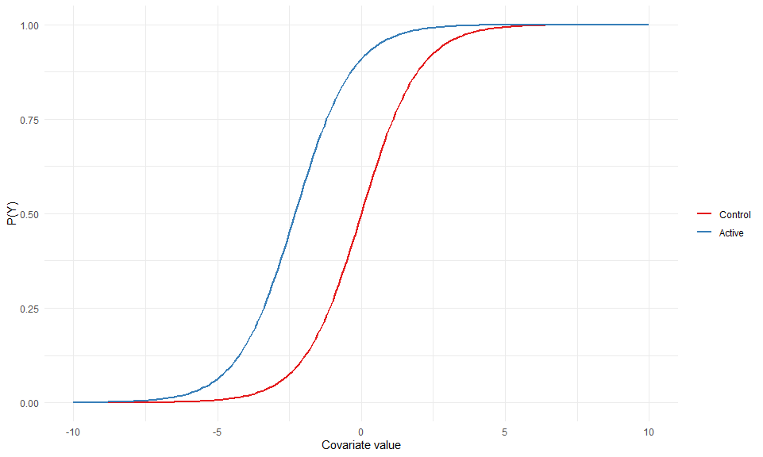

# Introduction

-   Binary outcomes

-   Effects of interventions on binary outcomes

-   Different ways of representing potential effects

    -   Risk difference

    -   Risk ratio

    -   Odds ratio

# Set-up

Y is a binary outcome (0, 1)

X is a binary indicator for treatment (0, 1) that is randomly allocated with a fair coin (50% of either outcome).

C is a covariate uniformly distributed between -10 and 10

We want to know the probability of Y based on the logistic model of:

logit(Prob(Y\|X, C)) = log(10)\*X + C

Prob = Odds / 1 + Odds 0.5 Odds = Prob / 1 - Prob 1


```r
  to_odds   <- function(prob){prob / (1 - prob)}
  to_prob   <- function(odds){odds / (1 + odds)}
  logit     <- function(prob){log(prob / (1 - prob))}
  invlogit <- function(log_odds){to_prob(exp(log_odds))}
  
  invlogit(logit(0.99)) == 0.99
```

```
## [1] TRUE
```


```r
  cov_1 <- seq(-10, 10, 0.1)
  
  df <- data_frame(
    arm = c(rep(0, length(cov_1)), rep(1, length(cov_1))),
    cov_1 = rep(cov_1, 2), 
    y = log(10) * arm + cov_1
  ) %>%
    mutate(arm = factor(arm, labels = c("Control", "Active")))
```

<!-- -->

The vertical difference between the 2 lines is log(10) or \~ 2.3.

<!-- -->


```r
  give_or <- function(covariate){
    #odds x = 1
    (invlogit(covariate + log(10))/(1-invlogit(covariate + log(10)))) /
    #odds x = 0  
    (invlogit(covariate)/(1-invlogit(covariate))) 
  }

 give_or(-3) 
```

```
## [1] 10
```

```r
 give_or(2)
```

```
## [1] 10
```


```r
  df <- data_frame(
    # P(Y|X = 0, C)  
    x = invlogit(cov_1),
    # P(Y|X = 1, C) 
    y = invlogit(cov_1 + log(10)), 
  ) 

  df %>%
  ggplot(aes(x, y)) +
    geom_line() +
    geom_abline() +
    theme_minimal() +
    theme(aspect.ratio = 1) +
    xlab("P(Y|X = 0, C)") +
    ylab("P(Y|X = 1, C)") 
```

<!-- -->


  g(x) is a probability, because it's odds/1+odds
  So logit(x) + log(10) must be an log odds, since it is exponentiated to an odds
  so x must be a probability...the prob Y given C
  So g(x) maps x = P(Y = 1|X = 0, C) to g(x) = P(Y = 1|X = 1, C) 


```r
  df <- data_frame(
    # P(Y|X = 0, C)  
    x = invlogit(cov_1),
    # P(Y|X = 1, C) 
    y = invlogit(cov_1 + log(10)), 
    g_x = 10*x / (1 + 9*x)  # Add g(x)
  ) 

  df %>%
  ggplot(aes(x, g_x)) +
    geom_line() +
    geom_abline() +
    theme_minimal() +
    theme(aspect.ratio = 1) +
    xlab("P(Y|X = 0, C)") +
    ylab("P(Y|X = 1, C)") 
```

<!-- -->

<!-- -->

